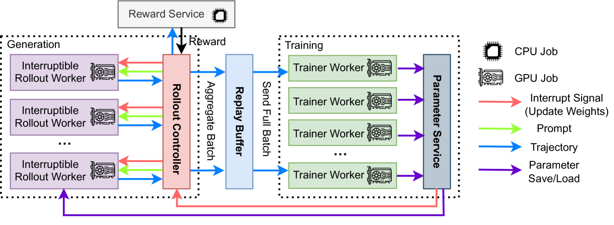

# AReaL：面向语言推理的大规模异步强化学习系统

>原文：[AReaL: A Large-Scale Asynchronous Reinforcement Learning System for Language Reasoning](https://arxiv.org/html/2505.24298v1?utm_source=chatgpt.com)

## 摘要

强化学习（RL）已成为训练大型语言模型（LLMs）的主流范式，尤其在推理任务中表现突出。为了有效地对 LLM 进行强化学习训练，通常需要大规模的并行处理能力，这对高效训练系统提出了迫切需求。当前大多数面向 LLM 的大规模 RL 系统采用同步方式，在批处理场景下交替进行生成与训练：每个训练批次中的 rollout 由同一个（或最新的）模型生成。虽然这种方法有助于稳定训练过程，但却带来了严重的系统层面低效问题。模型生成必须等待整个批次中最长输出完成后，才能进行模型更新，导致 GPU 资源利用率不足。

我们提出 **AReaL**，一个完全异步的 RL 系统，在系统层面上彻底解耦了生成与训练过程。AReaL 中的 rollout worker 会持续不断地生成新输出而无需等待，而 training worker 则在收集到一个批次的数据后立即进行模型更新。AReaL 还引入了一系列系统级优化措施，显著提升了 GPU 利用率。为了稳定 RL 训练，AReaL 通过动态平衡 rollout worker 与 training worker 的工作负载来控制数据陈旧程度，并引入了一个改进版的基于 staleness 的 PPO 算法，以更好地处理过时样本。

在数学与代码推理基准任务上的大量实验证明，**AReaL** 相较于当前最优的同步系统，在使用相同数量 GPU 的前提下，训练速度提升最多可达 **2.57 倍**，同时保持甚至提升了最终模型性能。项目代码已开源，详见：https://github.com/inclusionAI/AReaL/。

## 1 引言

强化学习（RL）已成为提升大语言模型（LLMs）推理能力的一种新型扩展范式。给定一个提示，RL 允许 LLM 在输出最终答案之前生成“思考 token”，从而实现推理阶段的扩展能力。这类具有推理能力的 LLM 被称为大型推理模型（LRMs），已被证明在数学、编程、逻辑谜题、Agent 任务等具有挑战性的推理问题上表现出色。

为了实现有效的 RL 训练，通常需要大规模并行化，以产生足够的 rollout 数据进行探索，这对于获得最优模型性能至关重要。例如，流行的 RL 算法如 PPO 和 GRPO，往往需要数千条输出组成的有效训练 batch。此外，每个输入提示可能引发 LRM 生成上万 token 的推理过程，这进一步迫切要求拥有一个高效的训练系统来支持大规模 RL 训练。

然而，构建高效的大规模 RL 系统本身就是一项挑战。一个 RL 系统通常需要在 LLM 推理和模型训练之间频繁切换，如果缺乏系统层面的优化，将引入显著的开销。对于 LRM 而言，在 RL 训练过程中，不同提示所生成的输出长度差异巨大，导致生成和训练两侧的工作负载持续变化。这种特性经常会导致高性能硬件处于空闲状态，造成计算资源浪费。此外，传统的大规模 RL 算法（如 PPO 或 GRPO）通常依赖于策略内（on-policy）数据，即必须使用最新模型生成的样本进行训练，这也带来了额外的系统设计难题。

因此，现有的大多数大规模 RL 系统都采用完全同步的方式，通过严格交替进行 LLM 的生成与训练，确保模型始终基于最新的输出进行训练，从而实现最优的实际性能。在这种同步设计中，生成步骤必须等待 batch 中最长输出完成之后才能进行模型更新。由于 LRM 输出长度高度不均，导致同步 RL 系统面临严重的训练效率瓶颈。近期也有一些工作尝试探索并行生成与训练。这些方法使用旧版本模型生成的输出用于更新当前模型。为了保证性能，生成 rollout 时使用的模型版本通常仅滞后一两步。但这些系统仍采用批量生成的方式，即一个训练 batch 中的所有样本都来自同一个模型版本，因此生成阶段的系统效率问题仍未得到根本解决。

为从根本上解决系统设计中的这些问题，我们提出了 AReaL——一个完全异步的 LRM 强化学习训练系统，可彻底解耦生成与训练过程，同时不影响最终性能。AReaL 以流式方式进行 LLM 生成，每个 rollout worker 持续不断地产生输出，无需等待，从而大幅提升 GPU 利用率。与此同时，trainer worker 在从 rollout worker 收集到一个训练 batch 后，即可并行进行模型更新。一旦模型更新完成，系统会将最新权重同步至各个 rollout worker。在这种异步设计下，AReaL 每个训练 batch 中的样本可能来自不同版本的模型。因此，AReaL 引入了一个改进版的 PPO 算法，能够无性能下降地使用最多滞后 8 个版本的模型生成的样本。同时，AReaL 还通过数据筛选机制来控制训练样本的“陈旧度”。

此外，AReaL 还引入了多项系统级优化，例如支持中断的 rollout worker、适配可变长度输出的动态 batching 机制，以及并行 reward 服务，从而进一步提高整体训练吞吐量。

我们在数学推理与代码生成等挑战性任务上使用高达 32B 参数规模的模型对 AReaL 进行了评估。与现有最先进的同步系统相比，AReaL 在相同硬件资源下实现了最多 2.57 倍的训练吞吐速度提升，并在多达 512 块 GPU 上保持了良好的线性扩展效率。更关键的是，在加速的同时，AReaL 在这些任务上的最终表现还出现了提升，证明了它在显著提高效率的同时不但没有牺牲性能，反而实现了增强。

## 2 相关工作

**用于 LLM 的强化学习**

强化学习（RL）已成为提升大语言模型（LLMs）推理能力的主流范式。现有的 RL 方法主要聚焦于具有明确定义奖励函数的任务，例如数学推理、代码生成、科学问题求解和工具使用。在训练过程中，模型通过逐步扩展“思维链条”轨迹的长度来学习推理能力。近期的开源项目也展示了通过较小的蒸馏模型提升模型能力的显著成果。我们的工作建立在这一研究方向之上，并区别于基于偏好反馈的 RLHF 以及试图在无需任务特定微调的前提下从预训练模型中直接获取推理能力的零样本推理方法。

非耦合的异步 RL 架构结合相应的算法创新，已在游戏应用中取得了显著成功。尽管类似的异步方法也被用于 LLM 训练，但通常仅限于短上下文场景（如 RLHF）或生成与训练之间存在一步或两步重叠的情况。我们的工作在此基础上进行了扩展，提出了一种在样本“陈旧度”和训练速度之间更具灵活性的权衡机制，这一点将在第 5 节详细介绍。与同时期的一项旨在最大化系统效率的研究不同，我们采用了算法与系统协同设计的思路，兼顾系统表现力与算法实用性。我们提出的可中断生成技术在概念上与同步 RL 系统中的“部分 rollout”相似。但不同的是，AReaL 并未设定固定长度限制，而是通过动态中断生成并使用缓冲机制保持训练 batch 大小一致，从而确保 PPO 的稳定性。与以往的方法相比，我们在异步场景下的算法创新可容忍更高的样本“陈旧度”，同时与可中断生成机制兼容。

**图 1：** 同步 RL 系统（左）与单步重叠 RL 系统（右）的执行时间线，展示了推理设备利用率不足的情况。

**LLM 训练与推理**

我们的工作聚焦于稠密 Transformer 模型。RL 训练主要包括生成（推理）阶段和训练阶段。生成过程采用自回归解码，依赖于高效的 KV cache 管理机制和优化的解码内核；训练过程则需在数据并行、张量并行和流水线并行之间进行精心协调。传统的同步系统通常在相同的硬件资源上顺序执行生成与训练，但这两个阶段对并行策略的最优要求并不一致。近期的研究提出了上下文切换或权重重分片技术来应对此类不匹配问题。AReaL 通过将生成与训练彻底解耦，消除了关键训练路径中由重分片带来的额外开销，从而进一步推进了同步 RL 系统的能力边界。

## 3 背景

### 3.1 强化学习训练基础

#### 强化学习建模与 PPO 算法

我们将问题建模为一个马尔可夫决策过程（Markov Decision Process，MDP），其形式为六元组 $\langle \mathcal{S}, \mathcal{A}, r, P, \gamma, H \rangle$。其中：

- $\mathcal{S}$ 表示状态空间，
- $\mathcal{A}$ 表示动作空间，
- $P$ 为状态转移函数，
- $r: \mathcal{S} \times \mathcal{A} \rightarrow \mathbb{R}$ 为奖励函数，
- $\gamma$ 为折扣因子，
- $H$ 为时间步长（horizon）。

LRM 实现了一个参数化策略 $\pi_\theta: \mathcal{S} \rightarrow \mathcal{A}$，其中每个动作 $a_t \in \mathcal{A}$ 表示词表中的一个 token。状态 $s_t \in \mathcal{S}$ 表示一个以问题 $s_1 = q$ 开头、后接之前生成的响应 token 序列 $(a_1, ..., a_{t-1})$，状态转移为确定性的，即 $s_{t+1} = \text{concat}(s_t, a_t)$。

给定问题分布 $\mathcal{D}$，优化目标为：
$$
J(\theta) = \mathbb{E}_{q \sim \mathcal{D}, a_t \sim \pi_\theta(\cdot | q, a_{<t})} \left[ \sum_{t=1}^H \gamma^{t-1} r(s_t, a_t) \right]
$$
按照通行做法，我们使用一个基于规则的奖励函数，仅对最后一个 token 提供非零反馈（用于指示答案是否正确），并设置 $\gamma = 1$。

我们使用 Proximal Policy Optimization（PPO）算法来优化上述目标函数，其形式为：
$$
J_{\text{PPO}}(\theta) = \mathbb{E}_{q \sim \mathcal{D}, a_t \sim \pi_{\text{old}}(\cdot | q, a_{<t})} \left[
\sum_{t=1}^H \min \left(
u_t(\theta) \hat{A}(s_t, a_t),
\text{clip}(u_t(\theta), 1 - \epsilon, 1 + \epsilon) \hat{A}(s_t, a_t)
\right)
\right]
$$
其中，重要性比率定义为：
$$
u_t(\theta) = \frac{\pi_\theta(a_t | s_t)}{\pi_{\text{old}}(a_t | s_t)}
$$
$\hat{A}(s_t, a_t)$ 是优势函数的估计值。

按照强化学习中的标准做法，我们将全局 batch 划分为多个 minibatch，并逐步更新模型参数。

#### 用于 LRM 训练的分布式系统

我们的工作重点在于提升经过监督微调（Supervised Fine-Tuning, SFT）后的大型推理模型（Large Reasoning Models, LRM）的推理能力，这与那些试图直接在预训练基础模型上激发推理能力的方法是不同的。

SFT 之后的 LRM 会生成较长的推理序列（例如 32K token），并且通常需要较大的全局 batch（例如每轮 128 个 prompt，每个 prompt 生成 16 个响应）以实现强化学习训练的稳定性。

在同步的强化学习系统中，训练流程主要由两个阶段交替执行：

1. **生成阶段（Generation / Rollout）**：使用当前最新的模型参数，为训练 batch 中的每个问题生成多个推理轨迹。
2. **训练阶段（Training）**：根据已生成的轨迹对模型参数进行更新。

这两个阶段通常在相同的 GPU 上交替进行。

**图 2：**AReaL 架构，展示了异步的生成与训练组件。

### 3.2 异步强化学习系统的动机

我们识别出同步强化学习系统中存在两个关键限制：

- **推理设备利用率低**。如图 1（左）所示，在开始训练之前，生成过程必须等待最慢的序列完成。这导致不同 GPU 之间解码长度不一致，从而无法充分利用 GPU 的计算资源。
- **同步系统的可扩展性较差**。同步系统将生成任务分配到所有设备上，进而降低了每个 GPU 的解码批大小。这会使解码过程进入一个以内存 I/O 为瓶颈的阶段，此时即使增加更多设备，也无法提升吞吐量。

## 4 系统架构

第 3.2 节中指出的限制促使我们设计了一个系统，将生成与训练完全解耦，并运行在不同的 GPU 集群上。该系统应具备硬件高效性、良好的可扩展性，并能够灵活适配定制化的强化学习流程。我们在 AReaL 中实现了这些设计原则。AReaL 是一个专为高效大规模语言奖励模型（LRM）训练而设计的异步强化学习系统。

### 4.1 系统概览

**Interruptible Rollout Worker** 处理两种类型的请求：（1）`generate` 请求，根据提示生成响应；（2）`update_weights` 请求，打断所有正在进行的生成任务并加载新版本的参数。中断发生时，rollout worker 会丢弃由旧权重计算的 KV 缓存，使用新权重重新计算。之后，rollout worker 继续解码未完成的序列，直到下一次中断或任务结束。我们强调，这种中断和权重在线更新会导致生成的轨迹由不同模型版本产生的片段组成，这带来了新的算法挑战，相关内容将在第 5 节讨论。

**Reward Service** 用于评估模型生成响应的准确性。例如，在编程任务中，该服务会提取代码并执行单元测试以验证准确性。

**图 3：**AReaL 中生成管理的示意图。竖线表示下一步训练的就绪时间。蓝色叉号表示在新参数到达时被中断的请求。

**Trainer Workers** 持续从重放缓冲区采样，累计数据直到达到配置的训练批大小，然后执行 PPO 更新，并将更新后的参数存储在分布式存储中。为保证数据的新鲜度，重放缓冲区中的数据只被使用一次。

**Rollout Controller** 作为 rollout worker、reward service 和模型 worker 之间的重要桥梁。在训练过程中，它从数据集中读取数据并调用 rollout worker 的 `generate` 请求，接收到的响应随后发送至 reward service 获取奖励。轨迹和奖励一起存储在重放缓冲区，等待模型 worker 进行训练。模型 worker 更新参数后，controller 会调用 rollout worker 的 `update_weights` 请求。我们在图 3 中展示了生成与训练的管理流程。该异步流水线确保了生成和训练资源的持续充分利用。

### 4.2 算法挑战

虽然异步系统设计通过提升设备利用率带来了显著加速，但它也引入了若干需要算法层面考虑的技术挑战。

**数据陈旧性**
由于 AReaL 的异步特性，每个训练批次包含来自多个旧策略版本的数据。先前关于异步强化学习训练系统的研究表明，这种数据陈旧会降低 RLHF 和游戏环境中的学习性能。数据陈旧导致训练数据与最新模型之间存在分布差异。在针对语言奖励模型（LRM）的异步强化学习训练中，由于解码时间较长，这一问题对长轨迹的影响可能更加严重。

**策略版本不一致**
如第 4.1 节所述，生成的轨迹可能包含由不同策略版本产生的片段。这种不一致性从根本上违背了标准 PPO 方法（公式 2）中假设所有动作均由单一旧策略 π_old 生成的前提。

接下来的章节中，我们将详细介绍为克服这些挑战，同时保持异步系统效率优势所做的技术创新。

### 5 解决 AReaL 中的算法挑战

#### 5.1 陈旧感知训练

为了避免数据陈旧性带来的负面影响，我们限制生成轨迹的策略版本与训练策略 $\pi_\theta$ 之间的版本差异。我们引入超参数 $\eta$，表示允许的最大陈旧程度。设最新参数版本为 $i$，总生成轨迹数为 $N_r$，训练批大小为 $B$，我们强制执行如下约束：
$$
\left\lfloor \frac{N_r}{B} \right\rfloor \leq i + \eta
$$
当 $\eta = 0$ 时，系统退化为同步 RL 设置，此时生成与训练批次严格匹配；当 $\eta = 1$ 时，系统等同于之前的一步重叠方法。在训练过程中，我们优先使用较旧的轨迹，确保陈旧度不超过 $\eta$。在实现中，rollout controller 会跟踪 $N_r$ 和服务器参数版本 $i$，并拒绝可能违反陈旧度约束的请求。尽管该方法保证了陈旧度有界，但过于保守的 $\eta$ 会不必要地限制生成吞吐，尤其是在长上下文生成时，批次完成时间差异较大。这也促使我们采用了一个能够高效利用略微陈旧数据的解耦 PPO 目标。

------

#### 5.2 解耦 PPO 目标

我们采用了解耦 PPO 目标，该方法将行为策略和近端策略分离。行为策略 $\pi_{\text{behav}}$ 表示用于采样轨迹的策略，近端策略 $\pi_{\text{prox}}$ 是一个最近的目标策略，用以正则化 $\pi_\theta$ 的更新。通过对采样轨迹应用重要性采样，可以推导出适用于异步 RL 训练的解耦 PPO 目标：
$$
J(\theta) = \mathbb{E}_{q \sim \mathcal{D}, a_t \sim \pi_{\text{behav}}} \left[ \sum_{t=1}^H \min \left( \frac{\pi_\theta}{\pi_{\text{behav}}} \hat{A}_t, \frac{\pi_{\text{prox}}}{\pi_{\text{behav}}} \operatorname{clip} \left( \frac{\pi_\theta}{\pi_{\text{prox}}}, 1-\epsilon, 1+\epsilon \right) \hat{A}_t \right) \right]
$$
简化为：
$$
J(\theta) = \mathbb{E}_{q \sim \mathcal{D}, a_t \sim \pi_{\text{behav}}} \left[ \sum_{t=1}^H \frac{\pi_{\text{prox}}}{\pi_{\text{behav}}} \min \left( u_t^{\text{prox}}(\theta) \hat{A}_t, \operatorname{clip} \left( u_t^{\text{prox}}(\theta), 1-\epsilon, 1+\epsilon \right) \hat{A}_t \right) \right]
$$
其中，重要性比率
$$
u_t^{\text{prox}}(\theta) = \frac{\pi_\theta(a_t | s_t)}{\pi_{\text{prox}}(a_t | s_t)}
$$
为简洁起见，省略了状态-动作项。异步 PPO 目标（公式 6）与标准 PPO 目标（公式 2）的主要区别在于，前者引入了近端策略 $\pi_{\text{prox}}$ 用于正则化模型更新。在异步 PPO 训练中，若将行为策略用作近端策略，会使最新策略 $\pi_\theta$ 向旧版本及低质量策略靠拢，减缓模型改进速度。而采用最近的高质量策略作为近端策略，则保证模型更新在该策略的信赖域内进行，从而稳定训练过程。

解耦 PPO 目标的另一个自然优势是，它放宽了同一训练批次内所有数据必须由单一策略生成的要求。这一性质对于结合可中断生成和策略更新时维持算法正确性至关重要。我们断言，轨迹中存在的策略版本不一致等价于单一行为策略 $\pi_{\text{behav}}$ 的采样。（证明详见附录 C）

**命题 1**
对于由策略序列 $(\pi_\theta, \ldots, \pi_{\theta+k})$ 生成的任意序列 $(q, a_1, \ldots, a_H)$，其中策略 $\pi_{\theta+i}$ 产生令牌 $(a_{t_i}, \ldots, a_{t_{i+1}-1})$，满足 $1 = t_0 < \cdots < t_{k+1} = H$，存在一个行为策略 $\pi_{\text{behav}}$，使得中断生成等价于完全从 $\pi_{\text{behav}}$ 采样。

**实践说明**
Hilton 等人采用参数的指数移动平均作为 $\pi_{\text{prox}}$，但这一方法对语言奖励模型开销过大。因此，我们简单使用每次模型更新前的参数作为 $\pi_{\text{prox}}$。公式 5 的实现是在每次训练步骤接收到全局批后重新计算令牌概率。

### 6 实现细节

我们基于 ReaLHF框架，使用 Python 和 PyTorch实现了 AReaL 系统。系统结合了用于生成服务的 SGLang v0.4.6 和作为训练后端的 Megatron-Core v0.11.0，由 SLURM 负责资源调度。为了最大化生成和训练阶段的吞吐量，我们在系统级别实现了若干关键优化，旨在解决流水线中的核心瓶颈。

AReaL 将 GPU 计算与 CPU 操作解耦，CPU 端包括基于规则的奖励计算（例如数学题的字符串匹配或代码的单元测试执行）以及基于 TCP 的数据传输。通过在独立线程中执行这些操作并对工作流程进行流水线设计，我们实现了奖励计算和数据传输与后续生成请求的重叠执行。在 rollout worker 中，我们使用 asyncio 协程并发处理多个请求，避免相互阻塞等待。

针对可变长度序列的训练问题，我们采用了无填充的序列打包策略，并辅以动态分配算法。该算法在固定内存限制下，平衡微批次间的令牌分布（详见算法 1）。此方法最大化了 GPU 内存利用率，同时最小化了所需的前向和反向传播次数。

## 7 实验

略
