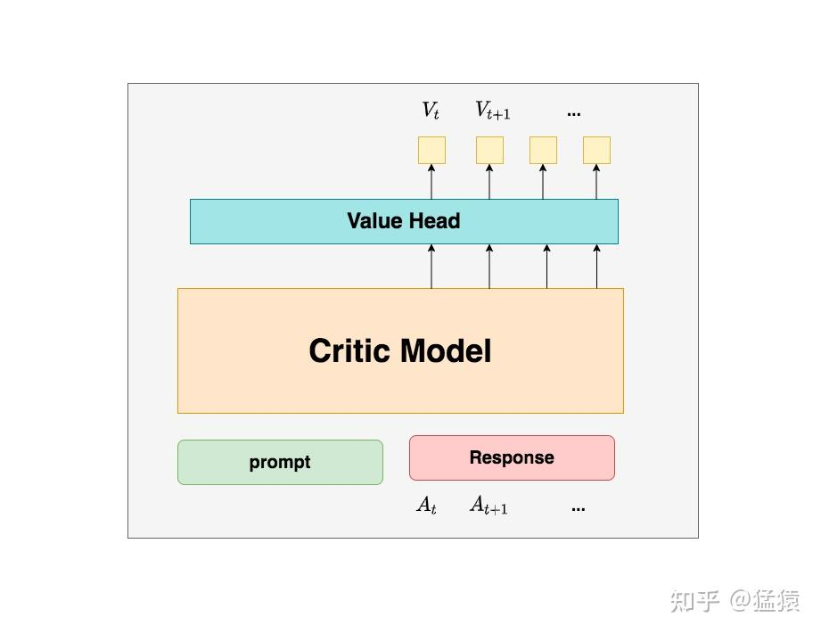

# 强化学习理论导入

## 摘要


## 缩写映射

| 缩写      | 中文描述                | 全称                                       |
| --------- | ----------------------- | ------------------------------------------ |
| **RL**    | **强化学习**            | Reinforcement Learning                     |
| **SFT**   | **监督式微调**          | Supervised Fine-Tuning                     |
| **MDP**   | **马尔可夫决策过程**    |                                            |
| **RLHF**  | **人类反馈强化学习**    | Reinforcement Learning from Human Feedback |
| **RLAIF** | **RLHF 与来自 AI 反馈** |                                            |
| **RM**    | **奖励模型**            | Reward Model                               |
| **PPO**   | **近端策略优化**        | Proximal Policy Optimization               |
|           |                         |                                            |
|           |                         |                                            |

## 强化学习简介

### SFT

SFT 是对 **预训练大语言模型（LLMs）** 进行进一步训练的一种方法，旨在通过给模型提供一系列 **（指令，答案）对** 来增强其在特定任务或领域中的表现。

其中：

- **指令（Instruction）**：是用户输入或任务描述，指导模型该做什么；
- **答案（Answer）**：是人类提供的理想输出，用来教会模型该如何回应。

SFT 的目标是使大语言模型生成更符合特定用途或人类预期的响应，提升模型在实际应用中的实用性和互动性。

**SFT 的优势**

- 能快速将通用模型适配到特定任务或领域。
- 输出更具可控性、准确性，特别是在高风险或专业场景中。
- 训练方法相对直接，技术成熟。

**SFT 的缺点**

1. **限制模型生成的多样性与泛化能力**：
   - SFT 要求模型尽可能模仿人类提供的特定答案。
   - 在训练中，模型倾向于复制“唯一正确答案”，而不会学习多个有效表达方式，可能导致对同义词或不同表述的惩罚（如困惑度PPL的提高）。
   - 这在任务如写作、总结、翻译中尤其不利，因为这些任务具有天然的多样性。
2. **不直接体现人类偏好**：
   - SFT 是基于静态数据训练的，即便答案由人类提供，但模型并不知道哪些答案更“好”或更符合偏好。
   - 它忽略了不同答案之间的优劣排序，无法学习**偏好导向**的响应策略。
3. **对数据质量和覆盖面的高度依赖**：
   - SFT 效果高度依赖于指令-答案对的质量、丰富性和多样性。
   - 如果训练数据有偏或有限，模型输出容易受到影响，难以泛化到未见场景。

SFT 是将大语言模型与人类意图对齐的重要第一步，但其 **缺乏对人类偏好的直接建模** 和 **对语言表达的多样性支持不足**，限制了其在高质量人机交互中的表现。
 因此，SFT 通常作为后续更先进对齐方法（如 **RLHF，基于人类反馈的强化学习**）的基础步骤。

### RL

强化学习是一种机器学习范式，核心目标是通过智能体（agent）与环境（environment）的互动，**最大化长期累计奖励（cumulative reward）**。

**基本概念：**

- **智能体（Agent）**：学习做决策的主体，例如机器人或语言模型。
- **环境（Environment）**：智能体所处的系统或世界，提供状态和奖励。
- **状态（State）**：当前环境的表征，例如机器人所在的位置。
- **动作（Action）**：智能体在某状态下可以采取的操作。
- **奖励（Reward）**：智能体执行动作后从环境中获得的反馈，用于评估行为好坏。
- **策略（Policy）**：指导智能体在每个状态中采取什么动作的规则或模型。

**强化学习流程（MDP）：**

1. 智能体从初始状态开始；
2. 在每个时间步，智能体依据策略选择一个动作；
3. 动作使环境状态发生变化，环境返回新的状态与奖励；
4. 该过程反复进行，智能体通过试错学习最优策略，以实现最大化累积奖励。

### RL on LLMs

#### 关键映射关系（将RL元素映射到LLM）：

- **Agent（智能体）** → LLM 本身（作为策略）
- **Environment（环境）** → 与人类互动的对话场景
- **State（状态）** → 当前对话上下文或输入 prompt
- **Action（动作）** → 生成下一个 token 或完整响应
- **Reward（奖励）** → 来自人类偏好建模的反馈得分
- **Policy（策略）** → LLM 的 token 生成机制（概率分布）

#### 具体流程：

1. **奖励模型训练（Reward Model, RM）**：
   - 从监督微调后的LLM生成多个响应样本；
   - 由人类对这些响应进行偏好比较，生成“哪一个更好”的对比数据；
   - 用这些偏好数据训练一个奖励模型，用于估计每个响应的质量分数。
2. **基于奖励的策略优化（如PPO）**：
   - 使用奖励模型对LLM输出进行评分；
   - 用强化学习算法（如 PPO，Proximal Policy Optimization）微调原始模型，使其生成更高质量、更符合人类偏好的响应。


# TODO

RealHF --> RLHF，需要四个大模型，

AReaL --> Reasoning RL，算法变简单，需要两个大模型。

From RLHF to Reasoning RL

https://zhuanlan.zhihu.com/p/677607581

下面公式有的有问题


- 我们首先给模型提供一个 prompt，期望它能够生成符合人类偏好的 response。

- 在时刻 $t$，模型基于上文生成一个 token，**这个 token 即对应强化学习中的动作，我们记为** $A_t$。因此，在 NLP 的语境下，**强化学习任务中的动作空间就对应于词表**。

- 同样在时刻 $t$，**模型生成的 token** $A_t$ **对应的即时收益为** $R_t$，**总收益为** $V_t$（**回顾一下，$V_t$ 蕴含了“即时收益”与“未来收益”两个部分**）。这个收益可以理解为**对人类偏好程度的衡量**。此时，**模型的状态从** $S_t$ **转变为** $S_{t+1}$，也就是从“上文”变为“上文 + 新生成的 token”。

- 在 NLP 的语境中，智能体即为语言模型本身，而环境则由它所生成的语料构成。

  

- **Actor Model：演员模型**，这就是我们想要训练的目标语言模型
- **Critic Mode：评论家模型**，它的作用是预估总收益 $V_t$
- **Reward Model：奖励模型**，它的作用是计算即时收益 $R_t$
- **Reference Model：参考模型**，它的作用是在RLHF阶段给语言模型增加一些“约束”，防止语言模型训歪（朝不受控制的方向更新，效果可能越来越差）

### 3.1 Actor Model (演员模型)

正如前文所说，**Actor就是我们想要训练的目标语言模型。我们一般用SFT阶段产出的SFT模型来对它做初始化。**

我们的最终目的是让Actor模型能产生符合人类喜好的response。所以我们的策略是，先喂给Actor一条prompt （这里假设batch_size = 1，所以是1条prompt），让它生成对应的response。然后，我们再将“prompt + response"送入我们的“奖励-loss”计算体系中去算得最后的loss，用于更新actor。

### 3.2 Reference Model（参考模型）

**Reference Model（以下简称Ref模型）一般也用SFT阶段得到的SFT模型做初始化，在训练过程中，它的参数是冻结的。**Ref模型的主要作用是防止Actor”训歪”，那么它具体是怎么做到这一点的呢？


“防止模型训歪”换一个更详细的解释是：**我们希望训练出来的Actor模型既能达到符合人类喜好的目的，又尽量让它和SFT模型不要差异太大**。简言之，**我们希望两个模型的输出分布尽量相似**。那什么指标能用来衡量输出分布的相似度呢？我们自然而然想到了**KL散度**。

如图所示：

- 对于 **Actor 模型**，我们喂给它一个 prompt，它会正常输出对应的 response。那么，response 中的每一个 token 都对应一个生成的 log probability，我们记为 $\text{log\_probs}$。
- 对于 **Ref 模型**，我们将 Actor 模型生成的 “prompt + response” 输入给它，它同样会为每个 token 生成 log probability，记为 $\text{ref\_log\_probs}$。

因此，这两个模型输出分布之间的相似度可以通过 $\text{ref\_log\_probs} - \text{log\_probs}$ 来衡量。我们可以从两个角度理解这个公式：

1. **直觉理解**：$\text{ref\_log\_probs}$ 越高，说明 Ref 模型对 Actor 模型输出的“肯定程度”越大。也就是说，Ref 模型也认为在某个上下文下，生成某个 token 的概率是比较高的（即 Ref 模型也认可这个选择）。这时候可以认为 Actor 模型与 Ref 模型的行为一致，没有“训歪”。

2. **从 KL 散度角度理解**：这个差值项其实是 KL 散度的一种近似形式：

3. $$
   \mathrm{KL}[ \text{Actor}(X) \,\|\, \text{Ref}(X) ] = \mathbb{E}_{x \sim \text{Actor}(x)} \left[ \log \frac{\text{Actor}(x)}{\text{Ref}(x)} \right] = \text{log\_probs} - \text{ref\_log\_probs}
   $$

   所以，当这个值越小，表示两者的分布越相似；反之，差值越大，说明 Actor 的策略已经偏离了 Ref 的行为模式。

>**注**：你可能已经注意到，从 KL 散度的严格定义来看，这里应该写成 $\text{log\_probs} - \text{ref\_log\_probs}$ 更为准确。然而，如果你读过一些与 RLHF（Reinforcement Learning from Human Feedback）相关的论文，可能会记得在实际的损失函数中，**KL 散度项前面是带负号的**（这一点我们稍后会详细讲解）。
> 因此，在这里我们采用 $\text{ref\_log\_probs} - \text{log\_probs}$ 的形式，是为了更符合直觉理解：Ref 模型的 log probability 越高，说明它越“认同” Actor 的输出，从而代表 Actor 没有“训歪”。

现在，我们已经知道如何利用 Ref 模型与 KL 散度来约束 Actor 模型，防止其偏离原始策略分布。在后续内容中，我们将介绍 KL 散度在损失函数中的具体作用与计算方式。

### 3.3 Critic Model（评论家模型）

Critic 模型用于预测 **期望总收益**（Expected Return）。与 Actor 模型一样，它也需要进行参数更新。在实践中，Critic 模型的设计与初始化方式多种多样，例如可以与 Actor 模型共享部分参数，或者从 RW（Reward Modeling）阶段的 Reward Model 初始化而来。

在本节讲解中，我们将参考 [DeepSpeed-Chat](https://github.com/microsoft/DeepSpeedExamples/tree/master/applications/DeepSpeed-Chat) 的实现方式：Critic 模型是从 RW 阶段的 Reward Model 初始化而来。

你可能会有疑问：

> 训练 Actor 模型我能理解，但为什么还要单独训练一个 Critic 模型去预测收益呢？

这是因为，在我们**理论分析**中提到的总收益 $V_t$（即时收益 + 未来收益）是从**上帝视角（omniscient view）**出发的——也就是说，$V_t$ 是一个真实存在、可以被完全观测到的值。

但在实际训练中，我们并没有这个“上帝视角”的加持。换句话说，在时刻 $t$，我们无法直接获得 $V_t$ 的真实值，因此只能**训练一个模型去预测它**。这个模型就是 Critic。

在 RLHF 中，我们的目标不仅仅是训练模型具备“生成人类偏好内容”的能力（即 Actor 的职责），还要提升**模型对“人类偏好程度进行量化评估”的能力**（即 Critic 的职责）。这正是 Critic 模型存在的意义。

接下来，我们来看看 Critic 模型的大致架构：



DeepSpeed-Chat 中使用 **Reward 模型** 作为 Critic 模型的初始化，因此我们也可以按照 Reward 模型的架构来简要绘制 Critic 的结构图。

你可以将 Critic 模型简单理解为与 Actor 模型架构**高度相似**（毕竟它们的输入相同），唯一的区别在于 **输出部分**：Critic 模型在最后增加了一层 **Value Head**，这是一层线性层（Linear Layer），用于将模型的原始输出映射为一个 **标量值**，即对总收益的估计。

在结构图中，我们通常用：

- $V_t$ 表示 Critic 模型对当前时刻 $t$ 及其未来（即完整 response）所能获得的 **期望总收益**（Expected Return）。

你可以参考如下结构图（示意）：

```

        +----------------------+
Input → |   Transformer Body   |  → Hidden States → Linear → V_t
        +----------------------+
                              ↑
                       Value Head（预测总收益）
```


### 3.4 Reward Model（奖励模型）

**Reward Model** 用于计算生成 token $A_t$ 的**即时收益**，它就是 RW 阶段训练得到的奖励模型。在 RLHF 过程中，这个模型的参数是**冻结的**。

------

你可能会问：

> **既然 Critic 模型也用于估计收益，需要参与训练，那为什么同样和收益相关的 Reward 模型却可以参数冻结？**

这是因为 Reward 模型拥有“上帝视角”，这个“上帝视角”有两层含义：

1. **Reward 模型已经经过与“估算即时收益”相关的训练**，在 RLHF 阶段我们就可以将其视为一个能产生较为“客观值”的模型。
2. Reward 模型所表示的就是**即时收益 $R_t$**，而 token $A_t$ 已经生成，因此**即时收益是可以立即计算的**。

------

你还可能会问：

> **我已经通过 Critic 模型预测出了 $V_t$，而 $V_t$ 已经包含了“即时收益”和“未来收益”的概念，那我为什么还需要一个专门用于“即时收益”的 $R_t$ 呢？直接用 $V_t$ 不就行了吗？**

我们来回顾一下 1.2 小节中提到的价值函数定义：
$$
V_t = R_t + V_{t+1}
$$
这个函数说明，**时刻 $t$ 的总收益**可以由两个结果给出：

- 结果 1：Critic 模型预测的 $V_t$
- 结果 2：Reward 模型给出的 $R_t$ **加上** Critic 模型预测的 $V_{t+1}$

------

那么哪个结果更接近“上帝视角”的客观值呢？

当然是**结果 2**，因为结果 1 完全是预测值，而结果 2 中的 $R_t$ 是**真实数据**。

我们知道 Critic 模型的参数是参与更新的，因此我们可以使用如下形式计算其损失：
$$
\text{Loss} = \left( \text{客观总收益} - V_t^{\text{Critic}} \right)^2
$$
但问题是，我们**无法直接获得客观总收益**。所以我们使用已知的事实数据 $R_t$ 与 Critic 模型预测的 $V_{t+1}$ 进行组合，用下式来近似：
$$
V_t^{\text{target}} \approx R_t + V_{t+1}^{\text{Critic}}
$$
这就是为什么 Reward 模型和 $R_t$ 依然是必要的原因。

- Reward 模型用于提供即时收益 $R_t$，是 RLHF 中的客观参考量
- Critic 模型用于预测期望总收益 $V_t$，参与训练
- 使用 $V_t^{\text{target}} = R_t + V_{t+1}$ 来作为训练目标，使 Critic 的预测更接近真实收益

附：Reward 模型结构

Reward 模型与 Critic 模型结构类似，只是在最后一层输出一个标量值 $R_t$。我们可以复用 Critic 架构图，仅将输出从 $V_t$ 改为 $R_t$ 即可。


- 第一步，我们准备一个batch的prompts
- 第二步，我们将这个batch的prompts喂给Actor模型，让它生成对应的responses
- 第三步，我们把prompt+responses喂给我们的Critic/Reward/Reference模型，让它生成用于计算actor/critic loss的数据，按照强化学习的术语，我们称这些数据为经验（experiences）。critic loss我们将在后文做详细讲解，目前我们只把目光聚焦到actor loss上
- 第四步，我们根据这些经验，实际计算出actor/critic loss，然后更新Actor和Critic模型


https://zhuanlan.zhihu.com/p/7461863937

**此时，你肯定会想，这是否意味着强化学习过程中一定存在** π **和** Vπ **两个实体呢？**例如，这是否意味我们一定要训练两个神经网络，分别表示策略和价值评估？**答案是否定的：**

- 你可以只有一个价值实体 Vπ ，因为它的输入和状态与动作相关（这里我们不区分V和Q，留到后文细说）。这意味着只要我们知道状态空间 S 和动作空间 A ， Vπ 就可以作用到这两个空间上帮助我们衡量哪个状态/动作的价值最大，进而隐式地承担起制定策略的角色，**我们也管这种方法叫value-based**。
- 你可以只有一个策略实体 π ，在对策略的价值评估中，我们可以让策略和环境交互多次，采样足够多的轨迹数据，用这些数据去对策略的价值做评估，然后再据此决定策略的迭代方向，我们也管这种方法叫**policy-based**。
- 你可以同时有价值实体 Vπ 和策略实体 π ，然后按照上面说的过程进行迭代，**我们也管这种方法叫actor-critic，其中actor表示策略，critic表示价值。这是我们本文讨论的重点。**


### Policy-based 强化学习优化目标解析

我们现在来看 **policy-based** 强化学习中的优化目标：
$$
\arg\max_{\pi_\theta} J(\pi_\theta) = \mathbb{E}_{\tau \sim \pi_\theta} [R(\tau)] = \sum_{\tau} R(\tau) P(\tau|\pi_\theta)
$$

------

#### 公式逐项解读：

- **$\tau$**：表示一条轨迹序列。
- **$\pi_\theta$**：智能体所采取的策略，参数为 $\theta$。
- **$R(\tau)$**：该轨迹序列 $\tau$ 所获得的累计奖励。
- **$P(\tau|\pi_\theta)$**：在策略 $\pi_\theta$ 下生成轨迹 $\tau$ 的概率。
- **$\tau \sim \pi_\theta$**：表示该轨迹是从策略 $\pi_\theta$ 中采样得到的。

------

#### 轨迹 $\tau$ 的隐式定义

轨迹 $\tau$ 的生成包含以下步骤：

- $a_t \sim \pi_\theta(a_t | s_t)$：根据策略在状态 $s_t$ 下采样动作。
- $s_0 \sim \rho_0(\cdot)$：初始状态由环境初始状态分布采样。
- $s_{t+1} \sim P(\cdot | s_t, a_t)$：状态转移分布。
- $r_t = R(s_t, a_t, s_{t+1})$：即时奖励由环境返回。

------

#### 总体目标 $J(\pi_\theta)$

我们的优化目标是：

> **找到一个策略 $\pi_\theta$，使它生成的轨迹的“回报期望”最大化。**

也就是最大化：
$$
J(\pi_\theta) = \mathbb{E}_{\tau \sim \pi_\theta} [R(\tau)]
$$

------

#### 为什么最大化的是回报的“期望”？

因为轨迹生成过程中包含 **策略随机性** 和 **环境随机性**：

- 对于一个固定策略 $\pi_\theta$，每次与环境交互得到的轨迹 $\tau$ 可能不同；
- 所以 $R(\tau)$ 是一个随机变量；
- 因此我们不能只看单次回报值，而是应该最大化所有可能轨迹回报的期望值。

换句话说：

> **一个好的策略不应只在一次轨迹中表现好，而应该在多次交互中整体表现优秀。**
