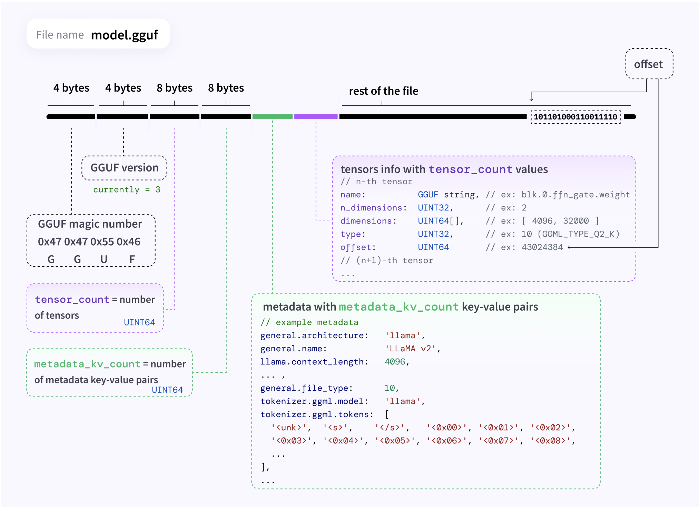

# Llama.cpp：简介与实战

## Llama.cpp 简介

**llama.cpp** 是一个由 Georgi Gerganov 发起的开源高性能 LLM（大语言模型）推理框架。它采用纯 C/C++ 编写，致力于在边缘设备和本地 PC 上高效部署和运行各类 LLM 模型。尽管名字中带有 “llama”，但实际上该框架支持的不仅仅是 Meta 的 LLaMA 模型，而是覆盖了多种主流 LLM 模型和多种硬件后端的平台级推理框架。

相较于如 vLLM 等 Python 系框架，llama.cpp 拥有更强的跨平台性和更轻量的部署能力，支持 Windows、Linux、macOS，兼容 CPU（x86/ARM）、GPU（NVIDIA、AMD）、Vulkan 以及**华为昇腾 NPU（CANN）**。同时，它支持 1.5～8 bit 的模型量化，AVX 向量加速、多核并行及混合推理。

### 核心组成

llama.cpp 基于 GGML 张量库构建，使用 GGUF 作为权重格式，具备可扩展、易改造的优势，非常适合学习 AI 模型量化、内存优化和异构计算等底层技术。如果只想快速体验，可使用基于其封装的项目 Ollama（支持 Docker 部署）。无论是部署 LLM 还是深入学习其原理，llama.cpp 都是极具价值的开源项目。

#### GGML

**GGML（Georgi's Graph Machine Learning）** 是 llama.cpp 所基于的核心张量计算库，由项目作者 Georgi Gerganov 开发，名字即来源于他的名字缩写。它使用 C/C++ 编写，定位为轻量、高效、无依赖的机器学习张量库，可视为“C++版的 PyTorch“。GGML 主要用于**推理**，不专注于训练，具备自定义算子、静态计算图、量化支持等能力，适合在资源有限的设备上运行 AI 模型。

#### GGUF

**GGUF（GGML Universal Format）** 是 GGML 使用的统一权重文件格式，用于存储 LLM 的模型参数与量化信息。它取代了早期使用的 `.bin` 格式，具备更好的可扩展性与通用性。"Universal Format" 体现了它的通用目标，适配不同模型和量化方案（如 4-bit、8-bit 等），并支持元信息嵌入（如 tokenizer 配置等），方便在不同系统中部署使用。

#### Backend

**Backend** 指的是推理过程中模型实际运行的硬件设备，例如 CPU、GPU、NPU（如昇腾）等。GGML 通过统一的后端接口机制，支持同一个模型在不同后端上运行，甚至支持混合推理（如 CPU+GPU 协同）。这种设计大大提升了模型的适应性和性能，可根据设备资源动态调度计算，兼顾灵活性与效率。

这三者共同构成了 llama.cpp 的核心架构基础，使其既轻量又强大，适用于多种 LLM 推理场景。

## GGML 源码解析

### ggml_tensor

```c
// 表示 ggml 中的张量结构体，包含张量的元信息、计算图相关信息和数据指针等。
struct ggml_tensor {
    enum ggml_type type;
    // 张量元素的数据类型，例如 F32、F16、Q4_0 等

    struct ggml_backend_buffer * buffer;
    // 后端缓冲区指针，实际存储数据的内存由 backend（如 CPU、CUDA、Metal）管理

    int64_t ne[GGML_MAX_DIMS];
    // 每个维度上的元素数量（number of elements），如 [rows, cols, ..., batch]

    size_t nb[GGML_MAX_DIMS];
    // 每个维度上的字节跨度（stride in bytes）：
    // nb[0] = 单个元素的字节大小（由类型决定）
    // nb[1] = nb[0] * (ne[0] / 类型的 block size) + padding
    // nb[i] = nb[i-1] * ne[i-1]
    // 用于从线性内存中定位特定坐标位置的元素

    enum ggml_op op;
    // 当前张量是由哪个算子（操作符）计算出来的（构成计算图）

    int32_t op_params[GGML_MAX_OP_PARAMS / sizeof(int32_t)];
    // 算子相关的参数，使用 int32_t 对齐方式分配

    int32_t flags;
    // 用于表示张量的标志位，比如是否为参数、是否需要计算梯度等

    struct ggml_tensor * src[GGML_MAX_SRC];
    // 当前张量的输入张量（源张量）数组，即计算图中本张量依赖的前驱张量

    struct ggml_tensor * view_src;
    // 如果当前张量是 view（视图）类型，则该字段指向其原始数据的张量

    size_t view_offs;
    // 视图张量在原始张量中的偏移（以字节为单位）

    void * data;
    // 实际的数据指针（当 buffer 不为空时，data 通常是 buffer 管理的内存指针）

    char name[GGML_MAX_NAME];
    // 张量名称，便于调试和图可视化

    void * extra;
    // 额外字段，比如在 CUDA 后端中存储 device-specific 信息

    char padding[8];
    // 对齐用 padding，保证结构体大小为 8 字节对齐（或 16/32，视平台而定）
};
```

### ggml_backend_buffer

`ggml_backend_buffer` 是多设备后端的抽象，是实现不同类型数据在多种类型后端上进行**统一的接口对象**。

```c
// 表示后端内存缓冲区的抽象结构，封装了缓冲区类型、大小、用途及其操作接口。
struct ggml_backend_buffer {
    struct ggml_backend_buffer_i iface;
    // 接口结构体，定义了一组用于操作缓冲区的函数指针（如分配、释放、映射、拷贝等）

    ggml_backend_buffer_type_t buft;
    // 缓冲区的类型，指向一个描述特定后端（如 CPU、CUDA、Metal）的类型对象

    void * context;
    // 与缓冲区相关的上下文信息，通常由具体后端维护（如 CUDA 的流或设备 ID）

    size_t size;
    // 当前缓冲区的大小（以字节为单位）

    enum ggml_backend_buffer_usage usage;
    // 缓冲区的用途，如用于计算（COMPUTE）、上传数据（UPLOAD）或下载数据（DOWNLOAD）
};
```

### ggml_context

```c
// ggml_context 是 ggml 内部用于内存管理和对象跟踪的核心结构体。
// 它类似于一个内存池，负责管理所有张量（tensor）、操作符对象（object）等的生命周期。
// ggml_context容器所承载的无论是tensor还是graph，都不是实际的数据本身，而是用来描述他们的结构体对象。
struct ggml_context {
    size_t mem_size;
    // 上下文管理的内存总大小（以字节为单位）

    void * mem_buffer;
    // 实际用于分配张量和对象的内存缓冲区指针

    bool mem_buffer_owned;
    // 表示 mem_buffer 是否由当前上下文自己分配和拥有
    // - true 表示上下文在内部 malloc 的
    // - false 表示用户传入的缓冲区（不会释放）

    bool no_alloc;
    // 如果为 true，表示不允许在 context 中进行内存分配（只允许创建 view、alias 等零拷贝结构）

    int n_objects;
    // 当前上下文中已分配的 ggml_object 数量（即构建了多少 tensor/operator 节点）

    struct ggml_object * objects_begin;
    // 对象链表的起始指针，用于跟踪内存中分配的张量/操作符等对象
  	// 容器里可以承载的数据有三种类型：Tensor、Graph、Work_Buffer。

    struct ggml_object * objects_end;
    // 当前对象链表的末尾指针，指向最后一个分配的对象
};
```

### ggml_object

```c
// 表示 ggml_context 中的一个已分配对象（object），可以是 tensor、op 或者其它内部结构。
// ggml_object 是通过 context 的内存池按顺序分配的，多个对象串成链表。
struct ggml_object {
    size_t offs;
    // 当前对象在 context 的 mem_buffer 中的偏移量（以字节为单位）
    // 实际数据地址 = context->mem_buffer + offs

    size_t size;
    // 当前对象占用的字节大小

    struct ggml_object * next;
    // 指向下一个对象的指针，用于将所有对象串成单向链表

    enum ggml_object_type type;
    // 对象类型：用于标识该对象是 tensor 还是其它类型
    // 例如 GGML_OBJECT_TENSOR 表示是张量对象

    char padding[4];
    // 补齐字段，保证结构体对齐（通常是为了保持 8 字节或 16 字节对齐）
};
```

### ggml_cgraph

```c
// ggml_cgraph 表示一张静态计算图（computation graph）。
// 它维护了张量的计算依赖关系，并支持前向和反向传播（自动微分）操作。
struct ggml_cgraph {
    int size;
    // 图中最多可容纳的节点、叶子节点、梯度、梯度累加器的数量上限
    // 在图构建初期会一次性为这些数组分配空间

    int n_nodes;
    // 当前图中实际使用的计算节点（operation 节点）数量

    int n_leafs;
    // 当前图中实际使用的叶子节点数量（即常量张量，如模型权重、输入）

    struct ggml_tensor ** nodes;
    // 存储图中的计算节点（即输出会在运行时被更新的 tensor）
    // 例如 matmul、add、relu 等中间结果张量

    struct ggml_tensor ** grads;
    // 与 nodes 一一对应，表示对每个 node 的梯度张量（∂L/∂node）

    struct ggml_tensor ** grad_accs;
    // 梯度累加器（用于支持多路径反向传播）
    // 通常在自动微分中使用，用于累加同一张量的多条路径上的梯度

    struct ggml_tensor ** leafs;
    // 图中的“叶子节点”，通常是不会在图中被进一步操作的常量张量
    // 比如输入张量、权重张量等（只读，不变）

    struct ggml_hash_set visited_hash_set;
    // 用于标记遍历过程中访问过的节点（用于拓扑排序或循环检查）

    enum ggml_cgraph_eval_order order;
    // 图的评估顺序，例如顺序执行（normal order）或并行执行（可能用于后端优化）
};
```

## GGUF 模型解析



### 文件头部结构（Header）

从左到右，分别为：

| 字节数 | 内容                  | 说明                                  |
| ------ | --------------------- | ------------------------------------- |
| 4 字节 | **GGUF 魔术数字**     | `0x47 0x47 0x55 0x46`，即 "GGUF"      |
| 4 字节 | **GGUF 版本号**       | 当前为 `3`                            |
| 8 字节 | **tensor_count**      | 模型中 tensor 的数量（类型：UINT64）  |
| 8 字节 | **metadata_kv_count** | metadata 的键值对数量（类型：UINT64） |

### Metadata 部分（绿色）

包含由 `metadata_kv_count` 决定数量的键值对，用于描述模型的元信息，例如：

```c++
general.architecture: 'llama'
general.name: 'LLAMA v2'
llama.context_length: 4096
... ,
general.file_type: 10
tokenizer.ggml.model: 'llama'
tokenizer.ggml.tokens: ['<unk>', '<s>', '</s>', ...]
```

这些信息包括模型架构、名称、上下文长度、tokenizer 配置等，主要是配置和参数说明。

### Tensor 信息区（紫色）

包含 `tensor_count` 个张量（tensor）的描述信息，每个 tensor 包括以下字段：

| 字段           | 类型        | 示例/说明                            |
| -------------- | ----------- | ------------------------------------ |
| `name`         | GGUF 字符串 | 如 `blk.0.ffn_gate.weight`           |
| `n_dimensions` | UINT32      | 维度数，例如 `2`                     |
| `dimensions`   | UINT64[]    | 每个维度的大小，例如 `[4096, 32000]` |
| `type`         | UINT32      | 数据类型（如 GGML_TYPE_Q2_K → 10）   |
| `offset`       | UINT64      | 在文件中的偏移位置                   |

### Tensor 数据区（黑色 - offset 指向）

在文件的最后部分是所有 tensor 的实际二进制数据，偏移地址由上面的 `offset` 字段提供，每个 tensor 依次存放。


## 参考文献

* [GGUF](https://github.com/ggml-org/ggml/blob/master/docs/gguf.md)
