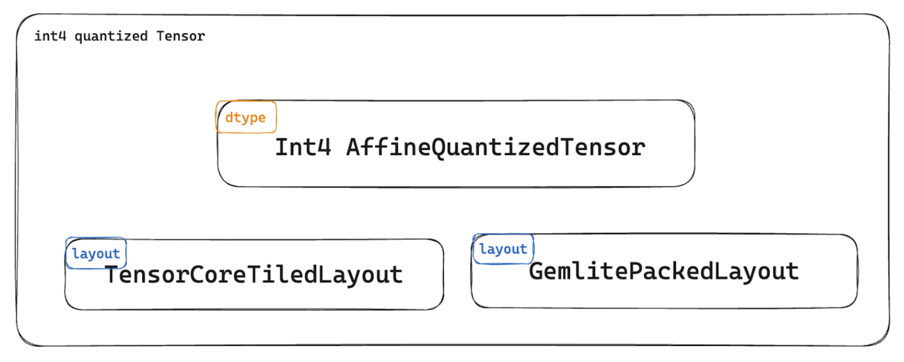
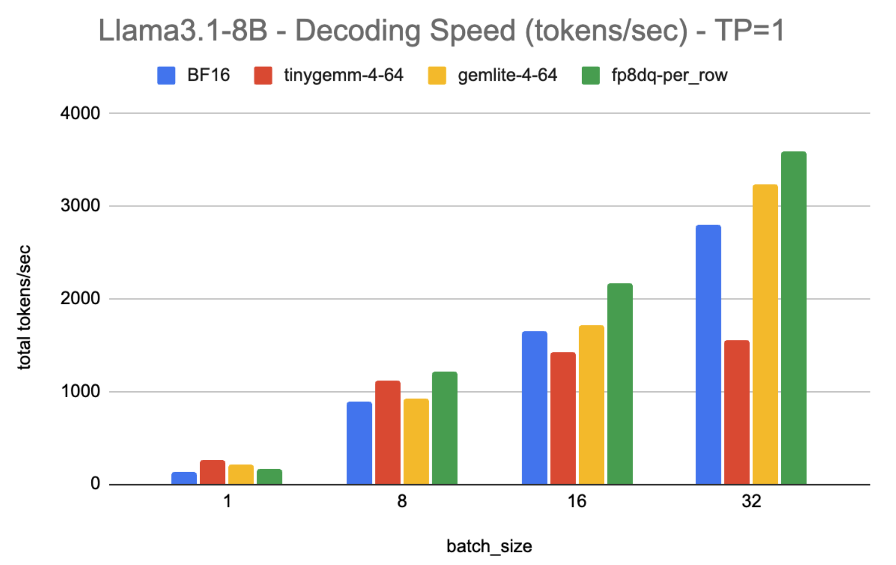
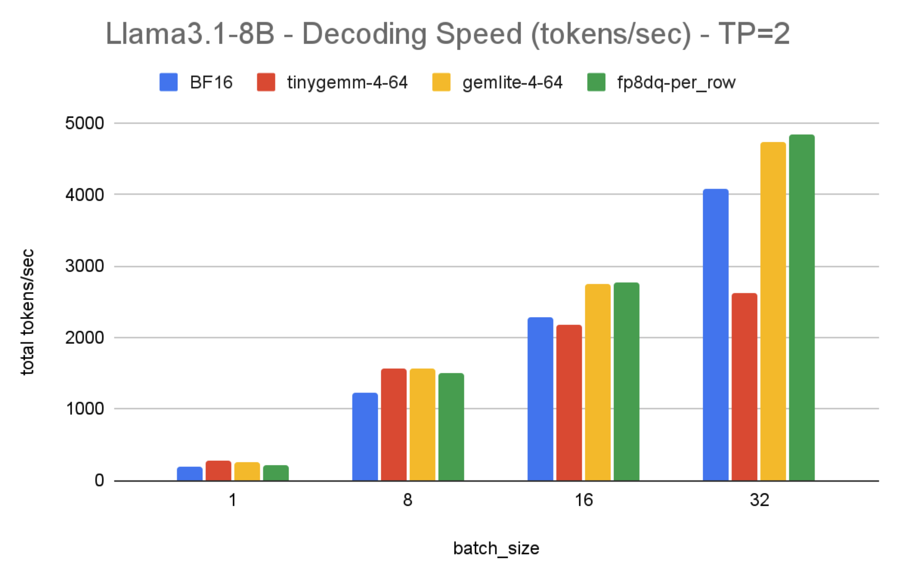
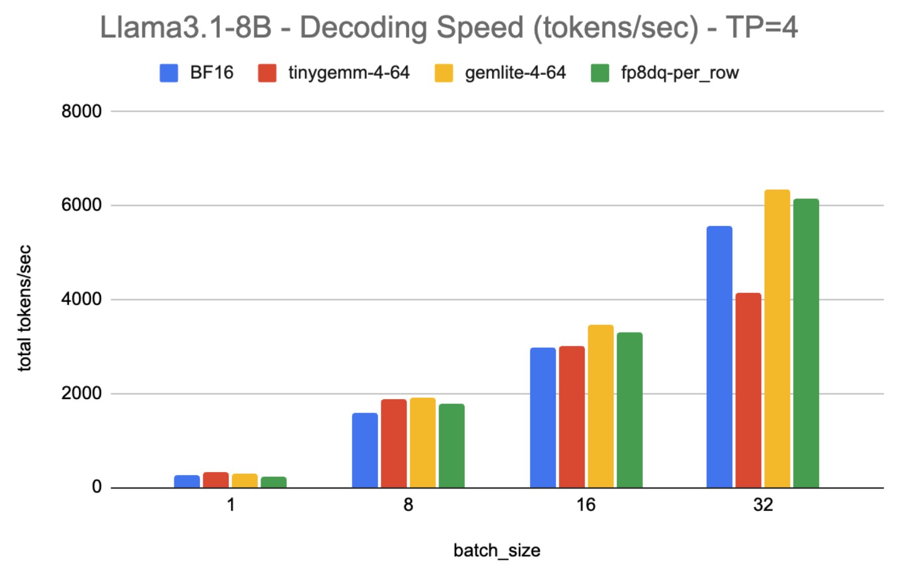

>标题：使用 GemLite、TorchAO 和 SGLang 加速 LLM 推理
>
>作者：PyTorch、Mobius Labs 和 SGLang 团队

大型语言模型（LLMs）通常对计算资源需求极高，需要大量的内存、计算能力和功耗才能高效运行。量化技术通过将权重和激活值从 16 位浮点数降低到更低的比特率（如 8 位、4 位、2 位），从而实现显著的加速和内存节省，同时还支持更大的 batch size。

现有的低精度推理方案在小 batch size 场景下表现良好，但存在以下问题：

- **当 batch size 增大时，性能下降**
- **对量化类型的限制**，例如，一些计算核（kernels）仅支持对称量化，这可能会影响模型在较低比特下的准确性
- **量化、序列化和张量并行（TP）的相互影响**，使得加载量化模型变得困难，并且可能需要对用户模型进行修改

为了解决这些挑战，我们构建了一套端到端的高性能、模块化且可扩展的低精度推理方案，并集成了以下库：

- **[GemLite](https://github.com/mobiusml/gemlite)**：一个基于 Triton 的计算核（kernel）库，解决了大 batch size 场景下的性能瓶颈，并支持更灵活的量化方式。
- **[TorchAO](https://github.com/pytorch/ao)**：一个原生 PyTorch 库，为量化、稀疏性和张量并行（与 DTensor 结合使用）提供了简化的用户体验。
- **[SGLang](https://github.com/sgl-project/sglang)**：一个快速、高效且可扩展的 LLM 和视觉语言模型（VLM）推理框架，支持广泛的模型类型。

如果你对在 SGLang 中尝试这一方案感兴趣，请按照[复现指南](https://pytorch.org/blog/accelerating-llm-inference/#repro-instructions)进行操作。在接下来的博客内容中，我们将详细介绍 GemLite、TorchAO 和 SGLang 的核心设计，以及它们如何集成来解决上述问题。最后，我们将展示在不同 batch size 和张量并行规模下，对 Llama 3.1-8B 模型进行基准测试的结果。

# 1. 结果预览

以下是在 **8×H100** 机器上对 **Llama 3.1-8B** 进行解码（decode）时的实验结果摘要。在所有实验中，基线模型为 **bfloat16 torch.compiled** 版本：

|                          | bfloat16 w/ torch.compile | int4 weight only quantization, group size 64 | float8 per row dynamic quantization |
| ------------------------ | ------------------------- | -------------------------------------------- | ----------------------------------- |
| Batch size 1, TP size 1  | 131 tokens/sec            | 255 tokens/sec (1.95x speedup)               | 166 tokens/sec (1.27x speedup)      |
| Batch size 32, TP size 1 | 2799 tokens/sec           | 3241 tokens/sec (1.16x speedup)              | 3586 tokens/sec (1.28x speedup)     |
| Batch size 32, TP size 4 | 5575 tokens/sec           | 6334 tokens/sec (1.14x speedup)              | 6159 tokens/sec (1.10x speedup)     |

我们的解决方案支持包括 H100 和 A100 在内的 NVIDIA GPU，并且在不同的 batch size 和 TP size 下，针对 **int4 权重量化**（加速范围从 1.14x 到 1.95x）和 **float8 动态量化**（加速范围从 1.10x 到 1.28x），都相较于编译后的 bfloat16 基线模型取得了加速效果。需要注意的是，量化可能会对准确性产生小的影响，但这一部分不在本博客的讨论范围内。我们的 **int4 权重量化** 兼容保持准确性的技术，如 HQQ。更多信息请参考 [TorchAO README](https://github.com/pytorch/ao/blob/main/torchao/quantization/README.md#cuda-backend-1)、[基准测试](https://huggingface.co/mobiuslabsgmbh/Llama-3.1-8b-instruct_4bitgs64_hqq_calib)以及[博客](https://neuralmagic.com/blog/we-ran-over-half-a-million-evaluations-on-quantized-llms-heres-what-we-found/)。

# 2. GemLite: 核心开发

这些计算核心是 GemLite 项目的一部分，旨在优化低比特矩阵乘法的计算核心。GemLite 使用 Triton 开发，提供了高度灵活且高效的解决方案，支持不同的激活函数、比特率和硬件平台。简而言之，这些核心提供了以下功能：

- **支持各种激活数据类型**：包括 fp16、int8 和 fp8
- **兼容性**：与非打包格式（例如 int8、fp8）和打包格式（例如 uint4、uint2、uint1）无缝兼容
- **性能优化**：包括经过优化的计算核心和自动调优工具，能够在不同硬件和 batch size 下实现高性能
- **集成性**：与 torch.compile 和 CUDA 图（CUDA graphs）兼容，确保支持张量并行等高级功能

## 核心选择

针对大型语言模型（LLM）生成任务，优化核心选择需要解决不同 batch size 的特定需求。LLM 工作负载包含计算密集型和内存密集型的迭代：较小的 batch size 主要受内存限制，而较大的 batch size 则变为计算密集型。GemLite 核心旨在适应这些不同的需求，确保在每种场景下都能实现最佳执行效果。

在内存密集型场景下，数据传输是限制因素，处理器通常需要等待数据加载，这导致计算资源未能充分利用。在 batch size = 1 时，**GEMV** 核心表现最佳，而对于更大的 batch size，**GEMM** 核心则更加高效。对于 batch size 在 2 到 64 之间，并且矩阵较“瘦”（即行数较小，列数较大）的情况，使用 **GEMM-SPLITK** 核心可以更好地利用 GPU 资源（参见 [arXiv](https://arxiv.org/abs/2402.00025)）。

GemLite 包含以下为每种场景优化的核心：

## 单样本推理

对于单样本推理，我们使用 **GEMV** 核心。然而，非对称量化方法需要加载额外的元数据，例如比例因子（scales）和零点（zero points），并且这些元数据需要为每个块加载。这可能会导致内存传输的增加，因此需要小心处理。

具体来说，对于打包数据，我们的实验表明，每两个连续块只加载一次比例因子和零点，可以最小化冗余操作。由于这些块共享相同的元数据，这种方法实现了：

- 相比默认的 GEMV 核心，端到端推理速度提高了 **5–8%**
- 相比传统的 **Split-K** 方法，性能提高了 **30–40%**

这种新核心/算法 **GEMV_REVSPLITK** 可以在[这里](https://github.com/mobiusml/gemlite/blob/master/gemlite/triton_kernels/gemv_revsplitK_A16fWnO16f_int32packing.py)获取。

对于非打包数据，使用 **[GEMV_SPLITK](https://github.com/mobiusml/gemlite/blob/master/gemlite/triton_kernels/gemv_splitK_A16fWnO16f_int32packing.py)** 算法。该算法通过迭代 k 维度计算点积，而不依赖于 Triton 的 `tl.dot`。

## 批量推理

对于中等 batch size，我们使用基于 **GEMM** 的 **Split-K** 方法（参见 [arXiv](https://arxiv.org/abs/2402.00025)），该方法将 k 维度（权重行）拆分成多个任务。通过自动调优 **SPLIT_K** 参数的值（范围从 1 到 16），可以找到最优的拆分策略。设置 **SPLIT_K=1** 会启用回退实现为 **GEMM** 核心，这样同一核心代码就可以用于计算密集型的 batch size，从 32 和 64 开始，具体取决于矩阵形状和设备。

## 最大化高性能：关键实现洞察

为了实现高性能，必须精心处理各种实现细节。以下是我们关注的几个关键方面，以确保性能的优化：

1. 性能自动调优

   [自动调优](https://triton-lang.org/main/python-api/generated/triton.autotune.html)对于实现最佳的核心性能至关重要。由于这个过程可能耗时，GemLite 提供了工具来自动保存和加载所有核心的自动调优结果。这样可以确保每个 GPU 设备仅执行一次自动调优，从而最小化运行时间，减少重复开销，并保持不同运行间的一致性性能。

2. 确保核心的正确性

   确保在不同的量化和配置设置下核心的正确性是必不可少的。Triton 的[早期配置修剪](https://triton-lang.org/main/python-api/generated/triton.autotune.html)在这个过程中发挥了关键作用。例如，在 Split-K 调优过程中，只有当 K 能被 **BLOCK_SIZE_K × SPLIT_K** 整除时，配置才会被选择，并且 **BLOCK_SIZE_K** 会根据组大小值进一步修剪。这种方法确保了核心操作的效率和正确性。

3. 克服比特解包瓶颈

   在数据中心级 GPU（如 NVIDIA 的 A100 和 H100）上部署时，观察到与比特解包相关的性能瓶颈。为了缓解这些瓶颈，我们探索了多种比特打包配置，包括沿列与沿行打包，以及尝试不同的比特打包宽度（例如 8 位与 32 位）。特别地，从 32 位打包转换为 8 位打包，在 A100 上实现了最高 **18%** 的性能提升，而在 H100 上则提升了 **6%**。

4. 与 torch.compile 的兼容性

   为了确保与 PyTorch 的 **torch.compile** 无缝兼容，核心调用被封装在 **[custom_op](https://pytorch.org/tutorials/advanced/python_custom_ops.html)** 中。这个集成允许预钩子（pre-hooks）和早期配置修剪等高级功能正常工作，在不牺牲性能的情况下提供准确的结果。尽管 PyTorch 中一些[功能](https://github.com/pytorch/pytorch/issues/139059)尚未完全支持，但通过 **custom_op** 实现有效地弥补了这一空白，确保了平稳集成并实现了高性能。

# 3. TorchAO

**TorchAO** 是一个原生的 PyTorch 量化与稀疏性库，适用于训练和推理，提供简单的用户 API 来训练、量化和部署低精度模型，并且可以与 PyTorch 的其他功能（如分布式推理和 torch.compile）进行组合。

默认情况下，PyTorch 不支持低精度数据类型或不同的打包格式。通过 **Tensor Subclass**，我们扩展了 PyTorch 原生的 Tensor 抽象和模型量化，将其作为数据类型转换，同时不同的打包格式通过布局（layouts）来处理，以支持自定义核心。例如，我们支持使用 **int4** 权重进行量化的线性操作，并以 Tensor Core 友好的布局打包，使用 **tinygemm** 或 **GemLite** 核心实现。更多细节可以在[这里](https://pytorch.org/ao/stable/contributor_guide.html)找到。



除了为开发者提供更多的 PyTorch 原生抽象之外，我们还希望强调这种设计对模型使用者的两个重要优势：

1. **[序列化](https://pytorch.org/ao/stable/serialization.html)**：可以像浮点模型一样将量化权重保存并加载到 `state_dict` 中，避免了在加载量化权重之前将浮点模型转换为量化模型的步骤。这减少了分发和部署量化模型的摩擦。
2. **[可组合性](https://pytorch.org/blog/accelerating-llm-inference/#torch-tensor-parallel)**：与下游功能（如张量并行）的无缝集成，使用户能够专注于建模，而不必担心与张量并行、torch.compile 和其他 PyTorch 功能的兼容性。由于这些功能是通过张量级抽象实现的，用户通常可以在不更改模型的情况下进行量化并进行分布式推理。

## GemLite 核心集成

为了实现上述 GemLite 核心的优势，我们将 GemLite 集成到 TorchAO 中。这一集成充分利用了 GemLite 的广泛支持和灵活性，支持 4 位和 8 位的仅权重量化，支持非对称和对称量化方案，32 位和 8 位的打包大小，以及分组和未分组的量化。我们通过 `quantize_` API 来启用这一集成，可以与 GemLite 构造器一起使用，如下所示：

```python
quantize_(model, gemlite_uintx_weight_only(group_size, bit_width, packing_bitwidth))
```

创建这一集成的主要难点在于确保 TorchAO 的可组合性保证能够适用于 GemLite 量化核心选项的整个范围。虽然主要的集成过程相对直接，但确保每种不同的量化类型及其相关的核心与张量并行功能良好兼容则并非易事。

## Torch 张量并行

张量并行是加速 LLM 推理的有效方式。张量并行将线性层或嵌入模块的大矩阵切分到多个设备上，通常采用按列或按行切分的方式。随着权重矩阵的分布，计算也被分解。例如，下面的按列切分模式能够在四个设备上同时进行矩阵-向量乘法：
$$
y = Ax = [A0|A1|A2|A3]x
$$
PyTorch 通过将常规张量（例如矩阵 A）转换为 **DTensor** 来实现张量并行（TP）：

```python
dtensor = _shard_tensor(mA, device_mesh, (Shard(0),))
```

由于 **DTensor** 存储了关于切分的元信息，它知道在需要时如何重建完整的结果。例如，以 Transformer 的前馈模块为例，由于下投影（down projection）和上投影（up projection）分别使用按列和按行切分，**DTensor** 会在这些操作进入下一个步骤时自动对各个设备上的结果进行全还原（all-reduce）。这种自动化使得模型开发者可以专注于计算，而无需担心分布式执行所需的通信。

### 张量并行与量化顺序

由于 **DTensor** 和量化都是张量级别的转换，它们的应用顺序在确保工作流能够在不同设置下正常运行时非常重要。我们有两个观察结论：（i）检查点通常以量化格式保存，以减少每次运行之前的量化开销；（ii）张量并行（TP）可能会在不同数量的设备上运行，具体取决于资源限制或服务协议。因此，我们首先对原始张量进行量化，根据是否需要重用来决定是否将其保存到磁盘。在服务启动时，我们加载量化后的检查点，并在加载到模型中时动态地将张量切分为 **DTensors**。

### TorchAO 中的张量并行支持

由于我们先对模型进行量化，再分发张量，所以我们会得到 **DTensor(QuantizedTensor(weight))**，其中 **DTensor** 表示分布式张量类，**QuantizedTensor** 表示 TorchAO 中的量化张量类。在构建 **DTensor** 时，**QuantizedTensor** 应该支持所调用的运算符，包括切片（slice）和视图（view）操作。为了确保整体执行效率，在维度 0 和 1 上切片的打包权重应与先切片未打包的权重然后再打包的结果相匹配（打包和切片操作应该交换顺序），否则打包格式与张量并行性不兼容。

# 4. SGLang

**SGLang** 是一个快速的服务框架，专为大规模语言模型（LLM）和视觉语言模型（VLM）设计。它以几乎[零开销的批处理调度器](https://lmsys.org/blog/2024-12-04-sglang-v0-4/)和快速的[约束解码](https://lmsys.org/blog/2024-02-05-compressed-fsm/)（constrained decoding）而著称。该框架主要用 Python 实现，轻量级且易于修改。它也是首批集成 **torch.compile** 的框架之一。

## TorchAO 在 SGLang 中的集成

我们将 **quantize_** API 集成到 SGLang 中，用于将特定类型的量化应用到模型上，支持 **int4** 权重量化（包括 **tinygemm** 和 **GemLite** 版本）、**float8** 动态量化以及其他几种量化类型。用户可以通过向基准测试脚本添加 `--torchao-config` 参数来启用量化。目前启用的选项还通过与 **DTensor** 的组合，支持张量并行性，张量并行性通过 `--tp-size` 选项启用。

## SGLang 中的 PyTorch 原生张量并行支持

SGLang 中现有的模型定义使用了与张量并行性风格耦合的特殊线性模块，例如：**MergedColumnParallelLinear**、**QKVParallelLinear** 和 **RowParallelLinear**。为了将模型定义与张量并行化风格解耦，我们定义了一个 [PyTorch 原生模型](https://github.com/sgl-project/sglang/blob/main/python/sglang/srt/models/torch_native_llama.py)，使用 PyTorch 中的普通 **nn.Linear** 模块，并依赖于 PyTorch 张量并行性 API 进行并行化，使用 **torch.compile** 来加速。在相关模块的层次结构中，我们添加了一个字典，用来描述子模块应该如何进行并行化。例如，在 **LlamaAttention** 类中，我们定义了：

```python
_tp_plan = {
    "qkv_proj": "Colwise_Sharded",
    "o_proj": "Rowwise",
}
```

其中，`qkv_proj` 和 `o_proj` 是 **wqkv** 和 **wo** 投影的全名（FQNs），它们的值是相应的张量并行（TP）风格。

然后，我们在 **model_parallel.py** 中定义了一个 TP 引擎。该引擎递归地搜索模型中的 `_tp_plan`，并使用 PyTorch 的 **[parallelize_module](https://pytorch.org/docs/stable/distributed.tensor.parallel.html#torch.distributed.tensor.parallel.parallelize_module)** API 将指定的张量并行风格应用到子模块中。

# 5. 结果

该评估集中在 H100 机器上两种流行的量化技术：**int4 权重-only 量化** 和 **float8 动态量化**。之所以选择这两种方法，是因为它们在优化内存效率和计算性能方面广泛应用于 H100 机器，非常适合用于不同工作负载下的基准测试。

* **int4 权重-only 量化**：这种方法显著减少了内存占用，并加速了内存密集型工作负载的解码过程，对计算密集型场景（如填充或较大的批次大小）的性能影响最小。我们将在下面展示 **bf16**、**GemLite** 和 **tinygemm** 内核在不同批次大小和张量并行配置下的结果。

* **float8 动态量化**：虽然此方法的内存节省较少，但它通常能提供更高的精度，并在内存密集型和计算密集型任务之间实现更平衡的加速。在 Hopper 级别的硬件和原生 fp8 支持下，AO 使用的高效 **cutlass/cuBLAS** 内核有助于实现显著的加速。

以下图表展示了不同张量并行（TP）大小下的解码速度（tokens/sec），每个图表展示了不同批次大小和不同类型量化的结果：

- **BF16**：我们的 **bfloat16**，经过 **torch.compile** 优化的基线。
- **tinygemm-4-64**：使用 **int4_weight_only** 量化（TorchAO），这是一个 4 位按组量化，组大小为 64，使用 **tinygemm** 内核。
- **gemlite-4-64**：使用 **gemlite_uintx_weight_only** 量化（TorchAO），其中 4 表示 4 位，64 也是组大小，使用 **GemLite** 内核。
- **fp8dq-per_row**：使用 **float8_dynamic_activation_float8_weight** 量化（TorchAO），其中激活和权重都使用按行缩放量化。







对于 **int4 权重-only 量化**，在批次大小为 1 时，**tinygemm** 内核表现最佳。然而，随着批次大小的增大，其效率有所下降。相反，**GemLite** 有效地弥补了这一差距，在较大的批次大小下提供了更优的性能。尽管受限于 Triton 的性能优化，**GemLite** 在预填充阶段仍然比 **tinygemm** 实现了 9-10 倍的加速。

**float8 动态量化** 在不同批次大小下，相比 **bfloat16** 在张量并行大小为 1 时 consistently 实现了 1.3 倍的加速，在较大的张量并行大小下则实现了 1.1 到 1.2 倍的加速。随着张量并行大小的增加，总体加速效果有所下降，这是由于矩阵乘法（matmul）规模的减少所致。需要注意的是，尽管我们也期望在预填充阶段获得加速，但由于我们依赖 **torch.compile** 来加速，而在 SGLang 中尚未启用预填充编译，因此这一部分会留待未来工作中解决。

## 复现步骤

我们在一台 8xH100 机器上进行了基准测试，使用的版本包括 **GemLite 0.4.1**、从 **feb2b76** 提交构建的 **SGLang**、**TorchAO nightly 0.8.0.dev20241223+cu124** 和 **PyTorch 2.5.1**。作为评估架构，我们选择了 **Llama-3.1 Instruct** 模型。

```bash
BATCH_SIZE=16
# Note: gemlite is only compatible with float16
# while int4wo-64 (tinygemm-4-64 as shown in the graph) and fp8dq-per_row should use bfloat16
DTYPE=float16
# int4wo-64, fp8dq-per_tensor
TORCHAO_CONFIG=gemlite-4-64
TP_SIZE=2
# Decode performance
python3 -m sglang.bench_offline_throughput --model-path meta-llama/Llama-3.1-8B-Instruct --json-model-override-args '{"architectures": ["TorchNativeLlamaForCausalLM"]}' --dataset-name random --random-input 1024 --random-output 512 --random-range 1 --num-prompts $BATCH_SIZE --enable-torch-compile --dtype $DTYPE --torchao-config $TORCHAO_CONFIG --tp-size $TP_SIZE

# Example output
# Benchmark...
# [2024-12-20 12:42:16 TP0] Prefill batch. #new-seq: 2, #new-token: 2046, #cached-token: 4, cache hit rate: \0.06%, token usage: 0.00, #running-req: 0, #queue-req: 0
# ...
# [2024-12-20 12:45:35 TP0] Decode batch. #running-req: 16, #token: 16763, token usage: 0.01, gen throughput\ (token/s): 2.20, #queue-req: 0
# [2024-12-20 12:45:38 TP0] Decode batch. #running-req: 16, #token: 24443, token usage: 0.02, gen throughput\ (token/s): 2739.89, #queue-req: 0

# We reported the last throughput (token/s) as the performance for decode
```

# 6. 结论

通过集成高性能且可扩展的 **[GemLite](https://github.com/mobiusml/gemlite)** 核心、PyTorch 原生架构优化库 **[TorchAO](https://github.com/pytorch/ao)** 和高性能推理框架 **[SGLang](https://github.com/sgl-project/sglang)**，我们展示了面向 **int4** 和 **float8** 的快速端到端量化推理，适用于不同的批次大小和张量并行大小，同时提供简洁且可组合的用户 API，降低了 LLM（大型语言模型）的资源需求。此集成是我们迈向满足不同模型、工作负载、精度和硬件需求的快速推理的第一步，我们期待继续推进端到端混合精度和低精度 LLM 推理的最新技术。

我们的近期工作重点包括以下几方面：

- 探索不同的权重和激活量化组合，找到在速度和准确性之间的最佳平衡
- 扩展对其他 GPU 架构的支持，以扩大可访问性
- 增强与 MoE（专家模型）的兼容性，以应对可扩展推理日益增长的需求
- 允许在 **TorchAO** 中轻松集成快速的自定义核，以便 SGLang 和其他推理框架能够便捷地利用
- 虽然我们在本文中没有测量准确性影响，但我们可以在 **TorchAO** 中开发自动量化工具，允许用户在性能和准确性之间做出权衡
- 更好地与 **SGLang** 中的张量并行支持集成，以便运行更大的模型
- 启用 **torch.compile** 来加速 SGLang 中的预填充阶段

我们还邀请社区积极进行测试、提供反馈，并为塑造快速高效的 LLM 推理的未来贡献力量。

