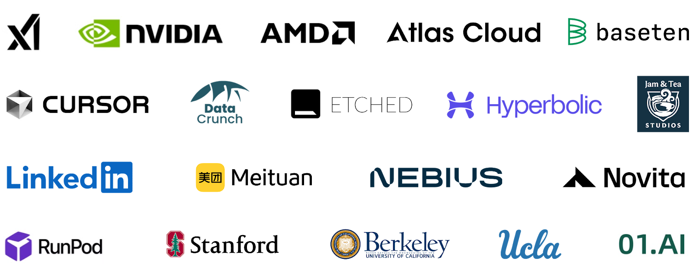

>标题：SGLang 加入 PyTorch 生态系统：高效的大模型推理引擎
>
>作者：SGLang 团队


我们很高兴地宣布，SGLang 项目已正式加入 PyTorch 生态系统！这一集成确保 SGLang 符合 PyTorch 的标准和最佳实践，为开发者提供一个可靠且由社区支持的框架，以实现大模型（LLM）的高效、灵活推理。

要查看 PyTorch 生态系统，请访问 [PyTorch Landscape](https://landscape.pytorch.org/) 了解更多关于项目[如何加入 PyTorch 生态系统](https://github.com/pytorch-fdn/ecosystem)的信息。

# 关于 SGLang

SGLang 是一个用于大语言模型（LLM）和视觉语言模型（VLM）的高速推理引擎。通过协同设计后端运行时和前端语言，它使模型交互更快且更可控。

**核心特性：**

- **高速后端运行时**：支持 RadixAttention 进行前缀缓存、零开销 CPU 调度器、持续批处理、Token 级注意力（Paged Attention）、预测解码、张量并行、分块预填充、结构化输出，以及 FP8/INT4/AWQ/GPTQ 量化。
- **灵活的前端语言**：提供直观的 LLM 应用编程接口，支持链式生成调用、高级提示、控制流、多模态输入、并行处理和外部交互。
- **广泛的模型支持**：支持多种生成式模型（Llama、Gemma、Mistral、Qwen、DeepSeek、LLaVA 等）、嵌入模型（e5-mistral、gte、mcdse）和奖励模型（Skywork），并支持轻松扩展以集成新模型。
- **活跃的社区**：SGLang 是开源项目，拥有活跃的社区支持，并已被业界采用。

SGLang 以其极快的速度而闻名，在推理吞吐量和延迟方面通常能显著超越其他最先进的框架。你可以通过以下版本博客了解更多底层技术：
 [v0.2 版本博客](https://lmsys.org/blog/2024-07-25-sglang-llama3/) | [v0.3 版本博客](https://lmsys.org/blog/2024-09-04-sglang-v0-3/) | [v0.4 版本博客](https://lmsys.org/blog/2024-12-04-sglang-v0-4/)

SGLang 已被领先的行业公司和前沿研究实验室广泛采用。例如，xAI 使用 SGLang 来部署其旗舰模型 [Grok 3](https://grok.com/)，该模型目前在 Chatbot Arena 排行榜上排名第一。Microsoft Azure 采用 SGLang 在 AMD GPU 上运行 [DeepSeek R1](https://techcommunity.microsoft.com/blog/azurehighperformancecomputingblog/running-deepseek-r1-on-a-single-ndv5-mi300x-vm/4372726)，这一模型是当前最强的开源模型。

# 部署 DeepSeek 模型

您可以使用以下命令轻松启动一个 Docker 容器来部署 DeepSeek 模型：

```bash
# Pull the latest image
docker pull lmsysorg/sglang:latest

# Launch a server
docker run --gpus all --shm-size 32g -p 30000:30000 -v ~/.cache/huggingface:/root/.cache/huggingface --ipc=host --network=host --privileged lmsysorg/sglang:latest \
    python3 -m sglang.launch_server --model deepseek-ai/DeepSeek-V3 --tp 8 --trust-remote-code --port 30000
```

然后，您可以使用兼容 OpenAI 的 API 查询服务器。

```python
import openai
client = openai.Client(base_url=f"http://127.0.0.1:30000/v1", api_key="None")

response = client.chat.completions.create(
    model="deepseek-ai/DeepSeek-V3",
    messages=[
        {"role": "user", "content": "List 3 countries and their capitals."},
    ],
    temperature=0,
    max_tokens=64,
)
```

上述服务器启动命令适用于 **8xH200**。您可以在 [DeepSeek 部署文档](https://docs.sglang.ai/references/deepseek.html) 中找到适用于 **MI300X、H100、A100、H20、L40S** 等硬件的详细指南。

SGLang 集成了针对 DeepSeek 的专门优化，例如 **MLA 吞吐量优化、MLA 优化内核、数据并行注意力、多 Token 预测** 以及 **DeepGemm**，使其成为包括 **AMD、NVIDIA 及众多云服务提供商** 在内的数十家[公司](https://x.com/lmsysorg/status/1887262321636221412)部署 DeepSeek 模型的首选方案。团队目前正积极推进更多优化，并将按照 **2025 年上半年** 的路线图进行集成。

# 部署 Llama 模型

类似地，您可以使用以下命令启动 Llama 3.1 文本模型的服务器：

```bash
python -m sglang.launch_server --model-path meta-llama/Meta-Llama-3.1-8B-Instruct
```

或者，使用以下命令启动 Llama 3.2 多模态模型的服务器：

```bash
python3 -m sglang.launch_server --model-path meta-llama/Llama-3.2-11B-Vision-Instruct  --chat-template=llama_3_vision
```

# 规划

今年，SGLang 团队将继续推动系统效率的边界。您可以在[这里](https://github.com/sgl-project/sglang/issues/4042)查看 2025 年上半年（2025H1）的路线图。重点包括：

- 面向吞吐量的大规模部署，类似于 DeepSeek 推理系统
- 长上下文优化
- 低延迟预测解码
- 强化学习训练框架集成
- 内核优化

# 社区

SGLang 已经部署到大规模生产环境，每天生成数万亿个 Token。它拥有一个活跃的社区，GitHub 上有超过三百名贡献者。SGLang 得到了以下机构的支持：AMD、Atlas Cloud、Baseten、Cursor、DataCrunch、Etched、Hyperbolic、iFlytek、Jam & Tea Studios、LinkedIn、LMSYS、美团、Nebius、Novita AI、NVIDIA、RunPod、斯坦福大学、加州大学伯克利分校、加州大学洛杉矶分校、xAI 和 01.AI。



# 结论

我们很高兴欢迎 SGLang 加入 PyTorch 生态系统。SGLang 加速了大语言模型和视觉语言模型的服务，它已被广泛应用于工业界，支持像 Grok 和 DeepSeek 这样的前沿模型的大规模在线服务。

我们邀请您探索 [SGLang 的 GitHub 仓库](https://github.com/sgl-project/sglang/tree/main)，加入 [Slack 社区](https://slack.mindee.com/)，并通过 contact@sglang.ai 联系我们，进行咨询或合作。让我们一起使强大的 AI 模型对每个人都变得触手可及。
