# RL 清单

| 项目名称            | 项目地址                                      | Star  | 起始日期   | 公司              | 应用场景 | 趋势     |
| ------------------- | --------------------------------------------- | ----- | ---------- | ----------------- | -------- | -------- |
| ~~TianShou~~        | https://github.com/thu-ml/tianshou            | 8.9k  | 2020/3/8   | 清华              | 算法研究 | 放缓     |
| **ART**             | https://github.com/OpenPipe/ART               | 7.8k  | 2025/3/9   | OpenPipe          |          | 快速增长 |
| TorchRL             | https://github.com/pytorch/rl                 | 3.1k  | 2022/3/27  | Meta              | 实验验证 | 放缓     |
| **AReaL**           | https://github.com/inclusionAI/AReaL          | 2.9k  | 2025/2/23  | 蚂蚁              | 算法研究 | 快速增长 |
| **ROLL**            | https://github.com/alibaba/ROLL               | 2.2k  | 2025/5/25  | 阿里              | 算法研究 | 快速增长 |
| **OpenRLHF**        | https://github.com/OpenRLHF/OpenRLHF          | 8.3k  | 2023/7/30  |                   |          | 快速增长 |
| **Agent Lightning** | https://github.com/microsoft/agent-lightning  | 6.6k  | 2025/6/15  | 微软              |          | 快速增长 |
| **Verl**            | https://github.com/volcengine/verl            | 15.1k | 2024/10/27 | 字节              | 生产部署 | 快速增长 |
| TRL                 | https://github.com/huggingface/trl            | 16.1k | 2020/3/22  | Hugging Face      |          |          |
| Prime RL            | https://github.com/PrimeIntellect-ai/prime-rl | 739   | 2024/9/8   | PrimeIntellect AI |          |          |
| SkyRL               | https://github.com/NovaSky-AI/SkyRL           | 1.1k  | 2025/5/4   | UC Berkeley       |          |          |
| RAGEN               | https://github.com/mll-lab-nu/RAGEN           | 2.4k  | 2025/1/19  |                   |          |          |
| **TorchForge**      | https://github.com/meta-pytorch/torchforge    | 484   | 2025/6/22  | Meta              |          | 新兴     |
| ~~CleanRL~~         | https://github.com/vwxyzjn/cleanrl            | 8.2k  | 2019/6/2   |                   | 算法研究 | 放缓     |
| Nemo-RL             | https://github.com/NVIDIA-NeMo/RL             | 996   | 2025/3/16  | Nvidia            |          |          |

待添加：OpenEnv

# TianShou

Tianshou 是一个强大且易用的强化学习库，适用于算法研究、实际应用和特定任务的解决。它提供了高性能、模块化和用户友好的框架，支持广泛的 RL 算法和多智能体场景。Tianshou 是通用的 PyTorch RL 库，面向经典 RL 算法（online/offline/multi-agent），未以 LLM/RLHF 为核心定位。

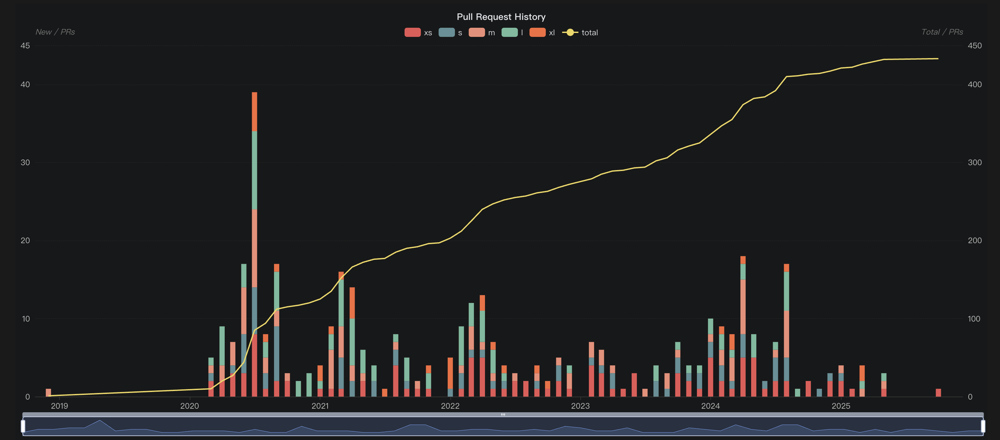

# ART

**亮点：**

1. Serverless RL（云端 弹性托管 GPU／训练资源），ART／OpenPipe 与 Weights & Biases（W&B）训练平台集成，支持 “W&B Training: Serverless RL” 模式。

2. 明确聚焦的是“agent 式”任务，ART 强调你在已有代码中插入训练。

**应用场景：**

ART·E 检索邮件 https://openpipe.ai/blog/art-e-mail-agent

GeekWire 报道 CoreWeave 收购 OpenPipe 的新闻，收购说明 OpenPipe／ART 在行业中有一定影响力和商业价值。

OpenPipe 推出了 ART，这是一个开源的强化学习训练库，专门用来提升 LLM 在 Agent 工作流中的表现。ART 使用 GRPO 算法，让模型从自己的经验中学习。更棒的是，你可以在现有的代码库中直接运行 Agent，而把复杂的强化学习训练交给 ART 后端。 点评：ART 支持市面上大多数的 LLM 模型，像是 Qwen, Gemma 等等。现在已经有使用 3B 和 7B Qwen 模型成功微调，使它们可以进行 2048、Tic Tac Toe 这样的小游戏的 Notebook 示例，可以快速上手体验，直观感少强化学习的强大之处。

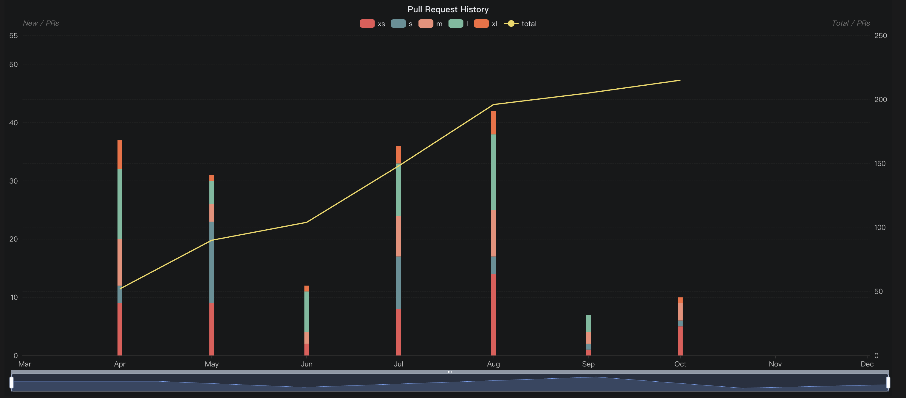

# TorchRL

PyTorch生态，起源比较早，但是一开始设计目标是成为PyTorch官方生态下的RL工具箱，偏向于研究。

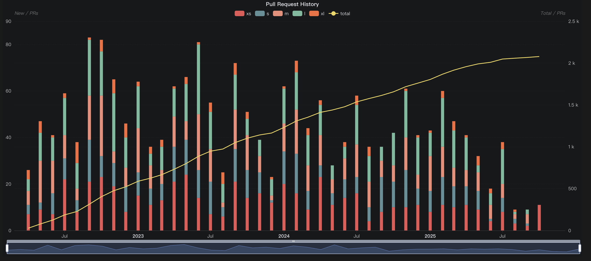

# AReaL

亮点：率先提出了全异步方案，由算法创新诞生的RL框架AReaL-Lite适合算法研究。采用算法优先的API 设计，优先考虑易用性和算法开发，同时原生支持完全异步的智能体强化学习 (RL)。

应用场景：采用 AReaL 端到端异步强化学习训练技术构建的先进搜索 Agent， ASearch：https://github.com/inclusionAI/ASearcher

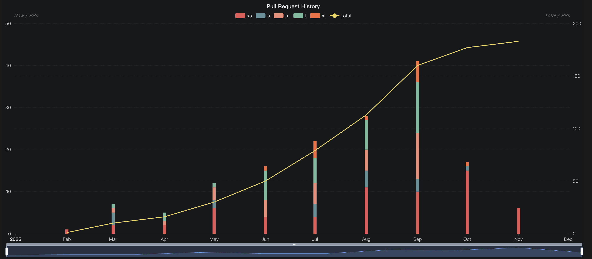

# ROLL

亮点：强调模块化，适用多种人群（产品研发/算法研究），偏向研究，但也在论文表明曾在千卡集群上稳定执行2周，

应用场景：

- [IPRO](https://arxiv.org/abs/2510.14255)：一种新型视频扩散框架，利用强化学习增强以人为中心的 I2V 生成中的身份保留，通过人脸身份评分器和 KL 散度正则化优化扩散模型。
- [TaoSR-SHE](https://arxiv.org/abs/2510.07972)：淘宝搜索相关性的逐步混合考试强化学习框架，采用 SRPO（混合奖励模型 + 离线验证器）、多样化数据过滤和多阶段课程学习。
- [EARL](https://arxiv.org/abs/2510.05943)：面向 LLM 的高效智能强化学习系统，引入动态并行选择器和布局感知数据调度器，以提高吞吐量，减少内存和数据移动瓶颈，从而实现稳定的大规模智能强化学习，而无需严格的上下文长度限制。
- [LiveThinking](https://arxiv.org/abs/2510.07685)：通过拒绝采样微调将 6700 亿教师 LLM 精简为 300 亿 MoE（30 亿活跃），然后使用 GRPO 压缩推理，实现 AI 驱动直播的实时推理；延迟低于一秒，计算量减少约 30 倍，在淘宝直播中，响应正确率 (3.3%)、有用性 (21.8%) 和 GMV 均有所提升。
- [TaoSR-AGRL](https://www.arxiv.org/abs/2510.08048)：基于LLM的电子商务相关性自适应引导强化学习，引入规则感知奖励塑造和自适应引导回放，以提高淘宝搜索的长期推理、规则遵守性和训练稳定性；已部署在处理数亿用户的主要搜索中。
- [RecGPT](https://www.arxiv.org/abs/2507.22879)：下一代 LLM 驱动框架，将用户意图置于推荐系统的核心，从而促进更可持续、互惠互利的生态系统。
- [TaoSR1](https://arxiv.org/abs/2508.12365)：一种新型的LLM框架，直接部署了思维链（CoT）推理，用于电子商务查询产品相关性预测，克服了部署挑战，实现了卓越的性能。
- [AIGB-Pearl](https://www.arxiv.org/abs/2509.15927)：一种新型的自动竞价方法，它融合了生成式规划和策略优化，利用 LLM 增强的轨迹评估器迭代地改进竞价策略，以实现最先进的广告效果。

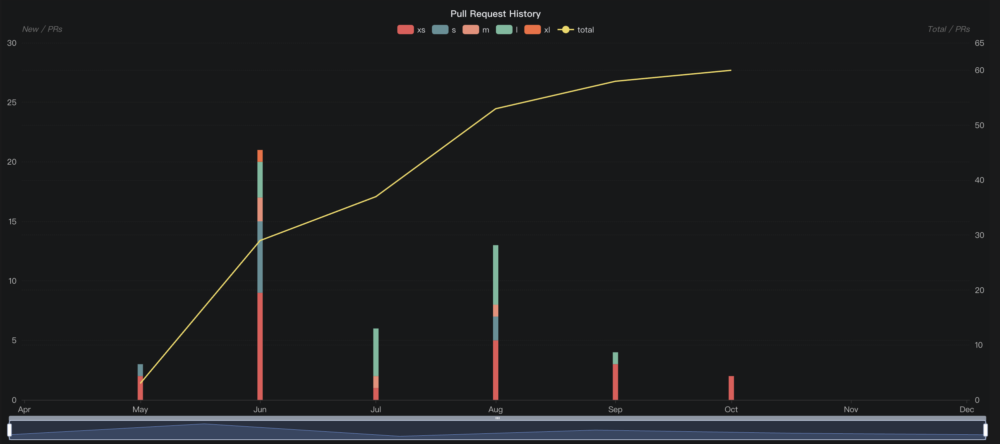

# OpenRLHF

亮点：比较早的RL框架，也在补齐后续的能力

应用场景：研究者使用 OpenRLHF 来复现实验 DeepSeek-R1 的训练流程

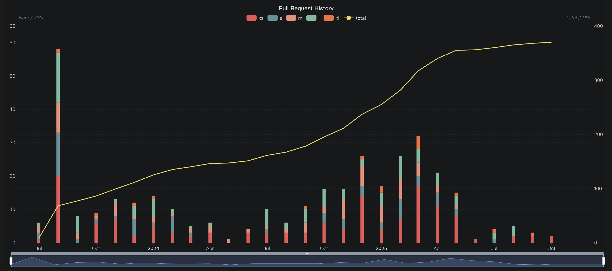

# Agent-Lightning

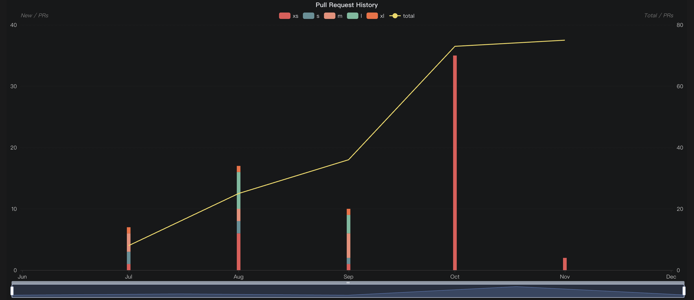

# Verl

支持多种算法，可以简单搭建工作流，如 GRPO，PPO
细致整合许多 LLM 框架，FSDP, Megatron-LM, vLLM, SGLang
灵活的设备映射
支持主流的 HF 模型

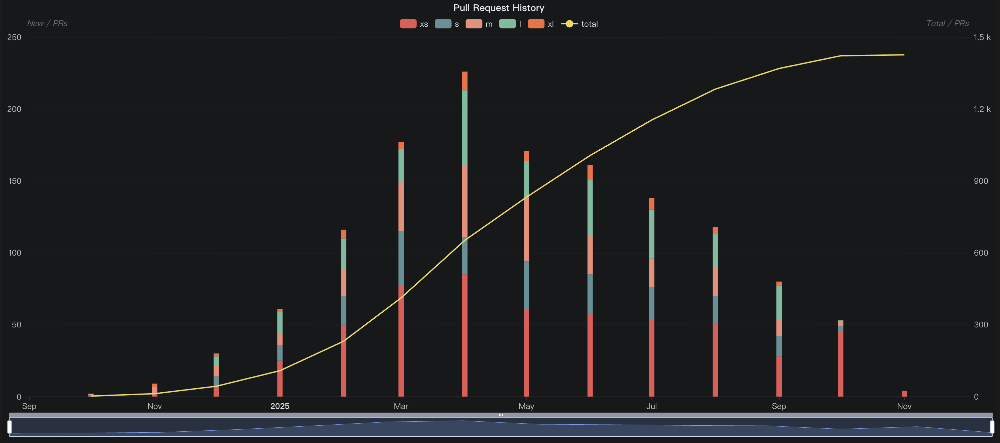

# TRL

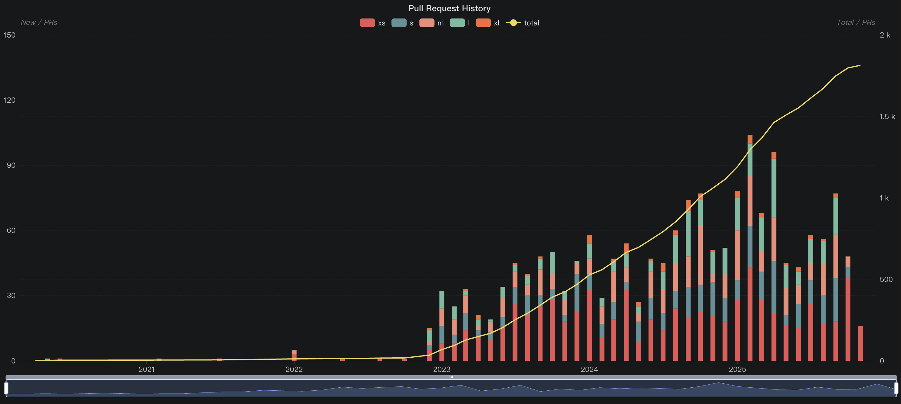

# Prime-RL

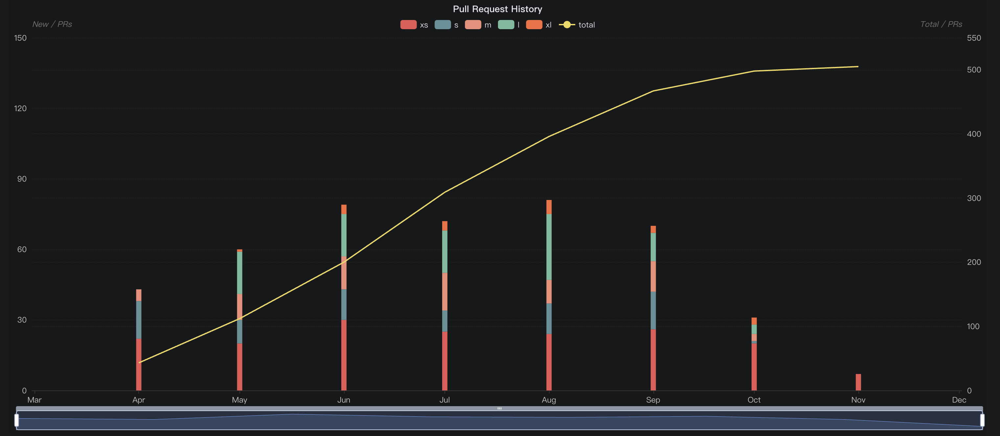

# SkyRL

SkyRL 是一个模块化的 RL 全栈框架
Trainer 支持 DeepSpeed 和 FSDP2
推理支持 vLLM SGLang 以及自定义 OpenAI API
Environment 支持 SkyRL-Gym(A simple Environment interface for implementing new tasks, along with library of implemented environments for math, python, search, and text-to-SQL) 以及自定义 

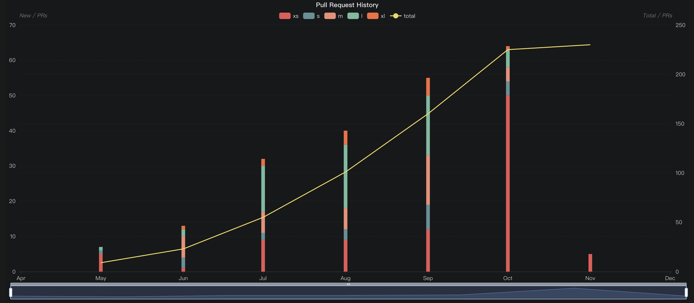

# RAGEN

亮点：
StarPO 是 trajectory 级别的推理优化，聚焦于多轮的轨迹优化 

StarPO 是一个全面的强化学习框架，它提供了一种统一的方法来训练多轮、轨迹级别的智能体，能够对推理过程、奖励分配机制和提示展开结构进行灵活控制。
在 StarPO 的基础上，引入了 RAGEN，一个模块化的智能体训练和评估系统，它实现了完整的训练循环，包括生成、reward 计算和轨迹优化。
RAGEN 作为一个强大的研究基础设施，用于系统地分析多轮和随机环境中 LLM 智能体的训练动态。

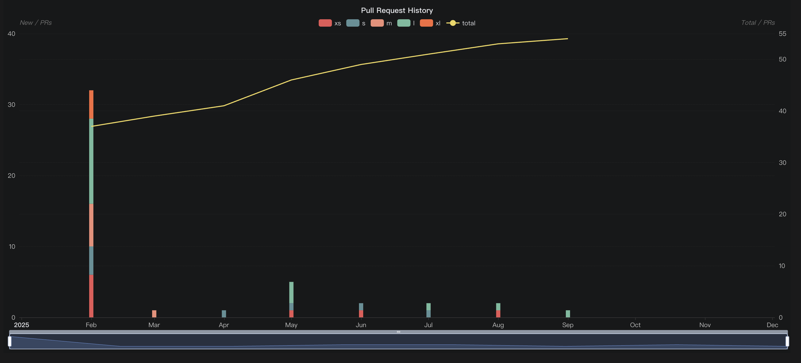

# TorchForge

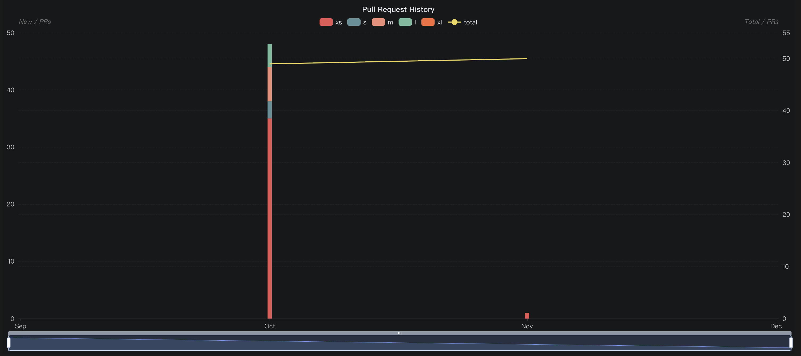

# CleanRL

主要面向理解与复现实验的经典 RL 算法，并非专门为 LLM/RLHF 设计。

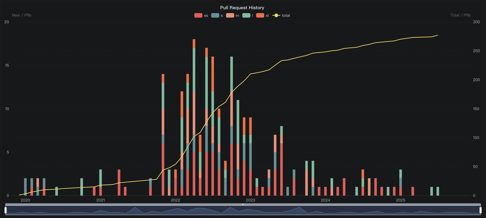

# NeMo-RL

亮点：
与英伟达的 NeMo 生态系统紧密耦合，支持使用 Megatron 进行训练与生成

用于 LLM / VLM 的端到端可扩展强化学习 —— 与英伟达的 NeMo 生态系统紧密耦合。
支持在 DTensor 和 Megatron 作为训练后端，支持 vLLM 和 Megatron 作为生成后端
可扩展性 - 支持从小尺度实验到多设备多节点的训练与生产工作。
原生 Ray 编排实现资源调度和部署管理。
与 Megatron Core 紧密融合，支持大模型 6D 并行方式的训练。

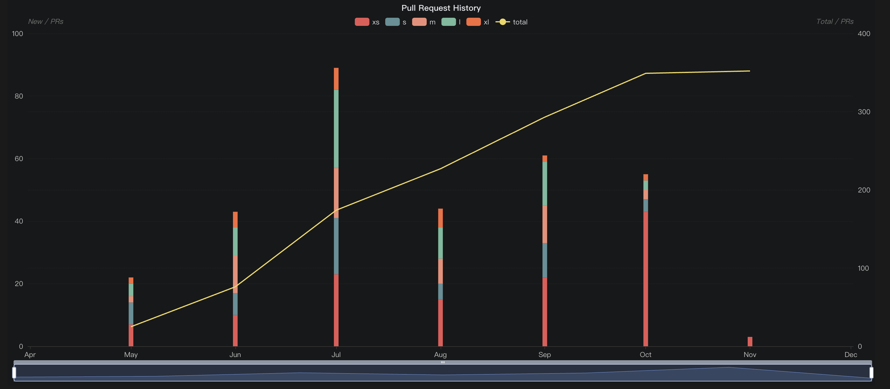

# 思考：为什么会有这么多RL框架？

RL 场景复杂：

* 环境多样性
* 算法差异大
* 每个框架侧重点不同

不同框架强调的点不同：例如：强调分布式伸缩性/轻量化可复现/大模型场景高效并行/专注于某些特定领域