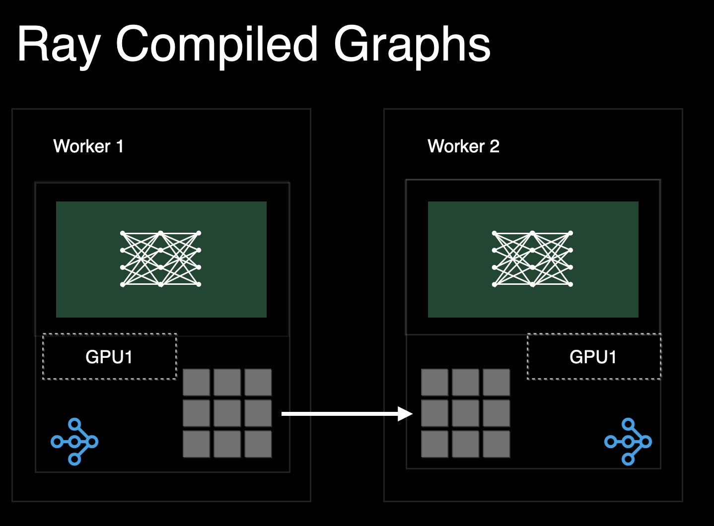
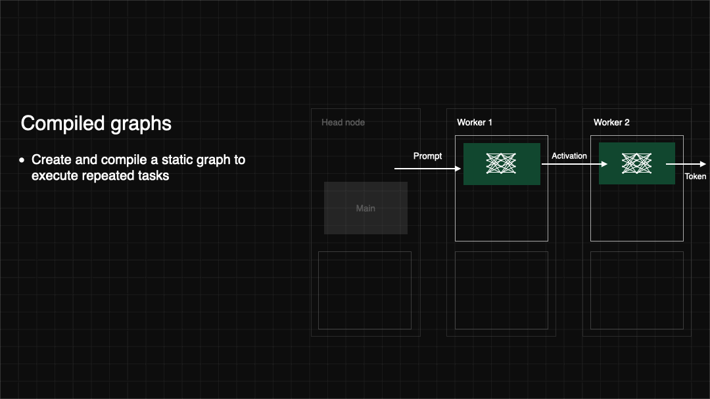
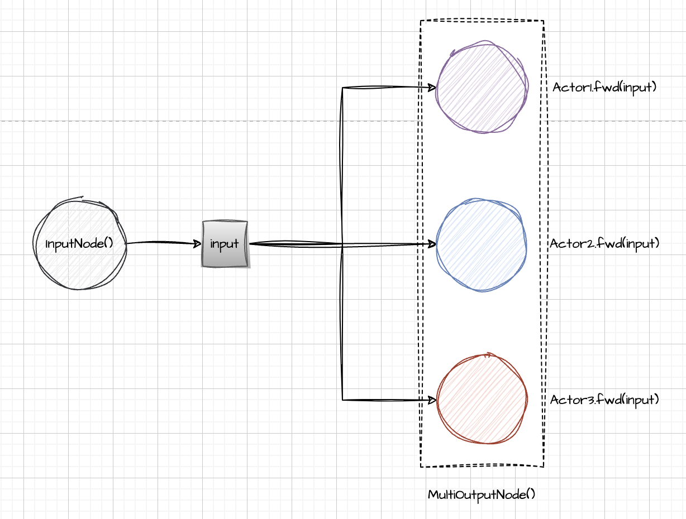
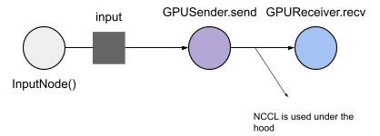
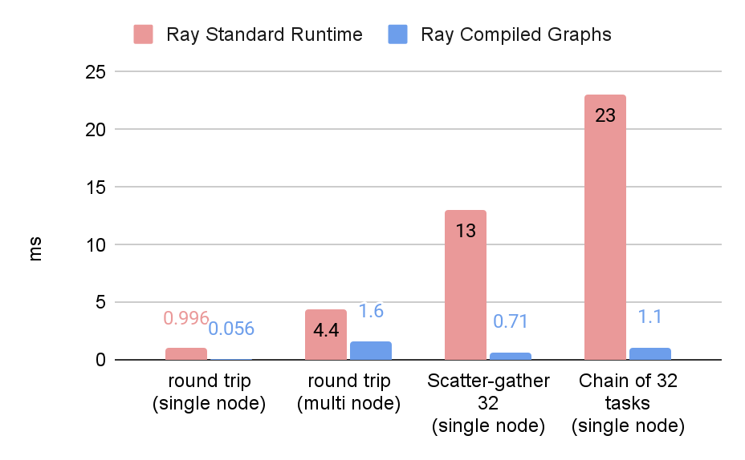
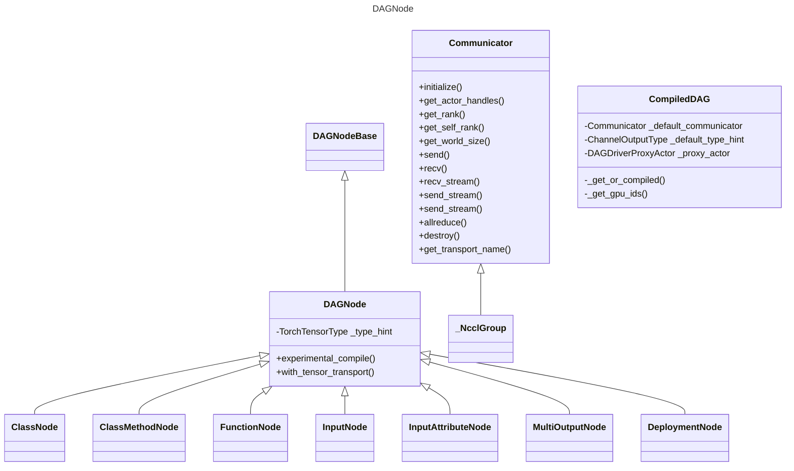
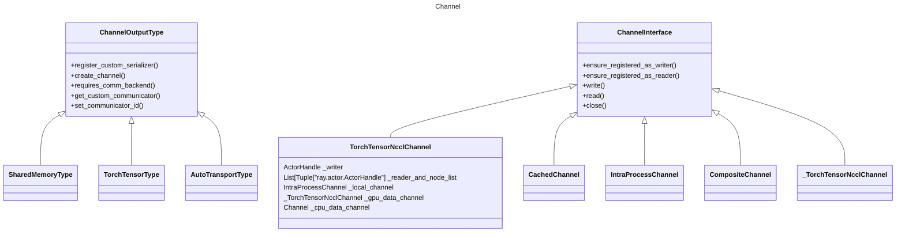

>参考文档：
>
>* [Ray Compiled Graphs: Optimized AI Workloads with Native GPU Communication](https://www.anyscale.com/blog/announcing-compiled-graphs)
>
>科普：
>
>* DAG：Directed Acyclic Graph 有向无环图。




## 1 Introduction

随着 AI 模型的复杂性和规模不断增加，与这些模型相关的工作负载和应用对底层软件基础设施及其原语提出了新的需求。与传统的基于 CPU 的工作负载不同，大型 AI 模型的工作负载（如训练和推理）主要依赖于 GPU 密集型计算，且通常需要在数十甚至数百个加速器之间进行分布式计算和协调。

**Compiled Graphs（编译图）** 提供了极低的任务提交开销（约 50 微秒），相比之下，Ray 的标准任务提交开销为 1~2 毫秒。虽然这种默认的开销对诸如数据处理或批处理等长时间运行、以吞吐量为中心的工作负载来说影响较小，但对于诸如自回归式（auto-regressive）生成这样的亚秒级工作负载来说，这样的开销是不可接受的。

此外，**Compiled Graphs** 支持原生的 GPU 到 GPU 数据传输，同时能自动解决死锁问题，并实现通信与计算的重叠优化。在没有 Compiled Graphs 的情况下，用户必须借助 NCCL 等带外通信原语，才能实现低延迟的 GPU 数据传输。

```python
# 原始的 Ray 项目
ref = receiver.recv.remote(sender.send.remote(inp))
ray.get(ref)

# 编译图
with InputNode() as inp:
    dag = receiver.recv.bind(sender.send.bind(inp))
compiled_graph = dag.experimental_compile()
ray.get(compiled_graph.execute(1))
```

这些改进为 Ray 程序带来了新机遇：

- **Ray Compiled Graphs** 可以在不同的 Actor 间以毫秒级的延迟传输大规模张量。
- 使用 **Compiled Graphs**，用户可以通过不到 70 行代码实现复杂的流水线调度算法，同时在性能上可与当前最先进的库（如 Deepspeed）相媲美。例如，在 4 台 A100 GPU 上对 Llama 7B 模型进行推理或训练时，可实现同等的性能。
- 基于 **Compiled Graphs** 的多模态训练工作负载，结合异构并行和 GPU，能相比 PyTorch 标准的 FSDP（Fully Sharded Data Parallel）实现 **43% 的 Token-per-Dollar 成本效率提升**。

这些优化显著降低了代码复杂度，同时提高了性能和成本效率，使得在 Ray 上开发高性能 AI 应用变得更加高效。


## 2 Introducing Compiled Graphs in Ray



**Compiled Graphs** 是 Ray 中的一项新功能，它提供了类似经典 Ray Core 的 API，同时具备以下三大优势：

1. **降低重复任务图的系统开销**
2. **原生支持通过 NVIDIA NCCL 进行 GPU-GPU 通信**
3. **优化调度以避免死锁，并最大化计算和通信资源的利用率**

与标准的 Ray API 相比，**Compiled Graphs** 是通过静态计算图来表达任务的。

通过利用程序的静态特性，Ray 能够在任务执行之前提前分配资源，并在后续调用中重复使用这些资源。此外，Ray 可以在任务执行前正确分配内存，以利用如 NCCL 这类需要发送端和接收端对称的优化通信原语。如下所示，Ray **Compiled Graphs** 在简单的 GPU 张量传输中可以将延迟提高 **140 倍**，在 CPU 数据传输中延迟提升 **17 倍**。

接下来，让我们深入了解机器学习工作负载中常见的一种模式：**散布-聚合（scatter-gather）** 的简化版本。

首先，让我们开始安装 Compiled Graphs：

```bash
pip install -U "ray[adag]"
```

**Scatter-gather** 是机器学习工作负载中一种常见的分布式计算模式。它将相同的输入发送给多个工作节点（Ray Actors），然后从所有工作节点中收集结果。例如，在张量并行推理中，程序会将相同的 CPU 数据发送给所有 Actors，然后这些 Actors 将 CPU 数据移动到 GPU 并运行仅加载分片权重的 Torch 模型。接下来，让我们使用 **Compiled Graphs** 表示这个程序。

我们从创建普通的 Ray Actors 开始，在这个示例中，我们将创建 3 个 Actors：

```python
import ray
from time import perf_counter

@ray.remote
class TensorProcessor:
  def fwd(self, tensor: str) -> str:
    # some_gpu_ops(tensor.to(torch.device()))
    # In a typical application, this actor will move the 
    # tensor to GPU and run a torch module. 
    # We instead do nothing and return the string input immediately for simplicity.
    return tensor

N = 3
actors = [TensorProcessor.remote() for _ in range(N)]
```

首先，让我们看看如何用常规 Ray 程序来表达这一点。

```python
# warmup actors
for _ in range(10):
    ray.get([actor.fwd.remote("hello") for actor in actors])

s = perf_counter()
result = ray.get([actor.fwd.remote("hello") for actor in actors])
print("Normal ray programs took", (perf_counter() - s) * 1000, "ms")
print(result)
```

接下来，我们定义并编译一个 **Compiled Graph**，该图会将相同的输入占位符传递给所有 Actors。在这里，我们使用 Ray 的 **DAG API**，它以静态方式构建一个计算图的中间表示。当我们有多个输出节点时，需要使用 [MultiOutputNode](https://www.anyscale.com/blog/announcing-compiled-graphs) 语法来封装输出结果，这是必不可少的步骤。

```python
import ray.dag

# Define a DAG for lazy execution.
with ray.dag.InputNode() as inp:
    # Bind each actor task to the same input placeholder.
    outputs = [actor.fwd.bind(inp) for actor in actors]
    dag = ray.dag.MultiOutputNode(outputs)
```

这将生成如下的 Ray DAG：



现在，为了使用 **Compiled Graphs**，我们使用以下 `experimental_compile` 命令。Ray 将预先分配运行图所需的所有资源，从而使得图的执行速度相比标准的动态运行时大大加快：

```python
compiled_graph = dag.experimental_compile()

# warmup actors
for _ in range(10):
    ray.get(compiled_graph.execute("hello"))

# Execute the DAG with different arguments:
s = perf_counter()
result = ray.get(compiled_graph.execute("hello"))
print("Compiled Graphs took", (perf_counter() - s) * 1000, "ms")
print(result)
# ["hello", "hello", "hello"]
```

这是全部内容！你可以使用相同的程序来扩展你的工作负载。这些 API 在多节点环境下同样适用。

在底层，Ray 预先分配资源，以减少执行过程中的开销：

* 新的 Compiled Graphs 后端在编译时静态分配每个 actor 任务的输入和输出缓冲区，而不是在每次执行 DAG 时动态分配。这些缓冲区在执行时被重复使用，actor 始终直接将结果推送到需要它的进程。

* 所有位于同一 Ray 节点上的 actor 将共享同一个物理输入缓冲区，该缓冲区由 Ray Compiled Graphs 后端进行同步。这有助于减少每个 task 的开销，例如序列化 task 参数、为参数分配内存以及调用 task。

* 此外，该后端还会提前分配 actor 的执行循环。每个 actor 不是等待 RPC 来执行下一个 task，而是在循环中等待下一个 echo task 的参数（通过已分配的缓冲区传递）。

那么，如果我们想要在不同的 actor task 之间进行流水线化执行呢？一个典型的例子是流水线并行推理（pipeline-parallel inference），在这个场景中，我们通过共享内存将一个 actor 的中间输出传递给下一个 actor，并且数据传输应该与计算任务并行流水线化。我们可以通过在检索输出之前多次执行相同的 DAG 来在不同的 actor 之间实现流水线化执行：

```python
# Teardown the previous dag.
compiled_graph.teardown()
with ray.dag.InputNode() as inp:
  for actor in actors:
    # Pass each actor task output as input to the next actor task.
    inp = actor.fwd.bind(inp)
  dag = inp
```

这将生成如下有向无环图 (DAG)：


我们可以像这样编译并执行：

```python
compiled_graph = dag.experimental_compile()
# Call dag.execute() several times. The executions will be pipelined across the different actors.
refs = [compiled_graph.execute(f"hello{i}") for i in range(N)]
# Get the results, flushing the pipeline.
for ref in refs:
  print(ray.get(ref))
# "hello0"
# "hello1"
# "hello2"
```

为了演示 GPU-GPU 通信，我们可以构建一个向另一个Actor发送张量的Actor。要运行此示例，请确保您的集群中至少有 2 个 GPU。

```python
import ray
import ray.dag

import torch

assert ray.cluster_resources().get("GPU") >= 2, ("Insufficient number of GPUs available in the cluster.")

@ray.remote(num_gpus=1)
class GPUSender:
  def send(self, shape):
    return torch.zeros(shape, device="cuda")

@ray.remote(num_gpus=1)
class GPUReceiver:
  def recv(self, tensor: torch.Tensor):
    assert tensor.device.type == "cuda"
    return tensor.shape

sender = GPUSender.remote()
receiver = GPUReceiver.remote()
```

接下来，我们定义并编译一个 **Compiled Graph**，用于将一个 CUDA 张量从一个 Actor 传递到另一个 Actor。通过下面的 `TorchTensorType` 类型提示，Ray 会在底层使用 NCCL，通过 GPU RDMA（远程直接内存访问） 在两个 GPU 之间传输张量。

```python
from ray.experimental.channel.torch_tensor_type import TorchTensorType
with ray.dag.InputNode() as inp:
  dag = sender.send.bind(inp)
  # You have to specify transport="nccl", otherwise, it uses shared memory to transfer GPU tensors.
  dag = dag.with_type_hint(TorchTensorType(transport="nccl"))
  dag = receiver.recv.bind(dag)

compiled_graph = dag.experimental_compile()
# Execute the DAG. Ray aDAG will orchestrate any NCCL ops.
assert ray.get(compiled_graph.execute((10, ))) == (10, )
```



您可以查看[开发者指南]()以获取更多信息。

## 3 Benchmarks

我们比较了 **Ray Core**（标记为“Ray Standard Runtime”）和 **Ray Compiled Graphs** 在多种通信模式下的性能表现：

- **回环通信（Round Trip）**：在这种模式下，我们构造了一个 Actor，用于反复将数据发送到接收者 Actor。
- **散布-聚合（Scatter-Gather）**：在这种模式下，主进程将数据发送到所有 Actors，并从每个 Actor 收集结果。
- **任务链（Chain of Tasks）**：在这种模式下，我们构造了一个由多个 Actor 组成的流水线，每个 Actor 从前一个 Actor 接收数据并将其发送给下一个 Actor。

首先，我们在上述计算模式下使用 1 字节的 CPU 数据进行基准测试，包括单节点和多节点的场景，以测量系统开销。基准测试运行在一台 **m5.16xlarge** 实例上，该实例配备了 **64 个 CPU**。

在以下图表中，我们可以观察到：

- 在单节点上，回环通信的速度最高可提高 **17 倍**。
- 在多节点上，回环通信的速度最高可提高 **2.7 倍**。

对于更复杂的工作负载（如散布-聚合或任务链），**Ray Compiled Graphs** 的延迟最高可降低 **20 倍**。



我们还比较了 **Ray Core** 和 **Ray Compiled Graphs** 在 GPU 到 GPU 数据传输中的性能表现。

我们进行了一个简单的回环通信基准测试，使用一个 **40MB 的 CUDA 张量**，分别在带有 **NVLink（A100）** 和不带 **NVLink（A10G）** 的机器上运行。测试过程中，将张量传输 **10 次**，并测量端到端的延迟。


默认情况下，**Ray Core** 并不支持对 Torch 张量的零拷贝序列化，也不使用 NCCL 进行通信。

相比之下，**Ray Compiled Graphs** 在底层使用 NCCL 来优化 GPU 到 GPU 的数据传输性能。在没有 NVLink 的两块 **A10G** 设备上，**Ray Compiled Graphs** 的张量传输延迟比 **Ray Core** 改善了 **19 倍**。而在带有 NVLink 的 **A100** 上，延迟降低了接近 **140 倍**。

这些基准测试表明，**Compiled Graphs** 是功能强大的基础原语，能够支持新兴的 AI 应用程序类型并极大提升其性能表现。


## 4 Use Cases

#### 更快的模型并行推理

我们将 **Compiled Graphs** 集成到 [vLLM](https://github.com/vllm-project/vllm/issues/6556) 中，这是一个流行的开源项目，用于大语言模型（LLM）的推理。通过 **Ray** 实现张量并行和流水线并行推理。

在使用流水线并行时，与默认的 NCCL 后端相比，我们观察到了 **10-15% 的吞吐量和延迟改进**。

#### 最先进的分布式训练

在我们的分布式训练实验中，我们利用 **Compiled Graphs** 实现了更复杂且高效的训练策略。例如，通过使用异构设备和并行技术，我们显著提高了多模态对比模型（如 CLIP）的训练吞吐量。用原生 PyTorch 表达这样的程序要困难得多。

具体来说，通过对文本和视觉编码器分别应用不同的并行方法，并将较小的文本编码器部署在更具性价比的 GPU 上，我们观察到训练吞吐量提高了 **20%**，并且与 PyTorch 的标准 FSDP 实现相比，**每美元 Token 处理效率提升了 43%**。

此外，我们还对多种流水线并行调度算法（如 **afab**、**1f1b** 和 **zero bubble**，参考 [论文链接](https://arxiv.org/pdf/2401.10241)）进行了原型设计。我们可以用不到 **70 行代码** 表达复杂的流水线调度算法，同时在 4 台 A100 GPU 上运行 Llama 7B 模型时，性能与最先进的库（如 Deepspeed）相当。我们计划进一步通过更大规模的工作负载改进流水线并行训练的性能。







1. 通过`DAGNode.with_tensor_transport()`构建Tensor的`DAGNode`，关键入参*transport*，*transport*支持传入`字符串nccl/auto`和`Communicator`
2. 入口`DAGNode.experimental_compile()`，关键入参：*_overlap_gpu_communication*，*_default_communicator*

2. 调用方法：`build_compiled_dag_from_ray_dag`，构造CompiledDAG
3. 在`build_compiled_dag_from_ray_dag`内部，CompiledDAG中构造Communicator和ChannelOutputType，并构造一个Acotr代理类
4. 在`build_compiled_dag_from_ray_dag`内部，遍历DAG，并将节点加入CompiledDAG，root.traverse_and_apply(_build_compiled_dag)
5. 在`build_compiled_dag_from_ray_dag`内部，然后执行CompiledDAG._get_or_compiled()方法去编译执行路径
6. 在`_get_or_compiled`内部，调用`CompiledDAG._preprocess()`，其又调用`CompiledDAG._init_communicators`，完成通信组的初始化


```
   		 ┌──────────┐
       │ InputNode│
       └────┬─────┘
            │
   ┌────────┴────────┐
   │   PP Stage 0    │  <-- 第一流水线阶段
   │ (TP Group: 4 workers)
   └────────┬────────┘
            │
  ┌─────────┴─────────┐
  │  For each worker: │
  │  worker.execute_model_spmd.bind(input)
  └─────────┬─────────┘
            │
  ┌─────────┴─────────┐
  │ IntermediateOutput│  <-- 第一阶段输出，各节点计算结果
  └─────────┬─────────┘
            │   (中间张量经过with_tensor_transport转换)
            │
   ┌────────┴────────┐
   │   PP Stage 1    │  <-- 第二流水线阶段
   │ (TP Group: 4 workers)
   └────────┬────────┘
            │
  ┌─────────┴─────────┐
  │  For each worker: │
  │  worker.execute_model_spmd.bind(intermediate_output)
  └─────────┬─────────┘
            │
       ┌────┴────┐
       │ Final   │  <-- 最终输出（MultiOutputNode）
       │ Output  │
       └─────────┘
```


#Client
curl http://0.0.0.0:8000/v1/completions \
    -H "Content-Type: application/json" \
    -d '{
        "model": "Qwen/Qwen2.5-0.5B-Instruct",
        "prompt": "Beijing is a",
        "max_tokens": 1000,
        "temperature": 0
    }'


### GPU测试：

#### 脚本

```bash
# DAG相关
export VLLM_USE_RAY_SPMD_WORKER='1'
export VLLM_USE_RAY_COMPILED_DAG='1'
export VLLM_USE_RAY_COMPILED_DAG_OVERLAP_COMM='1'

# V1引擎
export VLLM_USE_V1=1


# Serve
vllm serve Qwen/Qwen2.5-0.5B-Instruct \
  --pipeline-parallel-size 2 \
  --distributed-executor-backend ray \
  --dtype half \
  --disable-log-stats \
  --disable-log-requests \
  --trust-remote-code

#Client
python /home/lcg/github/vllm/benchmarks/benchmark_serving.py --backend vllm \
                             --model Qwen/Qwen2.5-0.5B-Instruct \
                             --dataset-name sharegpt \
                             --dataset-path /home/lcg/github/ray/.lcg/ShareGPT_V3_unfiltered_cleaned_split.json \
                             --num-prompts 100 \
                             --port 8000 \
                             --save-result \
								             --result-dir .lcg/results \
								             --request-rate 4
```

#### v0+GPU+PP2

```bash
============ Serving Benchmark Result ============
Successful requests:                     100       
Benchmark duration (s):                  36.75     
Total input tokens:                      23260     
Total generated tokens:                  21378     
Request throughput (req/s):              2.72      
Output token throughput (tok/s):         581.69    
Total Token throughput (tok/s):          1214.59   
---------------Time to First Token----------------
Mean TTFT (ms):                          62.49     
Median TTFT (ms):                        55.77     
P99 TTFT (ms):                           136.26    
-----Time per Output Token (excl. 1st token)------
Mean TPOT (ms):                          22.79     
Median TPOT (ms):                        20.74     
P99 TPOT (ms):                           43.93     
---------------Inter-token Latency----------------
Mean ITL (ms):                           22.56     
Median ITL (ms):                         18.35     
P99 ITL (ms):                            91.85     
==================================================
```

#### v0+GPU+PP2+DAG

```bash
============ Serving Benchmark Result ============
Successful requests:                     100       
Benchmark duration (s):                  29.08     
Total input tokens:                      23260     
Total generated tokens:                  21843     
Request throughput (req/s):              3.44      
Output token throughput (tok/s):         751.11    
Total Token throughput (tok/s):          1550.95   
---------------Time to First Token----------------
Mean TTFT (ms):                          45.79     
Median TTFT (ms):                        43.48     
P99 TTFT (ms):                           68.96     
-----Time per Output Token (excl. 1st token)------
Mean TPOT (ms):                          11.94     
Median TPOT (ms):                        11.74     
P99 TPOT (ms):                           17.00     
---------------Inter-token Latency----------------
Mean ITL (ms):                           11.72     
Median ITL (ms):                         10.52     
P99 ITL (ms):                            44.68     
==================================================
```

#### v0+GPU+PP2+DAG+HCCL

```bash
============ Serving Benchmark Result ============
Successful requests:                     100       
Benchmark duration (s):                  29.30     
Total input tokens:                      23260     
Total generated tokens:                  22043     
Request throughput (req/s):              3.41      
Output token throughput (tok/s):         752.27    
Total Token throughput (tok/s):          1546.07   
---------------Time to First Token----------------
Mean TTFT (ms):                          45.49     
Median TTFT (ms):                        43.90     
P99 TTFT (ms):                           63.22     
-----Time per Output Token (excl. 1st token)------
Mean TPOT (ms):                          12.62     
Median TPOT (ms):                        12.35     
P99 TPOT (ms):                           17.70     
---------------Inter-token Latency----------------
Mean ITL (ms):                           12.32     
Median ITL (ms):                         11.15     
P99 ITL (ms):                            44.55     
==================================================
```

#### v0+GPU+PP2+DAG+HCCL+OVERLAP COMM

```bash
============ Serving Benchmark Result ============
Successful requests:                     100       
Benchmark duration (s):                  29.28     
Total input tokens:                      23260     
Total generated tokens:                  22033     
Request throughput (req/s):              3.41      
Output token throughput (tok/s):         752.38    
Total Token throughput (tok/s):          1546.66   
---------------Time to First Token----------------
Mean TTFT (ms):                          43.77     
Median TTFT (ms):                        42.23     
P99 TTFT (ms):                           66.21     
-----Time per Output Token (excl. 1st token)------
Mean TPOT (ms):                          12.57     
Median TPOT (ms):                        12.35     
P99 TPOT (ms):                           17.14     
---------------Inter-token Latency----------------
Mean ITL (ms):                           12.33     
Median ITL (ms):                         11.18     
P99 ITL (ms):                            43.73     
==================================================
```


I also conducted tests on the GPU, and the results are consistent with those on the NPU:

| Test Scenarios                       | Throughput (tok/s) | Median TTFT (ms) | Median ITL (ms) |
| ------------------------------------ | ------------------ | ---------------- | --------------- |
| PP2 + Ray + CG disabled              | 1214.59            | 55.77            | 18.35           |
| PP2 + Ray + CG + HCCL disabled       | 1550.95            | 43.48            | 10.52           |
| PP2 + Ray + CG + HCCL                | 1546.07            | 43.90            | 11.15           |
| PP2 + Ray + CG + HCCL + OVERLAP COMM | 1546.66            | 42.23            | 11.18           |

**Test Summary:**
**For PP scenarios, enabling CG + HCCL improves throughput by 27.2%, reduces first token latency by 21.3%, and decreases inter-token latency by 39.2% compared to disabling CG.**


GPU延迟测试：

脚本

```bash
python /home/lcg/github/vllm/benchmarks/benchmark_latency.py \
  --model Qwen/Qwen2.5-0.5B-Instruct \
  --tensor-parallel-size 2 \
  --distributed-executor-backend ray \
  --load-format dummy \
  --num-iters-warmup 5 \
  --num-iters 15 \
  --dtype=half
```

结果（不开启CG）

2.43

```bash
Avg latency: 1.0726978161682685 seconds
10% percentile latency: 1.0299802169203758 seconds
25% percentile latency: 1.0373446755111217 seconds
50% percentile latency: 1.0550925992429256 seconds
75% percentile latency: 1.097391914576292 seconds
90% percentile latency: 1.1414518997073173 seconds
99% percentile latency: 1.161827388331294 seconds
```

3.0

```bash
Avg latency: 1.042148329814275 seconds
10% percentile latency: 1.0173448510468006 seconds
25% percentile latency: 1.0202629612758756 seconds
50% percentile latency: 1.03023174777627 seconds
75% percentile latency: 1.0405169175937772 seconds
90% percentile latency: 1.098411376029253 seconds
99% percentile latency: 1.1247548013925552 seconds
```

```bash
Avg latency: 0.868422407656908 seconds
10% percentile latency: 0.8616460517048836 seconds
25% percentile latency: 0.8652758887037635 seconds
50% percentile latency: 0.8679988868534565 seconds
75% percentile latency: 0.8712513111531734 seconds
90% percentile latency: 0.8767501298338175 seconds
99% percentile latency: 0.8792134084179998 seconds
```

```
Avg latency: 0.8669588834047317 seconds
10% percentile latency: 0.8517784826457501 seconds
25% percentile latency: 0.8574468735605478 seconds
50% percentile latency: 0.8651268817484379 seconds
75% percentile latency: 0.8755113473162055 seconds
90% percentile latency: 0.8820302747189999 seconds
99% percentile latency: 0.8882908537983895 seconds
```

结果（开启CG）

2.43

```bash
Avg latency: 0.9878563715765873 seconds
10% percentile latency: 0.9704913411289453 seconds
25% percentile latency: 0.9806051189079881 seconds
50% percentile latency: 0.9882589504122734 seconds
75% percentile latency: 0.9967789361253381 seconds
90% percentile latency: 1.0026191860437392 seconds
99% percentile latency: 1.0101348185539245 second
```

3.0

```bash
Avg latency: 0.8288120120763779 seconds
10% percentile latency: 0.8216691926121712 seconds
25% percentile latency: 0.8229629555717111 seconds
50% percentile latency: 0.8303928840905428 seconds
75% percentile latency: 0.8333907779306173 seconds
90% percentile latency: 0.8373868580907583 seconds
99% percentile latency: 0.8397082838788629 seconds
```

```bash
Avg latency: 0.8325132463127375 seconds
10% percentile latency: 0.8224320389330387 seconds
25% percentile latency: 0.8280689939856529 seconds
50% percentile latency: 0.8338026516139507 seconds
75% percentile latency: 0.8376650977879763 seconds
90% percentile latency: 0.8396484319120645 seconds
99% percentile latency: 0.8447789378464222 seconds
```

```bash
Avg latency: 0.8293809531877439 seconds
10% percentile latency: 0.819695957750082 seconds
25% percentile latency: 0.8257988197728992 seconds
50% percentile latency: 0.8292185887694359 seconds
75% percentile latency: 0.8324887929484248 seconds
90% percentile latency: 0.8392023585736752 seconds
99% percentile latency: 0.8449454347789288 seconds
```

```bash
Avg latency: 0.8266034511228403 seconds
10% percentile latency: 0.8109981153160334 seconds
25% percentile latency: 0.8180960435420275 seconds
50% percentile latency: 0.8275668807327747 seconds
75% percentile latency: 0.8360117860138416 seconds
90% percentile latency: 0.8391015358269215 seconds
99% percentile latency: 0.8424256873875856 seconds
```


# vLLM on Ray benchmark(Ascend NPU)

## Test Environment

**python: 3.10**

**cann: 8.1.0**

**vllm: Main branch (0.7.3) + custom modifications (to be submitted as a PR to the community)**

**ascend: main branch(0.7.3)**

**ray: [ray-project/ray#51032](https://github.com/ray-project/ray/pull/51032)**

**torch-npu: [2.5.1 rc1](https://github.com/vllm-project/vllm-ascend/blob/main/pta_install.sh)**

**pytorch: 2.5.1**

## Test Plan

The performance tests were conducted using vLLM's official Serving-Test script, [benchmark_serving.py](https://github.com/vllm-project/vllm/blob/main/benchmarks/benchmark_serving.py), under different scenarios, and the test results were recorded.

**Models: Qwen-2.5.0-0.5B/Qwen-2.5.0-14B**

**脚本：**

```bash
# Serve
vllm serve Qwen/Qwen2.5-0.5B-Instruct \
  --pipeline-parallel-size 2 \
  --distributed-executor-backend ray \
  --trust-remote-code \
  --disable-log-stats \
  --disable-log-requests

# CLIENT
python3 benchmarks/benchmark_serving.py --backend vllm \
	--model Qwen/Qwen2.5-0.5B-Instruct \
	--dataset-name sharegpt \
	--dataset-path benchmarks/ShareGPT_V3_unfiltered_cleaned_split.json \
	--num-prompts 100 \
	--save-result \
	--result-dir benchmarks/result/ \
	--request-rate 4
```

This involves adjusting the parameters: `pipeline-parallel-size`, `model`, and `num-prompts`.

**vLLM Environment Variables: **

```bash
export VLLM_USE_RAY_SPMD_WORKER='1'
export VLLM_USE_RAY_COMPILED_DAG='1'
export VLLM_USE_RAY_COMPILED_DAG_OVERLAP_COMM='1'
```


## Test Results

### **Qwen-2.5-0.5B**

| Test Scenarios                       | Throughput (tok/s) | Median TTFT (ms) | Median ITL (ms) |
| ------------------------------------ | ------------------ | ---------------- | --------------- |
| TP2 + Ray + CG disabled              | 867.49             | 110.95           | 43.81           |
| TP2 + Ray + CG                       | 858.43             | 67.93            | 45.46           |
| PP2 + MP                             | 417.00             | 72.91            | 50.36           |
| PP2 + Ray + CG disabled              | 780.89             | 79.29            | 46.91           |
| PP2 + Ray + CG + HCCL disabled       | 974.42             | 63.46            | 35.85           |
| PP2 + Ray + CG + HCCL                | 1006.72            | 60.40            | 34.81           |
| PP2 + Ray + CG + HCCL + OVERLAP COMM | 966.54             | 61.96            | 36.58           |

**Test Summary:**
For TP scenarios, there is no difference between enabling and disabling the CG feature.
**For PP scenarios, enabling CG + HCCL improves throughput by 29.1%, reduces first token latency by 23.8%, and decreases inter-token latency by 25.8% compared to disabling CG.**

### **Qwen-2.5-14B**

#### PP=2，num-prompts=100

| Test Scenarios                       | Throughput (tok/s) | Median TTFT (ms) | Median ITL (ms) |
| ------------------------------------ | ------------------ | ---------------- | --------------- |
| PP2 + MP                             | 547.93             | 129.24           | 75.23           |
| PP2 + Ray + CG disabled              | 581.58             | 140.40           | 78.35           |
| PP2 + Ray + CG + HCCL disabled       | 680.36             | 121.03           | 63.91           |
| PP2 + Ray + CG + HCCL                | 690.78             | 118.50           | 62.34           |
| PP2 + Ray + CG + HCCL + OVERLAP COMM | 664.87             | 126.62           | 64.84           |

**Test Summary:**
**For PP scenarios, enabling CG + HCCL improves throughput by 18.8%, reduces first token latency by 15.6%, and decreases inter-token latency by 20.4% compared to disabling CG.**

#### PP=4，num-prompts=500

| Test Scenarios                       | Throughput (tok/s) | Median TTFT (ms) | Median ITL (ms) |
| ------------------------------------ | ------------------ | ---------------- | --------------- |
| PP4 + Ray + CG disabled              | /                  | /                | /               |
| PP4 + Ray + CG + HCCL disabled       | 1237.83            | 134.52           | 71.74           |
| PP4 + Ray + CG + HCCL                | 1220.42            | 134.16           | 75.75           |
| PP4 + Ray + CG + HCCL + OVERLAP COMM | 1208.81            | 131.44           | 77.87           |

