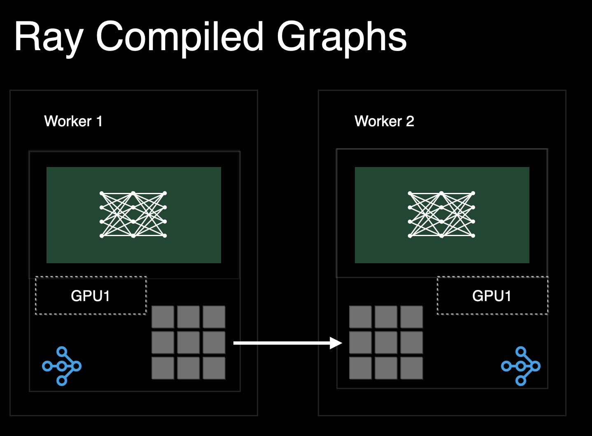
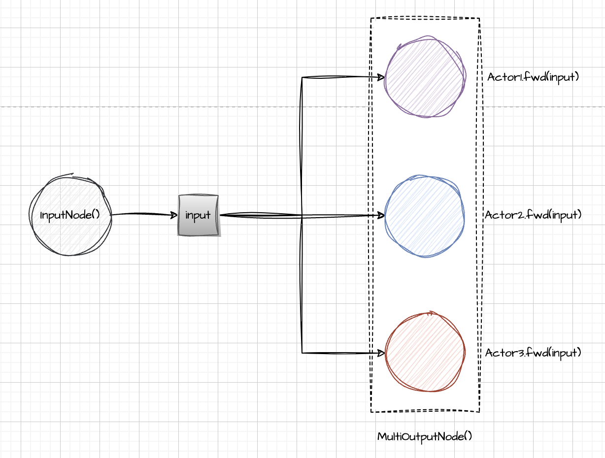
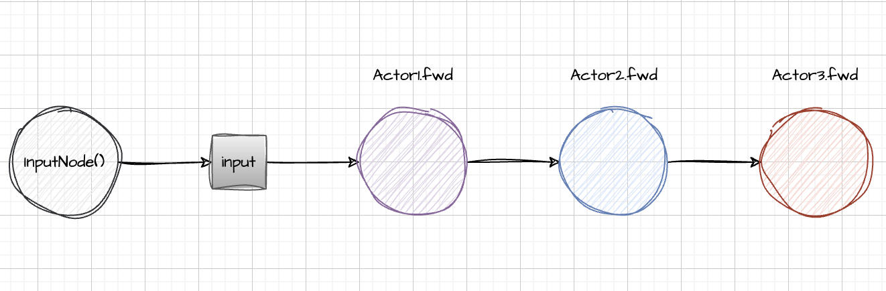
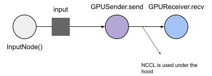
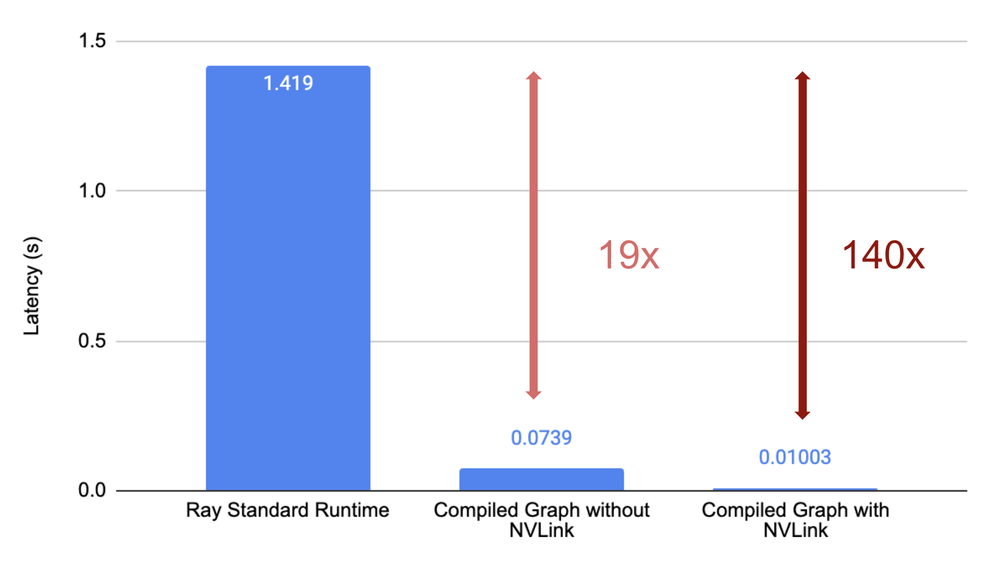

>参考文档：
>
>[Ray Compiled Graphs: Optimized AI Workloads with Native GPU Communication](https://www.anyscale.com/blog/announcing-compiled-graphs)
>
>




## 1 Introduction

随着 AI 模型的复杂性和规模不断增加，与这些模型相关的工作负载和应用对底层软件基础设施及其原语提出了新的需求。与传统的基于 CPU 的工作负载不同，大型 AI 模型的工作负载（如训练和推理）主要依赖于 GPU 密集型计算，且通常需要在数十甚至数百个加速器之间进行分布式计算和协调。

**Compiled Graphs（编译图）** 提供了极低的任务提交开销（约 50 微秒），相比之下，Ray 的标准任务提交开销为 1~2 毫秒。虽然这种默认的开销对诸如数据处理或批处理等长时间运行、以吞吐量为中心的工作负载来说影响较小，但对于诸如自回归式（auto-regressive）生成这样的亚秒级工作负载来说，这样的开销是不可接受的。

此外，**Compiled Graphs** 支持原生的 GPU 到 GPU 数据传输，同时能自动解决死锁问题，并实现通信与计算的重叠优化。在没有 Compiled Graphs 的情况下，用户必须借助 NCCL 等带外通信原语，才能实现低延迟的 GPU 数据传输。

```python
# 原始的 Ray 项目
ref = receiver.recv.remote(sender.send.remote(inp))
ray.get(ref)

# 编译图
with InputNode() as inp:
    dag = receiver.recv.bind(sender.send.bind(inp))
compiled_graph = dag.experimental_compile()
ray.get(compiled_graph.execute(1))
```

这些改进为 Ray 程序带来了新机遇：

- **Ray Compiled Graphs** 可以在不同的 Actor 间以毫秒级的延迟传输大规模张量。
- 使用 **Compiled Graphs**，用户可以通过不到 70 行代码实现复杂的流水线调度算法，同时在性能上可与当前最先进的库（如 Deepspeed）相媲美。例如，在 4 台 A100 GPU 上对 Llama 7B 模型进行推理或训练时，可实现同等的性能。
- 基于 **Compiled Graphs** 的多模态训练工作负载，结合异构并行和 GPU，能相比 PyTorch 标准的 FSDP（Fully Sharded Data Parallel）实现 **43% 的 Token-per-Dollar 成本效率提升**。

这些优化显著降低了代码复杂度，同时提高了性能和成本效率，使得在 Ray 上开发高性能 AI 应用变得更加高效。


## 2 Introducing Compiled Graphs in Ray


**Compiled Graphs** 是 Ray 中的一项新功能，它提供了类似经典 Ray Core 的 API，同时具备以下三大优势：

1. **降低重复任务图的系统开销**
2. **原生支持通过 NVIDIA NCCL 进行 GPU-GPU 通信**
3. **优化调度以避免死锁，并最大化计算和通信资源的利用率**

与标准的 Ray API 相比，**Compiled Graphs** 是通过静态计算图来表达任务的。

通过利用程序的静态特性，Ray 能够在任务执行之前提前分配资源，并在后续调用中重复使用这些资源。此外，Ray 可以在任务执行前正确分配内存，以利用如 NCCL 这类需要发送端和接收端对称的优化通信原语。如下所示，Ray **Compiled Graphs** 在简单的 GPU 张量传输中可以将延迟提高 **140 倍**，在 CPU 数据传输中延迟提升 **17 倍**。

接下来，让我们深入了解机器学习工作负载中常见的一种模式：**散布-聚合（scatter-gather）** 的简化版本。

首先，让我们开始安装 Compiled Graphs：

```bash
pip install -U "ray[adag]"
```

**Scatter-gather** 是机器学习工作负载中一种常见的分布式计算模式。它将相同的输入发送给多个工作节点（Ray Actors），然后从所有工作节点中收集结果。例如，在张量并行推理中，程序会将相同的 CPU 数据发送给所有 Actors，然后这些 Actors 将 CPU 数据移动到 GPU 并运行仅加载分片权重的 Torch 模型。接下来，让我们使用 **Compiled Graphs** 表示这个程序。

我们从创建普通的 Ray Actors 开始，在这个示例中，我们将创建 3 个 Actors：

```python
import ray
from time import perf_counter

@ray.remote
class TensorProcessor:
  def fwd(self, tensor: str) -> str:
    # some_gpu_ops(tensor.to(torch.device()))
    # In a typical application, this actor will move the 
    # tensor to GPU and run a torch module. 
    # We instead do nothing and return the string input immediately for simplicity.
    return tensor

N = 3
actors = [TensorProcessor.remote() for _ in range(N)]
```

首先，让我们看看如何用常规 Ray 程序来表达这一点。

```python
# warmup actors
for _ in range(10):
    ray.get([actor.fwd.remote("hello") for actor in actors])

s = perf_counter()
result = ray.get([actor.fwd.remote("hello") for actor in actors])
print("Normal ray programs took", (perf_counter() - s) * 1000, "ms")
print(result)
```

接下来，我们定义并编译一个 **Compiled Graph**，该图会将相同的输入占位符传递给所有 Actors。在这里，我们使用 Ray 的 **DAG API**，它以静态方式构建一个计算图的中间表示。当我们有多个输出节点时，需要使用 [MultiOutputNode](https://www.anyscale.com/blog/announcing-compiled-graphs) 语法来封装输出结果，这是必不可少的步骤。

```python
import ray.dag

# Define a DAG for lazy execution.
with ray.dag.InputNode() as inp:
    # Bind each actor task to the same input placeholder.
    outputs = [actor.fwd.bind(inp) for actor in actors]
    dag = ray.dag.MultiOutputNode(outputs)
```

这将生成如下的 Ray DAG：



现在，为了使用 **Compiled Graphs**，我们使用以下 `experimental_compile` 命令。Ray 将预先分配运行图所需的所有资源，从而使得图的执行速度相比标准的动态运行时大大加快：

```python
compiled_graph = dag.experimental_compile()

# warmup actors
for _ in range(10):
    ray.get(compiled_graph.execute("hello"))

# Execute the DAG with different arguments:
s = perf_counter()
result = ray.get(compiled_graph.execute("hello"))
print("Compiled Graphs took", (perf_counter() - s) * 1000, "ms")
print(result)
# ["hello", "hello", "hello"]
```

这将生成如下有向无环图 (DAG)：



我们可以像这样编译并执行：

```python
compiled_graph = dag.experimental_compile()
# Call dag.execute() several times. The executions will be pipelined across the different actors.
refs = [compiled_graph.execute(f"hello{i}") for i in range(N)]
# Get the results, flushing the pipeline.
for ref in refs:
  print(ray.get(ref))
# "hello0"
# "hello1"
# "hello2"
```

为了演示 GPU-GPU 通信，我们可以构建一个向另一个Actor发送张量的Actor。要运行此示例，请确保您的集群中至少有 2 个 GPU。

```python
import ray
import ray.dag

import torch

assert ray.cluster_resources().get("GPU") >= 2, ("Insufficient number of GPUs available in the cluster.")

@ray.remote(num_gpus=1)
class GPUSender:
  def send(self, shape):
    return torch.zeros(shape, device="cuda")

@ray.remote(num_gpus=1)
class GPUReceiver:
  def recv(self, tensor: torch.Tensor):
    assert tensor.device.type == "cuda"
    return tensor.shape

sender = GPUSender.remote()
receiver = GPUReceiver.remote()
```

接下来，我们定义并编译一个 **Compiled Graph**，用于将一个 CUDA 张量从一个 Actor 传递到另一个 Actor。通过下面的 `TorchTensorType` 类型提示，Ray 会在底层使用 NCCL，通过 GPU RDMA（远程直接内存访问） 在两个 GPU 之间传输张量。

```python
from ray.experimental.channel.torch_tensor_type import TorchTensorType
with ray.dag.InputNode() as inp:
  dag = sender.send.bind(inp)
  # You have to specify transport="nccl", otherwise, it uses shared memory to transfer GPU tensors.
  dag = dag.with_type_hint(TorchTensorType(transport="nccl"))
  dag = receiver.recv.bind(dag)

compiled_graph = dag.experimental_compile()
# Execute the DAG. Ray aDAG will orchestrate any NCCL ops.
assert ray.get(compiled_graph.execute((10, ))) == (10, )
```



您可以查看[开发者指南]()以获取更多信息。

## 3 Benchmarks

我们比较了 **Ray Core**（标记为“Ray Standard Runtime”）和 **Ray Compiled Graphs** 在多种通信模式下的性能表现：

- **回环通信（Round Trip）**：在这种模式下，我们构造了一个 Actor，用于反复将数据发送到接收者 Actor。
- **散布-聚合（Scatter-Gather）**：在这种模式下，主进程将数据发送到所有 Actors，并从每个 Actor 收集结果。
- **任务链（Chain of Tasks）**：在这种模式下，我们构造了一个由多个 Actor 组成的流水线，每个 Actor 从前一个 Actor 接收数据并将其发送给下一个 Actor。

首先，我们在上述计算模式下使用 1 字节的 CPU 数据进行基准测试，包括单节点和多节点的场景，以测量系统开销。基准测试运行在一台 **m5.16xlarge** 实例上，该实例配备了 **64 个 CPU**。

在以下图表中，我们可以观察到：

- 在单节点上，回环通信的速度最高可提高 **17 倍**。
- 在多节点上，回环通信的速度最高可提高 **2.7 倍**。

对于更复杂的工作负载（如散布-聚合或任务链），**Ray Compiled Graphs** 的延迟最高可降低 **20 倍**。


我们还比较了 **Ray Core** 和 **Ray Compiled Graphs** 在 GPU 到 GPU 数据传输中的性能表现。

我们进行了一个简单的回环通信基准测试，使用一个 **40MB 的 CUDA 张量**，分别在带有 **NVLink（A100）** 和不带 **NVLink（A10G）** 的机器上运行。测试过程中，将张量传输 **10 次**，并测量端到端的延迟。



默认情况下，**Ray Core** 并不支持对 Torch 张量的零拷贝序列化，也不使用 NCCL 进行通信。

相比之下，**Ray Compiled Graphs** 在底层使用 NCCL 来优化 GPU 到 GPU 的数据传输性能。在没有 NVLink 的两块 **A10G** 设备上，**Ray Compiled Graphs** 的张量传输延迟比 **Ray Core** 改善了 **19 倍**。而在带有 NVLink 的 **A100** 上，延迟降低了接近 **140 倍**。

这些基准测试表明，**Compiled Graphs** 是功能强大的基础原语，能够支持新兴的 AI 应用程序类型并极大提升其性能表现。


## 4 Use Cases

#### 更快的模型并行推理

我们将 **Compiled Graphs** 集成到 [vLLM](https://github.com/vllm-project/vllm/issues/6556) 中，这是一个流行的开源项目，用于大语言模型（LLM）的推理。通过 **Ray** 实现张量并行和流水线并行推理。

在使用流水线并行时，与默认的 NCCL 后端相比，我们观察到了 **10-15% 的吞吐量和延迟改进**。

#### 最先进的分布式训练

在我们的分布式训练实验中，我们利用 **Compiled Graphs** 实现了更复杂且高效的训练策略。例如，通过使用异构设备和并行技术，我们显著提高了多模态对比模型（如 CLIP）的训练吞吐量。用原生 PyTorch 表达这样的程序要困难得多。

具体来说，通过对文本和视觉编码器分别应用不同的并行方法，并将较小的文本编码器部署在更具性价比的 GPU 上，我们观察到训练吞吐量提高了 **20%**，并且与 PyTorch 的标准 FSDP 实现相比，**每美元 Token 处理效率提升了 43%**。

此外，我们还对多种流水线并行调度算法（如 **afab**、**1f1b** 和 **zero bubble**，参考 [论文链接](https://arxiv.org/pdf/2401.10241)）进行了原型设计。我们可以用不到 **70 行代码** 表达复杂的流水线调度算法，同时在 4 台 A100 GPU 上运行 Llama 7B 模型时，性能与最先进的库（如 Deepspeed）相当。我们计划进一步通过更大规模的工作负载改进流水线并行训练的性能。
