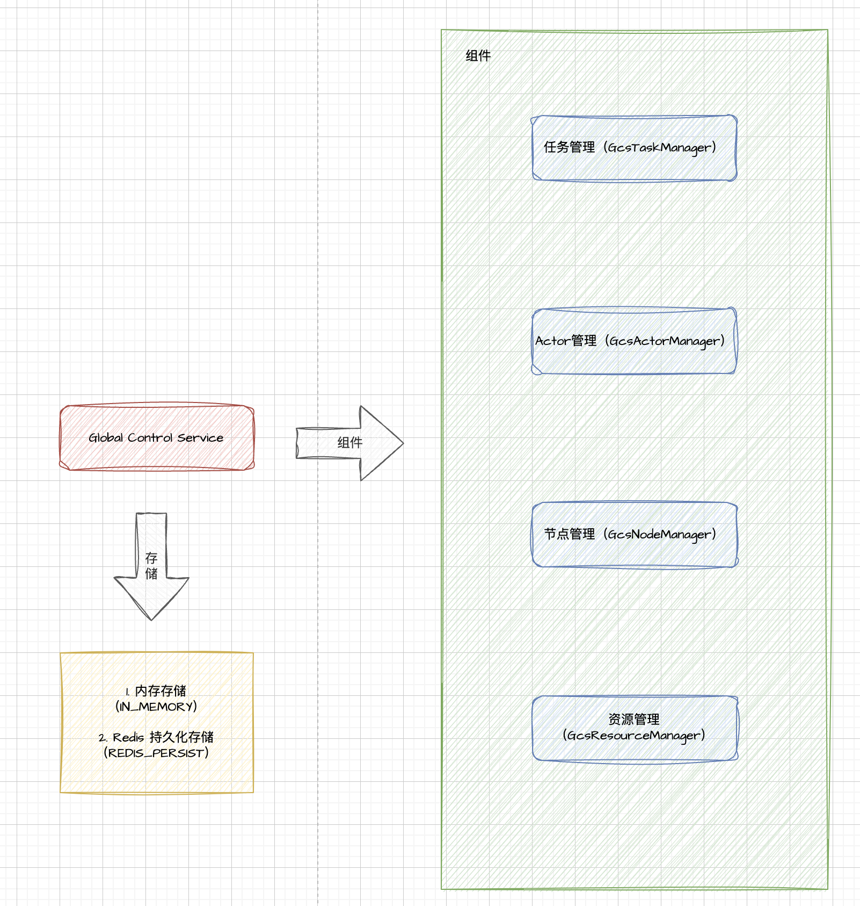

# GCS 简介

在 Ray 2.0 的架构中，**GCS（Global Control Service，全局控制服务）** 扮演着非常核心的角色，其主要职责包括以下几个方面：

1. **全局元数据存储**
   - **集群状态信息存储**：GCS 负责存储集群中所有关键组件的状态信息，包括节点状态、资源信息、任务和 Actor 的元数据、对象位置等。
   - **一致性视图**：通过集中存储元数据，GCS 为整个集群提供了一个全局一致的视图，确保各个组件（如调度器、工作节点等）都能访问到最新的状态数据。
2. **调度与资源管理支持**
   - **任务与 Actor 调度**：GCS 保存了任务和 Actor 的调度信息，为调度器提供必要的数据支持，使其能在全局范围内做出合理的调度决策。
   - **资源管理**：记录各节点的资源使用情况，帮助调度器在任务分配时更好地匹配资源需求，提高资源利用率。
3. **故障检测与恢复**
   - **故障监控**：GCS 跟踪集群中各个节点和组件的状态，一旦检测到节点故障或异常情况，就能及时将故障信息传播给其他模块。
   - **状态恢复与重调度**：在出现节点或任务失败时，GCS 协调整个系统的恢复工作，比如重新调度失败的任务、恢复 Actor 状态等，确保系统的鲁棒性。
4. **集群管理与动态扩展**
   - **作业管理**：GCS 负责跟踪和管理整个集群的作业（Jobs），包括作业的提交、调度、监控以及结束状态。
   - **动态扩缩容**：在集群运行过程中，GCS 能够实时反映资源变化，为集群动态扩展或缩容提供数据支持，从而保证系统在大规模下依然高效稳定。
5. **接口与服务解耦**
   - **服务中枢作用**：通过提供统一的 API 接口，GCS 将底层的元数据存储与上层的业务逻辑解耦。这样，不同组件（如调度器、监控模块、用户 API 服务等）都可以通过 GCS 获取或更新全局状态，降低了各模块之间的耦合度。
6. **高可用与扩展性**
   - **高并发支持**：针对大规模集群的需求，Ray 2.0 对 GCS 进行了架构上的优化，以支持高并发的状态更新与查询操作。
   - **容错能力**：GCS 通常设计有多副本或其他容错机制，确保在部分节点故障时，集群依然能够稳定运行。

总的来说，在 Ray 2.0 中，GCS 不仅仅是一个简单的键值存储系统，而是集群控制平面的核心，承担着全局状态管理、调度支持、故障恢复、动态扩展以及各模块之间信息交互的重要职责。通过对这些全局信息的统一管理，Ray 能够实现高性能、高可用的大规模分布式计算。



# GCS 核心组件

## 任务管理 GcsTaskManager


## Actor 管理 GcsActorManager


## 节点管理 GcsNodeManager


## 资源管理 GcsResourceManager


```c++
void GcsServer::Start() {
  // 使用 gcs_table_storage_ 创建一个 GcsInitData 对象，并包装成智能指针。
  // 这里通过 std::make_shared 创建一个共享指针，便于后续在 lambda 表达式中使用。
  auto gcs_init_data = std::make_shared<GcsInitData>(*gcs_table_storage_);

  // 初始化 KV 管理器。必须先初始化 KV 管理器，以便后续获取或生成集群 ID 时能够使用。
  InitKVManager();

  // 异步加载 GCS 表数据。
  // AsyncLoad 的参数包括一个回调 lambda 和一个 IO 上下文（用于异步任务调度）。
  gcs_init_data->AsyncLoad({
    // 第一个参数：当数据加载完成时调用的 lambda 表达式。
    // 捕获了 this 指针和 gcs_init_data 智能指针，便于在 lambda 内部使用它们。
    [this, gcs_init_data] {
      // 调用 GetOrGenerateClusterId 获取或生成集群 ID。
      // 此函数的参数是一个结构，包含回调 lambda 和 IO 上下文。
      GetOrGenerateClusterId({
        // 内部 lambda：当集群 ID 准备好后调用。
        // 参数 cluster_id 为获取或生成的集群 ID。
        [this, gcs_init_data](ClusterID cluster_id) {
          // 设置 RPC 服务器的集群 ID。
          rpc_server_.SetClusterId(cluster_id);
          // 启动 GCS 服务，传入解引用后的 gcs_init_data 数据。
          DoStart(*gcs_init_data);
        },
        // 为 GetOrGenerateClusterId 指定默认的 IO 上下文。
        io_context_provider_.GetDefaultIOContext()
      });
    },
    // 为 AsyncLoad 指定默认的 IO 上下文，用于调度异步任务。
    io_context_provider_.GetDefaultIOContext()
  });
}
```

