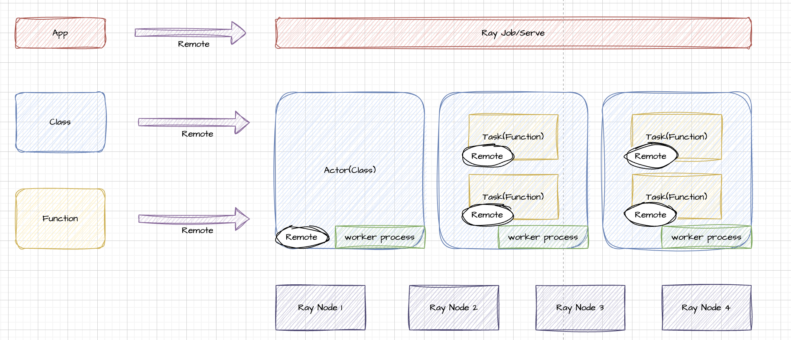

>参考文档：
>
>[开源分布式计算框架——Ray](https://zhuanlan.zhihu.com/p/7881244469)
>
>[Ray: A Distributed Framework for Emerging AI Applications](./PDF/Ray-Paper.pdf)

## 1 Ray 简介

Ray最初是UC Berkeley的RISELab团队提出并主导开发的。RISELab专注于开发分布式系统和机器学习系统，旨在实现大规模分布式计算的高效性和可扩展性。Ray 的开发起始于 2017 年，其目标是为分布式计算提供一个通用、高效且灵活的平台，特别是面向人工智能和机器学习领域的任务。

Ray 的核心开发人员包括 Philipp Moritz、Robert Nishihara、Ion Stoica 等人。这些研究者都是分布式系统和大数据领域的专家。Ray 后来逐渐吸引了开源社区的广泛参与，并由 Anyscale 公司进一步推动其商业化和大规模应用。


## 2 Ray AI Libraries

应用工具包：

- [Data](https://link.zhihu.com/?target=https%3A//docs.ray.io/en/latest/data/data.html): 可扩展的、与框架无关的数据加载和转换，涵盖训练、调优和预测。
- [Train](https://link.zhihu.com/?target=https%3A//docs.ray.io/en/latest/train/train.html): 分布式多节点和多核模型训练，具有容错性，与流行的训练库集成。
- [Tune](https://link.zhihu.com/?target=https%3A//docs.ray.io/en/latest/tune/index.html): 可扩展的超参数调整，以优化模型性能。
- [Serve](https://link.zhihu.com/?target=https%3A//docs.ray.io/en/latest/serve/index.html): 可扩展和可编程的服务，用于部署用于在线推理的模型，并可选择微批处理来提高性能。
- [RLlib](https://link.zhihu.com/?target=https%3A//docs.ray.io/en/latest/rllib/index.html): 可扩展的分布式强化学习工作负载。


## 3 Ray Core

开源、Python、通用、分布式计算库。



1. Ray Cluster 是一个分布式系统架构，通常由多个节点（Node）组成：

   * 每个节点都运行一个 **Ray Head Node** 或 **Worker Node**。

   * **Head Node** 是集群的主节点，负责调度和全局任务管理。

   * **Worker Node** 是普通节点，用于执行任务或托管 Actor。

2. 用户可以使用 Ray 提供的多种方式提交任务或应用：

   - **Ray Core API**：通过 Python 编写代码，直接使用 `@ray.remote` 装饰器将函数、类声明为远程执行对象。

   - **Ray Client**：远程连接到 Ray Cluster，提交作业（Ray Job）

   - **Ray Serve API**：面向服务化部署的 API，用于构建和运行应用。

3. **Task** 是指通过 `@ray.remote` 声明的函数实例化后，在 Ray Cluster 中异步执行的单元。每个 Task 是一个独立的任务，可以并行执行。

4. **Actor** 是通过 `@ray.remote` 声明的类的实例，它是一个有状态的执行单元。

   * Actor 在某个节点的独立进程（Worker Process）中运行。

   - Actor 可以管理内部状态并处理多次方法调用。

5. **Ray Job**：用户通过 `ray job submit` 提交的一个任务或者应用的整体。它可能包含多个 Task 和 Actor。

   **Ray Serve**：是 Ray 提供的高层框架，用于服务化部署。它将多个 Actor 和 Task 封装成一个可扩展的分布式服务。

   | **任务类型** | **Worker Process 分配** | **复用情况**              | **生命周期**                            |
   | ------------ | ----------------------- | ------------------------- | --------------------------------------- |
   | **Task**     | 默认 Worker Process     | 多个 Task 可复用          | 长生命周期，节点内全局复用              |
   | **Actor**    | 独立 Worker Process     | 不可复用，专属 Actor 使用 | 与 Actor 生命周期一致，Actor 销毁即结束 |

6. Ray 的调度器会根据任务类型和资源需求分配合适的 Worker Process：

   - 对于 Task：会根据资源标签（如 CPU、GPU、自定义资源）选择可用的默认 Worker Process。
   - 对于 Actor：会为每个 Actor 分配独立的资源，启动专属 Worker Process。

---

### 3.1 Task

1. 使用 `@ray.remote` 装饰器可以将普通函数或类声明为 Remote Function 或 Remote Actor。通过 `.remote()` 调用函数时，Ray 会将任务序列化后提交到集群进行异步执行。

   ```python
   import ray
   
   ray.init()
   
   @ray.remote
   def add(x, y):
       return x + y
   
   result = add.remote(1, 2)  # 提交任务
   print(ray.get(result))  # 获取结果
   ```

2. Ray 支持通过网络传递参数值，也支持传递对象引用（`ObjectRef`）。传递值会复制数据，而传递引用则避免数据重复传输。

   * 如果任务依赖另一个任务的结果（`ObjectRef`），调用时会自动阻塞直到依赖被解析。
   * 如果所有参数都是直接值，任务可以立即执行。

   ```python
   @ray.remote
   def f(x):
       return x + 1
   
   ref = f.remote(10)
   result = f.remote(ref)  # 阻塞直到第一个任务完成
   print(ray.get(result))
   ```

3. 等待结果：

   * **`ray.get()`**：用于阻塞式获取任务结果，调用时会等待任务完成。
   * **`ray.wait()`**：用于非阻塞式等待，返回已经完成的任务列表和未完成的任务列表。

   ```python
   @ray.remote
   def slow_task(i):
       import time
       time.sleep(1)
       return i
   
   tasks = [slow_task.remote(i) for i in range(5)]
   
   # 等待部分任务完成
   done, not_done = ray.wait(tasks, num_returns=2)
   print(ray.get(done))  # 获取已完成任务的结果
   ```

4. Ray Task 支持返回多个结果对象引用，使用 `num_returns` 参数指定返回值的数量。返回值以 `ObjectRef` 列表的形式返回，调用 `ray.get` 获取实际值。

   ```python
   @ray.remote(num_returns=2)
   def split_data(x):
       return x[:len(x)//2], x[len(x)//2:]
   
   part1, part2 = split_data.remote([1, 2, 3, 4])
   print(ray.get(part1), ray.get(part2))
   ```

5. 使用 `ray.cancel()` 可以取消任务，但只能取消尚未运行或正在运行的任务。

   * 如果任务已完成，调用 `ray.cancel()` 无效。
   * 如果任务不可中断（如执行 I/O 或调用外部程序），可能无法真正取消。

   ```python
   @ray.remote
   def long_task():
       import time
       time.sleep(10)
   
   ref = long_task.remote()
   ray.cancel(ref)  # 尝试取消任务
   ```

6. Ray 支持嵌套任务，也就是一个 Remote Function 可以调用另一个 Remote Function，产生嵌套任务树。嵌套任务的执行结果也可以通过 `ObjectRef` 返回给调用者。

   ```python
   @ray.remote
   def nested_task(x):
       return x * 2
   
   @ray.remote
   def outer_task(x):
       ref = nested_task.remote(x)
       return ray.get(ref)
   
   print(ray.get(outer_task.remote(5)))  # 输出 10
   ```

7. Ray 的资源管理允许任务在阻塞状态下释放其分配的资源，以便其他任务利用。例如：

   * 如果一个任务由于依赖未完成而阻塞，Ray 可以将 CPU 或 GPU 资源释放给其他任务。
   * 嵌套任务完成后，Ray 会立即释放它们占用的资源。

8. **远程生成器（Dynamic Generators）** 是一种行为类似迭代器的远程函数，用于生成多个结果。它可以减少内存占用，特别是在返回值数量未知时。使用 `ray.util.iter` 或 `async for` 来处理生成器结果。

   ```python
   @ray.remote
   def generator_task():
       for i in range(5):
           yield i
   
   async def consume_generator():
       async for value in generator_task.remote():
           print(value)
   
   ray.get(consume_generator())
   ```

---

### 3.2 Actor

1. **Actor 的本质**：Ray 扩展了 Remote Function 的概念，引入了 Remote Actor，这是一种有状态的计算单元。Actor 是在特定的 Worker Process 中运行的，因此它可以维护状态，并允许用户通过调用其方法来改变状态。

   ```python
   import ray
   
   ray.init()
   
   @ray.remote
   class Counter:
       def __init__(self):
           self.count = 0
   
       def increment(self):
           self.count += 1
           return self.count
   
   # 实例化 Actor
   counter = Counter.remote()
   print(ray.get(counter.increment.remote()))  # 输出 1
   print(ray.get(counter.increment.remote()))  # 输出 2
   ```

2. 初始化 Actor 时可以分配资源，指定 CPU/GPU 的使用大小。

   ```python
   @ray.remote(num_cpus=2, num_gpus=1)
   class MyActor:
       def __init__(self):
           pass
   ```

3. 调用 Actor 方法的执行机制——**并行与串行机制**：

   - 调用不同 Actor 的方法可以并行执行，因为它们是不同的 Worker Process。
   - 同一 Actor 的方法调用是按顺序串行执行的。这是因为同一 Actor 的状态被绑定到它的 Worker Process，需要确保方法调用的顺序性。

   ```python
   @ray.remote
   class Worker:
       def process(self, value):
           return value * 2
   
   actor1 = Worker.remote()
   actor2 = Worker.remote()
   
   # 调用不同 Actor 的方法是并行的
   refs = [actor1.process.remote(10), actor2.process.remote(20)]
   print(ray.get(refs))  # 输出 [20, 40]
   
   # 调用同一 Actor 的方法是串行的
   ref1 = actor1.process.remote(30)
   ref2 = actor1.process.remote(40)
   print(ray.get([ref1, ref2]))  # 保持顺序性输出 [60, 80]
   ```

4. Actor Handle 是一种引用，它可以被传递给其他 Remote Function 或 Actor 方法。这样可以在分布式计算中实现 Actor 共享。

   ```python
   @ray.remote
   def use_actor(actor, value):
       return ray.get(actor.process.remote(value))
   
   actor = Worker.remote()
   result = use_actor.remote(actor, 50)
   print(ray.get(result))  # 输出 100
   ```

5. 使用 `ray.cancel()` 可以取消任务，取消 Actor 的任务不会终止整个 Actor，Actor 仍然可以接受新的任务，但 Actor 的方法是否能成功取消取决于其执行状态：

   * 如果任务已经完成或不可中断（例如阻塞 I/O 操作），则无法取消。
   * 某些任务可能会因为使用外部库而难以中断。

   ```python
   @ray.remote
   class Worker:
       def long_task(self):
           import time
           time.sleep(10)
           return "done"
   
   actor = Worker.remote()
   ref = actor.long_task.remote()
   
   ray.cancel(ref)  # 尝试取消任务
   ```

6. Actor 的任务执行记录可以通过 State API 或 Ray Dashboard 获取。

   * **State API**：Ray 提供了 `ray.state` 模块，支持查询任务和 Actor 的状态信息，包括任务运行时的资源使用情况、执行时间、失败原因等。
   * **Ray Dashboard**：在运行 Ray 集群时，Dashboard 会自动启动并提供 Web 界面，用户可以查看所有任务和 Actor 的状态，包括资源使用、日志等。

   ```python
   # 使用 State API 获取 Actor 信息
   from ray.experimental.state.api import list_actors
   
   actors = list_actors()
   for actor in actors:
       print(actor)
   ```

---

### 3.3 Object


1. **远程 Objects** 确实被存储在 **Ray Cluster** 的各个 **Object Store** 中。每个节点有一个 **Object Store**，用于存储计算过程中产生的数据（即远程对象）。这些远程对象在计算过程中可以存储在集群中的任何节点，而不需要与特定的任务或 Actor 的持有者绑定。
2. **Object Store** 提供了分布式存储和缓存机制，使得数据在任务间可以有效共享，并通过 **Object refs**（引用）在不同的任务或节点之间传递。
3. **Object ref** 本质上类似于指针或唯一标识符，它是一个对远程对象的引用。它不会包含数据本身，而是指向在集群中存储的远程对象。
4. **Object ref** 不包含实际的对象数据，这就像是 **future** 或 **promise** 的一种实现。它代表一个尚未计算的结果，且可以被任务在后续计算中使用。
5. **远程 Function 调用的返回值**：通过远程函数（Task）调用的结果可以生成 **Object refs**，它们可以在后续任务中作为输入传递。
6. **`ray.put()`**：通过 `ray.put()` 方法显式地将 Python 对象放入 **Object Store** 并返回一个 **Object ref**，这样对象可以在 Ray 集群中共享。
7. 一旦一个对象被创建并存储在 **Object Store** 中，它的内容不能被更改。这使得对象可以在集群的多个节点间复制而不需要同步副本。该特性有助于提高系统的效率和并发性，减少同步开销。
8. Ray 集群内的 **Object Store** 会进行内存管理，但 Ray 对存储和副本的管理通常依赖于任务调度。Ray 会确保在需要时能够访问存储的对象，而对象的副本可以存储在多个节点中，确保高可用性和访问速度。

---

### 3.4 Environment Dependencies

* Ray Application：一个 Ray Application 是一个包含 Ray 代码的程序，通常包括 Ray 初始化（如 `ray.init()`）并调用一组 Ray 任务（Tasks）或行动器（Actors）。Application 代表了整个 Ray 作业（Job）和计算的集合。
* Dependencies或者Environment，Application需要运行的Ray代码之外的任何内容，包括文件、包和环境变量。
* Files：Ray 运行应用所需的文件，包括 **任务代码文件**、**数据文件** 或 **其他文件**。这些文件通常是需要在 **Ray Cluster** 中的每个节点上共享或访问的资源。例如，数据文件可以通过 `ray.util.connect()` 访问或者通过 Ray's distributed file system 分发。
* Packages：这是指 Ray 应用运行时所需的额外的 Python 包，通常是通过 **pip** 或 **conda** 安装的。你可以通过 Runtime Environments 来指定和安装这些包，确保每个任务或 Actor 执行时的环境一致。
* Local machine 和 Cluster：提交任务的机器叫做 Local machine，而执行任务的机器叫做 Ray Cluster。Local machine 通常指的是开发者的本地环境或本地机器，而 Ray Cluster 是 Ray 作业（Job）实际执行的分布式计算环境。
* Job：一个 Job 是一个 Ray 应用的执行单元，通常是来自同一代码的 Ray Tasks、Objects 和 Actors 的集合。每个 Job 代表一个执行的任务或作业，它可以包含多个并行的 Task 或 Actor，也可以包含复杂的工作流。
* Ray 中 **环境依赖管理**的两种方式：
  * 在启动 Ray 之前预置依赖：Kubernetes 部署/虚拟机部署
  * 使用 Runtime Environments 在 Ray 应用运行时动态安装

---

### 3.5 Scheduler

**1. 调度过程：**

Ray 的 **调度器** 负责在 Ray 集群中选择合适的节点来执行每个提交的 **Task** 或 **Actor**。调度的核心是 **资源需求**，即每个任务（Task）和行动器（Actor）可能需要特定的 **资源**（如 CPU、GPU、内存等）。调度器根据 **Ray Cluster** 中可用的资源来决定将任务分配到哪个节点上执行。

**2. 节点的资源状态**：Ray 在每个节点上维护 **资源状态**，并且会根据任务的 **资源需求** 来选择可行的节点。

**Feasible (可行的节点)**：指节点上可用的资源能够满足Task或 Actor 的资源需求。这是 Ray 调度的基本前提。

- **Available (可用的节点)**：节点上有足够的资源并且这些资源是空闲的，能够立即执行任务或启动 Actor。
- **Unavailable (不可用的节点)**：节点上有足够的资源，但这些资源正在被其他任务或 Actor 使用。任务或 Actor 会等待资源释放后才能执行。

**Infeasible (不可行的节点)**：指节点的资源无法满足任务或 Actor 的资源需求。例如，只有 CPU 的节点对于需要 GPU 的任务来说是不可行的。

**3. 资源需求的硬性要求**：

Task 或 Actor 只能在 **可行的节点** 上运行。如果 **节点无法满足资源要求**，那么这个节点即使存在也不能被调度来执行 Task 或 Actor。

**4. 任务调度的优先级**：

Ray 会首先尝试选择一个 **Available** 节点来执行任务。如果没有 **Available** 节点，调度器将会等待一个 **Unavailable** 节点上的任务完成，以便释放资源并使得该节点变得 **Available**。

如果所有节点都为 **Infeasible**，Ray 将无法在集群中调度任务。在这种情况下，Ray 会等待 **Feasible** 节点的加入，或者会对现有集群进行资源扩展。

---

## 4 Ray Clusters

一组连接到Ray Head 节点的Worker节点。Ray Cluster可以是固定大小的，也可以根据群集上运行的Application请求的资源进行集群自动缩放。


## 5 Ray Applications


