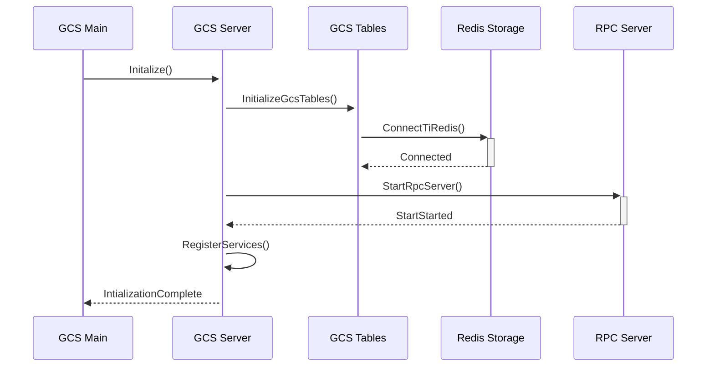
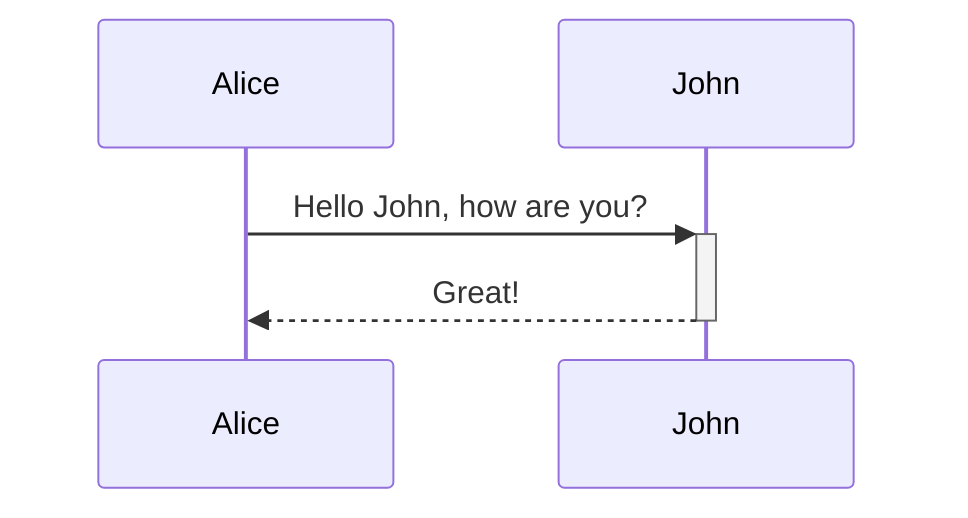

```mermaid
sequenceDiagram
    GCS Main->>+GCS Server: Initalize()
    GCS Server->>+GCS Tables: InitializeGcsTables()
    GCS Tables->>+Redis Storage: ConnectTiRedis()
    Redis Storage-->>-GCS Tables: Connected
    GCS Server->>+RPC Server: StartRpcServer()
    RPC Server-->>-GCS Server: StartStarted
    GCS Server->>GCS Server: RegisterServices()
    GCS Server-->>GCS Main: IntializationComplete
```

```mermaid
sequenceDiagram
    Alice->>+John: Hello John, how are you?
    John-->>-Alice: Great!
```

