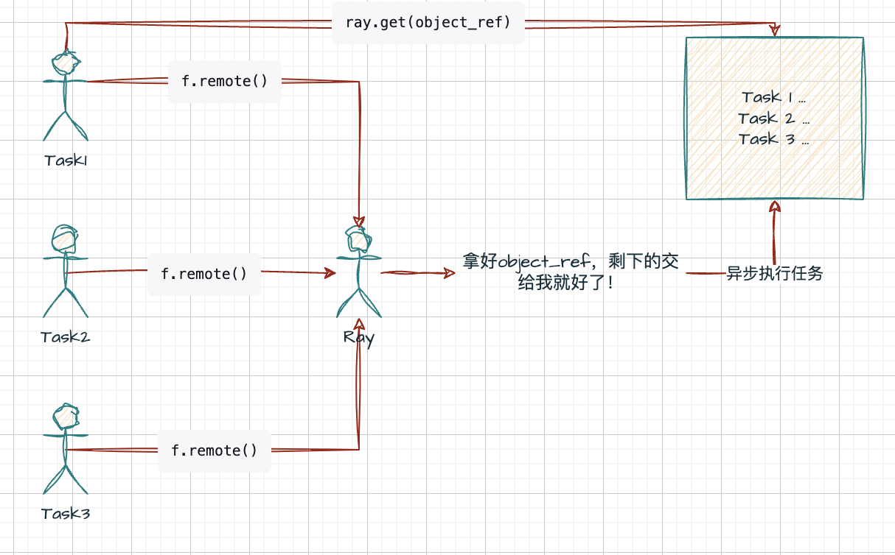
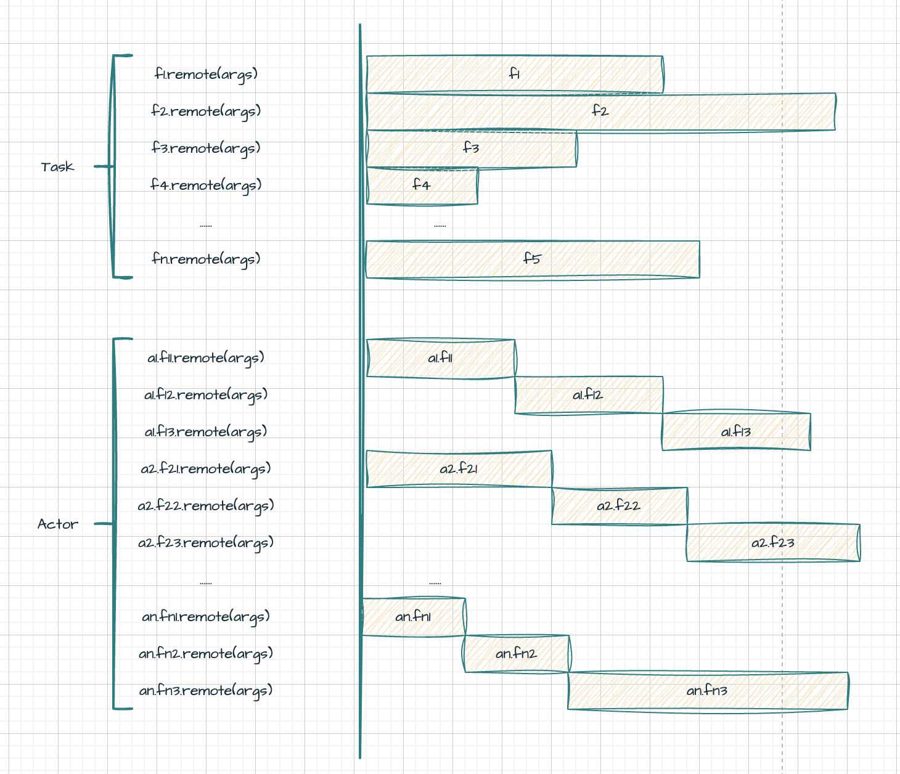
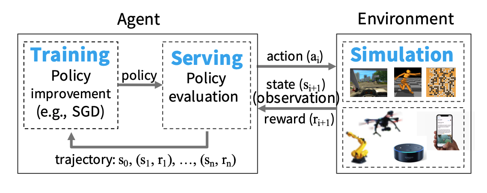
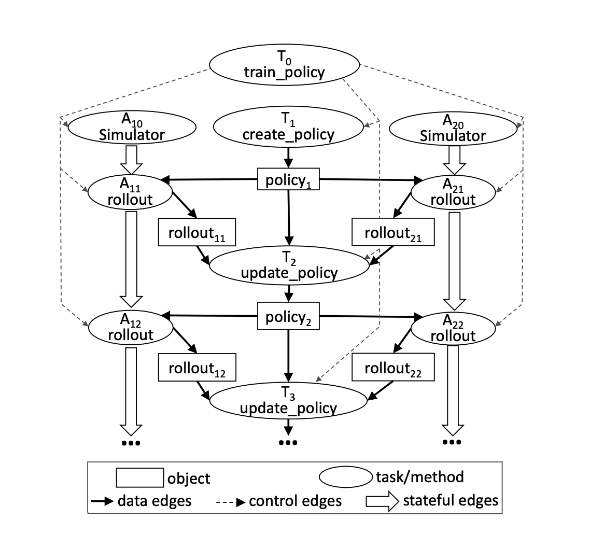
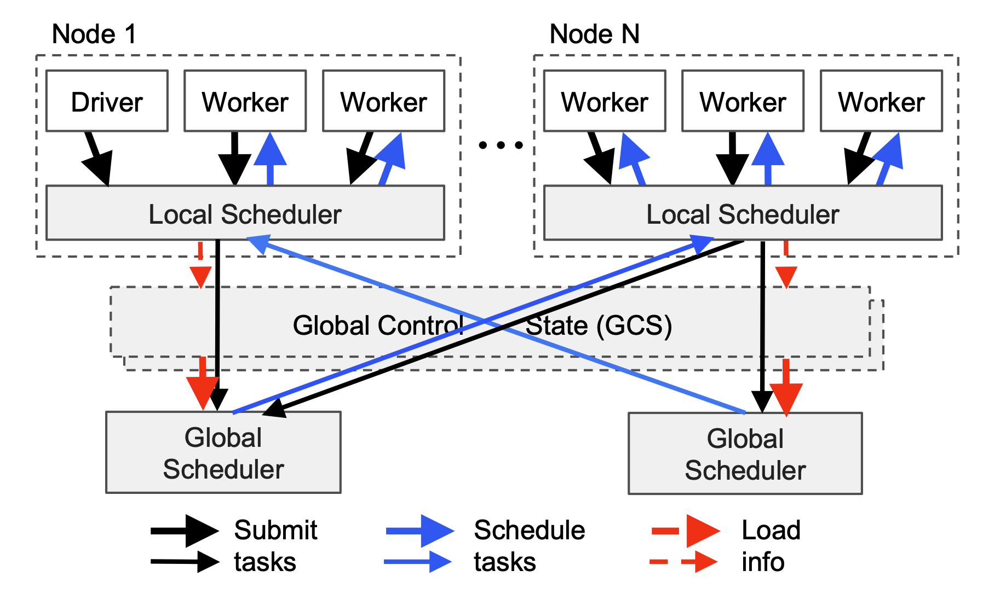
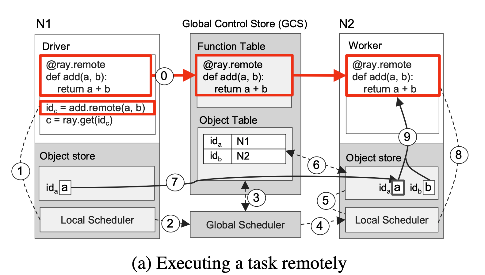
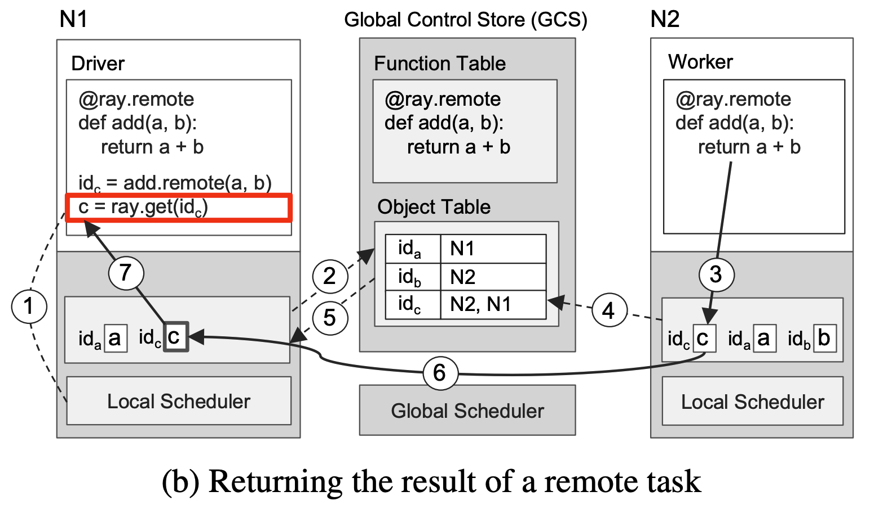

> 参考文档：
>
> [Ray: A Distributed Framework for Emerging AI Applications](./PDF/Ray-Paper.pdf)
>
> [Ray分布式计算框架详解](https://zhuanlan.zhihu.com/p/460600694)


## 1 Ray 编程模型

Ray中有两个重要的概念：

* 任务 Task：无状态，注解在方法上
* 行动器 Actor：有状态，注解在类对象上

Ray编程模型指的是Ray框架基于任务和行动器向用户提供的一套API和编程范式。Ray中的核心API如下：

| 代码                                                         | 说明                                                         |
| ------------------------------------------------------------ | ------------------------------------------------------------ |
| futures = f.remote(args)                                     | 远程地执行函数f。f.remote()以普通对象或future对象作为输入，返回一个或多个future对象，非阻塞执行。 |
| objects = ray.get(futures)                                   | 返回与一个或多个future对象相关联的真实值，阻塞执行           |
| ready_futures = ray.wait(futures, k, timeout)                | 当futures中有k个future完成时，或执行时间超过timeout时，返回futures中已经执行完的future |
| actor = Class.remote(args)<br/>futures = actor.method.remote(args) | 将一个类实例化为一个远程的行动器，并返回它的一个句柄。然后调用这个行动器的method方法，并返回一个或多个future. 两个过程均为非阻塞的。 |

### 1.1 任务 Task

> 任务是指在无状态的工作器中执行的远程函数。远程函数被调用时回立即返回一个future对象，对真正的返回值可以通过ray.get(<future对象>)的方式来获取。这样的编程模型允许用户编写并行计算代码，同时又提醒用户要关注数据之间的依赖性。

任务的编程范式：

1. 注册任务：在需要注册为任务的函数上加上@ray.remote装饰器。
2. 提交任务：在调用具有@ray.remote的装饰器的函数时，需要带上.remote()而不是直接调用。
3. 非阻塞提交：无论任务的运行需要多少时间，在提交任务后都会立即返回一个ObjectRef对象。
4. 按需阻塞获取结果：在你需要函数的返回值时，可以通过ray.get来获取。

```python
# 注册任务
@ray.remote
def f(x):
    return x * x

# 非阻塞提交任务，拿到立即返回的object_ref
object_ref = f.remote(2)
# 获取任务的执行结果
assert ray.get(object_ref) == 4
```



任务是无状态的的，任务所操作的对象都可以看作不可变对象（Immutable Objects），或者任务调用可以看作一个无副作用的（Side-effect Free）表达式，任务的输出仅与输入有关。

```python
# 声明两个功能相同的函数，一个是Ray任务，另一个是普通的Python函数
@ray.remote
def append_one(container):
    container.append(1)
    return container

def local_append_one(container):
    container.append(1)
    return container

container = []

object_ref = append_one.remote(container)
result = ray.get(object_ref) # 此处可确保函数已经在远程执行完成
print(result) # [1]
print(container) # []; 远程函数未对container产生副作用

local_append_one(container)
print(container) # [1]; 本地函数对container产生了副作用
```

优点：由于任务是无状态的，不依赖其他任务的结果，任务可以重复执行，提高容错性；

缺点：限制了对全局变量和内存引用的访问。

任务使Ray具备了以下能力：

- 细粒度负载均衡：利用任务级粒度的负载感知调度来进行细粒度的负载均衡。
- 输入数据本地化：每个任务可以在存有它所需要的数据的节点上调度。
- 较低的恢复开销：无需记录检查点或恢复到中间状态。

### 1.2 行动器 Actor

行动器用来表达有状态的计算任务。每个行动器都会暴露一些可供远程调用的方法，类似于任务中的远程函数，不同的是，使用f.remote顺序提交若干远程函数后，这些函数是并行执行，但在同一个actor下使用actor.method.remote顺序提交若干远程函数后，这些函数是串行执行。



行动器的编程范式：

1. 注册行动器：在需要注册为行动器的类上加上@ray.remote装饰器。
2. 实例化行动器：相比于普通Python类的实例化，需要在类名后加上.remote。
3. 提交方法调用：调用行动器的方法时，同样需要带上.remote()而不是直接调用。
4. 非阻塞提交：无论方法的运行需要多少时间，在提交任务后都会立即返回一个ObjectRef对象（同一行动器实例下，方法会按照提交顺序串行地运行）。
5. 按需阻塞获取结果：在需要方法运行的返回值时，可以通过ray.get来获取。

```python
# 声明行动器
@ray.remote
class Counter(object):
    def __init__(self):
        self.value = 0

    def increment(self):
        self.value += 1
        return self.value

# 创建行动器
counter = Counter.remote()

refs = []

for i in range(10):
    # 调用行动器的方法
    ref = counter.increment.remote()
    refs.append(ref)

for i, ref in enumerate(refs):
    assert ray.get(ref) == i + 1
```

行动器的设计使得Ray具备更高效的细粒度更新能力。因为行动器是一种高内聚的设计，状态与可能改变状态的操作被设计在一个类中，使得这些操作不依赖于外界的状态，从而在更新状态时省去了许多序列化和反序列化的开销。

Task可以理解为一种特殊的简易的Actor，即这个行动器只有一个方法，且只会执行一次。


## 2 Ray计算模型

Ray采用动态任务图计算模型，当输入数据就绪时，系统将自动触发相应的远程函数和行动器方法的执行。

在不考虑行动器的参与，计算图的节点可以分为两类：

- 数据对象

- 远程函数调用

边也可以分为两类：

- 数据边
- 控制边

行动器的方法调用与远程函数基本相同，都表示为计算图的节点。与远程函数不同的是，需要增加一条状态边，用来表示同一行动器中的串行执行顺序。

>RL智能体策略学习图示：
>
>
>
>智能体策略学习的伪代码：
>
>
>
>* Serving（服务）：指利用策略状态状态进行计算。
>* Simulation（仿真）：指将执行的动作，产生策略状态转移和奖励，并记录轨迹过程。
>* Training（训练）：指利用轨迹对策略进行更新的过程。
>* Rollout（预演）：指服务和仿真的过程，此过程策略状态不发生改变。
>* Environment（环境）：图中环境是Episodic（分幕式的），每次预演结束的条件是每一幕结束。在Continous（持续式）的环境下没有幕的概念，可以根据已收集轨迹的长度来决定是否结束预演。

智能体策略学习代码：

```python
@ray.remote
def create_policy():
    # 随机初始化策略
    return policy


@ray.remote(num_gpus=1)
class Simulator(object):
    def __init__(self):
        # 初始化环境
        self.env = Environment()
    def rollout(self, policy, num_steps):
        observations = []
        observation = self.env.current_state()
        for _ in range(num_steps):
            action = policy(observation)
            observation = self.env.step(action)
            observations.append(observation)
        return observations


@ray.remote(num_gpus=2)
def update_policy(policy, *rollouts):
    # 更新策略
    return policy


@ray.remote
def train_policy():
    # 创建策略
    policy_id = create_policy.remote()
    # 创建10个行动器(仿真器)
    simulators = [Simulator.remote() for _ in range(10)]
    # 做100次训练
    for _ in range(100):
        # 每个行动器做一次预演
        rollout_ids = [s.rollout.remote(policy_id) for s in simulators]
        # 使用预演生成的轨迹来更新策略
        policy_id = update_policy.remote(policy_id, *rollout_ids)
    return ray.get(policy_id)
```

计算图如下所示：



图中的主任务是 $T_0$ ， $T_0$ 中创建了策略（任务），并实例化了若干个模拟器（行动器） $A_{10}$,⋯,$A_{n0}$ （图中为了简便且不失一般性只画了两个），这些过程都是并行的。

然后进入策略评估和策略改进的循环中。策略评估（rollout）需要策略作为输入，并输出rollout的结果，而策略改进需要策略和众多rollout结果作为输入。我们把 $A_{1k}$,⋯,$A_{nk}$ 称为第 k 批rollout，从而可以知道，每一批rollout都是基于同一个策略进行的，而必须等前一批rollout被用于更新策略后，下一批rollout才能基于新的策略开始。

同一个模拟器的不同批次的rollout之间之所以是串行的，是因为每次rollout可能改变环境的状态，下一次rollout必须使用前一次rollout结束的状态作为开始状态。

相比完全串行的策略学习方法，这种并行化的设计主要是将rollout批量化并行，从而增加单位时间内[蒙特卡洛采样](https://zhuanlan.zhihu.com/p/338103692)的数量，从而提高策略评估的精度，从而加速策略改进的过程。

### 3 Ray架构

Ray的架构由应用层和系统层组成，其中应用层实现了Ray的API，作为前端用户使用，而系统层则作为后端来保障Ray的高可拓展性和容错性。

架构图如下：


### 3.1 应用层

应用层进程分为三类：

* Driver Process（驱动器进程）：由主进程来驱动，执行用户程序的进程。
* Worker Process（工作器进程）：执行由驱动器或其他工作器调用的任务（远程函数）的无状态的进程。工作器由系统层分配任务并自动启动。当声明一个远程函数时，该函数将被自动发送到所有的工作器中。在同一个工作器中，任务是串行地执行的，工作器并不维护其任务与任务之间的局部状态，即在工作器中，一个远程函数执行完后，其局部作用域的所有变量将不再能被其他任务所访问。
* Actor Process（行动器进程）：行动器被调用时只执行其所暴露的方法。行动器由工作器或驱动器显式地进行实例化。与工作器相同的是，行动器也会串行地执行任务，不同的是行动器上执行的每个方法都依赖于其前面所执行的方法所导致的状态。

```python
@ray.remote
def f(x):
    # ==== 工作器进程 ====
    return x * x

@ray.remote
class Counter(object):
    def __init__(self):
        # ==== 行动器进程 ====
        self.value = 0

    def increment(self):
        # ==== 行动器进程 ====
        self.value += 1
        return self.value

if __name__ == "__main__":
    # ==== 驱动器进程 ====
    object_ref = f.remote(2)
    assert ray.get(object_ref) == 4

    counter = Counter.remote()
    refs = []
    for i in range(10):
        ref = counter.increment.remote()
        refs.append(ref)
    for i, ref in enumerate(refs):
        assert ray.get(ref) == i + 1
```

### 3.2 系统层

系统层由三个主要部件组成：

* Global Contro Store（全局控制存储器GCS）
* Distributed Scheduler（分布式调度器DS）
* Distributed Object Store（分布式对象存储器DOS）

这些部件在横向上是可拓展的，即可以增减这些部件的数量，同时还具有一定的容错性。

#### 3.2.1 全局控制存储器GCS

GCS设计的初衷是让系统的各个组件都变得尽可能地无状态，因此GCS维护了一些全局状态：

* Object Table（对象表）：记录每个对象存在于哪个节点。
* Task Table（任务表）：记录每个任务运行于哪个节点。
* Function Table（函数表）：记录用户进程中定义的远程函数。
* Event Logs（事件日志）：记录任务运行日志。

#### 3.2.2 分布式调度器DS

Ray中的人物调度器分为两层：

* Global Scheduler（全局调度器）：一个
* Local Scheduler（局部调度器）：每个节点各自享有一个

在 **Ray 框架**中，一个 **Node 节点**可以理解为一台物理机器或一台虚拟机（VM）。具体来说，**Node 节点**是指 Ray 集群中的一个工作单元，它通常对应一个独立的计算实例（无论是物理机、虚拟机还是容器）。

任务调度流程简述：

1. **任务提交**：
   - 用户提交任务后，任务会被发送到当前节点的 Local Scheduler。
2. **本地调度**：
   - Local Scheduler 检查本地资源是否能够满足任务需求：
     - 如果满足：任务直接在本地节点运行。
     - 如果不满足：将任务上报给 Global Scheduler。
3. **全局调度**：
   - Global Scheduler 接收任务，分析整个集群的资源状况。
   - 为任务选择最适合的节点，并将任务转交给目标节点的 Local Scheduler。
4. **任务执行**：
   - Local Scheduler 接收任务后，根据资源空闲情况开始执行。

下图展示了Ray的调度过程，箭头的粗细表示过程发生频率的高低。用户进程和工作器向本地调度器提交任务，大多数情况下，任务将在本地被调度。少数情况下，局部调度器会向全局调度器提交任务，并向GCS传递任务的相关信息，将任务涉及的对象和函数存入全局的对象表和函数表中，然后全局调度器会从GCS中读取到信息，并选择在其他合适的节点上调度这一任务。更具体地来说，全局调度器会根据任务的请求选出具有足够资源的一系列节点，并在这些节点中选出等待时间最短的一个节点。



【拓展】任务从 Local Scheduler 转交给 Global Scheduler 的情况：

- 本地资源不足：例如任务需要 4 个 GPU，而本地节点只有 2 个 GPU 可用。

- 指定了资源位置约束：例如任务指定需要运行在带有特定 GPU 型号（如 A100）的节点，而本地节点没有该型号 GPU。

- 全局优化调度的需要：Global Scheduler 会综合评估整个集群的负载和任务分配情况，决定是否重新分配任务。

- Actor调度：如果 Actor 对象被创建时绑定到特定节点，而本地节点不是其目标节点，Local Scheduler 会将任务移交给 Global Scheduler，后者会确保 Actor 在目标节点上启动。

- 数据依赖：如果任务依赖的数据不在本地节点，而在另一个节点上，Global Scheduler 会考虑数据位置，将任务调度到拥有数据的节点上，以减少数据传输开销。

【拓展】全局调度的匹配策略：

- 资源匹配优先

- 负载均衡
- 数据本地性
- Actor位置绑定
- 抢占策略
- 定制调度策略

#### 3.2.3 分布式对象存储器DOS

Ray实现了一个内存式的分布式存储系统来存储每个任务的输入和输出。Ray通过内存共享机制在每个节点上实现了一个对象存储器 (Object Store)，从而使在同一个节点运行的任务之间不需要拷贝就可以共享数据。当一个任务的输入不在本地时，则会在执行之前将它的输入复制到本地的对象存储器中。同样地，任务总会将输出写入到本地的对象存储器中。这样的复制机制可以减少任务的执行时间，因为**任务永远只会从本地对象存储器中读取数据（否则任务不会被调度）**，并且消除了热数据可能带来的潜在的瓶颈。

#### 3.2.4 进程视角的架构分析——两数之和

现在假设有一个求两数之和的任务需要交给Ray来执行，我们来具体分析一下这一任务在Ray的架构中是如何执行的。以下以全局调度为例，因为它更具有一般性。



上图（a）描述的是任务的定义、提交和执行的过程：

0. 【定义远程函数】位于 $N_1$ 的用户程序中定义的远程函数add被装载到GCS的函数表中，位于 $N_2$ 的工作器从GCS中读取并装载远程函数`add`。
1. 【提交任务】位于 $N_1$ 的用户程序向本地调度器提交`add(a, b)`的任务。
2. 【提交任务到全局】本地调度器将任务提交至全局调度器。
3. 【检查对象表】全局调度器从GCS中找到`add`任务所需的实参a，b，发现a在 $N_1$ 上，b在 $N_2$ 上（a，b 已在用户程序中事先定义）。
4. 【执行全局调度】由上一步可知，任务的输入平均地分布在两个节点，因此全局调度器随机选择一个节点进行调度，此处选择了 $N_2$。
5. 【检查任务输入】 $N_2$ 的局部调度器检查任务所需的对象是否都在 $N_2$ 的本地对象存储器中。
6. 【查询缺失输入】 $N_2$ 的局部调度器发现任务所需的a不在 $N_2$ 中，在GCS中查找后发现a在 $N_1$ 中。
7. 【对象复制】将a从 $N_1$ 复制到 $N_2$。
8. 【执行局部调度】在 $N_2$ 的工作器上执行`add(a, b)`的任务
9. 【访问对象存储器】`add(a, b)`访问局部对象存储器中相应的对象



上图（b）描述的是获取任务执行结果的的过程：

1. 【提交get请求】向本地调度器提交`ray.get`的请求，期望获取`add`任务执行的返回值。
2. 【注册回调函数】 $N_1$ 本地没有存储返回值，所以根据返回值对象的引用 $id_c$ 在GCS的对象表中查询该对象位于哪个节点，假设此时任务没有执行完成，那么对象表中找不到 $id_c$ ，因此 $N_1$ 的对象存储器会注册一个回调函数，当GCS对象表中出现 $id_c$ 时触发该回调，将c从对应的节点复制到 $N_1$ 上。
3. 【任务执行完毕】 $N_2$ 上的`add`任务执行完成，返回值c被存储到 $N_2$ 的对象存储器中。
4. 【将对象同步到GCS】 $N_2$ 将c及其引用 $id_c$ 存入GCS的对象表中。
5. 【触发回调函数】步骤2中注册的回调函数被触发。
6. 【执行回调函数】将c从 $N_2$ 复制到 $N_1$。
7. 【返回用户程序】将c返回给用户程序，任务结束。

