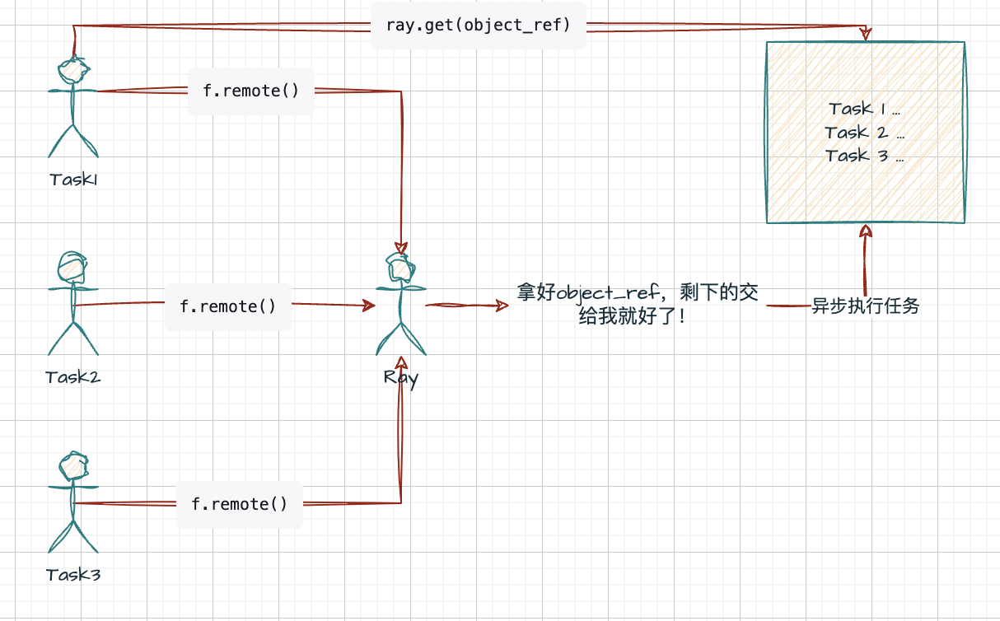
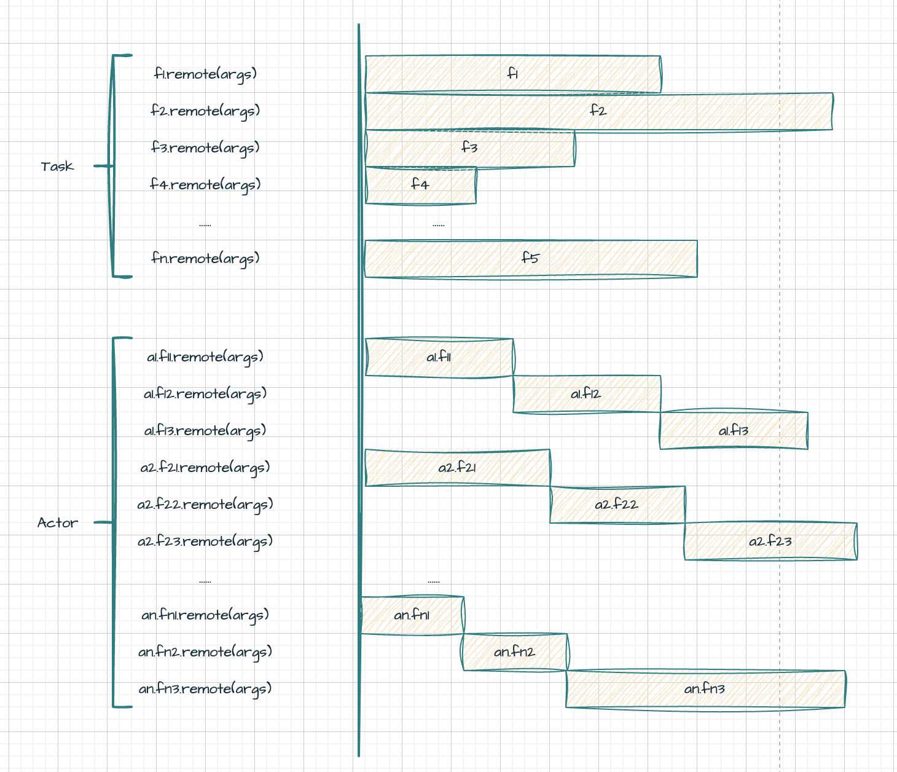
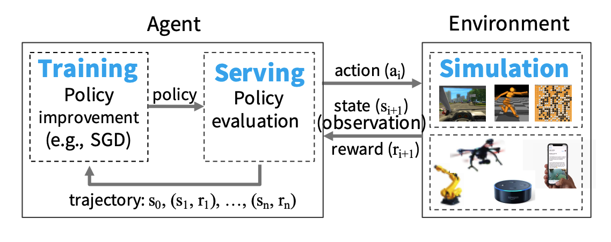
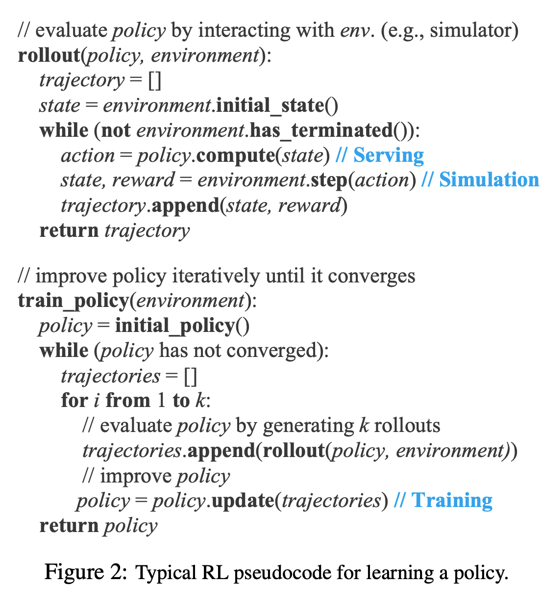
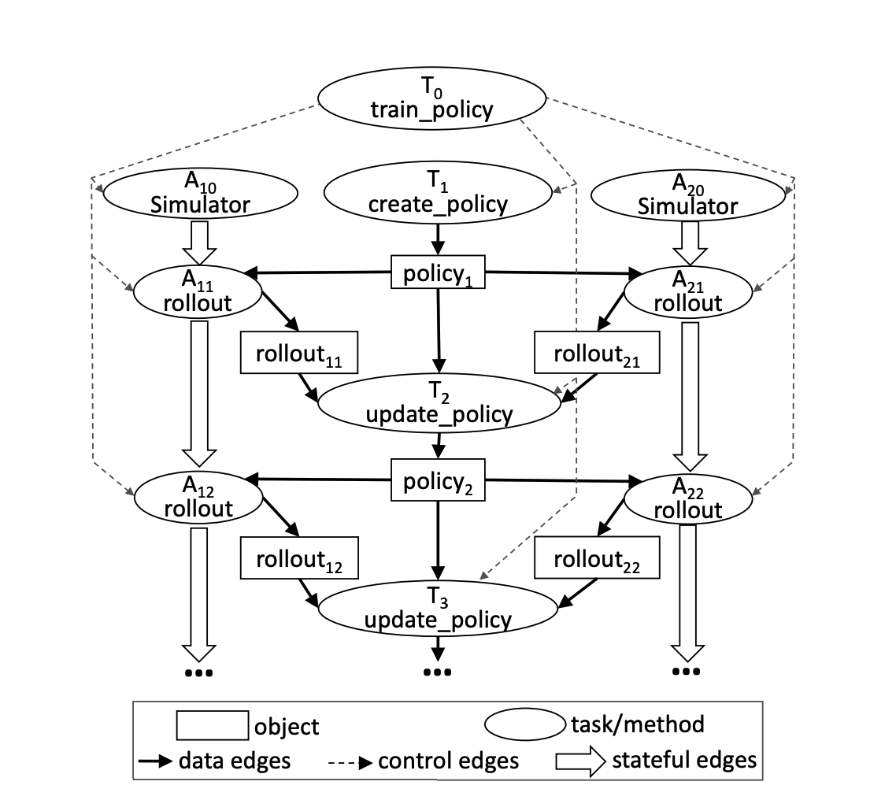
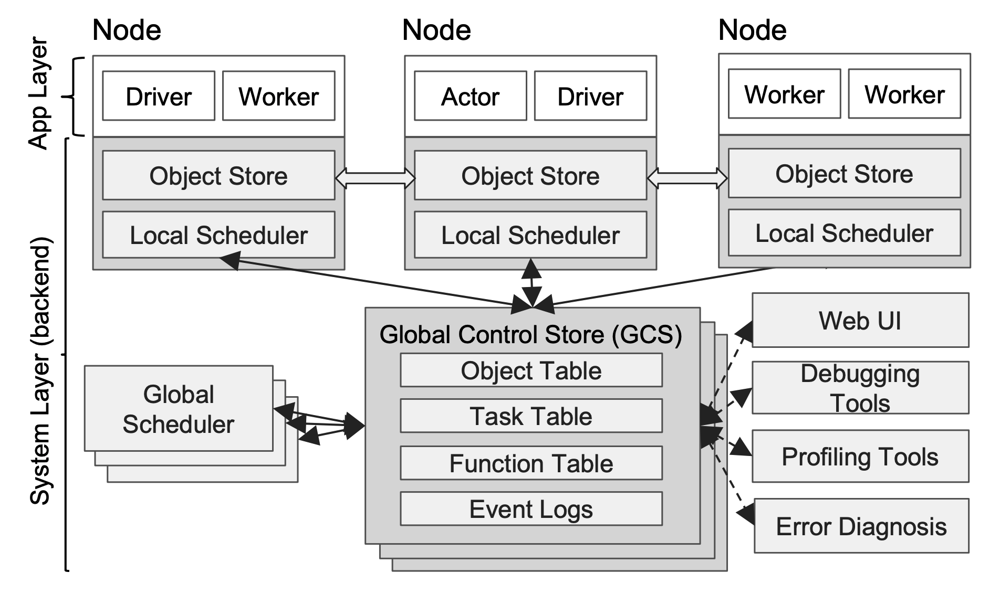
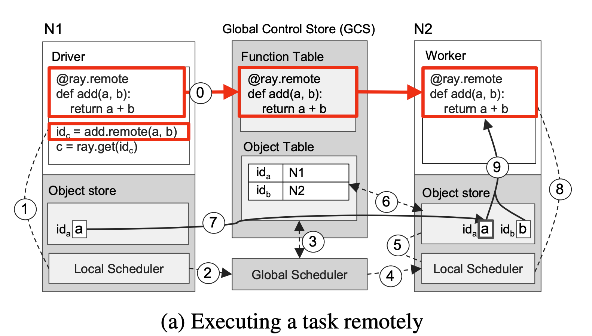
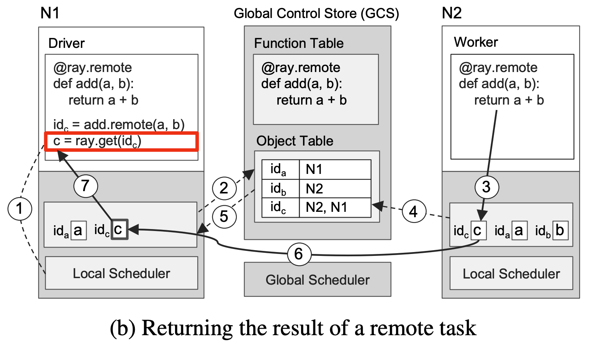

# 引言

Ray 是一个高效的分布式计算框架，专为大规模并行任务设计，广泛应用于机器学习、数据处理等领域。它通过简洁的编程模型和强大的计算模型，支持高效的资源调度和任务执行。本文基于[ Ray 的论文](./PDF/Ray-Paper.pdf)，简要介绍了 Ray 的编程模型、计算模型以及其总体架构。

# Ray 编程模型

Ray中有两个重要的概念：

* **任务（Task）**：无状态，通常通过注解应用于方法。
* **行动器（Actor）**：有状态，通常通过注解应用于类对象。

Ray 编程模型指的是 Ray 框架基于任务和行动器，为用户提供的一套 API 和编程范式。Ray 中的核心 API 如下：

| 代码                                                         | 说明                                                         |
| ------------------------------------------------------------ | ------------------------------------------------------------ |
| futures = f.remote(args)                                     | 远程执行函数 `f`。`f.remote()` 接受普通对象或 `future` 对象作为输入，返回一个或多个 `future` 对象，执行为非阻塞。 |
| objects = ray.get(futures)                                   | 返回与一个或多个 `future` 对象相关联的真实值，执行为阻塞。   |
| ready_futures = ray.wait(futures, k, timeout)                | 当 `futures` 中有 `k` 个 `future` 完成，或超时达到 `timeout` 时，返回已经完成的 `future` 对象。 |
| actor = Class.remote(args)<br/>futures = actor.method.remote(args) | 将类实例化为远程行动器，并返回其句柄。随后调用该行动器的 `method` 方法，并返回一个或多个 `future` 对象。两个过程均为非阻塞。 |

## 任务 Task

> 任务是指在无状态的 **worker** 中执行的远程函数。当远程函数被调用时，会立即返回一个 `future` 对象，真正的返回值可以通过 `ray.get(<future对象>)` 来获取。这样的编程模型使用户能够编写并行计算代码，同时提醒用户关注数据之间的依赖关系。

任务的编程范式：

1. **注册任务**：在需要注册为任务的函数上添加 `@ray.remote` 装饰器。
2. **提交任务**：调用带有 `@ray.remote` 装饰器的函数时，需使用 `.remote()` 方法，而不是直接调用。
3. **非阻塞提交**：无论任务运行所需时间长短，提交任务后会立即返回一个 `ObjectRef` 对象。
4. **按需阻塞获取结果**：当需要获取函数的返回值时，可以使用 `ray.get` 来获取结果。

```python
# 注册任务
@ray.remote
def f(x):
    return x * x

# 非阻塞提交任务，拿到立即返回的object_ref
object_ref = f.remote(2)
# 获取任务的执行结果
assert ray.get(object_ref) == 4
```



任务是无状态的，任务操作的对象可以视为不可变对象（Immutable Objects），或者任务的调用可以看作是一个无副作用的（Side-effect Free）表达式。任务的输出仅依赖于其输入。

```python
# 声明两个功能相同的函数，一个是Ray任务，另一个是普通的Python函数
@ray.remote
def append_one(container):
    container.append(1)
    return container

def local_append_one(container):
    container.append(1)
    return container

container = []

object_ref = append_one.remote(container)
result = ray.get(object_ref) # 此处可确保函数已经在远程执行完成
print(result) # [1]
print(container) # []; 远程函数未对container产生副作用

local_append_one(container)
print(container) # [1]; 本地函数对container产生了副作用
```

**优点**：由于任务是无状态的，不依赖于其他任务的结果，任务可以重复执行，从而提高容错性。

**缺点**：限制了对全局变量和内存引用的访问。

任务使Ray具备了以下能力：

- **细粒度负载均衡**：通过任务级别的负载感知调度实现细粒度的负载均衡。

  **输入数据本地化**：每个任务可以在存储所需数据的节点上调度执行。

  **较低的恢复开销**：无需记录检查点或恢复到中间状态。

## 行动器 Actor

行动器用于表示有状态的计算任务。每个行动器会暴露一些可供远程调用的方法，类似于任务中的远程函数。不同之处在于，使用 `f.remote` 顺序提交若干远程函数时，这些函数会并行执行；而在同一个 `actor` 下，使用 `actor.method.remote` 顺序提交若干远程函数时，这些函数会串行执行。



行动器的编程范式：

* **注册行动器**：在需要注册为行动器的类上添加 `@ray.remote` 装饰器。

* **实例化行动器**：与普通 Python 类实例化不同，需要在类名后加上 `.remote`。

* **提交方法调用**：调用行动器的方法时，同样需要使用 `.remote()`，而不是直接调用。

* **非阻塞提交**：无论方法的运行需要多长时间，提交任务后都会立即返回一个 `ObjectRef` 对象（同一行动器实例下，方法会按照提交顺序串行执行）。

* **按需阻塞获取结果**：当需要方法返回值时，可以通过 `ray.get` 来获取结果。

```python
# 声明行动器
@ray.remote
class Counter(object):
    def __init__(self):
        self.value = 0

    def increment(self):
        self.value += 1
        return self.value

# 创建行动器
counter = Counter.remote()

refs = []

for i in range(10):
    # 调用行动器的方法
    ref = counter.increment.remote()
    refs.append(ref)

for i, ref in enumerate(refs):
    assert ray.get(ref) == i + 1
```

行动器的设计使 Ray 具备更高效的细粒度更新能力。由于行动器采用高内聚的设计，状态和可能改变状态的操作被组织在同一个类中，这样这些操作不依赖于外部状态，从而在更新状态时避免了大量的序列化和反序列化开销。

**Task** 可以理解为一种特殊的简易 **Actor**，即该行动器只有一个方法，并且该方法只会执行一次。

# Ray 计算模型

Ray 采用动态任务图计算模型，当输入数据就绪时，系统会自动触发相应的远程函数和行动器方法的执行。

在不考虑行动器的参与下，计算图的节点可以分为两类：

- **数据对象**

- **远程函数调用**

边也可以分为两类：

- **数据边**
- **控制边**

行动器的方法调用与远程函数调用类似，都是计算图的节点。与远程函数不同的是，行动器方法调用需要额外增加一条状态边，用以表示同一行动器中的串行执行顺序。

>RL 智能体策略学习图示：
>
>
>
>智能体策略学习的伪代码：
>
>
>
>* **Serving（服务）**：指利用策略状态进行计算的过程。
>
>* **Simulation（仿真）**：指执行动作，产生策略状态转移和奖励，并记录轨迹的过程。
>
>* **Training（训练）**：指利用轨迹对策略进行更新的过程。
>
>* **Rollout（预演）**：指服务和仿真过程，此过程策略状态不发生改变。
>
>* **Environment（环境）**：图中的环境是 **Episodic（分幕式）**，每次预演结束的条件是每一幕的结束。在 **Continous（持续式）** 环境下，没有幕的概念，可以根据已收集轨迹的长度来决定是否结束预演。

智能体策略学习代码：

```python
@ray.remote
def create_policy():
    # 随机初始化策略
    return policy


@ray.remote(num_gpus=1)
class Simulator(object):
    def __init__(self):
        # 初始化环境
        self.env = Environment()
    def rollout(self, policy, num_steps):
        observations = []
        observation = self.env.current_state()
        for _ in range(num_steps):
            action = policy(observation)
            observation = self.env.step(action)
            observations.append(observation)
        return observations


@ray.remote(num_gpus=2)
def update_policy(policy, *rollouts):
    # 更新策略
    return policy


@ray.remote
def train_policy():
    # 创建策略
    policy_id = create_policy.remote()
    # 创建10个行动器(仿真器)
    simulators = [Simulator.remote() for _ in range(10)]
    # 做100次训练
    for _ in range(100):
        # 每个行动器做一次预演
        rollout_ids = [s.rollout.remote(policy_id) for s in simulators]
        # 使用预演生成的轨迹来更新策略
        policy_id = update_policy.remote(policy_id, *rollout_ids)
    return ray.get(policy_id)
```

计算图如下所示：



图中的主任务是 $T_0$ ， $T_0$ 中创建了策略（任务），并实例化了若干个模拟器（行动器） $A_{10}$,⋯,$A_{n0}$ （图中为了简便且不失一般性只画了两个），这些过程都是并行的。

接下来进入策略评估和策略改进的循环。策略评估（rollout）需要策略作为输入，并输出 rollout 的结果；而策略改进则需要策略和众多 rollout 结果作为输入。我们将 $A_{1k}$, ⋯, $A_{nk}$ 称为第 k 批 rollout，这意味着每一批 rollout 都是基于同一个策略进行的，且必须等前一批 rollout 用于更新策略后，下一批 rollout 才能基于新的策略开始。

同一个模拟器的不同批次 rollout 之所以是串行的，是因为每次 rollout 可能会改变环境的状态，下一次 rollout 必须以前一次 rollout 结束时的状态作为起始状态。

与完全串行的策略学习方法相比，这种并行化设计的主要优势在于将 rollout 批量化并行化，从而增加单位时间内 [蒙特卡洛采样](https://zhuanlan.zhihu.com/p/338103692) 的数量，提高策略评估的精度，进而加速策略改进的过程。

# Ray 架构

Ray 的架构由应用层和系统层组成，其中应用层实现了 Ray 的 API，供前端用户使用；系统层则作为后端，保障 Ray 的高可扩展性和容错性。

架构图如下：



## 应用层

应用层进程分为三类：

* **Driver Process（驱动器进程）**：由主进程驱动，执行用户程序的进程。

* **Worker Process（工作器进程）**：执行由驱动器或其他工作器调用的任务（远程函数）的无状态进程。工作器由系统层分配任务并自动启动。当声明一个远程函数时，该函数将自动发送到所有工作器。在同一个工作器中，任务是串行执行的，且工作器不维护任务之间的局部状态，即一个远程函数执行完后，其局部作用域的所有变量将不再被其他任务访问。

* **Actor Process（行动器进程）**：行动器在被调用时只执行其所暴露的方法。行动器由工作器或驱动器显式实例化。与工作器相同，行动器也会串行执行任务，不同之处在于，行动器上执行的每个方法都依赖于之前方法执行后的状态。

```python
@ray.remote
def f(x):
    # ==== 工作器进程 ====
    return x * x

@ray.remote
class Counter(object):
    def __init__(self):
        # ==== 行动器进程 ====
        self.value = 0

    def increment(self):
        # ==== 行动器进程 ====
        self.value += 1
        return self.value

if __name__ == "__main__":
    # ==== 驱动器进程 ====
    object_ref = f.remote(2)
    assert ray.get(object_ref) == 4

    counter = Counter.remote()
    refs = []
    for i in range(10):
        ref = counter.increment.remote()
        refs.append(ref)
    for i, ref in enumerate(refs):
        assert ray.get(ref) == i + 1
```

## 系统层

系统层由三个主要部件组成：

* **Global Control Store（全局控制存储器 GCS）** Ray 2.0中改名为Global Control Service

* **Distributed Scheduler（分布式调度器 DS）**

* **Distributed Object Store（分布式对象存储器 DOS）**

这些部件在横向上是可拓展的，即可以增减这些部件的数量，同时还具有一定的容错性。

### 全局控制存储器 GCS

GCS 的设计初衷是使系统的各个组件尽可能无状态，因此 GCS 维护了一些全局状态：

* **Object Table（对象表）**：记录每个对象所在的节点。
* **Task Table（任务表）**：记录每个任务运行的节点。
* **Function Table（函数表）**：记录用户进程中定义的远程函数。
* **Event Logs（事件日志）**：记录任务运行的日志。

### 分布式调度器 DS

Ray中的人物调度器分为两层：

* **Global Scheduler（全局调度器）**：一个
* **Local Scheduler（局部调度器）**：每个节点都有一个

在 **Ray 框架** 中，**Node 节点** 可以理解为一台物理机器或一台虚拟机（VM）。具体来说，**Node 节点** 是指 Ray 集群中的一个工作单元，它通常对应一个独立的计算实例（无论是物理机、虚拟机还是容器）。

**任务调度流程简述**：

1. **任务提交**：
   - 用户提交任务后，任务会被发送到当前节点的 Local Scheduler。
2. **本地调度**：
   - Local Scheduler 检查本地资源是否能够满足任务需求：
     - 如果满足：任务直接在本地节点运行。
     - 如果不满足：将任务上报给 Global Scheduler。
3. **全局调度**：
   - Global Scheduler 接收任务并分析整个集群的资源状况。
   - 为任务选择最适合的节点，并将任务转交给目标节点的 Local Scheduler。
4. **任务执行**：
   - Local Scheduler 接收任务后，根据资源空闲情况开始执行。

下图展示了 Ray 的调度过程，箭头的粗细表示过程发生频率的高低。用户进程和工作器向本地调度器提交任务，大多数情况下，任务将在本地被调度。少数情况下，局部调度器会向全局调度器提交任务，并向 GCS 传递任务的相关信息，将任务涉及的对象和函数存入全局的对象表和函数表中。然后，全局调度器会从 GCS 中读取信息，并选择在其他合适的节点上调度任务。更具体地说，全局调度器会根据任务的请求选出具有足够资源的节点，并在这些节点中选出等待时间最短的一个。


【拓展】任务从 **Local Scheduler** 转交给 **Global Scheduler** 的情况：

- **本地资源不足**：例如任务需要 4 个 GPU，而本地节点只有 2 个 GPU 可用。
- **指定了资源位置约束**：例如任务指定需要运行在带有特定 GPU 型号（如 A100）的节点，而本地节点没有该型号 GPU。
- **全局优化调度的需要**：**Global Scheduler** 会综合评估整个集群的负载和任务分配情况，决定是否重新分配任务。
- **Actor 调度**：如果 **Actor** 对象在创建时绑定到特定节点，而本地节点不是其目标节点，**Local Scheduler** 会将任务移交给 **Global Scheduler**，后者会确保 **Actor** 在目标节点上启动。
- **数据依赖**：如果任务依赖的数据不在本地节点，而在另一个节点上，**Global Scheduler** 会考虑数据位置，将任务调度到拥有数据的节点上，以减少数据传输开销。

【拓展】全局调度的匹配策略：

- **资源匹配优先**
- **负载均衡**
- **数据本地性**
- **Actor 位置绑定**
- **抢占策略**
- **定制调度策略**

### 分布式对象存储器DOS

Ray 实现了一个内存式的分布式存储系统来存储每个任务的输入和输出。通过内存共享机制，Ray 在每个节点上实现了一个对象存储器（Object Store），使得在同一节点上运行的任务可以直接共享数据，无需进行拷贝。当一个任务的输入不在本地时，它会在执行之前将输入复制到本地的对象存储器中。同样，任务的输出总是写入到本地的对象存储器。

这种复制机制有助于减少任务执行时间，因为 **任务永远只会从本地对象存储器中读取数据（否则任务不会被调度）**，并且消除了热数据可能带来的潜在瓶颈。

### 进程视角的架构分析——两数之和

假设现在有一个求两数之和的任务需要交给 Ray 来执行，下面我们来具体分析这一任务在 Ray 架构中是如何执行的。以下分析以全局调度为例，因为它更具有一般性。



上图（a）描述的是任务的定义、提交和执行的过程：

0. **定义远程函数**：位于 $N_1$ 的用户程序中定义的远程函数 `add` 被装载到 GCS 的函数表中，位于 $N_2$ 的工作器从 GCS 中读取并装载远程函数 `add`。

1. **提交任务**：位于 $N_1$ 的用户程序向本地调度器提交 `add(a, b)` 的任务。
2. **提交任务到全局**：本地调度器将任务提交至全局调度器。
3. **检查对象表**：全局调度器从 GCS 中查找 `add` 任务所需的实参 a 和 b，发现 a 在 $N_1$ 上，b 在 $N_2$ 上（a 和 b 已在用户程序中事先定义）。
4. **执行全局调度**：根据上一步的检查，任务的输入分布在两个节点上，因此全局调度器随机选择一个节点进行调度，此处选择了 $N_2$。
5. **检查任务输入**：$N_2$ 的局部调度器检查任务所需的对象是否都在本地对象存储器中。
6. **查询缺失输入**：$N_2$ 的局部调度器发现任务所需的 a 不在 $N_2$ 中，经过 GCS 查找后，发现 a 在 $N_1$ 上。
7. **对象复制**：将 a 从 $N_1$ 复制到 $N_2$。
8. **执行局部调度**：在 $N_2$ 的工作器上执行 `add(a, b)` 的任务。
9. **访问对象存储器**：`add(a, b)` 访问局部对象存储器中的相应对象。



上图（b）描述了获取任务执行结果的过程：

1. **提交 get 请求**：向本地调度器提交 `ray.get` 请求，期望获取 `add` 任务执行的返回值。
2. **注册回调函数**：$N_1$ 本地没有存储返回值，因此根据返回值对象的引用 $id_c$ 在 GCS 的对象表中查询该对象位于哪个节点。假设此时任务尚未执行完成，GCS 对象表中找不到 $id_c$，因此 $N_1$ 的对象存储器会注册一个回调函数。当 GCS 对象表中出现 $id_c$ 时，触发该回调，将 c 从对应节点复制到 $N_1$。
3. **任务执行完毕**：$N_2$ 上的 `add` 任务执行完成，返回值 c 被存储到 $N_2$ 的对象存储器中。
4. **将对象同步到 GCS**：$N_2$ 将 c 及其引用 $id_c$ 存入 GCS 的对象表中。
5. **触发回调函数**：步骤 2 中注册的回调函数被触发。
6. **执行回调函数**：将 c 从 $N_2$ 复制到 $N_1$。
7. **返回用户程序**：将 c 返回给用户程序，任务结束。

# 参考文档

>[Ray: A Distributed Framework for Emerging AI Applications](./PDF/Ray-Paper.pdf)
>
>[Ray分布式计算框架详解](https://zhuanlan.zhihu.com/p/460600694)

