>参考文档：
>
>[Ray 1.x Architecture](https://docs.google.com/document/d/1lAy0Owi-vPz2jEqBSaHNQcy2IBSDEHyXNOQZlGuj93c/preview?tab=t.0)
>
>[Ray 1.0 架构解读](https://zhuanlan.zhihu.com/p/344736949)


## 框架概览

### 应用概念

#### 1 Task

Task 是一个函数，也可以是 Actor 的类。调用时，Task 会将其输入、输出和中间计算逻辑封装成一个任务包并提交到 Ray 集群。

- 提交时，Task 并不会立即执行，而是完成资源分配和向 GCS（Global Control Store）的注册过程。
- 提交任务时，会返回一个 `ObjectRef` 对象，作为任务结果的引用。只有当调用 `get` 操作时，Task 才会真正开始执行。此时，`get` 操作会阻塞，直到结果返回。

#### 2 Object

Object 是应用程序中的值，可以通过以下两种方式生成：

1. 调用 `ray.put` 显式存储某个值。
2. 提交 Task 或 Actor 时，自动生成任务的输出对象。

**特点**：

- **不可变性**：Object 创建后不可修改。
- **访问方式**：Worker 通过 `ObjectRef` 对象来引用和操作 Object。

#### 3 Actor

Actor 是一个有状态的 Worker 进程，是通过 `@ray.remote` 修饰的类的实例。

- Actor 的任务（Actor Task）需要通过句柄（handle）或 Python 引用提交到 Ray 集群。
- 每个 Actor 持有自己的状态，并在任务之间保留该状态。

#### 4 Driver

Driver 是 Ray 应用程序的起点，指执行 `ray.init()` 的程序。它是 Ray 作业（Job）的入口，负责启动和提交任务到 Ray 集群。

#### 5 Job

Job 是一个逻辑上的集合，包含由同一 Driver 发起的 Tasks、Objects 和 Actors。

- 它是一个粗粒度的概念，并没有具体的函数或类对应。
- Job 表示的是一次应用执行的全局上下文。

### 设计

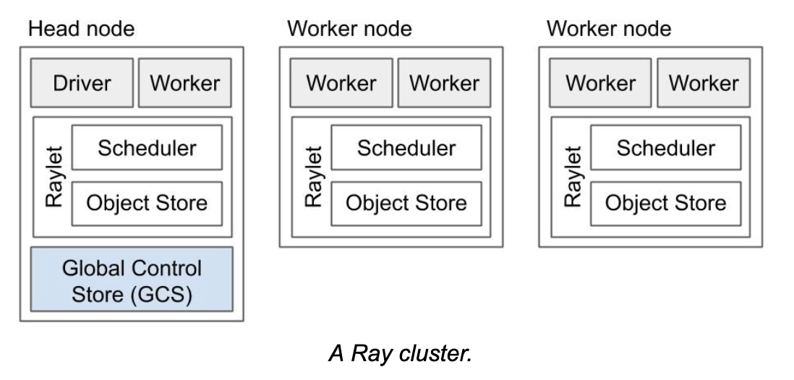

一个 Ray 集群由一组同类型的 Worker 节点（Worker Nodes）和一个中心化的全局控制存储实例（Global Control Store, GCS）组成。

**GCS 的职责**：GCS 负责管理系统的元数据，例如 actor 的地址信息和集群中节点的拓扑关系。这些元数据虽然访问频率较低，但通常会被大部分甚至所有 Worker 使用，例如获取当前节点在集群中的位置关系。

**性能优化**：GCS 的集中化设计可以提供高效的调度和监控能力，但频繁的访问可能会影响系统性能。为此，GCS 的设计目标是尽量减少 Worker 对其的直接访问。例如，在后续版本中，引入了本地调度器（Local Scheduler），通过缓存和分散调度策略，减少 Worker 对 GCS 的调用频率，从而进一步优化性能。

**核心组件**：GCS 和 Worker 是 Ray 的两个最重要组件。GCS 提供了集中式的元数据管理和调度能力，而 Workers 承担任务的具体执行。两者协同工作，为 Ray 的高效分布式计算奠定了基础。

### 所有权关系


Ray 的大部分元数据通过一种**去中心化**的机制来管理，称为**所有权（ownership）**。具体来说，每个 Worker 进程负责管理并“拥有”其提交的任务（Task）以及任务返回的结果（`ObjectRef`）。

- 任务的所有者负责任务的执行以及与之相关的 `ObjectRef` 的解析。
- 此外，Worker 还拥有它通过 `ray.put` 创建的对象。

所有权机制的优点（相对于 Ray < 0.8 的中心化机制）：

1. **低延迟**，元数据更新在本地进程内完成，因此访问延迟极低（约 1 RTT，< 200 微秒）。
2. **高吞吐**，系统元数据通过嵌套的远程调用自然分布在多个 Worker 进程中，从而实现高吞吐量（每个客户端可达约 10k tasks/s），并支持集群内的线性扩展。
3. **架构简化**，所有者集中管理垃圾回收和系统元数据，减少了系统复杂性。
4. **增强可靠性**，Worker 故障被有效隔离。例如，一个远程调用的故障不会影响其他任务或 Worker 的运行。

所有权机制的权衡（Trade-offs）：

1. **对象解析的依赖**，要解析 `ObjectRef`，其对应的对象所有者必须是可访问的。这意味着对象需要与其所有者保持联系。有关对象恢复和持久化的更多细节，可以参考 **Object Failures** 和 **Object Spilling** 部分。
2. **不可转移的所有权**。

### 组件

一个 Ray 实例由一个或多个工作节点（worker nodes）组成，每个节点包含以下主要的物理进程和组件：

**1 Worker Processes**

**功能**：负责任务（task）的提交和执行。

**类型**：每个 worker process 可以是无状态的，也可以是一个 Actor。

**关联**：每个 worker process 对应一个特定的 job。

**数量**：默认情况下，初始化的 worker 数量等于机器的 CPU 核心数。

**存储信息**：

1. **对象的所有权表**：记录对象的引用计数（ref counts）以及对应的 worker 信息。
2. **进程内存储**：用于存储小型对象，以提高访问速度。

**2 Raylet**

Raylet 是每个节点上的核心组件，负责集群中所有 job 的协调与资源管理。它包含两个主要线程：

1. 调度线程：
   - 负责资源分配。
   - 在分布式对象存储中写入任务参数。
   - 实现集群范围的分布式调度。
2. 共享内存对象存储（Plasma Object Store）：
   - 用于存储和传输大型对象。
   - 每个节点的对象存储是 Ray 分布式对象存储的一部分。

---

每个 Worker 进程和 Raylet 进程都会分配一个唯一的 20 字节（bytes）ID，以及对应的 IP 地址和端口。

- **端口重用**：相同的地址和端口可以被子组件重新使用（例如，当之前的 Worker 进程被销毁后）。
- **唯一性保证**：唯一的进程 ID 不可重用，并会随着进程的销毁而失效。
- **资源共享**：Worker 进程与其本地的 Raylet 进程资源共享（fate-share），确保它们在同一个生命周期内协作运行。

Ray 集群中的某个 Worker 节点会被设计为 **Head 节点**，区别于其他节点，Head 节点承担以下特殊职责：

1. **Global Control Store（GCS）**
   - GCS 是一个 key-value 服务器，负责存储系统级的元数据，例如对象（Objects）和 Actor 的位置信息
   - 当前，GCS 运行在 Head 节点上，但有正在进行的优化工作，以允许 GCS 运行在任意节点或以分布式形式部署，以提高灵活性和性能。
2. **Driver 进程**
   - **Driver 定义**：Driver 是一个特殊的 Worker 进程，用于运行用户的上层应用（例如 Python 中的 `__main__` 模块）。
   - **功能**：Driver 可以提交任务（Tasks），但自身不参与任务的执行。
   - **部署**：Driver 进程可以运行在集群的任意节点上，但默认情况下运行在 Head 节点内。

Ray 中区分了 **small objects** 和 **large objects** 的处理方式：

- **小对象**（小于一定大小，默认 100KB，可配置）：通过进程直接传递，避免额外的开销。
- **大对象**（超过指定大小）：通过 **Plasma** 共享内存进行传递，以高效支持大规模数据共享。

Ray 在 GCS 与 Worker 之间采用了一种**混合模式**：

- **去中心化**：Worker 增强了互相调度的能力，减轻对 GCS 的依赖，提升性能。
- **中心化**：GCS 仍负责全局调度和系统元数据管理，提供全局一致性。

这种混合模式并非十全十美，但它很好地平衡了去中心化的高效性与中心化的全局协调需求，是一种适应多样场景的合理设计。

## 连接到 Ray

Ray 的应用程序中的 Driver 可以通过以下方式连接到 Ray 集群：

1. **启动一个嵌入式单节点实例**
   - 不带参数调用 `ray.init()`，会启动一个嵌入式的单节点 Ray 实例。
   - 该实例无需额外配置，可以立即准备好供应用调用和使用。
2. **连接到已有的 Ray 集群**
   - 通过指定 `ray.init(address=<GCS addr>)`，Driver 可以连接到一个已启动的 Ray 集群。
   - 在这种模式下，Driver 会连接到 GCS，查询集群中其他组件（例如本地 Raylet）的地址。
   - **注意**：由于 Ray 的共享内存机制，Driver 必须与集群中某个节点位于同一物理位置，才能使用该节点的共享内存。

Driver 与集群共享内存的限制：

- 如果 Driver 连接到一个已有的 Ray 集群，它需要与某个节点的 Raylet 直接连接，并加入集群。
- 如果 Driver 不在集群节点上，它无法使用共享内存机制，这也意味着无法正常提交任务或操作对象。

目前，Driver 必须运行在 Ray 集群的某个节点上，而不能位于集群外。这一限制是由共享内存机制决定的，但随着优化工作的推进，**该限制可能会被逐步解除**。

## 语言运行时

Ray 的核心组件是用 C++ 开发的。为了支持 Python 和 Java，Ray 提供了一个嵌入式 C++ 库，称为 **Core Worker**。该库实现了多项关键功能，包括：

- **所有权表**：用于管理对象的所有权和引用计数。
- **进程内存储**：支持小对象的本地存储和高效访问。
- **gRPC 通讯**：实现了与其他 Worker 进程和 Raylet 的通信机制。

由于这些核心库采用 C++ 开发，Ray 的不同语言运行时共享一个高效的、统一的 **Ray Worker 协议**，从而确保各个语言的执行环境能够高效地协同工作。

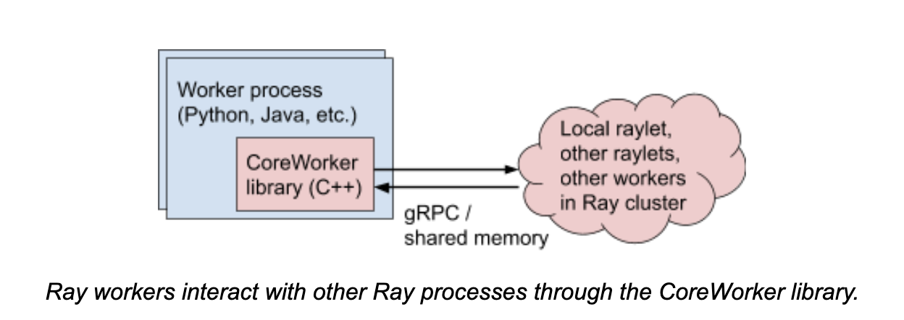

### TASK生命周期

在 Ray 中，**Task 的所有者**负责提交任务，并将任务执行的结果（`ObjectRef`）解析为其对应的值。提交任务的进程即成为该任务返回值的所有者。任务所有者通过 Raylet 获取资源来执行任务。例如，在一个任务执行中，**Driver** 是结果 “A” 的所有者，而 **Worker 1** 是结果 “B” 的所有者。

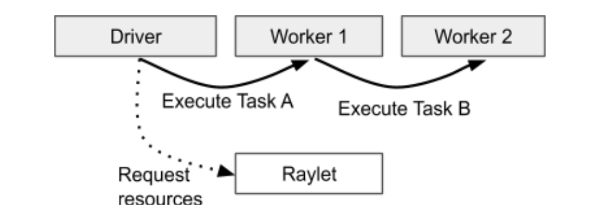

当任务被提交后，任务所有者会等待所有依赖项的可用性。这些依赖项可能是 `ObjectRef`，即作为任务参数传入的对象引用。需要注意的是，这些依赖必须是本地可访问的。任务所有者会考虑在集群中尽可能快速地使这些依赖变得可用。一旦所有依赖项准备就绪，任务所有者就会从分布式调度器中获取资源来执行任务。当资源可用时，调度器批准任务的提交，并将相应的资源分配给任务所有者所在的 Worker。

任务所有者所在的 Worker 会通过 gRPC 发送任务描述来调度任务执行。当任务开始执行时，Worker 必须存储该任务的返回值。如果返回值较小，Worker 会直接将结果拷贝到任务所有者进程的内存中（即进程内存储）。如果返回值较大，Worker 会将该结果存储在本地的共享内存对象中，并通过分布式内存将该对象反馈给任务所有者。这样，任务所有者可以在本地节点引用并获取该对象。

简化后的任务提交与执行流程：

1. **任务提交**：当任务提交后，Ray 集群会确认资源可用性，只有在资源准备好之后，任务才会被执行。
2. **依赖解析**：如果任务参数中包含 `ObjectRef`，这些对象必须在 Worker 开始执行任务时可解析。对于较小的对象，任务描述会直接包含这些值，Worker 可以直接引用；对于较大的对象，必须通过分布式内存来获取，Worker 会在本地共享内存中存储该对象并传递给所有者。
3. **调度协调**：任务调度涉及对对象位置的追踪和从其他节点获取副本，以完成数据传输。Ray 通过 Raylet 间的通信机制实现共享内存数据调度，并采用本地消息传递机制处理小数据的传输。这是 Ray 优化数据传输的一部分策略。

>**Ray 集群的结构与对象存储机制小结：**
>
>1. **Worker Node 和 Worker Process 的关系**：
>   - 一个 Ray 集群中存在一个或多个 **Worker Node** 节点。
>   - 每个 Worker Node 节点上运行多个 **Worker Process**，其数量默认与 CPU 核心数相关，可以通过配置调整。
>   - **Worker Process** 是实际执行任务（task）的主体。
>2. **Plasma Store 的作用**：
>   - 每个 **Worker Node** 都有一个 **Plasma Store**，用于节点范围内的共享内存存储。
>   - **Plasma Store** 专门用于存储 **大对象**（例如大于 100KB 的对象，阈值可配置），这些对象会以不可变形式存储。
>3. **小对象与大对象的区别**：
>   - **小对象**（小于阈值，默认 100KB）：直接存储在 **Worker Process** 的进程内存中。
>   - **大对象**（超过阈值）：存储在 **Plasma Store** 中，供同一节点的所有 **Worker Process** 和 Raylet 访问。
>4. **数据访问与传输机制**：
>   - 本地访问：
>     - 如果任务需要访问的数据对象在同一节点的 **Plasma Store** 中，Ray 会通过共享内存直接读取，无需网络传输。
>   - 跨节点访问：
>     - 如果任务需要的数据对象在其他节点，Ray 会通过 gRPC 协议将对象从源节点的 **Plasma Store** 复制到目标节点的 **Plasma Store**，以便任务能够使用。
>     - 数据传输是分布式系统的关键开销，因此 Ray 的调度器会尽量将任务调度到数据所在节点，减少跨节点数据传输。
>5. **总结调用路径**：
>   - 对于小对象：直接通过任务描述传递（嵌入式数据）。
>   - 对于大对象：
>     - **本地节点**：通过共享内存访问 Plasma Store。
>     - **跨节点**：通过 gRPC 在节点之间复制对象，并存储到目标节点的 Plasma Store 中。

Ray 区分两种类型的任务错误：

1. **应用层错误**
   - 例如在任务执行过程中，Python 抛出 `IndexError` 等异常。对于应用层错误，Ray 不会自动重试，异常会被捕获并记录在任务的返回值中。
2. **系统层错误**
   - 例如 Worker 进程因 `segfault` 错误中止，或者 Worker 所在的 Raylet 进程崩溃。**系统层错误会自动触发重试机制**，Ray 会尝试多次重新执行任务，直到达到重试次数上限。

### Object 生命周期

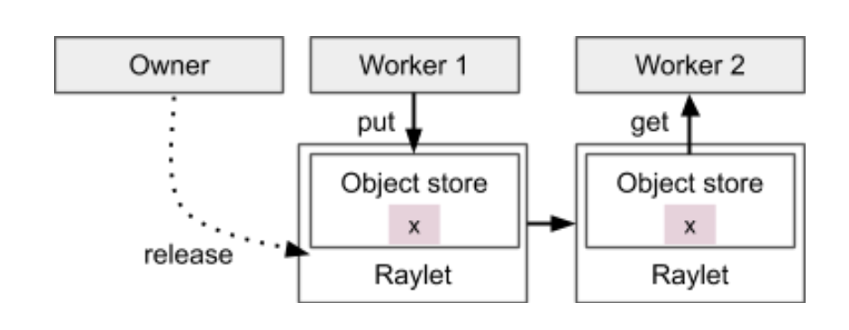

在 Ray 中，Worker 可以创建和获取对象（Object），而每个对象的生命周期由其所有者负责管理。对象的所有者负责判断何时可以安全地释放对象，以有效利用内存资源。

#### **1 对象所有者的定义**：

* **Object 的所有者**是创建了该对象引用（`ObjectRef`）并提交了任务或调用了 `ray.put` 的 Worker。

* 所有者管理对象的生命周期，确保在其存活期间，`ObjectRef` 能够解析为实际的值，或者在出现错误时抛出异常。

* 如果对象的所有者进程终止，即使存在该对象的物理拷贝，获取其值的操作也不会挂起，而是立即抛出异常。

#### **2 引用计数机制**：

- 每个 Worker 会存储它所持有的对象的引用计数。
- 引用计数的变化情况包括：
  - 当一个任务被提交并传递了 `ObjectRef` 或包含 `ObjectRef` 的参数时，引用计数增加。
  - 当任务返回一个 `ObjectRef` 或包含 `ObjectRef` 的结果时，引用计数增加。
- 引用计数的主要目的是决定对象何时可以安全释放，避免内存泄漏。

#### **3 对象的存储位置**：

- **小对象**：存储在 Worker 进程的内存中（进程内存储）。
- **大对象**：存储在节点级别的共享内存中，即 **Plasma Store**。
- 存储位置的选择旨在优化内存利用和解析效率。

#### **4 对象的解析与获取：**

Ray 提供两种方式来解析 `ObjectRef` 并获取其值：

1. **直接获取**：调用 `ray.get` 方法，获取 `ObjectRef` 对应的值。
2. **任务参数传递**：将 `ObjectRef` 作为参数传递给另一个任务时，Worker 会在任务执行前解析该引用，并将解析后的值作为任务的参数。

3. 对于 **小对象**：解析操作直接从进程内存储中完成。

4. 对于 **大对象**：解析操作依赖于分布式对象存储（共享内存存储），并通过分布式协议完成对象传输（跨节点）。

#### **5 异常处理与对象的可靠性**

1. **正常情况下**：
   - 如果没有异常发生，所有者会确保对象至少有一个可用的拷贝，并且仍在被引用（引用计数大于零）。
   - 此机制保证了对象在需要时能够被解析为实际的值。
2. **异常情况下**：
   - **应用级别异常**：如任务在执行时发生 Python 异常（例如 `IndexError`），解析过程会抛出该异常，但系统不会中止。
   - **系统级别异常**：
     - 如果 Worker 或 Raylet 出现问题，存储在分布式内存中的对象可能会丢失。
     - 如果所有对象的拷贝都丢失，Ray 提供了一种可选的恢复机制，通过对象重建（reconstruction）来自动恢复这些对象。
   - 如果对象的所有者进程失败，相关对象也可能无法恢复，并被视为失败对象。

## Actor 生命周期

在 Ray 中，**Actor 的生命周期及其元数据**（例如 IP 地址和端口）是通过 **GCS 服务**（Global Control Store）集中管理的。每个 Actor 的客户端会将这些元数据缓存到本地，并通过 gRPC 通信直接向其他 Actor 发送任务。

与普通任务（Task）的完全去中心化机制不同，**Actor 的生命周期管理采用中心化模式**，由 GCS 统一负责。

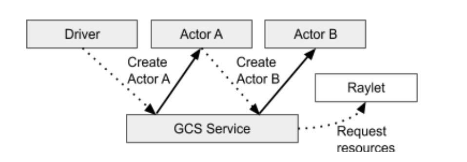

#### 1 Actor的创建过程

1. **注册到 GCS**：
   当一个 Actor 在 Python 中被创建时，负责创建的 Worker 会将 Actor 的信息同步到 GCS 并进行注册。这样可以确保在 Actor 创建完成之前，即使创建的 Worker 失败，也不会导致不一致性问题。

2. **异步创建**：
   一旦 GCS 确认了注册，Actor 的剩余创建过程会变成异步操作。创建 Actor 的 Worker 会将一个特殊任务（称为“创建 Actor 的 Task”）加入本地任务队列。

   - 这一任务类似于普通任务，但它需要为 Actor 的生命周期分配特殊的资源。

   - 创建的 Task 会被异步解析，并发送到 GCS 以进行调度。

3. **返回 Actor 句柄**：
   即使创建的 Task 尚未调度完成，Python 调用会立即返回一个“Actor 句柄”。通过这个句柄，用户可以开始调用 Actor 方法。句柄的使用不依赖于 Actor 是否已经调度完成。

4. **Detached Actor**：
   Actor 默认会在创建者退出或集群中没有任何引用时被清理（通过引用计数实现）。但 **Detached Actor** 是一个特殊的长期存在的 Actor，可通过名称访问。
   - 清除 Detached Actor 时，需要显式调用 `ray.kill(no_restart=True)` 方法。

#### 2 Actor 的任务调度与执行

- **任务提交与执行**：
  - Actor 任务通过 gRPC 提交，返回一个 Future。
  - 如果任务参数中的 `ObjectRef` 尚未准备好，Actor 任务不会执行，而是等待解析完成。
- **区别于普通任务的特点**：
  1. **资源调度**：
     Actor 的资源是在创建时一次性分配的。因此，后续提交的任务无需再次进行资源调度。
  2. **顺序执行**：
     每次对 Actor 的调用都会严格按照任务提交的顺序执行，确保顺序一致性。
- **任务结果存储**：
  Actor 方法的返回值会存储在调用者的对象存储中，与普通任务一致。

#### 3 异步 Actor

Ray 支持基于 `asyncio` 的异步 Actor，允许任务并行执行。与普通 Actor 的使用方式类似，异步 Actor 的主要区别是：

- 提交的任务会被加入到 Actor 的 `asyncio` 事件循环，而不是直接运行在当前线程。
- 在事件循环中，任务会被调度到后台的线程或线程池中并行执行。

这种设计极大地提高了 Actor 的吞吐量，同时保持了用户接口的一致性。

### 系统故障

在 Ray 中，**Worker 节点的设计是完全对等的**，其核心目标是实现高可用性和故障容忍。任何一个 Worker 节点的丢失不会影响整个集群的正常运行。相较之下，系统故障更关注于 Head 节点的稳定性，因为它承载了 GCS 的功能。为此，Ray 正在优化 GCS，使其能够运行在多个节点上，从而降低因 Head 节点故障而导致的系统中断风险。

#### 1 节点的唯一标识与故障检测：

- **唯一 ID 与心跳机制**： 每个节点在启动时会分配一个唯一的 ID，通过心跳机制实现与 GCS 和其他节点的通信。GCS 监控集群中节点的状态，并实时响应节点的连接状况。例如，GCS 会判断哪些节点在线，哪些节点已中止。
- **节点故障的处理**： 如果某个节点的心跳停止：
  1. GCS 会将该节点标记为中止。
  2. 相应的资源（例如 CPU 和内存）会被释放。
  3. 如果资源仍然可用，则 GCS 会重新启动一个新的 raylet 并分配一个新的唯一 ID 来重用这些资源。
- **网络分区的限制**： 当前，Ray 的故障检测机制尚未支持网络分区的场景。如果一个 Worker 节点因为网络问题无法与 GCS 通信，它会被判定为超时并标记为中止。

#### 2 Worker 与 raylet 的关系

- 每个 **raylet** 都会向 GCS 汇报其本地的 **Worker 进程**信息。
- **GCS 的故障广播**：
  - GCS 会将检测到的故障事件广播到整个集群。
  - Actor 的死亡也由 GCS 统一管理和处理。
- **Worker 与 raylet 的 fate-share**： Worker 进程与其所在的 raylet 共享相同的生命周期。当 raylet 停止心跳时，所有的 Worker 进程也会终止。这种设计防止了资源泄漏和系统状态不一致的情况。

#### 3 Ray 的故障处理机制

Ray 的设计目标是，在单个 Worker 进程失败的情况下，确保集群资源和系统状态的一致性，并防止资源泄漏。以下是 raylet 在检测到 Worker 失败后的处理流程：

1. **释放资源**：
   - 当 Worker 失败时，其占用的资源（例如 CPU 和内存）会被立即释放。
   - 所有与该 Worker 相关的资源请求会被取消。
2. **释放分布式内存对象**：
   - Ray 会通过 Object Directory 清理与失败 Worker 相关的内存对象引用。
   - 这些对象在分布式内存中的占用会被释放。
3. **广播故障信息**：
   - GCS 将 Worker 的故障信息广播到集群中的所有节点，确保其他任务能够正确响应。

### 应用模型故障

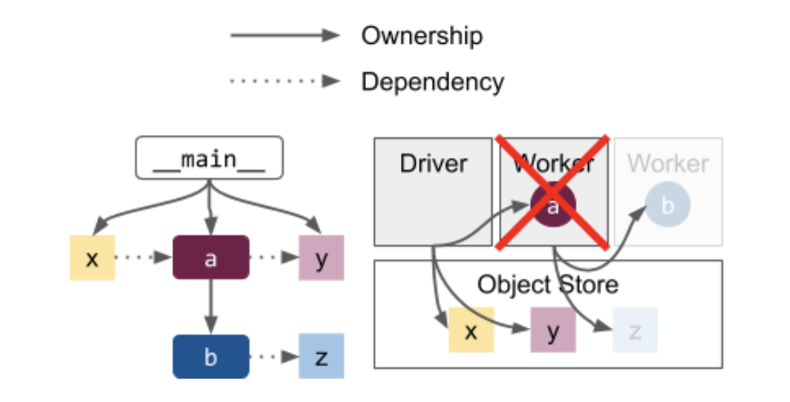

Ray 的系统故障设计体现了 **task 和 object 的生命周期与其所有者紧密绑定** 的特性。例如，在上图所示的场景中，如果 Worker `a` 发生故障，由 `a` 创建的对象（如 `b` 和 `z`，图中灰色部分）都会被统计为不可用。这种机制对系统的行为有重要意义，特别是在以下场景下：

**对象与所有者的共存关系：**

1. **对象的生命周期依赖所有者**：
   - 如果其他进程尝试获取因故障不可用的对象值，例如通过 `ray.get(z)` 访问对象 `z`，Ray 会抛出一个**应用层的异常**。这表明对象的值无法解析，因为它的所有者已经故障。
   - 对象的生命周期管理与所有者的紧密绑定确保了资源的及时回收，避免了因所有者故障而导致的状态混乱。
2. **Actor 的特殊关系**：
   - 如果对象 `b` 是由 Worker `a` 创建的 Actor，那么它的生命周期也依赖于 `a` 的正常运行。
   - Actor 的设计允许其他任务通过树状的所有权关系被隔离，从而有效限制故障的传播范围。

**隔离故障影响：**

通过让程序运行在独立的 Task 上，并形成一棵树状的子所有权结构，Ray 将故障局限在特定的子树内：

- **Driver 是所有权的根节点**： 应用程序的 Driver 是整个所有权图的根节点。任务和对象的生命周期最终依赖于 Driver 的存在。
- Detached Actor 避免共存限制：
  - 如果应用需要避免因 Driver 生命周期限制而导致的共存行为，可以使用 **Detached Actor**。
  - Detached Actor 的生命周期独立于原始 Driver，**可以超出 Driver 的生命周期范围**。
  - 它仅能通过显式调用销毁，但其子对象和子任务仍与其生命周期绑定。一旦 Detached Actor 被销毁，它所拥有的所有任务和对象也将被清理。

---

**系统优化与增强：**

Ray 正在引入多项优化以进一步提高系统的弹性和可靠性：

1. **Object Spilling**：
   - Object Spilling 允许将对象从内存中溢出到持久存储中，例如磁盘或远程存储。
   - 这种机制确保对象的生命周期能够在所有者故障后继续存在，从而实现更大的弹性。
2. **透明恢复机制**：
   - **Task 重试**：如果任务执行失败，Ray 提供了自动重试机制以恢复。
   - **Actor 重启**：对故障的 Actor，Ray 支持自动重启选项。
   - **Object Reconstruction**：当分布式存储中的对象因系统故障丢失时，Ray 能够自动重新构建这些对象。

### 对象管理

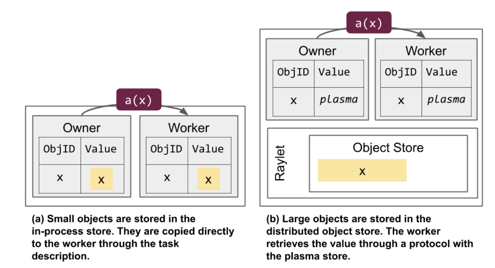

#### 1 对象存储与解析：Ray 的内存管理机制

在 Ray 中，对象的存储方式根据其大小而有所不同，设计目标是在性能和内存占用之间取得平衡：

1. **小对象**：
   - 小对象通常存储在创建它们的进程内，解析时通过直接内存拷贝操作，能够快速完成。这种方法减少了网络传输的延迟，但可能带来额外的内存占用。
   - 如果一个小对象被多个进程引用，就会产生多份对象拷贝，从而增加总内存开销。这种情况下，单个 Worker 进程的内存容量受限于所在节点的内存，以及同时引用对象的数量。
   - 对于高频引用的小对象，所有者进程的处理能力可能成为性能瓶颈，限制系统的吞吐量。
2. **大对象**：
   - 大对象存储在 **分布式对象存储**（例如 Plasma Store）中。进程中只保留一个占位符对象，标记该对象已提交到共享内存。
   - 对于这些大对象，解析过程涉及进程间通信（IPC）。如果 Worker 本地共享内存中没有该对象的拷贝，还需要通过远程过程调用（RPC）从其他节点获取数据。
   - 分布式对象存储通过共享内存机制，允许同一节点上的多个 Worker 引用同一块对象拷贝。这种“零拷贝反序列化”大大降低了内存占用，因为进程不需要额外创建本地拷贝。

#### 2 内存优化与分布式能力

Ray 的内存管理机制充分利用了共享内存和分布式存储的优势，使得系统可以高效地处理内存密集型任务：

1. **共享内存与零拷贝反序列化**：
   - 在同一节点上，多个 Worker 可以通过共享内存访问同一个对象，而不需要创建独立的拷贝。
   - 这种机制不仅减少了内存使用，还允许 Worker 进程以更高效的方式应用大对象。
2. **超越单节点内存限制**：
   - 一个进程可以引用超过单台机器内存容量的对象，因为对象的多个分片可以分布在不同的节点上。这使得 Ray 能够支持超大规模的内存使用场景。
3. **多机内存调用与调度**：
   - Ray 能够实现跨节点的对象存储与调度，通过分布式协议高效地管理多机内存资源。这使得开发者可以将 Ray 视为一个分布式大内存系统，满足内存密集型任务的需求。

#### 3 基于 Apache Arrow Plasma 的核心实现

Ray 的分布式对象存储底层基于 **Apache Arrow Plasma** 实现，Plasma 是 Ray 团队贡献给 Apache Arrow 的一部分：

- Plasma 提供了高性能的共享内存对象存储，支持零拷贝访问和分布式扩展。
- Ray 利用 Plasma 的能力，实现了多机内存的统一管理，同时提供了对象存储与调度的高效机制。

### 对象解析

#### 1 Object 的解析机制与 ObjectRef 的核心设计

在 Ray 中，**ObjectRef** 是解析对象值的关键工具。它通过精心设计的结构，支持高效的对象解析和分布式对象存储访问。ObjectRef 包含以下两个核心字段：

1. **唯一标识符**：
   - 每个 ObjectRef 都拥有一个唯一的 20 字节标识符。
   - 这个标识符是由产生该对象的任务 ID 和对象 ID 组合而成，确保在整个 Ray 集群中标识符的唯一性。
2. **所有者进程的地址**：
   - ObjectRef 包含对象所有者的详细地址信息：
     - **Worker 进程的唯一 ID**：标识具体的 Worker 进程。
     - **IP 地址和端口**：定位所有者进程所在的节点和网络位置。
     - **本地 raylet 的 ID**：便于关联到负责管理该 Worker 的 raylet。

#### 2 Object 的解析逻辑

Ray 中对象解析有两种路径：**进程内解析**和**分布式解析**。解析方式取决于对象的位置和大小。

**1. 进程内解析**：

- 场景：
  - 当 ObjectRef 的所有者进程需要解析本地对象时，系统会直接从进程内存储中读取值。
- 流程：
  - 举例：如果所有者调用 `ray.get`，系统会在进程内存储中查找对象值，并直接反序列化为可用的 Python 对象。
  - 如果所有者提交了新的任务，并且该任务需要使用 ObjectRef 指代的值作为参数，则系统会将对象值内联（直接拷贝）到任务描述中，供执行任务的 Worker 使用。
- 优点：
  - 通过直接内存拷贝，进程内解析速度极快，避免了额外的网络开销。

**2. 分布式解析**：

- 场景：
  - 当 ObjectRef 被其他进程引用，或者对象值需要跨节点访问时，解析过程会切换到分布式协议。
- 流程：
  - 如果一个非所有者进程试图解析 ObjectRef 对应的值，系统会将对象推送到 **分布式共享内存**。
  - 在分布式存储中，Ray 会通过 gRPC 通信和对象解析协议，允许非所有者进程从共享内存中获取对象的值。
- 关键点：
  - 在这种情况下，对象值会在目标节点的共享内存中保留一份副本，允许后续访问时直接通过本地共享内存解析，提高访问效率。

#### 3 举例说明

1. **本地解析**：
   - Worker A 是对象所有者，调用 `ray.get`，系统直接从进程内存中取回对象并反序列化，无需跨进程或跨节点通信。
2. **分布式解析**：
   - Worker B 请求解析 Worker A 所有的 ObjectRef。
   - 如果 Worker A 的本地进程存储无法满足 Worker B 的请求，系统会将对象推送到共享内存，并通过分布式协议完成解析。
   - Worker B 随后从其本地共享内存中读取对象值，实现高效访问。

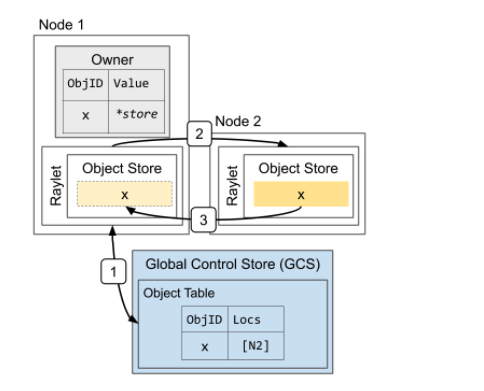

上图表示：

1. Node需要用到 `x` 变量，但本地无法满足，则去GCS中查找 `x` 所在的位置，发现其在Node2上。
2. 去Node2上查找 `x` 变量。
3. 通过远程分布式协议（gRPC）将x复制到Node1的Object Store中。

### 内存管理

在 Ray 中，当执行远程任务时，对象的计算与返回机制根据对象的大小采取不同策略：

**小对象的处理：**

- 如果任务返回的对象**很小**，执行任务的 Worker 会直接将值通过 **gRPC** 返回给调用方（Caller）。
- 该值随后被拷贝到调用者所在的进程空间，并直接可用。
- **优势**：这种方式避免了共享内存的使用和额外的分布式协议解析，减少了延迟。

**大对象的处理：**

- 如果任务返回的对象**较大**，执行任务的 Worker 不会直接返回对象值。
- 相反，Worker 会将对象存储在其本地的共享内存中（Plasma Store），并将对象的元数据（如对象 ID 和位置）反馈给调用者。
- 主拷贝（Primary Copy）：
  - 存储在执行 Worker 本地共享内存中的这一份对象被称为主拷贝。
  - 主拷贝是对象的原始存储位置，也是后续其他节点访问时的主要数据来源。

**访问主拷贝的机制：**

- 如果调用者需要使用该对象值，而它尚未被拷贝到调用者节点：
  - 调用者会通过其本地的 **raylet** 请求远程 raylet 提供对象值。
  - 对象会通过分布式协议从主拷贝所在节点传输到调用者节点，并存储在调用者的共享内存中供后续使用。
- **共享内存优势**：对象在本地节点的共享内存中只存储一次，即便被多个进程访问，也能实现内存的高效利用。

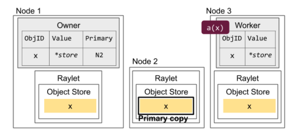

> 主拷贝和可清除的拷贝：主拷贝（在 Node 2）不能被清除。在 Node 1（通过`ray.get`创建） 和 Node 3（通过任务提交创建） 的拷贝在内存不够的情况下可以被清除。

**主拷贝的唯一性：**

- 主拷贝是对象在分布式内存系统中的**唯一原始副本**。
- 主拷贝的生命周期与其所有者的引用计数直接绑定：
  - **引用计数 > 0**：主拷贝必须保留，不能被清除。
  - **引用计数 = 0**：主拷贝可被自动回收。

**其他对象拷贝的管理：**

- 除主拷贝外，Ray 支持创建其他临时拷贝（Replica）。
- 这些临时拷贝可根据 **LRU（Least Recently Used）策略** 在内存紧张时优先被回收，释放内存空间。
- 内存不足风险：
  - 如果分布式对象存储（如 Plasma Store）中包含大量主拷贝，并且所有这些主拷贝都无法被清除，则可能导致系统在尝试存储新对象时出现 **OutOfMemoryError**。

**主拷贝的初始化与故障恢复：**

- 主拷贝通常在对象首次创建时由所有者生成并存储。
- 如果由于故障（例如节点宕机）导致主拷贝丢失，所有者会在分布式对象存储中其他位置生成新的主拷贝，确保对象的可用性。

**垃圾回收机制：**

1. **引用计数为 0 的对象**：
   - **小对象**：直接在所有者的进程内存中同步清理。
   - **大对象**：通过 Raylet 的分布式协议异步清除主拷贝及其他副本。
2. **系统内存压力管理**：
   - 临时拷贝会优先被回收。
   - 主拷贝仅在其引用计数归零后清除，从而保证任务或依赖对象的正确性。

### 引用计数

#### 1 什么是引用计数？

引用计数是一种常见的内存管理技术，用于跟踪资源（如对象、内存或磁盘空间）被引用的次数。当资源的引用计数归零时，资源即可被释放。

- **引用的含义**：
  "引用"是指程序中存在指针或变量指向某个资源。拥有该指针或变量的程序可以访问和操作该资源。
- **引用计数的作用**：
  统计有多少程序或任务可以使用该资源，从而决定资源的生命周期。

#### 2 Ray 中的引用计数机制

在 Ray 中，每个 Worker 都为其所拥有的 Object 存储引用计数，用于追踪这些对象的使用情况。

1. **所有者的本地引用计数**

   - 包括以下两部分：
     1. **本地 Python 的引用计数**：统计本地 Python 代码中引用 Object 的数量。
     2. **提交的任务对 Object 的引用计数**：统计依赖该 Object 的已提交任务数量。
   - 引用计数的递减规则：
     - **本地 Python 引用**：当 Python 中的 `ObjectRef` 被释放（如变量超出作用域）时，计数递减。
     - **任务引用**：当依赖该 Object 的任务成功完成时，计数递减。

2. **Object 的“借用”**

   - `ObjectRef` 可以通过存储到另一个 Object 中的方式传播到其他进程。

   - 当一个进程获得 `ObjectRef` 的拷贝时，这种行为称为**借用**。

   - **举例**：

     ```python
     @ray.remote
     def temp_borrow(obj_refs):
         # 暂时借用 obj_refs 的引用，就像它是本地所有者一样。
         x = ray.get(obj_refs[0])
     
     @ray.remote
     class Borrower:
         def borrow(self, obj_refs):
             # 永久借用 obj_refs 的引用。
             self.x = obj_refs[0]
     
     # 创建一个远程对象
     x_ref = foo.remote()
     
     # 通过列表传递 x_ref，允许任务在值尚未准备好时执行
     temp_borrow.remote([x_ref])
     
     # 创建一个 Borrower actor，并让它借用 x_ref
     b = Borrower.remote()
     b.borrow.remote([x_ref])  # Borrower actor 会永久借用 x_ref
     ```

     **引用的追踪机制**

     - 每当 `ObjectRef` 跨进程传递时，所有者会增加一个引用计数。例如：
       - 在调用 `temp_borrow.remote([x_ref])` 和 `b.borrow.remote([x_ref])` 时，`x_ref` 的所有者会增加一个“等待任务”的引用计数。
     - 当任务完成后，系统会通知所有者哪些引用仍在使用。例如：
       - 如果 `temp_borrow` 的任务结束且不再借用 `x_ref`，其 worker 会通知所有者引用已释放。
       - 但如果 `Borrower` actor 仍在借用 `x_ref`，则所有者会继续将 `x_ref` 的引用计数保持有效。

     **Actor 的引用特性**

     - 有状态性：Actor 可以长期保存其借用的对象，直到其生命周期结束。例如：
       - 在上面的代码中，`Borrower` actor 永久借用了 `x_ref`，因此所有者不会回收 `x_ref`，除非 `Borrower` actor 自身被销毁。
     - 借用关系的维护：
       - 如果任何 Worker 仍在借用对象引用，所有者会将该 Worker 的 ID 添加到本地维护的“借用者列表”中。
       - 借用者会维护一个独立的引用计数，且与所有者的引用计数保持同步。
       - 当所有者的引用计数为 0 时，会向借用者查询是否仍在借用该对象。如果借用者已释放引用，则所有者会将其从“借用者列表”中移除，并回收对象。

3. **递归借用的管理**

   * **借用递归传递**：
     借用者可以将 `ObjectRef` 再次传递给其他进程，形成递归借用关系。

     - 在这种情况下，当一个借用者释放引用时，它会将引用关系转移给新的借用者。

     - 所有者会跟踪递归借用链条，直到引用计数为 0 且没有新的借用者时，才会回收对象。

   * **举例**： 如果 `Borrower` actor 再将 `x_ref` 传递给另一个进程，那么新的进程会成为借用者链条中的一环。最终，当所有的借用者都释放引用时，所有者才会销毁对象

4. **小结**

   **临时借用**（如 `temp_borrow`）：引用在任务完成后即释放。

   **永久借用**（如 `Borrower` actor）：引用会被长期保留，直到 Actor 自身销毁。

   **递归借用**：引用关系可以跨进程递归传递，所有者会跟踪完整的借用链条。

   **分布式引用计数**：通过动态维护引用计数和借用者列表，确保对象生命周期的正确管理，避免资源泄漏或过早销毁。

   | 引用类型             | 描述                                                         | 何时引用更新                                                 |
   | -------------------- | ------------------------------------------------------------ | ------------------------------------------------------------ |
   | 本地 Python 引用计数 | 本地 `ObjectRef` 实例数量。等于 worker 本地进程 python 引用计数 | 当 Python `ObjectRef`分配或者释放的时候递增或者递减          |
   | 提交的任务数量       | 依赖这个 Object 的提交的还未执行的任务数量                   | 在 worker 提交任务的时候递增(例如 `foo.remote(x_ref)`)。在任务完成的时候递减。如果 Object 比较小，以任务描述符的形式储存在进程空间里，递增的操作就是 early 模式，就是任务完成的时候就递增。否则需要等待 `ray.get` 的时候才进行递增计算 |
   | 借用者               | 一组当前借用了 `ObjectRef` 的 worker ID。借用者是任何一个有 python `ObjectRef` 但是却不是这个 `ObjectRef`拥有者的 worker 。如果 worker 把 `ObjectRef` 发送给另外一个借用者，则这个借用者的 worker 也维护这个列表 | worker 在发现 `ObjectRef` 被另外一个 worker 借用的时候，会增加这个 worker 的 ID 到这个列表。例如，当 一个 actor 任务保存 `ObjectRef` 在本地的时候，调用这个 actor 的进程会增加这个 actor 的 worker ID 所有者清除的情况：所有者发送一个长运行的异步 RPC 给每个借用的 worker。如果借用者的 `ObjectRef` 为 0 ，借用者就返回结果。所有者就会清除这个 worker ID借用者清除的情况：worker 等待所有者的 RPC 返回。一旦 worker 的引用计数(本地 python 计数+提交任务计数)为 0， worker 就去除它本地的借用者的列表返回给所有者。这样，所有者就可以了解并跟踪借用者 |
   | 嵌套计数             | 在范围内或者包含`ObjectRef`的`ObjectRef`的数量               | 在另外一个 object(例如 `ray.put`或者`return x_ref`的时候 ) 并且 `ObjectRef`被储存的时候递增。当`ObjectRef`超过范围的时候递减 |
   | 线性计数             | 仅仅在重建的时候维护。依赖`ObjectRef`的任务数量。这个`ObjectRef`的值是出存在分布式内存里（也可能会因为故障丢失） | 当提交一个依赖这个 object 的任务的时候递增。当任务返回的`ObjectRef`超过范围的时候递减，或者任务完成在本进程空间返回值之后递减 |


## 资源管理和调度

在 Ray 中，资源以 "key" -> float 的键值对形式表示。为了方便起见，Ray 调度系统默认支持 CPU、GPU 和内存这几种资源类型。这意味着 Ray 能够自动检测每个节点上可用的物理资源。然而，用户也可以定义自定义的资源需求（custom resource requirements），自定义资源的名称可以是任何字符串，例如：`{"custom_resource": 1}`。

Ray 的分布式调度的核心目标是将任务的资源需求与集群中可用资源进行匹配。资源需求可以通过键值对的形式明确约束，例如：`{"CPU": 1.0, "GPU": 1.0}` 表示需要 1 个 CPU 和 1 个 GPU 的资源。这种任务只能运行在拥有至少 1 个 CPU 和 1 个 GPU 的节点上。

- 默认情况下，每个 `@ray.remote` 函数执行需要消耗一个 CPU。
- 对于 actor（例如 `@ray.remote` 的类实例），默认情况下资源需求为 `{"CPU": 0}`，因为 actor 本质上可以被设计为轻量级任务，并且用户可以灵活调整它的资源使用。

Ray 对特定的资源提供了额外支持和优化：

1. **自动检测**
   在 Ray 集群启动时，系统会自动检测每个节点的可用资源，包括 CPU、GPU 和内存。
2. **GPU 资源管理**
   如果任务或 actor 的资源需求中指定了 GPU，Ray 会自动设置 `CUDA_VISIBLE_DEVICES` 环境变量，使得该任务仅在特定 GPU 上运行。
3. **内存限制**
   资源的限制在 Ray 中并不是强制执行的（内存资源除外）。如果特别指定了 actor 的内存限制，Ray 会在每次任务执行完成后检查是否超出限制。

### 任务调度（raylet 所有者协议）

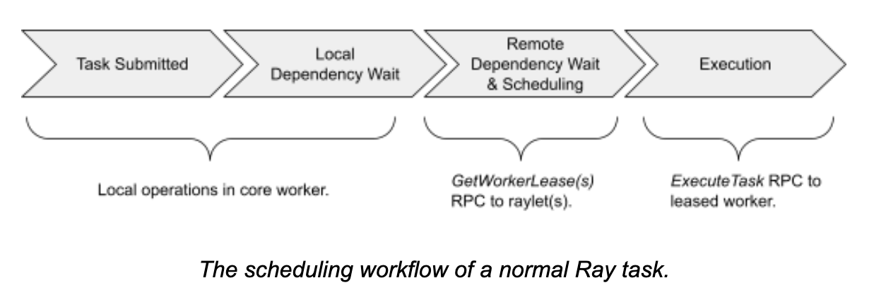

#### 1 依赖解析

在 Ray 中，任务的依赖解析是分布式调度中的关键步骤。当任务的调用者将所有任务参数准备好后，会向分布式调度器提交相应的资源需求。在多数情况下，任务的调用者也是任务参数的所有者。例如，程序 `foo.remote(bar.remote())` 中，调用者同时拥有 `bar` 和 `foo` 两个任务，并且在 `bar` 执行完成后，才会执行 `foo`。由于调用者本地存储了 `bar` 的结果，因此可以直接从本地进程存储中获取结果并继续执行。

任务的调用者有可能借用任务参数。具体而言，当任务的调用者从其他进程反序列化了一个 `ObjectRef`（对象引用）的拷贝作为参数时，该任务需要与参数的所有者协调，确定参数的创建状态。借用进程通过反序列化 `ObjectRef` 的方式与参数的所有者通信。一旦所有者确认对象已创建完成，借用者将标记对象为“可用”。如果所有者返回了创建失败的结果，借用者仍然会标记对象为“可用”，因为对象的生命周期与其所有者相同。

Ray 将任务参数分为以下三种类型：

1. **值类型**：
   - 示例：`f.remote(2)`
   - 值类型参数无需依赖解析，直接通过序列化传递即可。
2. **内嵌对象**（小对象）：
   - 示例：`f.remote(small_obj_id)`
   - 小对象通常小于 100k，可以直接存储在调用者的进程空间中。所有者能够通过任务描述直接将对象的值拷贝给任务。
3. **非内嵌对象**（大对象或未就绪对象）：
   - 示例：`f.remote(large_or_pending_obj_id)`
   - 非内嵌对象存储在分布式共享存储中，具体包括：
     - 对象的大型数据本身。
     - 对象的借用信息，包括哪些进程引用了该对象。
   - 在任务依赖的非内嵌对象本地不可用时，Ray 的调度器会等待对象在节点的本地共享存储中就绪，确保任务在分配到 Worker 后不会因为数据传输而被阻塞。这种设计保证了执行的 Worker 始终可以快速开始任务的执行。

**优化的依赖解析流程：**

1. **值类型参数**无需任何依赖解析，直接通过调用者序列化。
2. **小对象参数**可以通过任务描述直接传递，无需访问分布式存储。
3. **大对象参数**通过分布式存储进行调度。在任务被分配到 Worker 前，Ray 会确保对象已就绪，避免任务在执行时阻塞。

#### 2 资源安排

当任务的所有者首次调度任务时，它会向本地的 **raylet** 发送资源请求。Raylet 的作用是负责管理节点上的资源和任务调度。以下是任务调度的关键流程：

1. **请求入队**
   所有者发送的资源请求会被 raylet 放入一个调度请求队列中，等待调度器处理。
2. **资源分配**
   如果请求包含对特定资源的需求（如 CPU、GPU 或内存），raylet 会查找未被分配的本地资源。
   - 一旦找到符合要求的本地 **worker**（未被占用），raylet 会返回该 worker 的地址给任务的调用者。
   - 在分配的同时，raylet 确保其他客户端无法使用同一个 worker，以避免资源争抢。
3. **任务调度**
   当调用者和分配的 worker 都准备就绪时，任务会被正式分配到该 worker 上执行。
4. **公平性保障**
   为了保证资源分配的公平性，如果某个所有者在足够长的时间内（通常是几秒）未能安排任何任务执行，raylet 会释放分配给该所有者的 worker，以便将资源分配给其他需要任务执行的客户端。

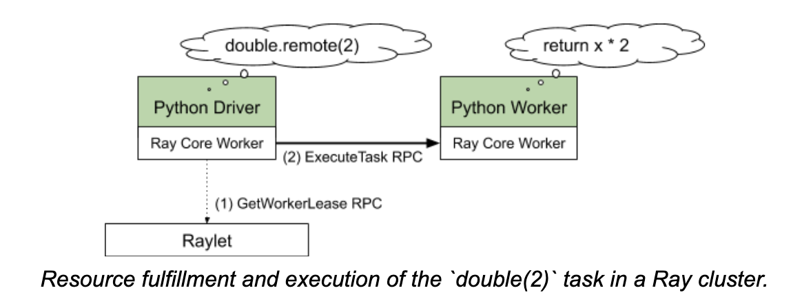

所有者可能会调度很多任务到借用的 worker，只要授权的资源是足够的。因为，借用可以理解为对同类调度请求的一种优化

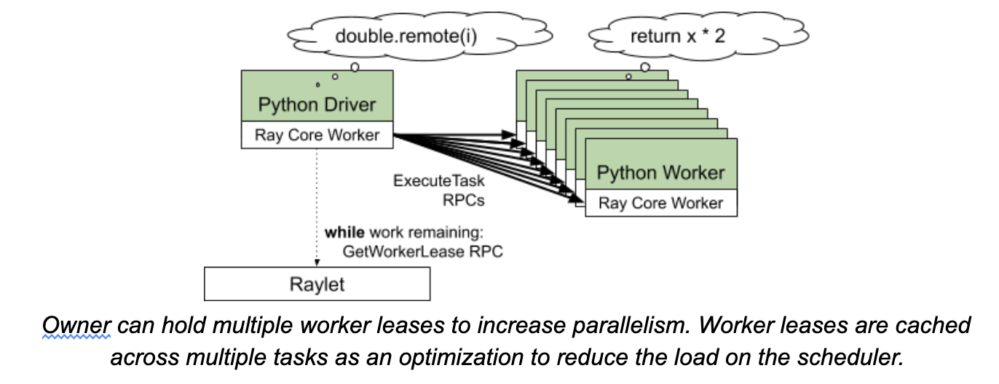

当 **raylet** 无法满足某个资源请求时，会将结果返回给所有者，并提供一个可以重新请求资源的地址。这种机制被称为 **"spillback"（溢出返回）调度**。其主要流程如下：

1. **请求被拒绝**
   当本地 raylet 判断当前节点无法满足资源需求（例如资源不足或没有空闲的 worker）时，会拒绝该请求。

2. **地址返回**
   Raylet 不会直接中断任务调度，而是将一个下一个节点（raylet）的地址返回给任务所有者。

3. **重新尝试**
   任务所有者会使用提供的地址，在新的 raylet 上重新尝试资源请求。

4. **递归溢出返回**
   溢出返回调度是一个可递归的过程。

   - 每次 raylet 无法满足资源需求时，都会返回另一个 raylet 的地址。

   - 任务的所有者会继续向链路中的下一个节点发起请求，直到找到符合条件的资源节点。

5. **一致性保障**
   在整个过程当中，所有者的任务元数据始终保持一致。这意味着即使任务经历了多次溢出返回，任务的状态、依赖和资源需求都不会丢失或出现冲突。

### 分布式调度(raylet-raylet 协议)

#### 1 资源记录(Resource accounting)

每个 raylet 都会跟踪记录在它这个节点的本地资源。当一个资源被申请成功之后，raylet 就会相应减少一个可用资源。一旦资源释放返回了（或者是因为申请者进程中止了），ralet 就会相应增加一个可用资源。这样 raylet 就可以对本地资源有一个可靠的一致性管理。

每个 raylet 在集群里也从 GCS 获得其他节点可用资源的信息。用来做分布式调度，例如在集群做负载均衡。为了减少信息搜集和传送的开销，这些信息只是做最终一致性；信息有可能过时，因为信息是通过周期性的广播来传送。每个间隔性的心跳信息（默认 100 毫秒），每个raylet 传送它当前可用资源到 GCS 服务。GCS 汇总这些心跳信息，然后重新传播到每个 raylet 节点。

#### 2 调度策略

raylet 总是先分配本地资源给请求者。当本地资源不够的时候，有三种可能性：

1. 根据之前从 GCS 获取的信息，其他节点有足够的资源。raylet 就会把请求转给其他的 raylet。
2. 没有节点有足够的资源。请求任务就会被推到本地队列，等待本地或者其他节点有资源可用。
3. 请求的资源（例如：`{"GPU":1}`）在集群里没有（集群里只有 CPU）。这样的任务就被认为是不能执行的。raylet 就会发送一个警告给相应的 driver 。 raylet 会把这个请求放入队列，等待有可用的资源。例如，集群里新增了一个 GPU 节点。

#### 3 弹性伸缩

Ray 的弹性伸缩（也被称为 Cluster Launcher），是指初始化集群节点，和根据需求增加额外的节点的能力，在 Ray 版本 `<= 1.0.1` ，弹性伸缩实现了如下能力：

1. 估计最近分配资源的使用率。例如，假设一个集群有 100/200 CPU ，和 15/25 GPU。集群的使用率就是 `max(100/200,15/25)=60%`
2. 如果使用率的估算超过了一个设定值（默认是 80%） ，弹性伸缩就会自动在集群增加节点
3. 如果一个节点空闲超过一定时间（默认是 5 分钟），这个节点就会从集群移除

### Actor 管理

#### 1 Actor 创建

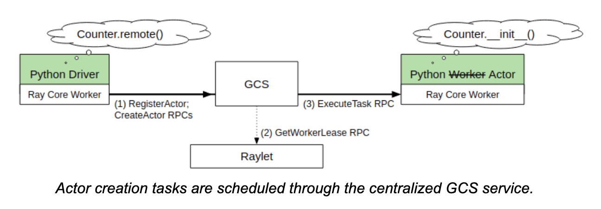

当通过 Python 代码来创建 Actor，创建的 worker 会同步注册创建 actor 的信息到 GCS。这样就能够让任何其他的 worker 在发现创建 actor 的 worker 中止情况下能够发现这个错误。

一旦所有的 actor 创建的 task 的依赖都被解析了，创建者就会把 task 信息发送给 GCS。GCS 就会采用在通常 task 用的分布式调度协议来调度这个 actor worker。因为 GCS 把所有的状态都持久化到了后台存储，一旦 task 信息成功的传递到 GCS，actor 就会最终创建完成。

最开始创建 actor 的创建者，可以通过创建返回的句柄提交 task 到这个 actor，甚至在 GCS 调度这个 actor 之前把 task 提交到另外的 task 或者 actor。一旦 actor 创建完成，GCS 绘就通过 pub-sub 订阅的方式通知所有的 worker 有一个 actor 可以使用，并且把这个 actor 的句柄也通知给所有 worker。每个 handle 都会缓冲最新的创建 actor 的运行时元数据（例如所有节点的 RPC 地址）。任何等待的任务都可以通过这个 actor 句柄提交到这个 actor 来执行。

#### 2 Actor 任务执行

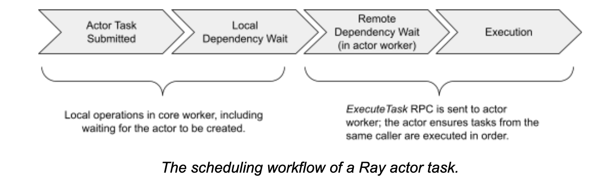

每个 Actor 都能够有不限数量的调用者。一个 Actor 句柄代表一个调用者，它包含了它引用的 actor 的 RPC 地址。通过这个句柄的调用就连接并且提交任务到这个地址。

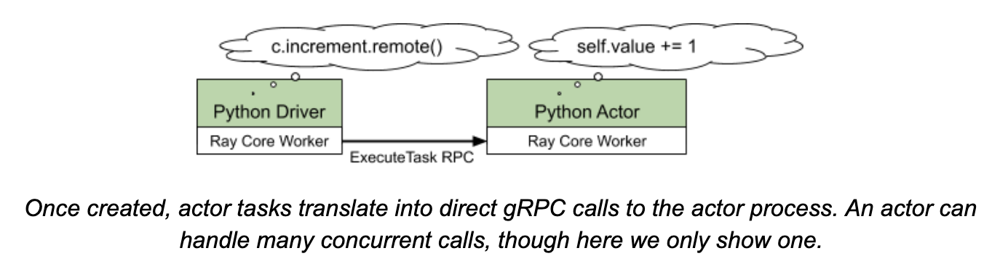

每个提交的任务都会在调用端设置一个序列号，用来确认获得每个任务都是按照提交的顺序来返回的，即使消息在传递的过程中重新排序也不会影响这个顺序。不能保证跨调用者的调用次序。例如，调用者之间的执行顺序会非常依赖消息延迟和任务依赖可用的顺序。

## 系统架构

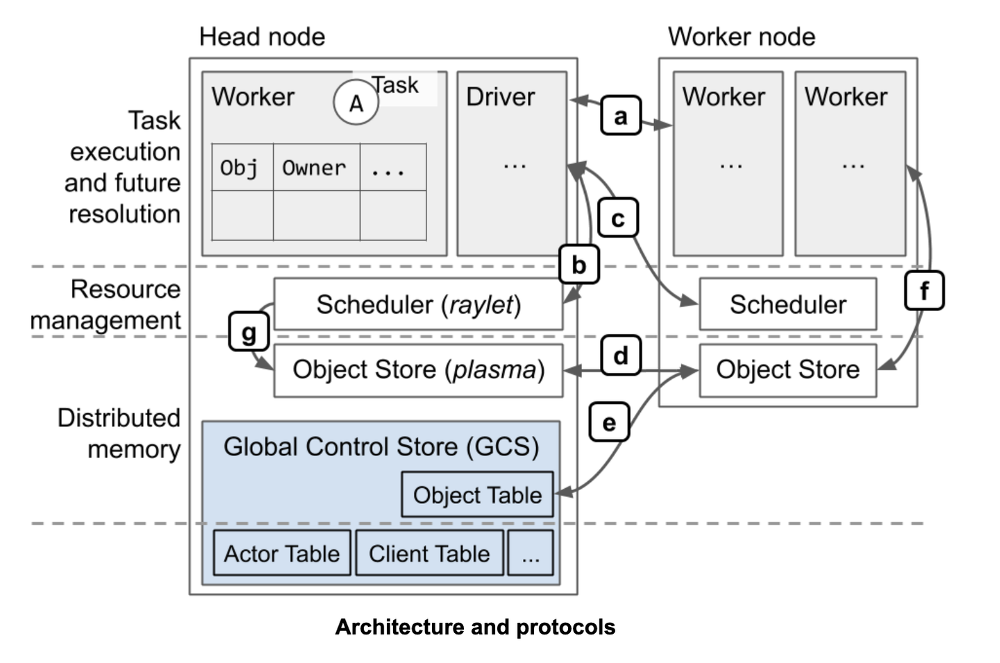

协议全貌(大部分通过 gRPC )：

- a ：任务执行，对象应用计数
- b ：本地资源管理
- c ：远程/分布式资源管理
- d ：分布式对象传输
- e ： 通过分布式对象存储获得对象地址
- f ： 存储或者恢复大对象。恢复在任务执行的时候通过 `ray.get` 来获取的，在调用 `ray.get`的时候替换任务的 ObjectID 参数为对象的值
- g ：调度从远程节点获取本地等待执行的任务的依赖的对象

### 任务调度和对象存储的示例

```python
@ray.remote
def A():
  y_id = C.remote(B.remote())
  y = ray.get(y_id)
```

在这个例子里面，任务 A 提交了任务 B 和 C，并且 C 依赖 B 的输出。为了能够更好的说明这个例子，我们假设 B 返回了一个大对象，并且 C 返回了一个小对象。这将会允许我们展示如果任务 A、B、和 C 都执行在不同的节点的时候发生了什么？

#### 1 分布式任务调度

我们开始用 worker 1 来执行 A，任务 B 和 C 已经提交到 worker 1。因此，worker 1 的本地所有权关系表已经包含了 X 和 Y。首先，我们看一下 B 的执行路径：

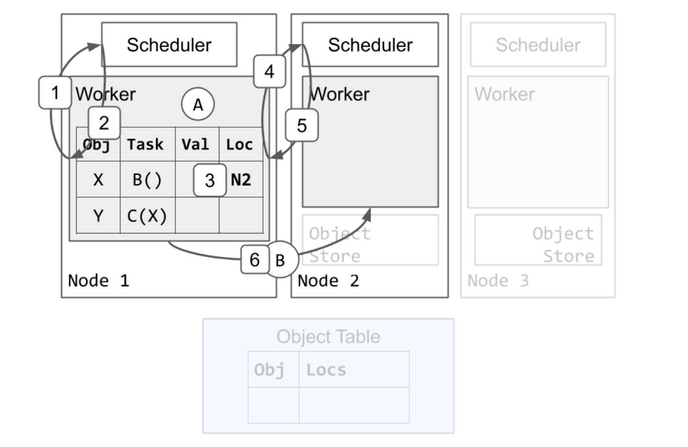

1. worker 1 向它的本地调度申请资源执行 B
2. 调度返回消息，告诉 worker 1 重试这个请求到 节点 2
3. worker 1 更新了本地的所有者关系表，把任务 B 的依赖更新到节点2
4. worker 1 询问节点2的调度，申请资源执行 B
5. 节点2的调度授权了资源给 worker 1 ，并且把 worker 2 的地址返回给了 worker 1。在 worker 1拥有这个授权资源的时候，节点2 的调度还需要确保没有分配其他的任务给 worker 2
6. worker 1 发送任务 B 到 worker 2 执行

#### 2 任务执行

接下来，我们展示一个例子，worker 执行一个任务并且储存返回结果到分布式内存：

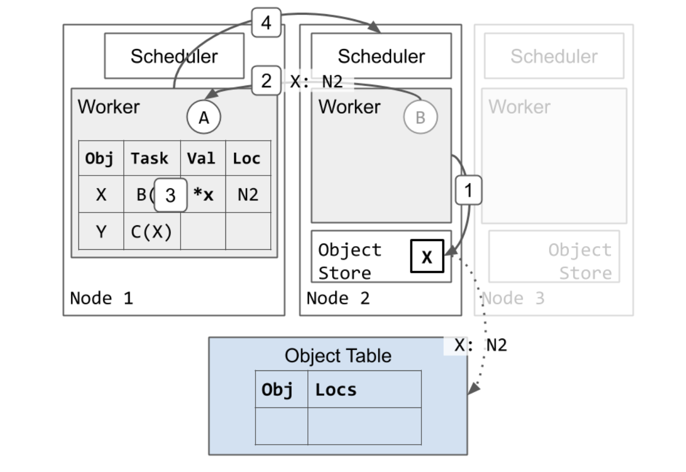

1. 如果 worker 2 执行完成 B 并且把返回的结果 X 存在它自己的本地存储
   1. 节点 2 会异步的通信对象表，记录 X 目前在节点2（虚箭头）
   2. 因为这是 X 创建的第一个拷贝，节点 2 也会固定这个 X 的拷贝，知道 worker 2 提醒节点 2 可以释放(在这里没有显示)。这样确保对象的值在引用的时候是可以拿到的


1. worker 2 返回 worker 1，任务 B 已经执行完成
2. worker 2 更新本地所有权表，标记 X 存储在分布式内存
3. worker 2 返回资源给调度 2，worker 2 这时候就可以重用，来执行其他任务。

#### 3 分布式任务调度和参数解析

现在B 已经执行完成， 任务 C 能够开始执行了。worker 1 接下来用同样调度任务 B 的协议来调度 C：

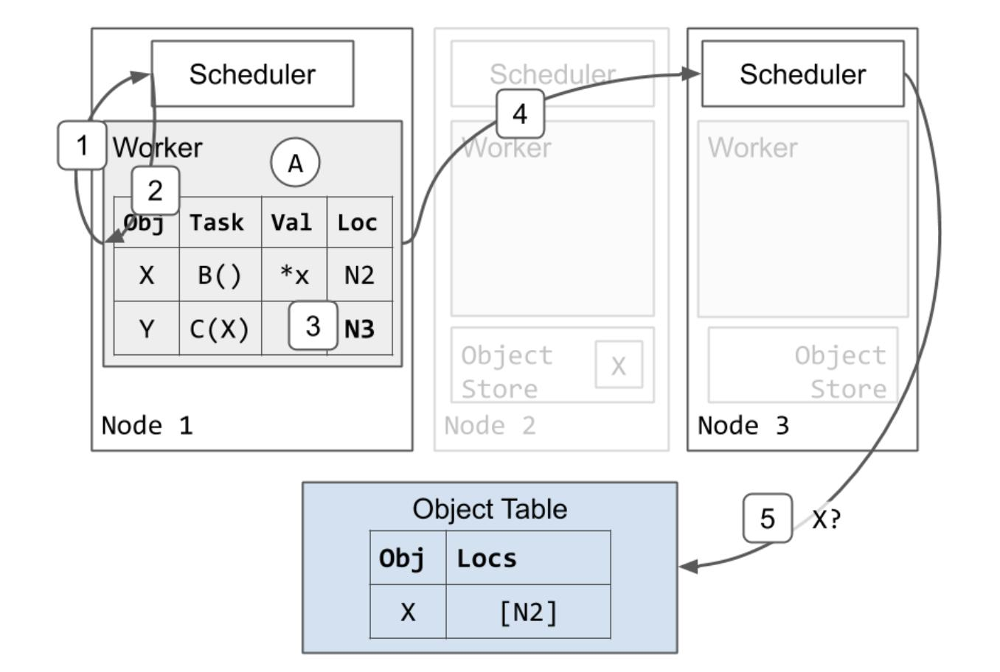

1. worker 1 向它的本地调度请求资源执行 C

2. 调度 1 返回，告诉 worker 1 重试这个调度请求到节点3

3. worker 1 更新本地的所有者表，标记 C 依赖于节点3

4. worker 1 向节点3的调度请求资源执行 C

5. 节点 3 的调度看到 C 依赖 X，但是它在本地没有 X 的拷贝。调度 3 就把 C 进入队列，同时向对象表询问 X 的地址。任务 3 需要一个 X 的本地拷贝来执行任务。

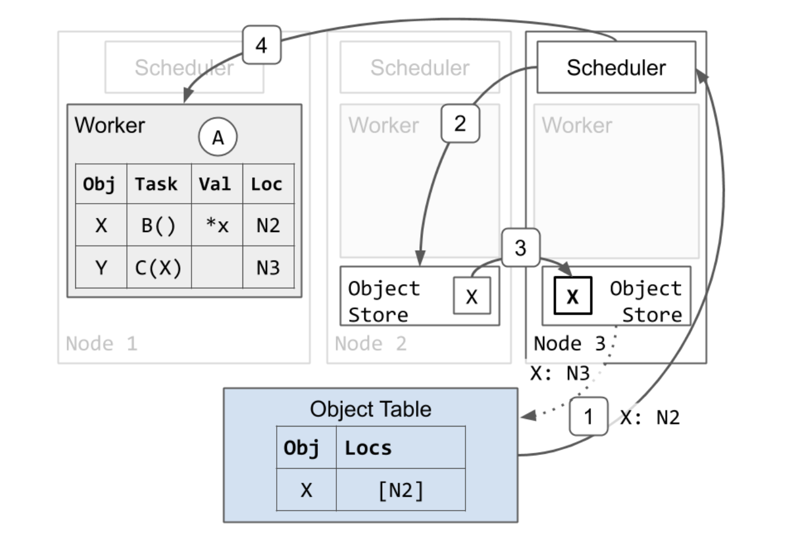

1. 对象表响应了节点 3 的信息，告诉它 X 在节点 2
2. 节点 3 的调度向节点 2 的调度申请发送一个 X 的拷贝
3. X 从节点 2 拷贝到节点 3
   1. 节点 3 也异步的更新对象表，标记 X 也同时在节点 3 存在（虚线）
   2. 节点 3 的 X 的拷贝缓存了，但是没有固定。一旦一个本地的 worker 使用了它，这个对象就不会被销毁。然后，不同于节点2 的拷贝，节点 3 的拷贝可能会因为 LRU 策略而销毁，也就是在系统处在内存紧张的时候，会清除一些不常用的内存对象数据。如果这个发生了，节点 3 还需要这个对象，它就可以重新从节点2获取获取一个不同的 X 的拷贝，方法也是和上面描述的一样

4. 因为节点 3 现在有了 X 的拷贝，调度 3 授权资源给 worker 1，并且把 worker 3 的地址返回给 worker 1

#### 4 任务执行和对象固定

任务 C 执行并且返回一个对象，这个对象是小对象能够存储在进程的内存中：

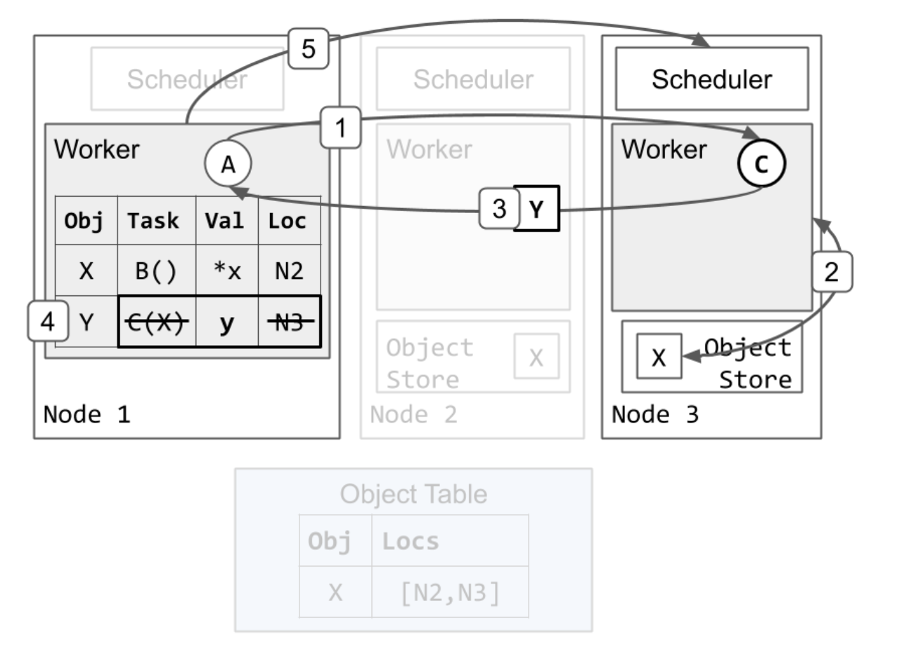

1. worker 1 发送任务 C 到 worker 3 执行。
2. worker 3 从本地对象存储中获得了 X 的值(类似于 `ray.get`操作)，并且运行 `C(X)`。
3. worker 3 执行完成 C，返回 Y。这个时候直接返回值，而不是存储在本地对象储存里面。
4. worker 1 存储 Y 在它自己的本地进程的内存空间中。同时擦除了任务 C 的描述和位置，因为 C 已经执行完成了。这时， 任务 A 调用`ray.get`将会找到并且返回在 worker 1 进程空间内存的 y 的值返回。
5. worker 1 释放资源给节点 3。 worker 3 这时就可以重用执行其他任务了。这一步也可能在第四步之前完成。

#### 5 垃圾回收

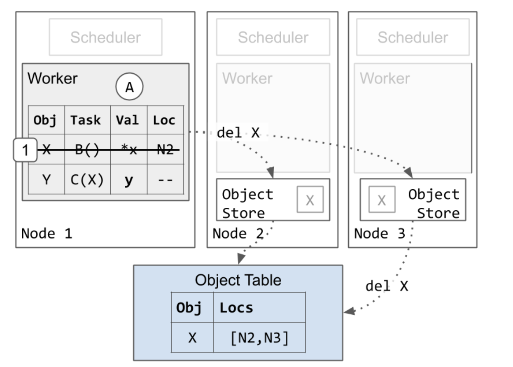

1. worker 1 擦除了它和对象 X 的入口。这样做是安全的，因为任务 C 已经执行完成，而只有 C 拥有对 X 的引用。worker 1 保留了它和 Y 的入口，因为应用还需要一个对 y 的 ObjectID 的引用
   1. 最后，所有的 X 的拷贝都在集群里被删除。这个可以在第一步之后的任何一步操作。就像上面记录的，节点 3 的 X 的拷贝也可能在第一步之后删除，如果节点 3 的对象存储存在内存紧张的情况
