>参考文档：
>
>[Ray v2 Architecture](https://docs.google.com/document/d/1tBw9A4j62ruI5omIJbMxly-la5w4q_TjyJgJL_jN2fI/preview?tab=t.0#heading=h.16g8domf57dq)
>
>[Ray -分布式计算框架架构设计详解 v2](https://www.qin.news/ray-v2/)

# 概述

## API理念

Ray 旨在为分布式计算提供一个通用的 API。实现这一目标的核心在于提供简单但通用的编程抽象，让系统处理所有复杂的工作。正是这种理念使开发者能够将 Ray 与现有的 Python 库和系统结合使用。

Ray 使用者只需通过少量的 Python 原语表达逻辑，而系统会处理物理执行相关的事务，例如并行性和分布式内存管理。Ray 用户以资源为核心来思考集群管理，而系统则根据这些资源请求自动处理调度和自动扩展。

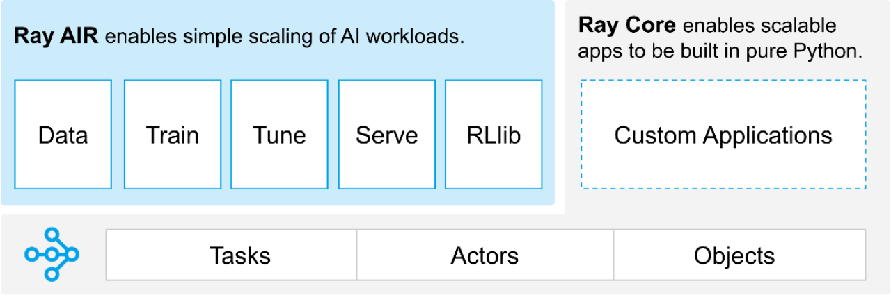

*Ray 提供了一个通用的 API，包括任务（tasks）、执行器（actors）和对象（objects），用于构建分布式应用程序*

一些应用可能需要不同的系统级权衡，这些权衡无法通过核心抽象集合来表达。因此，Ray API 的第二个目标是允许应用对系统行为进行细粒度控制。这个目标是通过一组可配置的参数来实现的，这些参数可以用来修改系统行为，例如任务调度、故障处理和应用生命周期管理。

## 系统范围

Ray 旨在促进分布式应用和库的开发与组合。具体而言，这包括粗粒度的弹性工作负载（即无服务器计算类型）、机器学习训练（例如 Ray AIR）、在线服务（例如 Ray Serve）、数据处理（例如 Ray Datasets、Modin、Dask-on-Ray）以及临时计算（例如，Python 应用的并行化，将不同的分布式框架结合在一起）。

Ray 的 API 使开发者能够轻松地在一个分布式应用中组合多个库。例如，Ray 的任务和执行器可以调用或被来自 Ray 内部的分布式训练（例如 torch.distributed）或在线服务工作负载所调用。Ray AI Runtime（AIR）就是通过在底层组合其他 Ray 库构建的。从这个意义上说，Ray 是一个出色的“分布式粘合”系统，因为它的 API 足够通用且高效，能够作为不同工作负载类型之间的接口。

## 系统设计目标

Ray 架构的核心原则是 API 简单性和通用性，而核心系统目标是性能（低开销和水平可扩展性）和可靠性。有时，我们愿意为了实现这些核心目标而牺牲其他一些理想目标，比如架构的简洁性。例如，Ray 包含分布式引用计数和分布式内存等组件，这些组件增加了架构复杂性，但它们是性能和可靠性所必需的。

在性能方面，Ray 建立在 gRPC 之上，并且在许多情况下可以匹配或超越直接使用 gRPC 的性能。与单独使用 gRPC 相比，Ray 使得应用程序更容易利用并行和分布式执行、分布式内存共享（通过共享内存对象存储）以及动态创建轻量级服务（即执行器）。

在可靠性方面，Ray 的内部协议旨在确保在故障期间的正确性，同时对常见情况添加的开销极低。Ray 实现了分布式引用计数协议，以确保内存安全，并提供了各种选项来从故障中恢复。

由于 Ray 用户将计算表达为资源而非机器，Ray 应用程序可以在无需任何代码修改的情况下，从笔记本电脑透明地扩展到集群。Ray 的分布式调度器和对象管理器被设计为支持这种无缝扩展，且开销极低。

## 相关系统

以下表格将 Ray 与几个相关系统类别进行了对比。请注意，我们省略了高级库的对比（例如 RLlib、Tune、RaySGD、Serve、Modin、Dask-on-Ray、MARS-on-Ray）；这些对比超出了本文档的范围，本文档主要关注 Ray 核心部分。您也可以参考 Ray 上的社区库完整列表。

| 模块                                         | 介绍                                                         |
| -------------------------------------------- | ------------------------------------------------------------ |
| **Cluster Orchestrators(集群协调器)**        | Ray 可以运行在 Kubernetes 或 SLURM 等集群协调器之上，提供更轻量级、语言集成的原语，即任务和执行器，而不是容器和服务。 |
| **Parallelization Frameworks(并行化框架)**   | 与 Python 并行化框架（如 multiprocessing 或 Celery）相比，Ray 提供了更通用、更高性能的 API。Ray 系统还显式支持内存共享。 |
| **Data Processing Frameworks(数据处理框架)** | 与数据处理框架（如 Spark、Flink、MARS 或 Dask）相比，Ray 提供了更低级和更狭窄的 API。这使得该 API 更加灵活，适合作为“分布式粘合”框架。另一方面，Ray 本身并不理解数据模式、关系表或流数据；这些功能仅通过库提供（例如，Modin、Dask-on-Ray、MARS-on-Ray）。 |
| **Actor Frameworks(执行器框架)**             | 与专门的执行器框架（如 Erlang 和 Akka）不同，Ray 与现有编程语言集成，支持跨语言操作并使用语言本地库。Ray 系统还透明地管理无状态计算的并行性，并显式支持执行器之间的内存共享。 |
| **HPC Systems(高性能计算系统（HPC）)**       | 许多 HPC 系统暴露了消息传递接口，这是比任务和执行器更低级的接口。这可能为应用提供更大的灵活性，但可能需要付出更多的开发努力。许多这些系统和库（例如 NCCL、MPI）还提供了优化的集体通信原语（例如 allreduce）。Ray 应用可以通过初始化 Ray 执行器组之间的通信组来利用这些原语（例如 RaySGD 与 torch 分布式结合的方式）。 |

## 2.0 带来的新特性

自 1.x 版本白皮书以来：

- **全局控制存储**（Global Control Store）现已更名为 **全局控制服务**（Global Control Service, GCS），并且进行了完全的设计更新，以简化协调和提高可靠性。
- **分布式调度器** 提供了扩展的功能和灵活性，包括调度策略和资源分配组（placement groups）。
- 在可靠性和容错性方面进行了全面改进，包括对象重建以从节点故障中恢复，以及 GCS 的容错能力。
- 扩展了管理和与 Ray 集群交互的工具集，新增了作业提交、KubeRay（Ray 在 Kubernetes 上运行）和应用可观测性等功能。


# 架构概述

## 应用概念

**任务**（Task） - 远程函数调用。这是一个在与调用者不同的进程上执行的函数调用，可能还会在不同的机器上执行。任务可以是无状态的（一个 `@ray.remote` 函数）或有状态的（`@ray.remote` 类的方法 —— 见下文的执行器）。任务是异步执行的：`.remote()` 调用会立即返回一个或多个 `ObjectRef`（即未来对象），可以用来获取返回值。

**对象**（Object） - 应用中的值。这些值由任务返回或通过 `ray.put` 创建。对象是不可变的：一旦创建就不能修改。工作进程可以通过 `ObjectRef` 引用一个对象。

**执行器**（Actor） - 有状态的工作进程（`@ray.remote` 类的实例）。执行器任务必须通过句柄提交，句柄是对特定执行器实例的 Python 引用，并且可以在执行过程中修改执行器的内部状态。

**驱动程序**（Driver） - 程序根本，或者说是“主”程序。运行 `ray.init()` 的代码就是驱动程序。

**作业**（Job） - 从同一驱动程序递归起源的任务、对象和执行器的集合，以及它们的运行时环境。驱动程序和作业之间有一一对应的关系。


## 设计

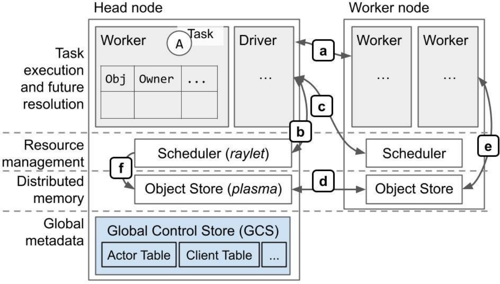

协议概览(大部分通过 gRPC):
a. 任务执行，对象引用计数。
b. 本地资源管理。
c. 远程/分布式资源管理。
d. 分布式对象传输。
e. 大型对象的存储和检索。检索是通过 `ray.get` 或在任务执行过程中进行。或者用对象的值替换一个任务的ObjectID参数时。
f. 调度器从远程节点获取对象，以满足本地排队任务的依赖满足。

### 组件

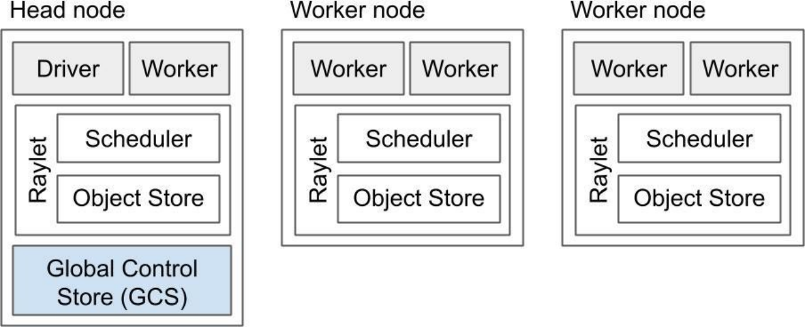

*一个Ray集群*

一个 Ray 集群由一个或多个工作节点组成，每个节点包括以下物理进程：

* **工作进程**：负责任务提交和执行。工作进程可以是无状态的（可以重复使用来执行任何 `@ray.remote` 函数）或是执行器（只能执行其 `@ray.remote` 类的方法）。每个工作进程都与特定的作业相关联。初始工作进程的默认数量等于机器上的 CPU 数量。每个工作进程存储：

  - **所有权表**：用于存储工作进程所引用对象的系统元数据，例如，存储引用计数和对象位置。

  - **进程内存存储**：用于存储小型对象。

* **Raylet**：Raylet 管理每个节点上的共享资源。与工作进程不同，Raylet 是所有并发运行的作业共享的。Raylet 包含两个主要组件，分别在不同的线程上运行：

  - **调度器**：负责资源管理、任务调度和执行任务的参数，这些参数存储在分布式对象存储中。集群中的各个调度器组成了 Ray 的分布式调度器。

  - **共享内存对象存储（也称为 Plasma 对象存储）**：负责存储、传输和溢出大对象。集群中的每个对象存储组成了 Ray 的分布式对象存储。

其中一个工作节点被指定为 **头节点**。除了上述进程，头节点还托管：

- **全局控制服务**（GCS）：GCS 是一个服务器，负责管理集群级的元数据，例如执行器的位置，以键值对的形式存储，这些键值对可能会被工作进程本地缓存。GCS 还管理一些集群级操作，包括执行器和资源分配组的调度、确定集群节点的成员资格。一般来说，GCS 管理的是较少访问但可能被集群中大多数或所有工作进程使用的元数据。这样设计是为了确保 GCS 的性能不会对应用程序性能产生关键影响。GCS 的容错性是 Ray 2.0 中的新增功能，允许 GCS 运行在任意多个节点上，而不仅仅是指定的头节点。
- **驱动程序进程**（Driver）：驱动程序是一个特殊的工作进程，用于执行顶层应用程序（例如 Python 中的 `__main__`）。驱动程序可以提交任务，但无法执行任何任务。需要注意的是，驱动程序进程可以运行在任何节点上，但默认情况下通常运行在头节点上。
- 其他集群级服务：这些服务处理作业提交、自动扩展等操作。

### 所有权关系（Ownership）

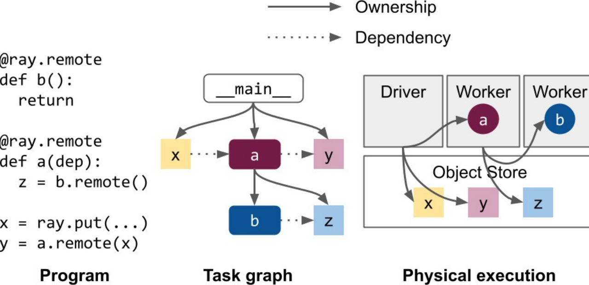

大部分系统元数据是通过一个名为“所有权”的去中心化概念来管理的。这个概念意味着应用中的每个 `ObjectRef` 将由一个单独的工作进程管理。这个工作进程或“所有者”负责确保执行创建该值的任务，并促使 `ObjectRef` 解析到其底层值。

创建 `ObjectRef` 有两种方式。在这两种情况下，所有者是调用此代码的 `x_ref` 的工作进程。

```python
x_ref = f.remote()
x_ref = ray.put()
```

换句话说，所有者是生成初始 `ObjectRef` 的工作进程。需要注意的是，这个工作进程可能与创建 `ObjectRef` 值的工作进程不同。例如，如果 `ObjectRef` 是由任务返回的，那么值将由远程工作进程创建。

**所有权的好处（与 Ray 版本 <0.8 中使用的更集中式设计相比）：**

- **低任务延迟**（约 1 个往返时延，<200 微秒）。频繁访问的系统元数据局部化在需要更新它的进程中。
- **高吞吐量**（每个客户端约 10,000 个任务/秒；在集群中线性扩展至百万任务/秒），因为系统元数据通过嵌套的远程函数调用自然分布在多个工作进程中。
- **简化架构**。所有者集中处理所需的逻辑，以安全地进行对象和系统元数据的垃圾回收。
- **提高可靠性**。工作进程的故障可以根据应用结构相互隔离，例如，某个远程调用的失败不会影响另一个调用。

**所有权带来的一些权衡：**

- 为了解析一个 `ObjectRef`，对象的所有者必须是可达的。这意味着对象将与其所有者共享命运。有关对象恢复和持久化的更多信息，请参见 **对象故障** 和 **对象溢出**。
- 目前，所有权无法转移。

### 内存模型

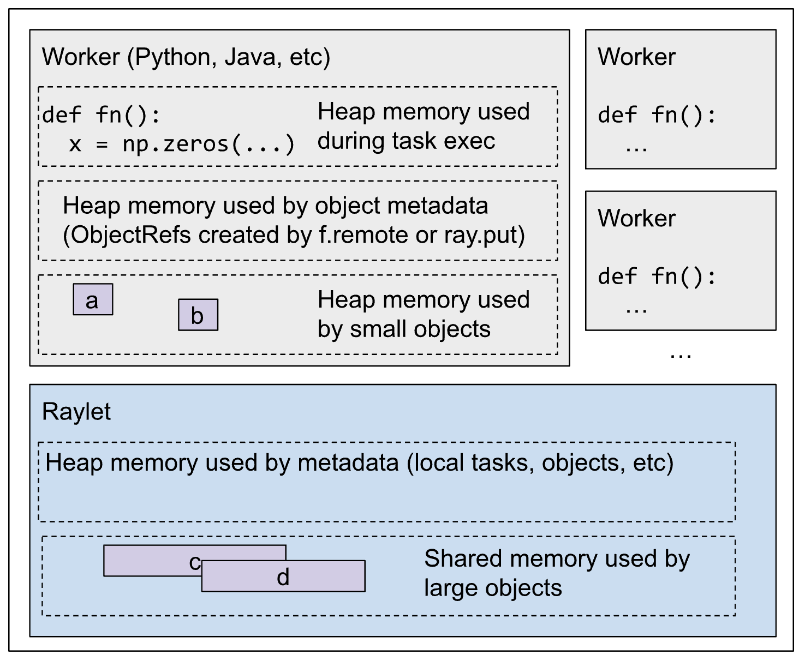

*典型的 Ray 节点使用的内存类型。GCS（未显示）包含集群级的元数据，例如节点和执行器的信息。*

Ray 可能以以下方式使用内存：

1. **Ray 工作进程在执行任务或执行器时使用的堆内存。**Ray 工作进程在执行任务或执行器时会执行用户定义的代码。由于 Ray 任务和执行器通常是并行运行的（最多与核心数量相同），应用程序开发人员应当关注每个任务的堆内存使用。如果堆内存压力过高，Ray 会首先尝试终止占用内存较多的工作进程，以保护对象存储和其他系统级进程中的系统状态。

2. **由大型 Ray 对象（由 `ray.put()` 创建或由 Ray 任务返回的值）使用的共享内存。**当工作进程调用 `ray.put()` 或从任务中返回时，它会将提供的值复制到 Ray 的共享内存对象存储中。Ray 随后会在集群中使这些对象可用，在发生故障时尝试恢复它们，如果对象存储超出其配置的容量，则将它们溢出，并在所有 `ObjectRefs` 超出作用域后进行垃圾回收。对于可以进行零拷贝反序列化的值，通过 `ray.get` 或作为任务参数传递的 `ObjectRef` 会直接返回指向共享内存缓冲区的指针给工作进程。所有其他值将会反序列化到接收工作进程的堆内存中。

3. **由小型 Ray 对象（由 Ray 任务返回的对象）使用的堆内存。**如果对象足够小（默认值为 100KB），Ray 会直接将值存储在所有者的“内存”对象存储中，而不是 Raylet 共享内存对象存储中。任何读取该对象的工作进程（例如，通过 `ray.get`）将直接将该值复制到自己的堆内存中。Ray 还通过与大对象相同的协议自动对这些对象进行垃圾回收。

4. **由 Ray 元数据使用的堆内存。**这是 Ray 分配的内存，用于管理应用程序的元数据。大部分元数据以任务规范或对象的元数据（例如引用计数）形式存在。从 Ray v2.0 开始，预计每个仍在作用域内的 `ObjectRef` 的总元数据开销为几 KB。以下是系统级进程及其预期内存占用的简要总结：

   - **GCS**：总执行器数量、总节点数量、总资源分配组数量。
   - **Raylet**：本地排队的任务数量、这些任务的对象参数数量、存储在本地共享内存或本地磁盘中的对象数量。
   - **工作进程**：已提交但仍待处理或可能通过血统重建重新执行的任务数量、所有的对象数量、在语言前端中处于作用域内的对象数量。

   >在 Ray 中，**任务规范（Task Specification，简称 Task Spec）** 是指描述一个任务的元数据和运行信息的结构化数据。它定义了任务的所有必要细节，以便 Ray 系统可以调度和执行该任务。任务规范在任务被提交时生成，并被用来协调任务的执行。
   >
   >任务规范通常包含以下内容：
   >
   >**任务的标识信息**
   >
   >- 唯一任务 ID（Task ID）：用于标识任务。
   >- 调用任务的驱动程序或工作器的信息（Owner）。
   >
   >**函数和代码信息**
   >
   >- 任务要调用的函数或方法的定义和引用。
   >- 函数的序列化版本（Pickled Function），这样其他工作器可以获取并执行它。
   >
   >**任务的输入参数**
   >
   >- 参数值：如果参数是小对象（例如标量、字符串等），它们会直接嵌入任务规范中。
   >- 对象引用（ObjectRefs）：如果参数是大对象或 Ray 对象，它们以 `ObjectRef` 的形式传递，需要从分布式对象存储中获取。
   >
   >**资源需求**
   >
   >- 任务所需的计算资源：如 CPU 核心数、GPU 数量、内存等。
   >- 特定资源标签：如果任务需要特定的节点或硬件。
   >
   >**返回值信息**
   >
   >- 返回值的 ObjectRefs：用来存储任务的输出数据。
   >
   >**依赖关系**
   >
   >- 任务执行前需要满足的依赖：如输入的 ObjectRefs 是否已完成或可用。
   >
   >**调度信息**
   >
   >- 调度策略：如任务的优先级或任务在集群中的放置策略（Placement Groups）。

### 语言运行时

所有 Ray 核心组件均使用 C++ 实现。Ray 通过一个名为“核心工作者”（core worker）的通用嵌入式 C++ 库支持 Python、Java 和（实验性）C++ 前端。该库实现了所有权表、进程内存储，并负责与其他工作进程和 raylet 的 gRPC 通信。由于该库是用 C++ 实现的，因此所有语言运行时共享 Ray 工作者协议的通用高性能实现。


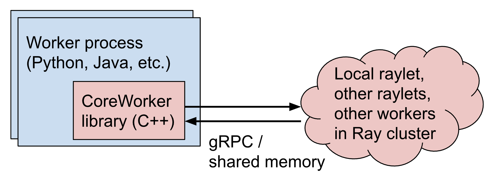

*Ray 工作进程通过 CoreWorker 库与其他 Ray 进程交互*

## Task 的生命周期

所有者负责确保已提交任务的执行，并促进返回的 `ObjectRef` 与其底层值的解析。

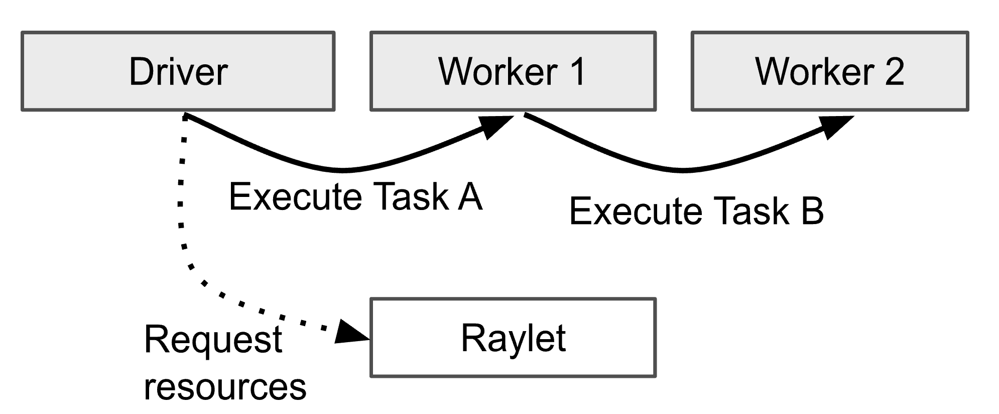

*提交任务的进程被视为结果的所有者，并负责从 raylet 获取资源以执行该任务。在此示例中，驱动程序是 `A` 结果的所有者，而 `Worker 1` 是 `B` 结果的所有者。*

所有者可以将普通 Python 对象作为任务参数传递。如果任务参数的值较小，它会直接从所有者的进程内对象存储中复制到任务规范中，以供执行的工作器引用。

如果任务的参数较大，则所有者会在底层调用 `ray.put()` 存储该对象，然后将生成的 ObjectRef 作为任务参数传递。需要注意的是，Ray 对象不会自动进行内存化或去重；如果同一个大型 Python 对象被传递给两个不同的任务，这将导致两次单独的 `ray.put()` 调用，并创建两个独立的对象。因此，如果需要将同一个对象传递给多个任务，建议显式调用 `ray.put()`。

所有者也可以将其他 ObjectRef 作为任务参数传递。当任务提交时，所有者会等待所有 ObjectRef 参数变为可用。需要注意的是，这些依赖项不需要是本地的；**一旦依赖项在集群中的任何位置可用，所有者就认为它们已经准备就绪。**如果 ObjectRef 的实际值较小，所有者会将该值直接复制到任务规范中，与小型 Python 值处理方式类似。否则，所有者会将 ObjectRef 的元数据附加到任务规范中，任务执行器必须在执行任务之前将 ObjectRef 解析为实际值。这是为了避免将大型参数传输到任务调用者。

一旦所有任务依赖项都已就绪，所有者会向分布式调度器请求资源以执行任务。分布式调度器尝试获取资源，并通过分布式内存将任务规范中的任何 ObjectRef 参数提取到本地节点。一旦资源和参数都可用，调度器批准请求并返回一个已分配给所有者的工作器地址。

>在 Ray 中，**本地节点** 是指当前任务将被调度和执行的物理或虚拟机器（节点）。具体来说，当任务被提交时，分布式调度器会尝试选择一个最合适的节点来执行任务，这个节点就被称为任务的本地节点。

>Q：假设任务是由节点A分发给节点B执行的，那么调度器是位于节点A，调度器如何知道节点B上的资源准备情况？
>
>调度器通过 **GCS** 和各节点的 **Raylet** 获取全局和本地资源状态。即使任务是由节点 A 提交给节点 B，调度器也能实时了解节点 B 的资源准备情况，并确保任务的顺利分配和执行。这种设计结合了中心化（GCS 提供全局视图）和去中心化（Raylet 管理本地资源）的架构，使 Ray 能够高效调度任务并动态适应资源变化。

所有者通过 gRPC 将任务规范发送给已分配的工作器以调度任务。在执行任务后，工作器必须存储返回值。如果返回值较小，工作器会将这些值直接内联返回给所有者，所有者会将其复制到自己的进程内对象存储中。如果返回值较大，工作器会将对象存储在其本地共享内存存储中，并回复所有者，指示这些对象现在位于分布式内存中。类似于将 ObjectRef 作为任务参数传递，这允许所有者引用返回值，而无需将它们提取到本地节点。

当首次调用 Ray 任务时，其定义会被序列化并存储在 GCS 中。随后，被分配的工作器会获取序列化的函数定义，并对其进行反序列化以运行任务。

任务可能会因错误而终止。Ray 将任务错误分为两种类型：

1. 应用层错误：这是指在 worker 进程仍然存活的情况下，任务因错误而终止。例如，一个在 Python 中抛出 `IndexError` 的任务。
2. 系统层错误：这是指 worker 进程意外死亡的情况。例如，一个进程发生段错误（segfault）或 worker 的本地 raylet 崩溃。

由于应用层错误导致的任务默认不会自动重试。错误会被捕获并作为任务的返回值存储。在 Ray 2.0 中，用户可以传递一个应用层异常的白名单，允许 Ray 自动重试这些特定的异常。由于系统层错误导致的任务则可能会自动重试，直到达到指定的重试次数。

## Object 的生命周期

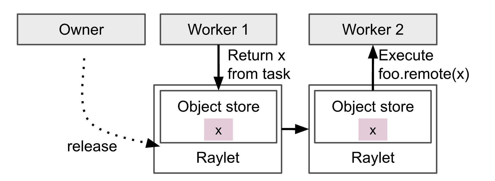

对象是一个不可变的值，可以在 Ray 集群中的任何地方存储和引用。对象的所有者是创建初始 `ObjectRef` 的 worker，通常是通过提交创建任务或调用 `ray.put`。所有者负责管理对象的生命周期。Ray 保证，如果所有者存活，最终可以解析对象的值（如果 worker 失败，则抛出错误）。如果所有者已死亡，即使对象仍有物理副本，尝试获取对象的值时也会抛出异常。

每个 worker 为其拥有的对象存储引用计数。有关如何跟踪引用的更多信息，请参见引用计数。引用仅在以下操作中计数：

- 将 `ObjectRef` 或包含 `ObjectRef` 的对象作为参数传递给任务。
- 从任务中返回 `ObjectRef` 或包含 `ObjectRef` 的对象。

对象可以存储在所有者的进程内存存储中，也可以存储在分布式对象存储中。进程内存存储分配在所有者的堆上，并且不强制执行容量限制。这是因为 Ray 只在此存储中存储小对象；如果作用域内的小对象过多，可能会导致所有者进程因内存不足而被杀死。存储在分布式对象存储中的对象首先存储在共享内存中。**共享内存对象存储强制执行用户可配置的容量限制（默认为机器 RAM 的 30%），并在达到容量时将对象溢出到本地磁盘。**这个决策旨在减少每个对象的内存占用和解析时间。

当没有发生故障时，只要对象仍然在作用域内（引用计数非零），所有者保证最终会有至少一个副本的对象变得可用。有关更多详细信息，请参见内存管理。

有两种方法可以将 `ObjectRef` 解析为其值：

- 对 `ObjectRef(s)` 调用 `ray.get`。
- 将 `ObjectRef` 作为参数传递给任务。执行任务的 worker 会解析 `ObjectRef` 并用解析后的值替换任务参数。

当对象很小的时候，它可以通过直接从所有者的进程内存存储中检索来解析。大对象存储在分布式对象存储中，必须使用分布式协议进行解析。有关更多详细信息，请参见对象解析。

当没有发生系统级故障时，解析保证最终会成功，但可能会抛出应用级异常。如果发生故障，解析可能会抛出系统级异常（例如，ray.exceptions.WorkerCrashedError），但永远不会挂起。如果对象存储在分布式内存中，并且所有副本因 raylet 故障而丢失，Ray 会尝试通过重建自动恢复丢失的对象。如果所有者进程死亡，对象也会失败。

## Actor 的生命周期

Actor 的生命周期和元数据（例如，IP 地址和端口）由 GCS 管理。每个 Actor 的客户端可以将这些元数据缓存到本地，并利用它通过 gRPC 直接向 Actor 发送任务。

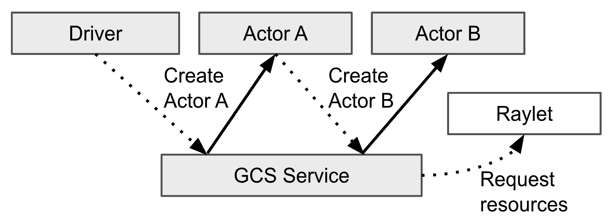

*与 Task 提交不同，Task 完全去中心化并由 Task 的所有者管理，Actor 的生命周期是由 GCS 服务集中管理的*

当在 Python 中创建一个 actor 时，创建的 worker 会构建一个特殊的任务，即 actor 创建任务，该任务运行 actor 的 Python 构造函数。创建的 worker 等待 actor 创建任务的任何依赖项变为就绪，这与非 actor 任务类似。**一旦完成，创建的 worker 会异步地将 actor 注册到 GCS**。然后，GCS 会通过调度 actor 创建任务来创建  actor。这类似于非 actor 的调度，只不过它指定的资源会在 actor 进程的生命周期内被获取。

同时，创建 actor 的 Python 调用会立即返回一个“actor handle”，即使创建任务尚未被调度，该句柄也可以被使用。随后，将 actor 句柄作为参数的任务，直到 actor 创建任务完成后才会被调度。有关更多细节，请参见 actor 创建。

对于 actor 的任务执行与普通任务类似：它们返回 **futures**，通过 gRPC 直接提交给 actor 进程，并且在所有 `ObjectRef` 依赖项解决之前不会执行。主要有两个不同点：

1. 默认情况下，执行 actor 任务不需要从调度器获取资源。这是因为在 actor 创建任务被调度时，已经为其生命周期分配了资源。

2. 对于每个调用 actor 的任务，任务将按提交的顺序执行。这是因为这些任务被假设为会修改 actor 状态。

当 actor 的创建者退出，或者集群中没有更多待处理任务或句柄时，actor 将自动清理（有关如何确定这一点，请参见引用计数）。请注意，这对于 **detached actor** 不适用，**detached actor** 是设计为长生命周期的 actor，可以通过名称引用，并且必须通过 `ray.kill(no_restart=True)` 显式清理。有关 actor 失败的更多信息，请参见 **Actor Death**。

在某些情况下，可能希望打破 actor 任务按提交顺序依次执行的要求。为支持这种用例，Ray 还提供了 actor 并发的选项，通过 **async actor**（可以使用 asyncio 事件循环并发执行任务）或 **threaded actor**（使用线程并行执行多个任务）。从调用者的角度来看，向这些 actor 提交任务与向常规 actor 提交任务是相同的。唯一的区别是，当任务在 actor 上运行时，它会被投递到后台线程或线程池中，而不是直接在主线程上运行。Ray API，如任务提交和 `ray.get`，是线程安全的，但用户需要对 actor 代码中的其他线程安全性负责。

## 故障模型

### 系统模型

Ray worker 节点被设计为同质的，因此任何单一节点的丢失都不会导致整个集群的崩溃。目前唯一的例外是头节点，因为它托管了 GCS。在 2.0 版本中，我们为 GCS 故障容错添加了实验性支持，这使得 GCS 在重启时能够最小化对集群其他部分的干扰。

所有节点都会被分配一个唯一标识符，并通过心跳与彼此通信。GCS 负责决定集群的成员资格，即当前存活的节点。GCS 会为任何超时的节点 ID 创建墓碑，这意味着必须在该节点上启动一个新的 **raylet**，并分配不同的节点 ID 才能重新利用物理资源。一个仍然存活的 **raylet** 会在听到自己超时时退出。当前节点故障检测不处理网络分区：如果一个 worker节点与 GCS 发生网络分区，它将超时并被标记为死亡。

每个 **raylet** 会将任何本地 worker进程的死亡报告给 GCS。GCS 会广播这些故障事件，并利用它们来处理 actor的死亡。所有 worker进程与其所在节点的 **raylet** 共享命运。

**raylet** 负责在单个 worker进程故障后，防止集群资源和系统状态泄漏。对于一个已经失败的 worker进程（无论是本地还是远程），每个 **raylet** 负责：

1. 释放任务执行所需的集群资源，如 CPU。这是通过终止所有分配给失败 worker的 worker来完成的（见资源履行）。任何该失败 worker提出的未完成资源请求也会被取消。
2. 释放该 worker拥有的分布式对象存储内存（见内存管理）。这也会清理与该对象相关的对象目录条目。

### 应用模型

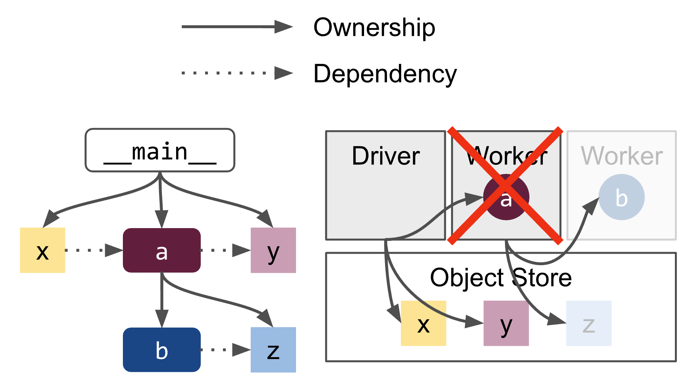

系统故障模型意味着 Ray 图中的任务和对象将与其所有者共享命运。例如，如果运行 `a` 的 **worker** 在这种情况下失败，那么它的子树中创建的任何对象和任务（灰色部分的 `b` 和 `z`）将会被收集。如果 `b` 是在 `a` 的子树中创建的 **actor**，则同样适用（见 **Actor Death**）。这有以下几个含义：

1. 任何其他存活的进程如果尝试获取此类对象的值，将会收到应用级异常。例如，如果 `z` 的 **ObjectRef** 在上述场景中已经传递给了驱动程序，驱动程序在调用 `ray.get(z)` 时将收到错误。
2. 通过修改程序将不同的任务放置在不同的子树中（即通过嵌套函数调用），可以隔离故障。
3. 应用程序将与驱动程序共享命运，驱动程序是所有权树的根节点。

避免共享命运行为的主要应用选项是使用 **detached actor**，该 **actor** 的生命周期可以超越其原始驱动程序，并且只能通过程序中的显式调用销毁。**detached actor** 本身可以拥有其他任务和对象，这些任务和对象在销毁后将与该 **actor** 共享命运。

Ray 提供了一些选项来帮助透明恢复，包括自动任务重试和 **actor** 重启。从 v1.3 版本开始，**object spilling** 也可以用来使对象在其所有者的生命周期之后依然存在。从 v2.0 开始，Ray 默认启用非 **actor** 任务的对象重建。

# Object 管理

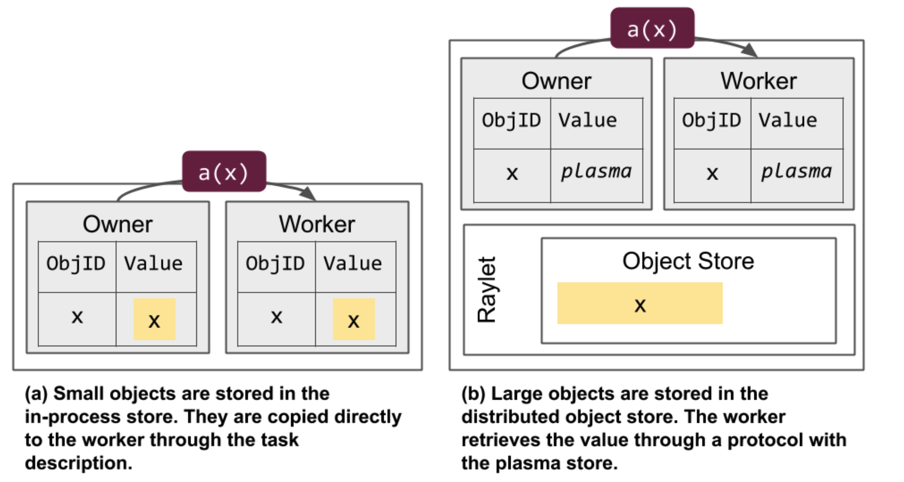

*进程内存储 vs 分布式对象存储。这展示了当提交一个依赖于对象（`x`）的任务（`a`）时，内存分配的不同方式*

一般来说，小对象会存储在其所有者的进程内存储中，而大对象则存储在分布式对象存储中。做出这个决策是为了减少每个对象的内存占用和解析时间。请注意，在后一种情况下，一个占位符对象会存储在进程内存储中，以指示该对象实际上存储在分布式对象存储中。

进程内存储中的对象可以通过直接内存拷贝快速解析，但当被多个进程引用时，可能会因额外的拷贝而导致更高的内存占用。单个 **worker** 的进程内存储容量也受限于该机器的内存容量，限制了在任何给定时刻可以引用的此类对象的总数量。对于被多次引用的对象，吞吐量可能还会受到所有者进程的处理能力的限制。

相比之下，解析分布式对象存储中的对象至少需要一次从 **worker** 到该 **worker** 本地共享内存存储的 RPC。如果该 **worker** 的本地共享内存存储还没有该对象的拷贝，可能还需要额外的 RPC。另一方面，由于共享内存存储是通过共享内存实现的，同一节点上的多个 **worker** 可以引用同一对象的拷贝。如果一个对象能够以零拷贝的方式反序列化，这可以减少总体内存占用。使用分布式内存还允许进程引用没有本地存储的对象，这意味着进程可以引用总大小超过单台机器内存容量的对象。最后，吞吐量可以随着分布式对象存储中节点数量的增加而扩展，因为多个拷贝可能存储在不同的节点上。

## Object 解析（Object resolution）

解析是将 **ObjectRef** 转换为底层物理值的过程，即在调用 `ray.get` 或将其作为任务参数传递时。**ObjectRef** 包含两个字段：

1. 一个唯一的 28 字节标识符。这是生产该对象的任务的 ID 与该任务至今创建的对象数量的整数值的拼接。
2. 对象所有者（**worker** 进程）的地址。这包括 **worker** 进程的唯一 ID、IP 地址和端口，以及本地 **raylet** 的唯一 ID。

小对象通过直接从所有者的进程内存储中复制来解析。例如，如果所有者调用 `ray.get`，**系统会从本地进程内存储中查找并反序列化该值**。如果所有者提交一个依赖任务，则通过直接将该值复制到任务规范中内联对象。同样地，如果一个借用者尝试解析该值，对象值将直接从所有者复制，跳过下节中描述的大对象解析协议。

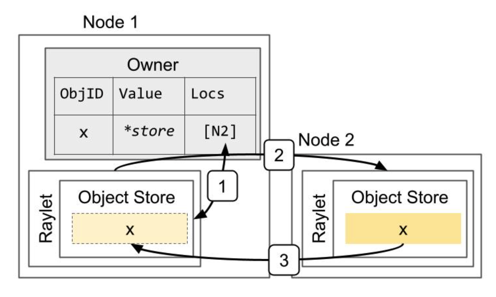

*对象 `x` 最初在节点 2 上创建，例如因为返回该值的任务在该节点上运行。以下展示了所有者（任务调用者）调用 `ray.get` 时的步骤：*

1. *在所有者处查找对象的位置。*
2. *选择一个位置并发送请求，获取该对象的拷贝。*
3. *接收对象。*

大对象存储在分布式对象存储中，必须通过分布式协议进行解析。如果该对象已经存储在引用持有者的本地共享内存存储中，引用持有者可以通过 IPC 检索该对象。这将返回指向共享内存的指针，该指针可能同时被同一节点上的其他 **worker** 引用。

如果对象在本地共享内存存储中不可用，引用持有者会通知其本地 **raylet**，然后 **raylet** 尝试从远程 **raylet** 获取该对象的拷贝。**raylet** 会从对象目录中查找位置，并请求从其中一个 **raylet** 转移该对象。自 Ray v1.3+ 版本起，对象目录存储在所有者处（之前存储在 GCS 中）。

>分布式协议和 **gRPC** 协议并不完全相同，但它们存在一些关联。Ray 的分布式协议是专门为任务调度、对象管理和资源分配设计的，而 gRPC 是 Ray 用来实现每个Woker Process之间通信的底层工具之一。

## 内存管理（Memory management）

对于远程任务，**worker** 会计算对象的值。如果该值较小，**worker** 会直接将值返回给所有者，并将其复制到所有者的进程内存存储中。一旦所有引用超出作用域，该值将被删除。

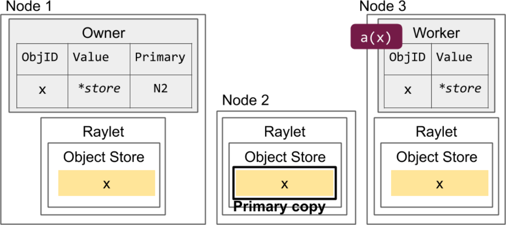

*主拷贝与可驱逐拷贝。主拷贝（节点 2）不能被驱逐。然而，位于节点 1（通过 `ray.get` 创建）和节点 3（通过任务提交创建）的拷贝，在内存压力下是可以被驱逐的。*

如果值较大，执行任务的 **worker** 会将该值存储在其本地共享内存存储中。这个共享内存对象的初始拷贝被称为主拷贝。主拷贝的特点是，只要存在作用域中的引用，它就不会被驱逐。**raylet** 通过持有指向对象存储位置的物理共享内存缓冲区的引用来“固定”主拷贝，从而防止对象存储驱逐它。与此相反，对象的其他拷贝在本地内存压力下可能会被 LRU 驱逐，除非一个 **Python worker** 正在积极使用该对象。

在大多数情况下，主拷贝是对象的第一个拷贝。如果初始拷贝因故障丢失，所有者将尝试根据对象的可用位置指定新的主拷贝。

一旦对象的引用计数降到 0，所有拷贝最终会被自动垃圾回收。小对象会立即从所有者的进程内存存储中删除。大对象则会由 **raylet** 异步从分布式对象存储中删除。

**raylet** 还管理分布式对象的传输，它根据对象当前所需的位置创建对象的附加拷贝，例如，当一个依赖该对象的任务被调度到远程节点时。

>引用计数元数据始终存储在 **对象所有者的进程内存** 中，由对象所有者完全管理。

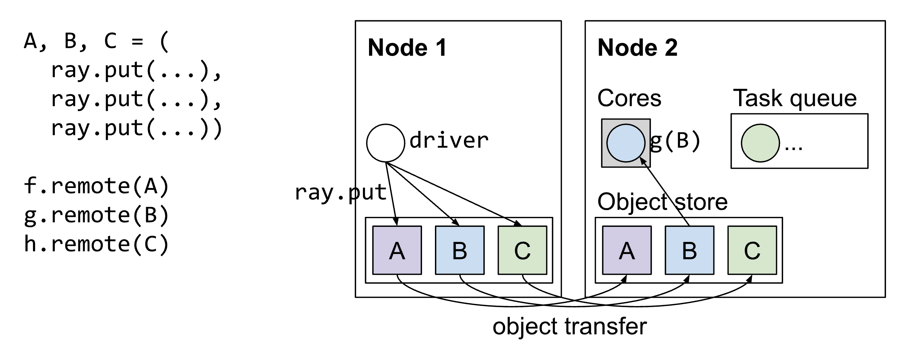

*可以存储在节点上的对象类型。对象要么由 **worker** 创建（如节点 1 上的 A、B 和 C），要么因为本地 **worker** 需要，拷贝会从其他节点传输过来（如节点 2 上的 A、B 和 C）*

因此，一个对象可能会因以下任一原因存储在节点的共享内存对象存储中：

1. 它是通过 `ray.get` 或 `ray.wait` 被本地 **worker** 进程请求的。完成 `ray.get` 请求后，这些对象可以被释放。请注意，对于可以零拷贝反序列化的对象，`ray.get` 返回的 Python 值会直接引用共享内存缓冲区，因此对象会被“固定”直到该 Python 值超出作用域。
2. 它是由先前在该节点上执行的任务返回的。只要没有更多的引用，或者对象已被溢出，这些对象就可以被释放。
3. 它是通过本地 **worker** 进程在该节点上通过 `ray.put` 创建的。只要没有更多的引用，这些对象可以被释放（例如上图中节点 1 上的对象 A、B 和 C）。
4. 它是任务的参数，该任务已排队或正在该节点上执行。这些对象可以在任务完成或不再排队后被释放。节点 2 上的对象 B 和 C 就是这种情况的例子，因为它们的下游任务 g 和 h 尚未完成。
5. 它是之前在该节点上需要的，例如由已完成的任务需要的。节点 2 上的对象 A 就是这种情况的例子，因为任务 f 已经完成。这些对象在内存压力下可能会根据本地 LRU 被驱逐。它们还会在 **ObjectRef** 超出作用域时被积极驱逐（例如，A 在任务 f 完成后被删除，且调用 `del A` 后从节点 2 中删除）。

### 内存不足的情况

对于小对象，Ray 当前没有对每个 **worker** 的进程内存存储设置内存限制。因此，作用域中小对象的数量过多可能会导致所有者进程因内存不足而被杀死。

Ray 对共享内存对象施加了硬性限制，**raylet** 负责执行该限制。下面是一个可视化图，展示了可以存储在节点上的不同类型的共享内存对象，以及它们的大致优先级。

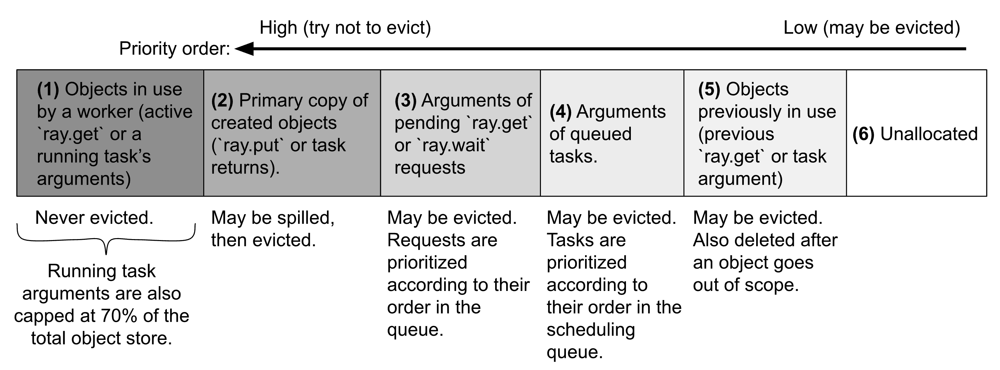

对象创建请求由 **raylet** 排队，并在（6）中有足够内存时提供服务。如果需要更多内存，**raylet** 将选择从（3）-（5）中驱逐对象以腾出空间。即使在驱逐所有这些对象之后，**raylet** 仍然可能没有足够的空间来创建新对象。这种情况发生在应用程序所需的总内存超过集群的内存容量时。

如果在驱逐后仍然需要更多空间，**raylet** 会首先在整个集群中的每个 **worker** 上触发语言特定的垃圾回收。语言前端看到的 **ObjectRef** 显得非常小，因此不太可能触发常规的语言特定垃圾回收机制（例如，Python 的 `gc.collect()`）。然而，**ObjectRef** 的实际内存占用可能非常大，因为其物理值存储在 Ray 的对象存储中，并且可能存储在与语言级 **ObjectRef** 不同的节点上。因此，当任何 Ray 对象存储达到容量时，我们会在所有 **worker** 上触发语言级的垃圾回收，以清理任何不需要的 **ObjectRef**，并允许物理值从对象存储中释放。

**raylet** 启动一个超时机制，给 **worker** 足够的时间来异步回收 **ObjectRef**，然后触发将数据溢出到外部存储。溢出允许从对象存储中释放（2）中的主拷贝，即使这些对象可能仍然被引用。如果禁用溢出，应用程序将在可配置的超时后收到 `ObjectStoreFullError` 错误。溢出可能是昂贵的，并会为任务执行添加较长的延迟；因此，Ray 也会在对象存储达到可配置的阈值（默认 80%）时主动进行溢出，以尽量确保有可用空间。

请注意，即使启用了对象溢出，对象存储仍然可能会耗尽内存。如果同时使用的对象过多（1），也可能发生这种情况。为了缓解这种情况，**raylet** 限制了正在执行的任务参数的总大小，因为任务完成之前，参数不能释放。默认的限制是对象存储内存的 70%。这确保了，只要没有其他对象因 `ray.get` 请求而被固定，任务应该能够创建一个占用对象存储 30% 容量的对象。

目前，**raylet** 并未为 **worker** 的 `ray.get` 请求固定的对象实施类似的限制，因为盲目地这样做可能会在任务之间引发死锁。因此，如果有过多的大对象同时被并发的 `ray.get` 请求，**raylet** 仍然可能会耗尽共享内存。发生这种情况时，**raylet** 会将对象回退分配为本地磁盘上的内存映射文件（默认存储在 `/tmp` 目录）。回退分配的对象由于 I/O 开销性能较差，但即使对象存储已满，它也允许应用程序继续运行。如果本地磁盘已满，回退分配将失败，应用程序将收到 `OutOfDiskError` 错误。

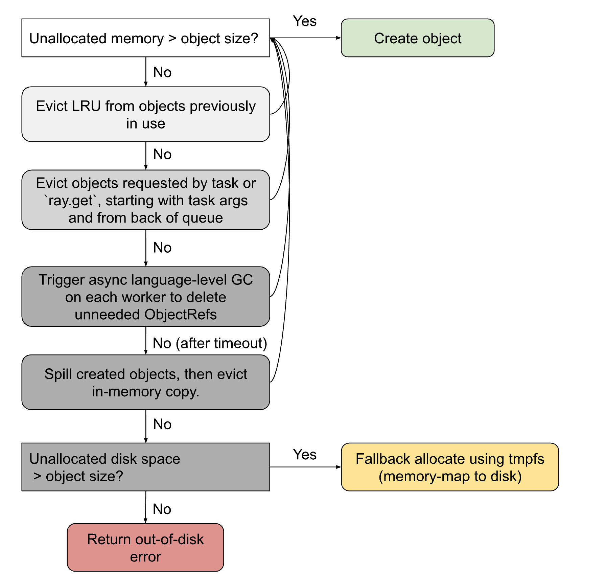

*Raylet 处理对象创建请求的流程图，如果本地对象存储中没有足够的可用内存来处理请求，**raylet** 会尝试一系列步骤以释放内存。*

### 对象溢出（Object spilling）

Ray 默认支持在对象存储容量用尽时将对象溢出到外部存储。这使得超出核心的数据处理和内存密集型分布式应用程序成为可能。

外部存储通过可插拔接口实现。默认支持两种类型的外部存储：

1. **本地存储（稳定）**：默认选择本地磁盘，以便 Ray 用户可以在无需额外配置的情况下使用对象溢出功能。
2. **分布式存储（实验性，当前支持 Amazon S3）**：访问速度可能较慢，但这可以提供更好的故障容忍性，因为数据可以在 **worker** 节点故障后生存。

对象溢出协议涉及四个组件：

* 在 **raylet** 中：

  * **本地对象管理器**：跟踪对象元数据，例如对象在外部存储中的位置，并协调 I/O 工作器与其他 **raylet** 之间的通信。

  * **共享内存对象存储**

* **I/O 工作器**：负责溢出和恢复对象的 Python 进程。

* **外部存储**：存储无法适配到对象存储内存中的 Ray 对象。

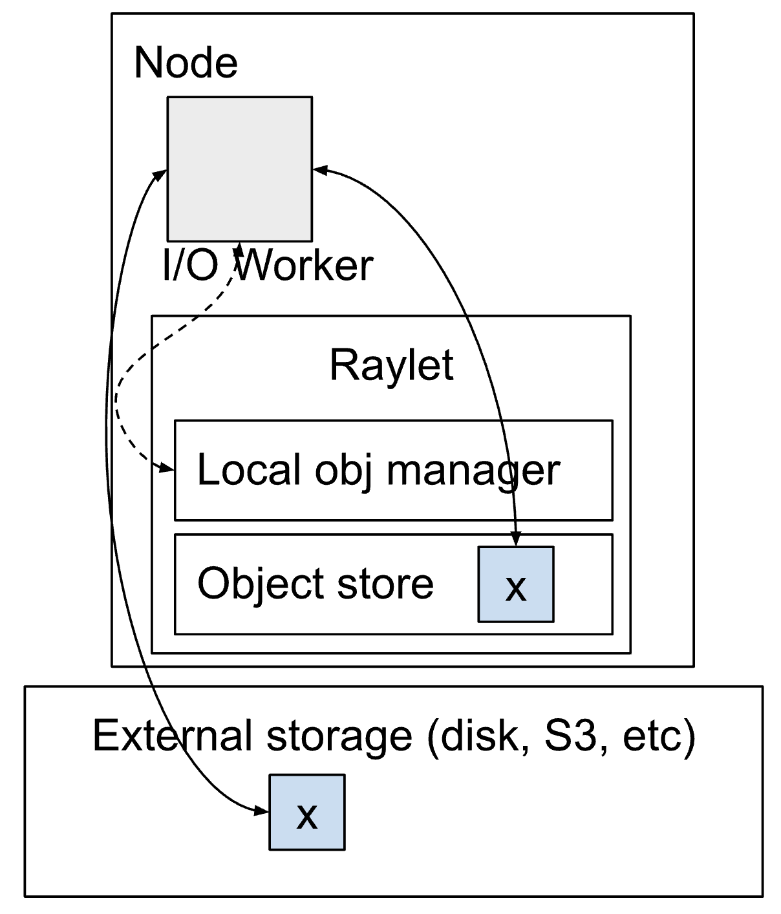

*对象溢出或恢复的设计概述，**raylet** 管理一组 I/O 工作器，I/O 工作器从本地共享内存对象存储和外部存储进行读写操作*

当 Ray 没有足够的内存容量来创建对象时，它会启动对象溢出。请注意，Ray 只会溢出对象的主副本：这是通过执行任务或通过 `ray.put` 创建的对象的初始副本。非主副本可以立即被驱逐，这种设计确保了集群中每个对象最多只有一个溢出的副本。主副本只有在对象溢出后，或者当应用程序中不再有引用时，才会被驱逐。

协议如下，重复执行，直到腾出足够的空间来创建任何待处理的对象：

1. **raylet**（本地对象管理器）在本地对象存储中找到所有主副本。
2. **raylet** 向 I/O 工作器发送这些对象的溢出请求。
3. I/O 工作器将对象值及其元数据写入外部存储。
4. 一旦主副本被溢出到外部存储，**raylet** 更新对象目录，记录溢出对象的位置。
5. 对象存储驱逐主副本。
6. 一旦对象的引用计数变为 0，所有者通知 **raylet** 可以删除该对象。**raylet** 发送请求给 I/O 工作器，从外部存储中删除该对象。

溢出对象在需要时会被恢复。当请求对象时，**Raylet** 会通过向本地 I/O 工作器发送恢复请求来从外部存储恢复该对象，或者从其他节点的 raylet 获取副本。远程 raylet 可能会将对象溢出到本地存储（例如，本地 SSD）。在这种情况下，远程 raylet 直接从本地存储读取对象并将其发送到网络。

溢出许多小对象，每个对象一个文件，这会因为 I/O 开销而效率低下。对于本地存储，操作系统会很快用尽 inode。如果对象小于 100MB，Ray 会将对象融合成一个单独的文件，以避免这个问题。

Ray 还支持多目录溢出，即利用挂载在不同位置的多个文件系统。这有助于提高溢出带宽和最大外部存储容量，尤其是在同一台机器上附加了多个本地磁盘的情况下。

**已知的限制**：

- 当使用本地文件存储时，如果存储对象的节点丢失，则溢出对象会丢失。在这种情况下，Ray 会尝试将对象恢复，就像它是从共享内存丢失的一样。
- 如果所有者丢失，则溢出对象无法访问，因为所有者存储了对象的位置。
- 当前被应用程序使用的对象是“固定”的。例如，如果 Python 驱动程序有指向通过 `ray.get` 获取的对象的原始指针（例如，指向共享内存的 numpy 数组视图），则该对象是固定的。这些对象在应用程序释放之前不能溢出。正在运行任务的参数也会在任务执行期间被固定。

>存储溢出对象的节点指的是IO Worker。

## 引用计数

每个 worker 为它拥有的每个对象存储一个引用计数。所有者的本地引用计数包括本地的 Python 引用计数以及由所有者提交的、依赖该对象的待处理任务数量。前者在 Python `ObjectRef` 被释放时递减；后者在依赖该对象的任务成功完成时递减（请注意，任务如果以应用程序级异常结束，仍然算作成功）。

`ObjectRef` 还可以通过将它们存储在另一个对象中来复制到另一个进程。接收 `ObjectRef` 副本的进程被称为借用者（borrower）。例如：

```python
@ray.remote
def temp_borrow(obj_refs):
  # 我可以临时使用 obj_refs，就像我是这个对象的所有者一样。
  x = ray.get(obj_refs[0])

@ray.remote
class Borrower:
  def borrow(self, obj_refs):
    # 我们将 ObjectRef 保存在本地状态中，这样一旦任务完成，我们依然可以借用该对象。
    self.x = obj_refs[0]

x_ref = foo.remote()  # 创建一个远程对象 foo，并返回其引用 x_ref
temp_borrow.remote([x_ref])  # 将 x_ref 作为列表传递，将允许在值准备好之前运行 `borrow` 方法。
b = Borrower.remote()  # 创建一个 Borrower 类型的 actor
b.borrow.remote([x_ref])  # x_ref 也可以被 actor 永久借用。
```

这些引用通过分布式引用计数协议进行跟踪。简而言之，当一个引用“逃离”本地作用域时，所有者会增加本地引用计数。例如，在上述代码中，当调用 `temp_borrow.remote` 和 `b.borrow.remote` 时，所有者会增加 `x_ref` 的待处理任务计数。**一旦任务完成，它会向所有者回复一个仍在借用的引用列表**。例如，在上述代码中，`temp_borrow` 的 worker 会回复表示它不再借用 `x_ref`，而 `Borrower` actor 会回复表示它仍然借用 `x_ref`。

如果 worker 仍然借用了任何引用，所有者会将该 worker 的 ID 添加到本地借用者列表中。借用者会保留第二个本地引用计数，类似于所有者，所有者会要求借用者在借用者的本地引用计数为 0 时回复。此时，所有者可以将该 worker 从借用者列表中移除并回收对象。在上述示例中，`Borrower` actor 永久地借用了该引用，因此所有者不会释放对象，直到 `Borrower` actor 本身超出作用域或死亡。

借用者也可以递归地添加到所有者的列表中。如果借用者本身将 `ObjectRef` 传递给另一个进程，就会发生这种情况。在这种情况下，当借用者回复给所有者，表示其本地引用计数为 0 时，它还会包含任何它创建的新借用者。所有者会使用相同的协议联系这些新借用者。

一个类似的协议也用于跟踪由所有者返回的 `ObjectRef`。例如：

```python
@ray.remote
def parent():
  y_ref = child.remote()
  x_ref = ray.get(y_ref)
  x = ray.get(x_ref)

@ray.remote
def child():
  x_ref = foo.remote()
  return x_ref
```

当 `child` 函数返回时，`x_ref` 的所有者（执行 `child` 的 worker）会标记 `x_ref` 被包含在 `y_ref` 中。然后，所有者会将 `parent` worker 添加到 `x_ref` 的借用者列表中。从这里开始，协议与上述相似：所有者向 `parent` worker 发送消息，要求借用者在其对 `y_ref` 和 `x_ref` 的引用超出作用域时进行回复。

| **引用类型**             | **描述**                                                     | **何时更新？**                                               |
| ------------------------ | ------------------------------------------------------------ | ------------------------------------------------------------ |
| **本地 Python 引用计数** | 跟踪工作进程中本地 `ObjectRef` 实例的数量，等于工作进程的本地 Python 引用计数。 | 当分配一个新的 Python `ObjectRef` 时增加，当一个 Python `ObjectRef` 被释放时减少。 |
| **提交任务计数**         | 跟踪依赖该对象的任务数量，这些任务尚未完成执行。             | 当工作进程提交一个依赖该对象的任务（例如 `foo.remote(x_ref)`）时增加，当任务完成时减少。如果对象足够小，可以存储在进程内存储中，则当对象被复制到任务规范中时，计数会提前减少。 |
| **借用者**               | 当前借用该 `ObjectRef` 的进程的工作进程 ID 集合。借用者是指任何具有本地 `ObjectRef` 实例但不是拥有者的工作进程。 | 当任务借用对象并通知拥有者时更新。拥有者将任务工作进程的 ID 添加到借用者集合中。当借用者的本地引用计数变为 0 时，拥有者会收到通知并移除该借用者。 |
| **嵌套计数**             | 跟踪当前 `ObjectRef` 所有的值中包含该 `ObjectRef` 的数量。   | 当 `ObjectRef` 被存储在另一个对象中（例如 `ray.put([x_ref])` 或 `return x_ref`）时增加，当外部的 `ObjectRef` 超出作用域时减少。 |
| **谱系计数**             | 跟踪依赖该 `ObjectRef` 且其值存储在分布式对象存储中的任务数量（用于对象重建）。 | 当提交一个依赖该对象的任务时增加，当任务完成或任务返回的 `ObjectRef` 超出作用域时减少。 |

>在分布式计算中，**谱系（Lineage）** 是指任务和对象之间的依赖关系图。这种图结构记录了哪些任务生成了哪些对象，以及这些任务的输入对象来源于哪些其他任务。
>
>**谱系计数（Lineage Count）** 是指一个对象或任务在依赖关系图中被引用的次数。

### 特殊情况（Corner cases）

在远程函数或类定义中捕获的引用将会被永久固定。例如：

```python
x_ref = foo.remote()
@ray.remote
def capture():
  ray.get(x_ref)  # x_ref 被捕获。只要驱动程序存在，它就会被固定。
```

创建引用的传统方法是将 `ObjectRef` 作为任务参数传递给其他 worker，可以是直接传递或者放在像列表这样的数据结构中。引用也可以通过 `ray.cloudpickle` 对 `ObjectRef` 进行序列化的方式“带外”创建。在这种情况下，Ray 无法跟踪对象的序列化副本，也无法确定何时对 `ObjectRef` 进行反序列化（例如，如果 `ObjectRef` 被非 Ray 进程反序列化）。因此，Ray 会将一个永久引用添加到对象的引用计数中，以防止对象超出作用域。

其他带外序列化方法包括使用 `pickle` 或自定义序列化方法。与上述类似，Ray 无法跟踪这些引用。访问反序列化后的 `ObjectRef`，例如通过调用 `ray.get` 或作为任务参数传递，可能会导致引用计数异常。

### 执行器句柄（Actor handles）

上述描述的相同引用计数协议也用于跟踪（非分离）actor 的生命周期。一个虚拟对象被用来代表 actor。该对象的 ID 是通过计算 actor 创建任务的 ID 得到的。actor 的创建者拥有这个虚拟对象。

当 Python actor 句柄被释放时，会减少虚拟对象的本地引用计数。当在 actor 句柄上提交任务时，会增加虚拟对象的提交任务计数。当 actor 句柄被传递到另一个进程时，接收的进程会被计为虚拟对象的借用者。一旦引用计数降到 0，拥有者会通知 GCS 服务，表示可以安全地销毁该 actor。

请注意，**detached actors 不会被 Ray 自动垃圾回收**。它们必须由应用程序显式删除。

### 与 Python GC

当对象是 Python 中引用循环的一部分时，Python 的垃圾回收器无法保证这些对象会及时被回收。由于未回收的 Python `ObjectRef` 可能会错误地导致 Ray 对象在分布式对象存储中保持活动状态，**因此 Ray 会定期在所有 Python 工作节点中触发 `gc.collect()`**，并在对象存储接近容量时执行此操作。这确保了 Python 引用循环不会导致错误的对象存储已满状态。

>Python 的垃圾回收系统由 **引用计数** 和 **循环垃圾回收（Cycle Garbage Collection）** 两部分组成，循环垃圾回收器专门用于检测和清理循环引用的问题。

## 对象失败（Object Failure）

在系统故障的情况下，Ray 将尝试恢复丢失的对象。如果无法恢复，系统将抛出一个应用级别的异常，表明某个工作节点在尝试获取对象值时遇到问题。

从高层次来看，Ray 保证如果对象的拥有者仍然存活，系统会尝试恢复该对象。如果恢复失败，拥有者会将失败的原因填充到异常中。否则，如果对象的拥有者已经去世，任何尝试获取该对象值的工作节点将收到一个关于拥有者死亡的通用错误，即使对象的副本仍然存在于集群中。

### 小对象

小对象存储在拥有者的进程内对象存储中，因此如果拥有者死亡，这些对象将丢失。任何未来尝试获取该对象值的工作节点将得知拥有者已死亡，并将错误存储在它们的本地进程内对象存储中。如果工作节点尝试访问该对象，例如通过 `ray.get()`，它将收到此错误。

### 大对象和谱系重建

如果对象丢失了分布式内存：非主副本的对象丢失不会带来后果。如果主副本丢失，拥有者将通过查找对象目录中的剩余位置来尝试指定一个新的主副本。

如果没有其他副本存在，Ray 将尝试通过对象重建来恢复该对象。对象重建是指通过重新执行创建该对象的任务来恢复丢失的对象。如果任务的依赖项也丢失，或者由于垃圾回收而先前被驱逐，那么这些对象将被递归重建。

谱系重建通过在每个对象旁边保留一个额外的“谱系引用计数”来实现。这表示依赖于该对象并且可能需要重新执行的任务数量。如果任务或其下游任务返回的任何对象仍然在作用域内，则可以重新执行该任务。一旦谱系引用计数为 0，Ray 将对创建该对象的任务规格进行垃圾回收。请注意，这是与对象值的垃圾回收机制分开的：如果对象的直接引用计数为 0，它的值将从 Ray 的对象存储中被垃圾回收，即使其谱系仍在作用域内。

需要注意的是，谱系重建可能会导致比平时更高的驱动程序内存使用量，因为会缓存谱系。每个 Ray 工作节点将在总大小超过系统阈值（默认为 1GB）时尝试驱逐其本地缓存的谱系。

谱系重建目前具有以下限制。如果应用程序不符合这些要求，则会收到一个错误，说明重建失败的原因：

1. 对象及其任何传递依赖项必须由任务（无论是执行器任务还是非执行器任务）生成。这意味着通过 `ray.put` 创建的对象是无法恢复的。需要注意的是，通过 `ray.put` 创建的对象总是存储在与其所有者相同的节点上，且所有者将与此节点共享命运；因此，如果 `ray.put` 对象的主副本丢失，应用程序将收到一个通用的 `OwnerDiedError` 错误。
2. 任务假定是确定性的且幂等的。因此，默认情况下，由执行器任务创建的对象不可重建。如果用户将执行器的 `max_task_retries` 和 `max_restarts` 设置为非零值，执行器任务则可以作为谱系的一部分重新执行。
3. 任务最多只能重新执行其最大重试次数。默认情况下，非执行器任务最多可以重试 3 次，执行器任务无法重试。可以通过非执行器任务的 `max_retries` 参数和执行器的 `max_task_retries` 参数来覆盖此设置。
4. 对象的所有者必须仍然存活（详见下文）。

如果存储在分布式内存中的对象的所有者丢失：在对象解析过程中，raylet 会尝试查找该对象的副本。同时，raylet 会定期联系所有者，以检查所有者是否仍然存活。如果所有者已死亡，raylet 会存储一个系统级错误，并在对象解析时将该错误抛给引用持有者。

# 任务管理

## 任务执行

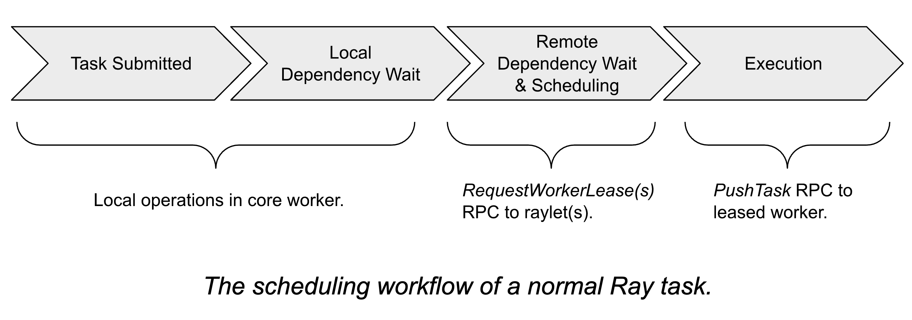

### 依赖解析

任务调用者在请求分布式调度器的资源之前，会等待所有任务参数被创建。在许多情况下，任务的调用者也是任务参数的所有者。例如，对于像 `foo.remote(bar.remote())` 这样的程序，调用者拥有这两个任务，并且在 `bar` 完成之前不会调度 `foo`。因为调用者会将 `bar` 的结果存储在其进程内存储中，所以可以在本地执行。

任务的调用者可能正在借用任务参数，即它从所有者处接收到参数的 `ObjectRef` 的反序列化副本。在这种情况下，任务调用者必须通过与参数所有者执行协议来确定参数是否已经创建。借用进程在反序列化 `ObjectRef` 时会联系所有者。当对象创建完成后，所有者会响应，借用者会将对象标记为已就绪。如果所有者失败，借用者也会将对象标记为已就绪，因为对象与其所有者共享命运。

```python
@ray.remote
def caller(refs: List[ObjectRef]):
  foo.remote(refs[0])  # 调用者借用 refs[0] 并且仅在 refs[0] 引用的对象创建后才会调度 foo
```

任务可以有三种类型的参数：普通值、内联对象和非内联对象。

普通值：`f.remote(2)` 内联对象：`f.remote(small_obj_ref)` 非内联对象：`f.remote(large_or_pending_obj_ref)`

普通值不需要依赖解析。

内联对象是足够小以存储在进程内存储中的对象（默认阈值为100KB）。调用者可以将这些对象直接复制到任务规范中。

非内联对象是存储在分布式对象存储中的对象。这些包括大对象和已被非所有者进程借用的对象。在这种情况下，调用者将请求 raylet 在调度决策时考虑这些依赖项。raylet 会等待这些对象变为本地对象后，才会授予工作节点执行依赖任务的租约。这样可以确保执行任务的工作节点在接收到任务后不会因等待对象变为本地而阻塞。

>**租约**（Lease）是一个用于管理任务、资源和对象生命周期的核心概念。它是一个由 **Raylet**（Ray 的资源管理节点）发放的权限，用于授予某个工作节点（worker node）执行任务的权利，并在任务执行期间管理资源和对象的访问。

### 资源分配

任务调用者通过首先向首选的 raylet 发送资源请求来调度任务。该 raylet 的选择方式如下：

- 通过数据本地性：如果任务有存储在共享内存中的对象参数，调用者会选择一个本地已存储最多对象参数字节数的节点。这些信息通过调用者的本地对象目录检索，可能会出现过时的情况（例如，如果对象传输或驱逐同时发生）。
- 通过节点亲和性：如果通过 `NodeAffinitySchedulingStrategy` 指定了目标 raylet。
- 默认情况下，选择本地 raylet。

首选 raylet 会排队该请求，并且如果决定授予资源，则会响应调用者，提供一个本地 worker 的地址，该 worker 现在被租赁给调用者。租约在调用者和被租赁的 worker 存活期间保持有效，并且 raylet 确保在租约有效期内，其他客户端无法使用该 worker。为了确保公平性，调用者如果没有更多任务或经过足够时间（例如几百毫秒）后，会归还空闲的 worker。

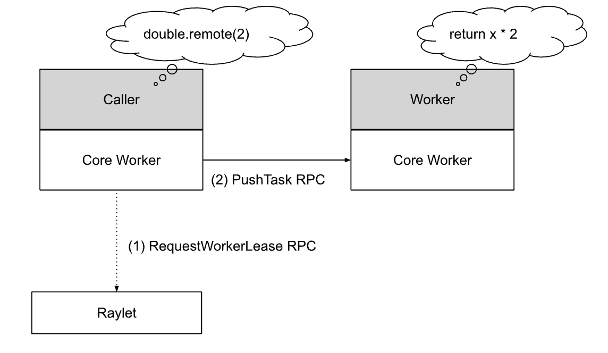

*资源分配和 `double(2)` 任务在 Ray 集群中的执行*

调用者可以将任意数量的任务调度到租用的 worker，只要这些任务与授予的资源请求兼容。因此，租约可以被看作是一种优化，避免了与调度器进行相似调度请求的通信。如果调度请求与租用的 worker 具有以下相同的条件，它可以重用该 worker：

1. 资源形状（例如，{“CPU”：1}），因为这些资源必须在任务执行期间从节点中获取。

2. 共享内存任务参数，因为这些参数必须在任务执行前在节点上本地化。请注意，小型任务参数不需要完全匹配，因为它们会内联到任务参数中。此外，在数据结构中传递的 ObjectRefs 不需要匹配，因为 Ray 在任务开始前不会将其本地化。

3. 运行时环境，因为租用的 worker 是在该环境中启动的。

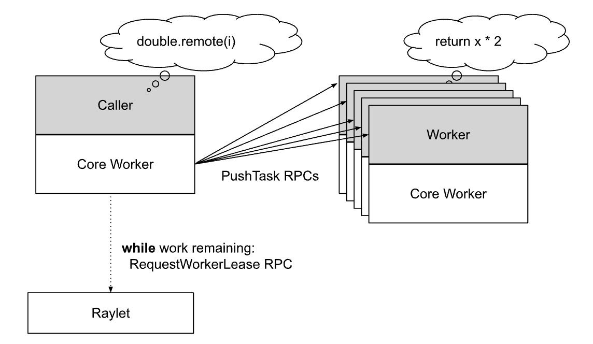

*调用者可以持有多个 worker 租约，以提高并行性。为了减少调度器的负载，worker 租约会在多个任务之间缓存，作为一种优化手段*

如果首选的 raylet 选择不在本地授予资源，它也可以通过返回一个远程 raylet 的地址来响应调用者，调用者应在该远程 raylet 上重试资源请求。这被称为溢出调度（spillback scheduling）。远程 raylet 根据其本地资源的当前可用性来决定是否授予资源请求。如果资源请求被拒绝，调用者将重新向首选的 raylet 发起请求，直到某个 raylet 授予资源请求，整个过程重复进行。

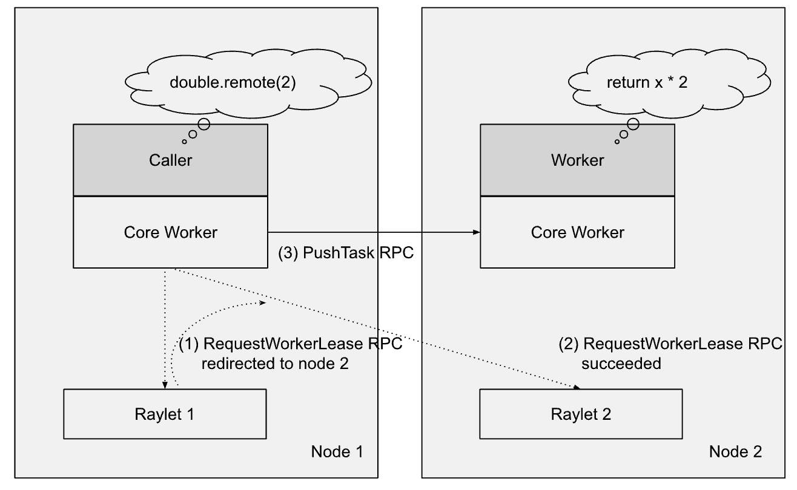

*在溢出调度期间，本地 raylet 将调用者的请求重定向到可能有可用资源的远程 raylet。*

# 资源管理和调度

在 Ray 中，资源是一个键值对，其中键表示资源名称，值是一个浮动数量。为了方便起见，Ray 调度器原生支持 CPU、GPU 和内存资源类型。Ray 资源是逻辑资源，不需要与物理资源一一对应（例如，即使物理上没有 GPU，也可以启动一个拥有 3 个 GPU 的 Ray 节点）。默认情况下，Ray 会将每个节点的逻辑资源数量设置为 Ray 自动检测到的物理资源数量。

用户还可以使用任何有效的字符串定义自定义资源要求，例如，指定一个资源要求 {“custom_resource”: 0.01}。自定义资源可以在节点启动时添加，例如，来声明某个节点具备特定的硬件功能。通过请求该自定义资源，任务或 actor 可以有效地限制在该特定节点上运行。

分布式调度器的目的是将调用者的资源请求与集群中的资源可用性进行匹配。资源请求是硬性调度约束。例如，{"CPU": 1.0, "GPU": 1.0} 表示请求 1 个 CPU 和 1 个 GPU。这个任务只能调度到具有 >= 1 个 CPU 和 >= 1 个 GPU 的节点上。**每个 `@ray.remote` 函数默认需要 1 个 CPU 执行（{"CPU": 1}）。一个 actor，即一个 `@ray.remote` 类，默认请求 0 个 CPU 执行。**这是为了让单个节点能够托管更多的 actor，而不必与核心数量一一对应，将 CPU 多路复用交给操作系统。Actor 还会请求 1 个 CPU 进行放置，意味着所选节点的总资源必须至少包含 1 个 CPU。这是为了让应用程序能够防止 actor 被调度到特定的节点，例如，可以通过启动节点时指定 `--num-cpus=0` 来实现。

有一些资源需要特殊处理：

- "CPU"、"GPU" 和 "memory" 的数量会在 Ray 启动时自动检测。
- 将 "GPU" 资源分配给任务时，会自动在 worker 中设置 CUDA_VISIBLE_DEVICES 环境变量，以将其限制为特定的 GPU ID。

需要注意的是，由于资源请求是逻辑资源，Ray 不会强制执行物理资源的限制。用户需要自行指定准确的资源要求，例如，指定 `num_cpus=n` 以便为具有 n 个线程的任务分配资源。Ray 资源要求的主要目的是用于准入控制和智能自动扩缩容。

## 分布式调度器

### 资源核算

每个 raylet 跟踪其节点上本地的资源。当资源请求被授予时，raylet 会相应地减少可用的本地资源。一旦资源被归还（或请求者死亡），raylet 会相应地增加本地资源的可用性。因此，raylet 始终保持对本地资源可用性的强一致性视图。

每个 raylet 还会从 GCS 获取关于集群中其他节点资源可用性的相关信息。这用于分布式调度，例如，进行节点间的负载均衡。为了减少收集和传播的开销，这些信息仅是**最终一致的**；它可能是过时的。这些信息通过定期广播进行传递。GCS 会定期（默认每 100 毫秒）从每个 raylet 拉取资源可用性，然后聚合并重新广播到每个 raylet。

### 调度状态机

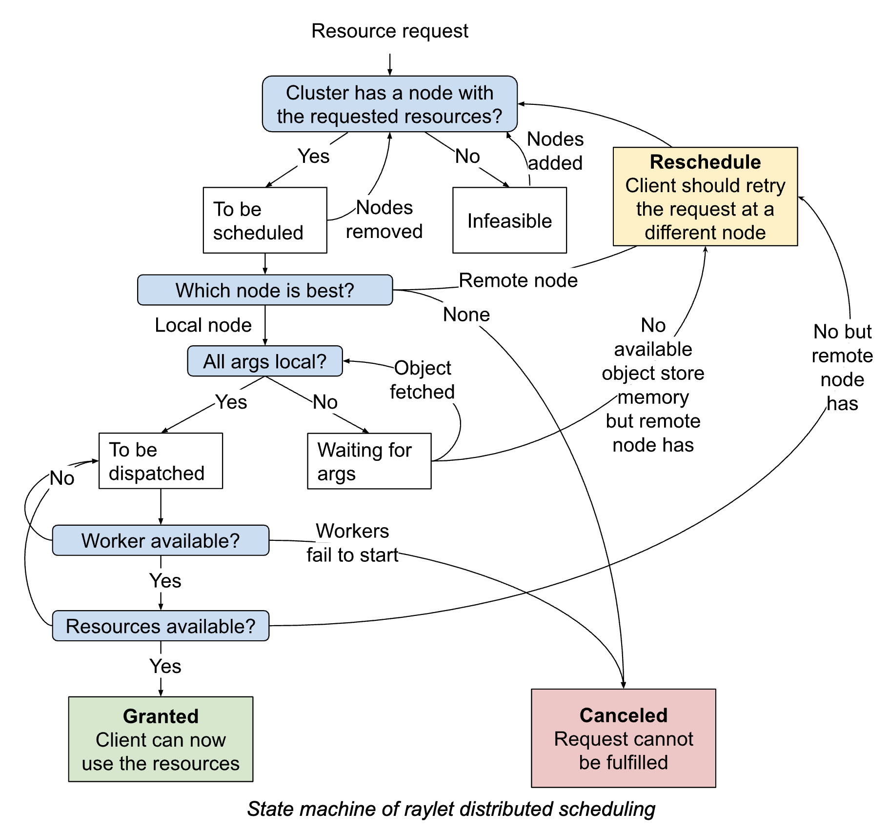

当 raylet 接收到资源请求（即 RequestWorkerLease PRC）时，它将通过上述状态机，并最终进入以下三种状态之一：

* Granted（已授权）：客户端现在可以使用授权的资源和 worker 来执行任务或 actor。
* Reschedule（重新调度）：根据当前节点对集群的视图，发现有比当前节点更合适的节点。客户端应该重新调度请求。这里有两种可能性：
  - 如果当前节点是客户端首选的 raylet（即客户端首次联系的 raylet），那么这是一个回溯请求。客户端应该在第一个 raylet 指定的 raylet 重新尝试请求。
  - 否则，当前节点是客户端首选 raylet 选择的节点。客户端应该在首选 raylet 重新尝试请求。
* Canceled（已取消）：资源请求无法执行。这可能发生在请求的调度策略不可行的情况下。例如：
  * 客户端请求了硬节点亲和性策略，但节点已经死亡。
  * 请求的任务运行时环境无法创建，因此 raylet 无法启动 worker 来满足请求。

决定“哪个节点最好”来满足请求的实际逻辑由调度策略控制，在后续小节介绍。

### 调度策略

Ray 有多种调度策略，用于控制任务或 actor 的运行位置。当任务或 actor 被提交时，用户可以选择性地指定要使用的调度策略/策略（例如，`task.options(scheduling_strategy=MySchedulingPolicy).remote()`）。

#### 默认混合策略（Default Hybrid Policy）

这是未指定其他策略时的默认策略。该策略首先尝试将任务打包到本地节点，直到该节点的关键资源利用率超过配置的阈值（默认为 50%）。关键资源利用率是该节点上任何资源的最大利用率。例如，如果一个节点正在使用 8/10 的 CPU 和 70/100GB 的 RAM，那么它的关键资源利用率为 80%。

当本地节点的利用率超过阈值后，策略会将任务打包到第一个远程节点（按节点 ID 排序），然后是第二个远程节点，依此类推，直到所有节点的关键资源利用率都超过阈值。之后，它将选择具有最低关键资源利用率的节点。

该策略的目的是在 bin-packing 和负载均衡之间实现平衡。当节点的关键资源利用率较低时，策略偏向于 bin-packing。按节点 ID 排序可以确保所有节点在进行 bin-packing 时使用相同的顺序。当节点的关键资源利用率较高时，策略偏向于负载均衡，选择负载最轻的节点。

>在 Ray 中，**bin-packing** 是一种将多个任务调度到集群中不同节点的策略。具体步骤如下：
>
>1. **任务资源需求计算**：Ray 在提交任务时，会分析任务所需的计算资源（如 CPU 数量、内存大小等）。这些需求会被当作任务的一部分传递给调度器。
>2. **节点资源的空闲情况**：Ray 集群的每个节点都有一些资源空闲，如 CPU 核心或内存。Raylet（每个节点的资源管理单元）跟踪这些资源的使用情况，并提供一个“可用资源”信息给调度器。
>3. **资源匹配和调度**：调度器会根据任务的资源需求和节点的可用资源，使用 bin-packing 算法来将任务分配到不同的节点。例如，调度器会尝试将一个任务的资源需求与节点的空闲资源匹配，尽量让节点的资源利用率最大化。

#### 分布策略（Spread Policy）

该策略使用轮询（round-robin）将任务分配到具有可用资源的节点上。需要注意的是，轮询顺序是每个节点的分布式调度器本地的；并不存在全局的轮询顺序。如果没有节点具有可用资源，任务将在所有可行节点之间以轮询方式分配。

#### 节点亲和性策略（Node Affinity Policy）

使用此策略，用户可以明确指定任务或 actor 应该运行的目标节点。如果目标节点处于活动状态，则任务或 actor 只会在该节点上运行。如果目标节点已经死亡，则根据亲和性是否为软亲和性，任务或 actor 可能会调度到其他节点，或者调度失败。

#### 数据局部性策略（Data Locality Policy）

Ray 通过让每个任务调用者根据调用者的本地信息选择一个首选 raylet 来支持数据局部性，任务参数的位置就是调用者本地信息的一部分。raylet 实现的调度策略不考虑数据局部性。这样做是为了避免增加额外的 RPC 和复杂性，来让 raylet 发现哪些任务参数存储在其他节点上。

#### 放置组策略（Placement Group Policy）

该策略将在给定的放置组所在的节点上运行任务或 actor。

## 放置组（Placement Groups）

从 1.0 版本开始，Ray 支持放置组（Placement Groups）。放置组允许用户跨多个节点原子地预留资源组（即用于 gang 调度）。每个放置组由资源包组成，例如 {CPU: 2}。组内的资源包可以尽可能地紧密打包以提高局部性（PACK），或者分散开来（SPREAD）。放置组可以被销毁，以释放与该组相关的所有资源。Ray Autoscaler 了解放置组，并会自动扩展集群，以确保可以根据需要放置待处理的放置组。

>**Gang 调度**（Gang Scheduling）是一种并行计算中的任务调度策略，通常用于需要多个任务同时运行的情况。与传统的单任务调度（如先到先服务或优先级调度）不同，**Gang 调度**旨在将一个任务集合（或多个任务）一起调度并分配到资源上，以确保这些任务能够同时启动并执行。

### 放置组创建

当应用程序请求创建放置组时，worker 会向 GCS 发送一个同步 RPC。GCS 将创建请求刷新到其后台存储，并将创建请求排入队列。

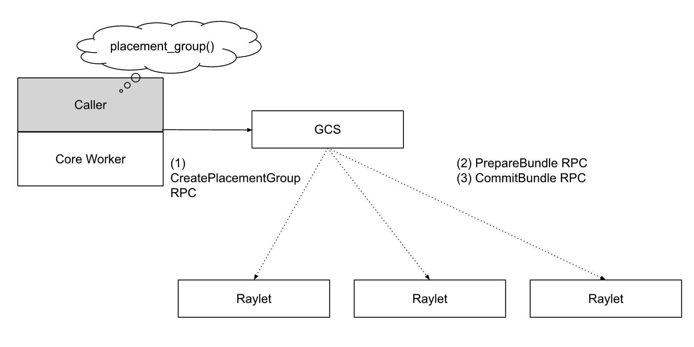

由于资源组可能涉及多个节点的资源，Ray 使用两阶段提交协议来确保原子性。该协议由 GCS 协调。如果在协议执行过程中任何 raylet 死亡，放置组创建将回滚，且 GCS 会重新排队该请求。如果 GCS 死亡且启用了 GCS 容错功能，则在 GCS 重启后，它会 ping 所有参与者，以重新启动协议。

### 放置组生命周期

与其他 Ray 原语（任务、actors、对象）不同，放置组不进行引用计数。放置组由创建它们的作业或分离的 actor 所拥有，并且在所有者死亡时会自动销毁。用户也可以通过 API `remove_placement_group` 来销毁放置组。与 actors 一样，放置组也支持分离放置组，这些放置组的生命周期超出其所有者的生命周期。

当放置组被销毁时，所有使用已预留资源的 actor 和任务都会被终止，所有预留资源都会被释放。

### 容错

当创建一个放置组时，它会在多个节点上预留资源包。当其中一个节点被终止时，丢失的资源包将以比任何待处理的放置组更高的优先级重新调度。在这些资源包重新创建之前，放置组将保持在部分分配状态。

# Actor 管理

## Actor 创建

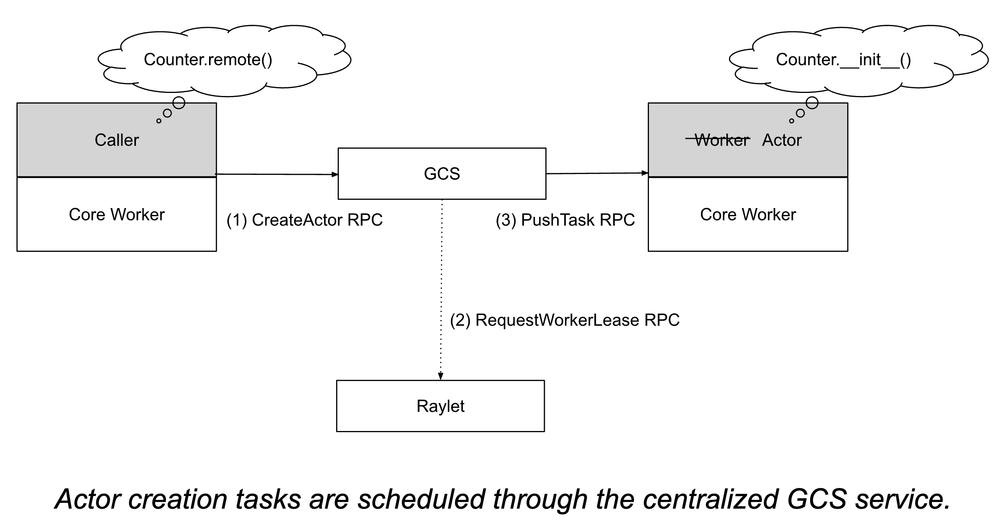

*Actor 的创建任务通过GCS服务进行集中调度。*

当在 Python 中创建一个 actor 时，创建 worker 首先会在 GCS 注册该 actor。对于分离的 actor，注册是同步进行的，以避免具有相同名称的 actor 之间的竞争条件。对于非分离的 actor（默认），注册是异步进行的，以提高性能。

注册完成后，一旦 actor 创建任务的所有输入依赖被解决，创建者将任务规范发送到 GCS 服务。然后，GCS 服务通过与普通任务相同的分布式调度协议调度 actor 创建任务，仿佛 GCS 是该任务的调用者。

在 GCS 调度 actor 创建任务之前，原始的创建者可以开始在 actor 句柄上提交任务，甚至将其作为参数传递给其他任务/actors。需要注意的是，对于异步注册，创建者在 actor 注册到 GCS 之前不会将 actor 句柄传递给其他任务/actors。这是为了防止创建者在注册完成之前死亡；通过阻塞任务提交，可以确保其他持有 actor 引用的 worker 能够发现故障。在这种情况下，任务提交仍然是异步的，因为创建者会将远程任务缓存，直到 actor 注册完成。

一旦 actor 创建完成，GCS 通过发布/订阅通知任何持有该 actor 句柄的 worker。每个句柄都会缓存新创建的 actor 的运行时元数据（例如，RPC 地址）。然后，任何在 actor 句柄上提交的待处理任务都可以发送到 actor 进行执行。

与任务定义类似，actor 定义通过 GCS 下载到 worker 上。

## Actor 任务执行

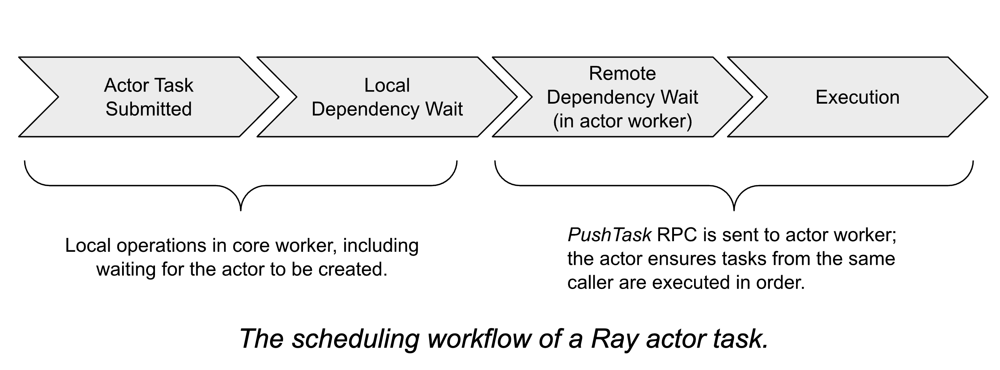

一个 actor 可以有无限数量的调用者。一个 actor 句柄代表一个单一的调用者：它包含指向该 actor 的 RPC 地址。调用的 worker 通过该地址进行连接并提交任务。

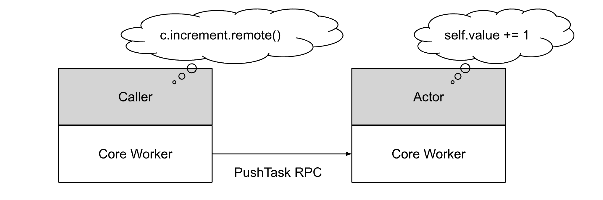

*一旦创建，执行器任务会转换为直接的gRPC调用到执行器进程。一个执行器可以处理多个并发调用，尽管这里我们只展示了一个调用*

提交的任务的执行顺序描述在[这里](https://docs.ray.io/en/releases-2.0.0/ray-core/actors/task-orders.html)。

## Actor 死亡

Actor 可以是“非分离的”或“分离的”。非分离的 Actor 是默认类型，并且推荐用于大多数用例。当所有句柄超出作用域或作业退出时，Ray会自动进行垃圾回收。

分离的 Actor 的生命周期不依赖于其原始创建者，一旦不再需要，必须由应用程序手动删除。

对于非分离的执行器，当执行器的所有待处理任务完成且所有句柄超出作用域（通过引用计数跟踪）时，执行器的原始创建者会通知GCS服务。GCS服务然后会发送一个 `KillActor RPC`  到该执行器，导致执行器退出其进程。如果GCS检测到创建者已退出（通过心跳表发布），它也会终止执行器。所有提交给该执行器的待处理和后续任务将会失败，并报出RayActorError错误。

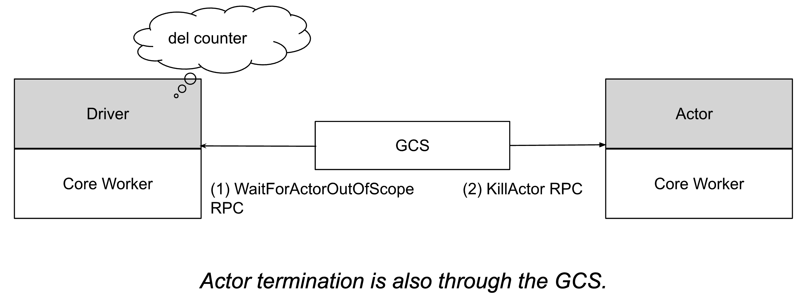

*Actor 的终止也是通过 GCS*

执行器在运行时也可能意外崩溃（例如，由于段错误或调用 `sys.exit`）。默认情况下，提交给崩溃执行器的任何任务都会失败，并报出 `RayActorError`，就像执行器正常退出一样。

Ray还提供了一个选项（`max_restarts`），允许自动重启执行器，最多重启指定次数。如果启用此选项且执行器的所有者仍然存活，GCS服务将尝试通过重新提交其创建任务来重启崩溃的执行器。所有持有该执行器句柄的客户端会将任何待处理任务缓存，直到执行器被重启。如果执行器无法重启或已达到最大重启次数，客户端将失败所有待处理任务。

第二个选项（`max_task_retries`）可用于在执行器重启后自动重试失败的执行器任务。这对于幂等任务或用户不需要自定义处理 `RayActorError` 的情况特别有用。


