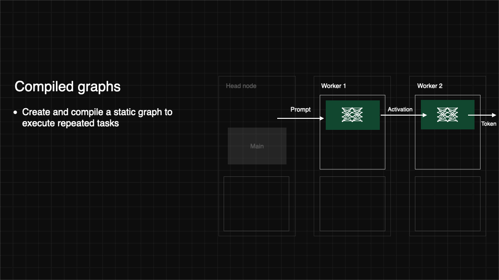
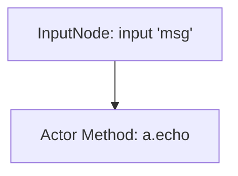
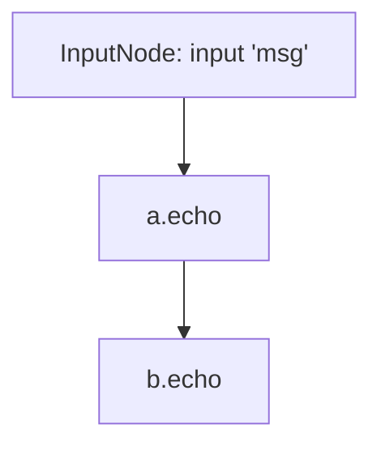
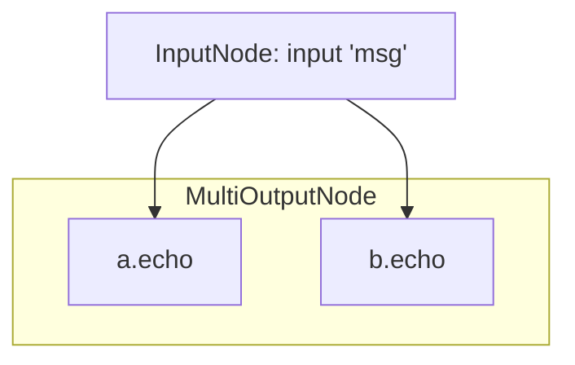
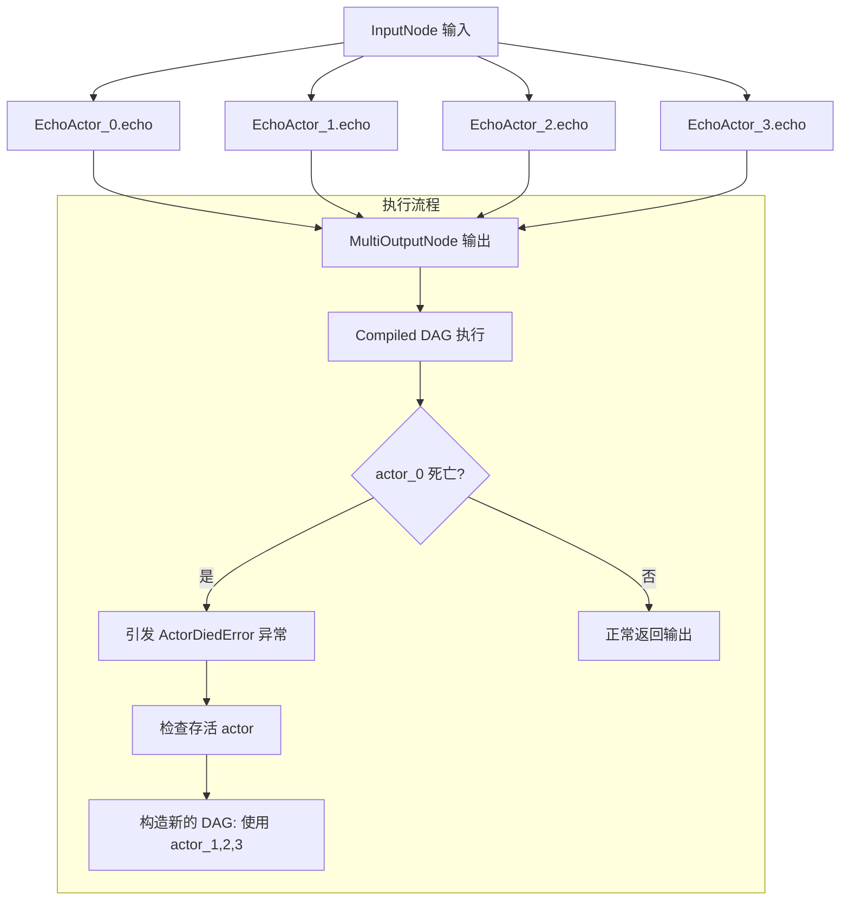
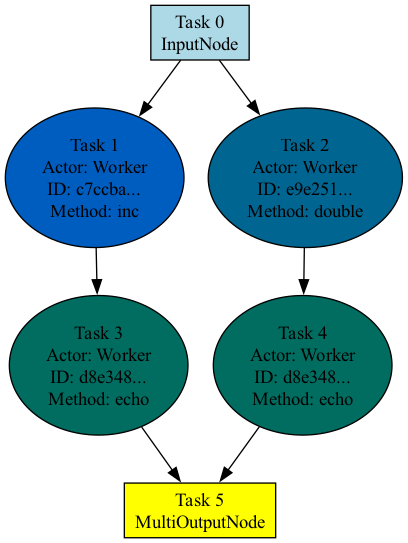

# Ray Compiled Graph：简介与实战

## 摘要

Ray Compiled Graph 是 Ray 为高性能任务（尤其是大语言模型推理）设计的全新执行模型，它在保留 Ray Core API 编程范式的同时，显著降低了系统开销（从 1 毫秒降至 50 微秒以下），并原生支持 GPU-GPU 通信。本文介绍了 Compiled Graph 的使用方式、性能对比、依赖建模、异步执行、异常处理与跨设备通信。通过 DAG（有向无环图）建模并编译任务图，Ray Compiled Graph 能提前进行资源规划、调度优化，并提升多节点 GPU 任务的吞吐量，是构建高效、可扩展 LLM 推理服务的关键能力之一。

## Compiled Graph 简介

随着大语言模型（LLM）的复杂性和规模不断增加，使用多 GPU 编程分布式系统变得至关重要。Ray Core API 虽然能够简化多 GPU 的使用，但也存在一些限制，例如：

- 每次任务启动约有 1 毫秒的系统开销，这对于 LLM 推理等高性能任务来说是不可接受的；
- 不支持直接的 GPU 到 GPU 通信，必须手动集成诸如 NVIDIA 集体通信库（NCCL）等外部库。

Ray Compiled Graph 提供了一种类似于 Ray Core 的 API，但具备以下优势：

- 针对重复执行相同任务图的工作负载，系统开销低于 50 微秒；
- 原生支持基于 NCCL 的 GPU-GPU 通信。



例如，考虑下面这段使用 Ray Core 编写的代码，它将数据发送给一个 actor 并获取结果：

```python
# Ray Core API 进行远程执行
# 调用 `recv` 时约有 1ms 的系统开销
ref = receiver.recv.remote(data)
ray.get(ref)
```

下面是如何使用 Compiled Graph 编译并执行相同示例的代码：

```python
# 使用 Compiled Graph 进行远程执行
# 调用 `recv` 时的系统开销低于 50 微秒（在 `graph.execute(data)` 期间）
with InputNode() as inp:
    graph = receiver.recv.bind(inp)

graph = graph.experimental_compile()
ref = graph.execute(data)
ray.get(ref)
```

Ray Compiled Graph 使用的是静态执行模型，这与传统 Ray API（属于 eager 模型）不同。由于其静态特性，Ray Compiled Graph 能够执行多种优化操作，例如：

- 预分配资源，从而降低系统开销；
- 预先准备 NCCL 通信器，并应用无死锁调度策略；
- （实验性功能）自动重叠 GPU 计算与通信；
- 提升多节点环境下的性能。

## Compiled Graph 使用

### 快速开始

这个 `Hello World` 示例展示了如何使用 **Ray Compiled Graph**。首先，安装 Ray：

```bash
pip install "ray[cgraph]"
# 如果使用的是 2.41 之前的 Ray 版本，请改用：
# pip install "ray[adag]"
```

接下来，定义一个简单的 actor，它会原样返回传入的参数：

```python
import ray

@ray.remote
class SimpleActor:
    def echo(self, msg):
        return msg
```

然后实例化这个 actor，并使用经典的 Ray Core API（`remote` 和 `ray.get`）在 actor 上执行任务：

```python
import time

a = SimpleActor.remote()

# 预热
for _ in range(5):
    msg_ref = a.echo.remote("hello")
    ray.get(msg_ref)

start = time.perf_counter()
msg_ref = a.echo.remote("hello")
ray.get(msg_ref)
end = time.perf_counter()
print(f"Execution takes {(end - start) * 1000 * 1000} us")
# 示例输出：
# Execution takes 2908.5837304592133 us
```

现在，使用 **Ray Compiled Graph** 构建等效程序。首先，定义一个基于经典 Ray Core 构造的计算图（DAG），但暂时不进行编译。后续将对该图进行编译，以启用优化，并防止后续修改。

首先，创建一个 Ray DAG（有向无环图），这是一个延迟执行的 Ray 任务图。与传统 Ray Core API 有以下三点关键区别：

1. 使用 `ray.dag.InputNode` 上下文管理器标明哪些输入会在运行时提供；
2. 使用 `bind()` 代替 `remote()`，以表示延迟执行的任务；
3. 使用 `execute()` 执行整个任务图。

以下是定义并执行图的代码（此处尚未编译，执行后端与上面的 Core 示例一致）：

```python
import ray.dag

with ray.dag.InputNode() as inp:
    # 注意这里使用的是 `bind` 而不是 `remote`
    # 它返回的是 ray.dag.DAGNode，而非 ray.ObjectRef
    dag = a.echo.bind(inp)

# 预热
for _ in range(5):
    msg_ref = dag.execute("hello")
    ray.get(msg_ref)

start = time.perf_counter()
msg_ref = dag.execute("hello")
ray.get(msg_ref)
end = time.perf_counter()
print(f"Execution takes {(end - start) * 1000 * 1000} us")
# 示例输出：
# Execution takes 3104.3700873851776 us
```

接下来，使用 `experimental_compile()` API 对 DAG 进行编译。图的执行方式保持不变：

```python
dag = dag.experimental_compile()

# 预热
for _ in range(5):
    msg_ref = dag.execute("hello")
    ray.get(msg_ref)

start = time.perf_counter()
msg_ref = dag.execute("hello")
ray.get(msg_ref)
end = time.perf_counter()
print(f"Execution takes {(end - start) * 1000 * 1000} us")
# 示例输出：
# Execution takes 319.9726343154907 us
```

生成对应的编译图如下：



可以看到，相同任务图的执行性能提升了 **10 倍**。这是因为 `echo` 函数本身开销很低，因此对系统开销非常敏感。而经典的 Ray Core API 由于各种内部 bookkeeping 和分布式协议的处理，通常会带来超过 1 毫秒的系统开销。

由于系统能够提前得知任务图，**Ray Compiled Graph** 可以提前分配所需资源，从而显著降低系统开销。例如，如果 actor `a` 与 driver 在同一节点上，Ray Compiled Graph 会使用 **共享内存** 而非 RPC 来在两者之间直接传递数据。

当前，DAG 中的任务运行在 actor 的后台线程中。每个 actor 一次只能参与一个 Compiled Graph。即使 actor 正参与 Compiled Graph，它仍可以执行普通任务，这些任务会运行在主线程上。

任务完成后，可以通过删除图对象或显式调用 `dag.teardown()` 来销毁已编译的图，以便复用这些 actor：

```python
dag.teardown()
```

### 指定数据依赖关系

#### 线性依赖关系

在创建 DAG 时，可以将一个 `ray.dag.DAGNode` 作为其他 `.bind` 调用的参数，以此指定任务之间的数据依赖关系。例如，下面的代码基于前面的示例，构建了一个 DAG，它将相同的消息从一个 actor 传递到另一个 actor：

```python
a = SimpleActor.remote()
b = SimpleActor.remote()

with ray.dag.InputNode() as inp:
    # 注意这里使用的是 `bind` 而不是 `remote`
    # 它返回的是 ray.dag.DAGNode，而非 ray.ObjectRef
    dag = a.echo.bind(inp)
    dag = b.echo.bind(dag)

dag = dag.experimental_compile()
print(ray.get(dag.execute("hello")))
# 输出：hello
```

生成对应的编译图如下：




#### 并行依赖关系

下面是另一个示例，它将相同的消息同时发送给两个 actor，二者可以并行执行。这里使用 `ray.dag.MultiOutputNode` 来表明该 DAG 会返回多个输出。随后，`dag.execute()` 将返回多个 `CompiledDAGRef` 对象，每个节点一个：

```python
import ray.dag

a = SimpleActor.remote()
b = SimpleActor.remote()

with ray.dag.InputNode() as inp:
    # 注意这里使用的是 `bind` 而不是 `remote`
    # 它返回的是 ray.dag.DAGNode，而非 ray.ObjectRef
    dag = ray.dag.MultiOutputNode([a.echo.bind(inp), b.echo.bind(inp)])

dag = dag.experimental_compile()
print(ray.get(dag.execute("hello")))
```

生成对应的编译图如下：



**请注意：**

- **在同一个 actor 上**，Compiled Graph 会按顺序执行。如果某个 actor 在同一个编译图中有多个 task，它会先完成当前输入的所有任务，然后再处理下一个输入。
- **在多个 actor 之间**，编译图可以进行流水线执行。即当下游 actor 仍在处理当前输入时，上游 actor 已可以开始处理下一个输入。
- **Compiled Graph 当前仅支持 actor task**，不支持非 actor 任务。

### asyncio 支持

如果你的 Compiled Graph 驱动运行在一个 `asyncio` 事件循环中，请使用异步 API，以确保执行 Compiled Graph 并获取结果的过程中不会阻塞事件循环。

首先，在调用 `dag.experimental_compile()` 时传入 `enable_asyncio=True` 参数：

```python
import ray
import ray.dag

@ray.remote
class EchoActor:
    def echo(self, msg):
        return msg

actor = EchoActor.remote()
with ray.dag.InputNode() as inp:
    dag = actor.echo.bind(inp)

cdag = dag.experimental_compile(enable_asyncio=True)
```

接下来，使用 `execute_async` 来调用 Compiled Graph。对 `execute_async` 使用 `await` 将在输入提交后返回一个 future，该 future 可用于获取执行结果。最后，再使用 `await` 获取 Compiled Graph 的执行结果：

```python
import asyncio

async def async_method(i):
    fut = await cdag.execute_async(i)
    result = await fut
    assert result == i

loop = asyncio.get_event_loop()
loop.run_until_complete(async_method(42))
```

### 异常处理

与经典的 Ray Core 类似，Ray Compiled Graph 会将异常传播到最终输出。其中包括：

- **应用级异常**：如果应用中的某个 task 抛出异常，Compiled Graph 会将该异常包装为 `RayTaskError`，并在调用方执行 `ray.get()` 获取结果时抛出。这个异常类型同时继承自 `RayTaskError` 和原始异常类。
- **系统级异常**：系统异常包括 actor 崩溃或网络错误等非预期错误。若发生 actor 崩溃，Compiled Graph 会抛出 `ActorDiedError`；其他系统错误则会抛出 `RayChannelError`。

在遇到 **应用异常** 时，Compiled Graph 仍然可以继续执行。然而，遇到 **系统异常** 时，Compiled Graph 会自动关闭。如果是某个 actor 的崩溃导致图被关闭，其余 actor 会保持存活状态。

下面的示例中，有一个 actor 在参与 Compiled Graph 运行过程中被显式销毁，其他 actor 仍然可以复用：

```python
from ray.dag import InputNode, MultiOutputNode


@ray.remote
class EchoActor:
    def echo(self, msg):
        return msg


actors = [EchoActor.remote() for _ in range(4)]
with InputNode() as inp:
    outputs = [actor.echo.bind(inp) for actor in actors]
    dag = MultiOutputNode(outputs)

compiled_dag = dag.experimental_compile()

# 模拟 actor 异常死亡：手动销毁其中一个 actor。
ray.kill(actors[0])
ref = compiled_dag.execute(1)

live_actors = []
try:
    ray.get(ref)
except ray.exceptions.ActorDiedError:
    # 此时，Compiled Graph 正在关闭。
    for actor in actors:
        try:
            # 检查哪些 actor 仍然存活。
            ray.get(actor.echo.remote("ping"))
            live_actors.append(actor)
        except ray.exceptions.RayActorError:
            pass

# 可选：使用仍存活的 actor 构建新的 Compiled Graph。
assert live_actors == actors[1:]
```

流程图如下所示：



### 通信

#### CPU 到 GPU 的通信

在传统的 Ray Core 中，在 actors 之间传递 `torch.Tensor` 代价很大，尤其是当涉及不同设备（如 CPU 和 GPU）之间的数据传输时。这是因为 Ray Core 无法预先获知目标设备的位置，因此你可能会观察到一些不必要的设备间数据复制（device-to-device copy），即使这些设备既不是源设备也不是目标设备。

Ray 的 Compiled Graph 原生支持在运行于不同设备上的 actors 之间传递 `torch.Tensor`。开发者现在可以在声明 Compiled Graph 时通过类型注解来显式表明 `torch.Tensor` 的目标设备。

```python
import torch
import ray
import ray.dag

@ray.remote(num_gpus=1)
class GPUActor:
    def process(self, tensor: torch.Tensor):
        assert tensor.device.type == "cuda"
        return tensor.shape

actor = GPUActor.remote()
```

在 Ray Core 中，如果你从 driver 端传递一个 CPU 上的 tensor，GPU actor 接收到的仍然是 CPU 上的 tensor：

```python
# 这将失败，因为 driver 传递的是 CPU 上的 tensor，
# 而 GPU actor 接收的也是一个 CPU 上的副本。
ray.get(actor.process.remote(torch.zeros(10)))
```

在 Ray Compiled Graph 中，你可以通过类型注解的方式，告诉系统某个值中可能包含 `torch.Tensor`，并指定其传输目标设备：

```python
with ray.dag.InputNode() as inp:
    inp = inp.with_tensor_transport(device="cuda")
    dag = actor.process.bind(inp)

cdag = dag.experimental_compile()
print(ray.get(cdag.execute(torch.zeros(10))))
# torch.Size([10])
```

在底层，Ray Compiled Graph 的后端会将 `torch.Tensor` 拷贝到 Ray Core 分配给该 `GPUActor` 的 GPU 上。

当然，你也可以手动完成这一步，但使用 Compiled Graph 的好处包括：

- **减少不必要的数据拷贝次数**。例如，从一个 CPU 向多个 GPU 传递 tensor 时，只需拷贝一次到共享内存缓冲区，然后再分别执行 host-to-device 拷贝即可。
- **未来还可以进一步优化**，例如使用内存钉住（memory pinning）、CPU 为目标设备时使用零拷贝反序列化（zero-copy deserialization）等技术。

#### GPU 到 GPU 的通信

Ray Compiled Graphs 支持基于 NCCL 的 CUDA `torch.Tensor` 对象传输，避免了通过 Ray 的 CPU 共享内存对象存储进行复制。借助用户提供的类型提示，Ray 会提前准备 NCCL 通信器和操作调度，从而避免死锁，并实现计算与通信的重叠。

Ray Compiled Graph 底层使用了 `cupy` 来支持 NCCL 操作，因此所用的 `cupy` 版本会影响所使用的 NCCL 版本。Ray 团队也计划未来支持自定义通信器，例如以支持跨 CPU 的 collective 操作，或重用已有的 collective 通信组。

首先，创建发送方和接收方的 actor。注意：此示例要求至少有 **2 张 GPU**：

```python
import torch
import ray
import ray.dag
from ray.experimental.channel.torch_tensor_type import TorchTensorType

ray.init()

# 注意：本示例需要至少 2 张 GPU
assert (
    ray.available_resources().get("GPU") >= 2
), "At least 2 GPUs are required to run this example."

@ray.remote(num_gpus=1)
class GPUSender:
    def send(self, shape):
        return torch.zeros(shape, device="cuda")

@ray.remote(num_gpus=1)
class GPUReceiver:
    def recv(self, tensor: torch.Tensor):
        assert tensor.device.type == "cuda"
        return tensor.shape

sender = GPUSender.remote()
receiver = GPUReceiver.remote()
```

要使用 NCCL 实现 GPU-to-GPU 通信，可以通过 `with_tensor_transport` API 提示包装包含 `torch.Tensor` 的 DAG 节点：

```python
with ray.dag.InputNode() as inp:
    dag = sender.send.bind(inp)
    # 添加类型提示，表示 `send` 的返回值应该通过 NCCL 传输
    dag = dag.with_tensor_transport("nccl")
    # 注意：对于 ray < 2.42 的版本，请改用 with_type_hint()
    # dag = dag.with_type_hint(TorchTensorType(transport="nccl"))
    dag = receiver.recv.bind(dag)

# 使用 Compile API，会在所有 worker 之间准备 NCCL 通信器，并相应调度操作
dag = dag.experimental_compile()
assert ray.get(dag.execute((10,))) == (10,)
```

**当前限制**：

- 仅支持 `torch.Tensor` 和 NVIDIA NCCL。
- 支持点对点（peer-to-peer）传输。collective 操作（如 all-reduce）暂不支持。
- 通信操作目前为同步执行。计算与通信重叠是实验性功能。

## 性能分析

Ray Compiled Graph 提供基于 PyTorch 和 Nsight 的两种性能分析功能，帮助更好地理解单个 task 的性能表现、系统开销及性能瓶颈。你可以根据喜好选择使用的 profiler。

### PyTorch profiler

要对 Compiled Graph 运行 PyTorch Profiling，只需在执行脚本时设置环境变量 `RAY_CGRAPH_ENABLE_TORCH_PROFILING=1`。例如，对于 example.py 中的 Compiled Graph 脚本，执行以下命令：

```bash
RAY_CGRAPH_ENABLE_TORCH_PROFILING=1 python3 example.py
```

执行完成后，Compiled Graph 会在当前工作目录下生成 `compiled_graph_torch_profiles` 目录，里面包含性能分析结果。每个 actor 会生成一个 trace 文件。

你可以通过 https://ui.perfetto.dev/ 来可视化这些 trace。

### Nsight Systems profiler

Compiled Graph 基于 Ray 的 profiling 功能，并集成了 Nsight Systems 分析。

具体的安装与操作见 [Ray 官方教程](https://docs.ray.io/en/latest/ray-observability/user-guides/profiling.html#run-nsight-on-ray)。

### 可视化

首先安装 graphviz：

```bash
pip install graphviz
```

要可视化图结构，在对 DAG 调用 `experimental_compile` 后，调用 `visualize` 方法：

```python
import ray
from ray.dag import InputNode, MultiOutputNode

@ray.remote
class Worker:
    def inc(self, x):
        return x + 1

    def double(self, x):
        return x * 2

    def echo(self, x):
        return x

sender1 = Worker.remote()
sender2 = Worker.remote()
receiver = Worker.remote()

with InputNode() as inp:
    w1 = sender1.inc.bind(inp)
    w1 = receiver.echo.bind(w1)
    w2 = sender2.double.bind(inp)
    w2 = receiver.echo.bind(w2)
    dag = MultiOutputNode([w1, w2])

compiled_dag = dag.experimental_compile()
compiled_dag.visualize()
```

默认情况下，Ray 会生成一个名为 `compiled_graph.png` 的 PNG 图片，并保存在当前工作目录。

下图展示了上述代码的可视化结果。属于同一个 actor 的 task 会使用相同颜色标记。




## 参考文献：

* [Ray Compiled Graphs: Optimized AI Workloads with Native GPU Communication](https://www.anyscale.com/blog/announcing-compiled-graphs)

* [Ray Compiled Graph (beta)](https://docs.ray.io/en/latest/ray-core/compiled-graph/ray-compiled-graph.html)

