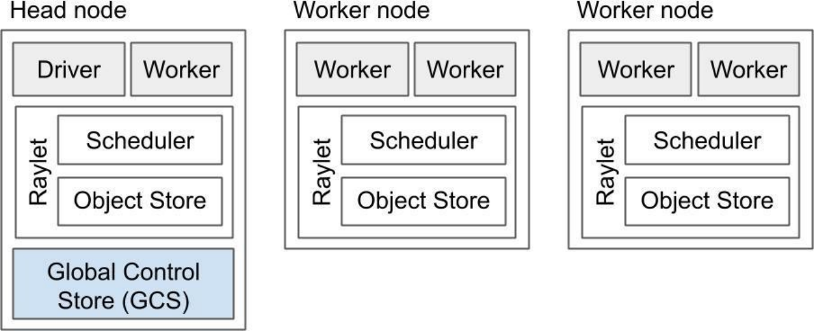
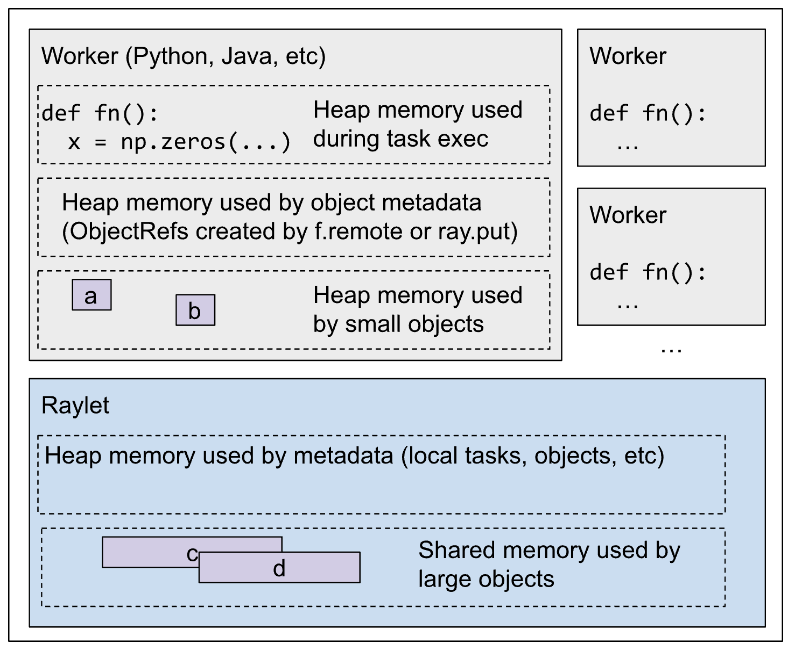
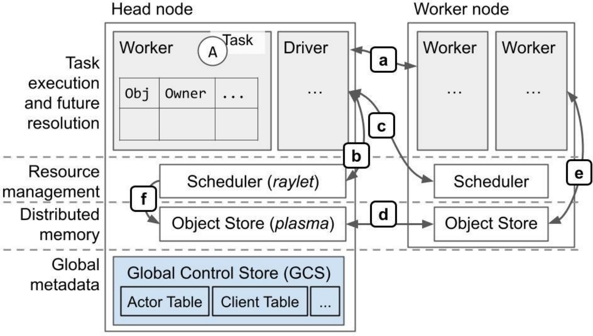
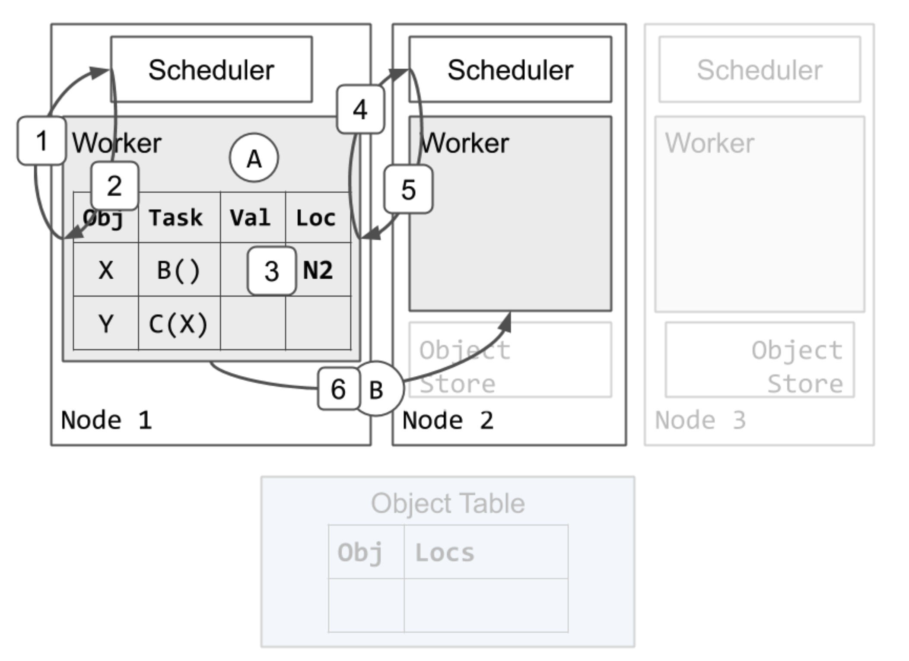
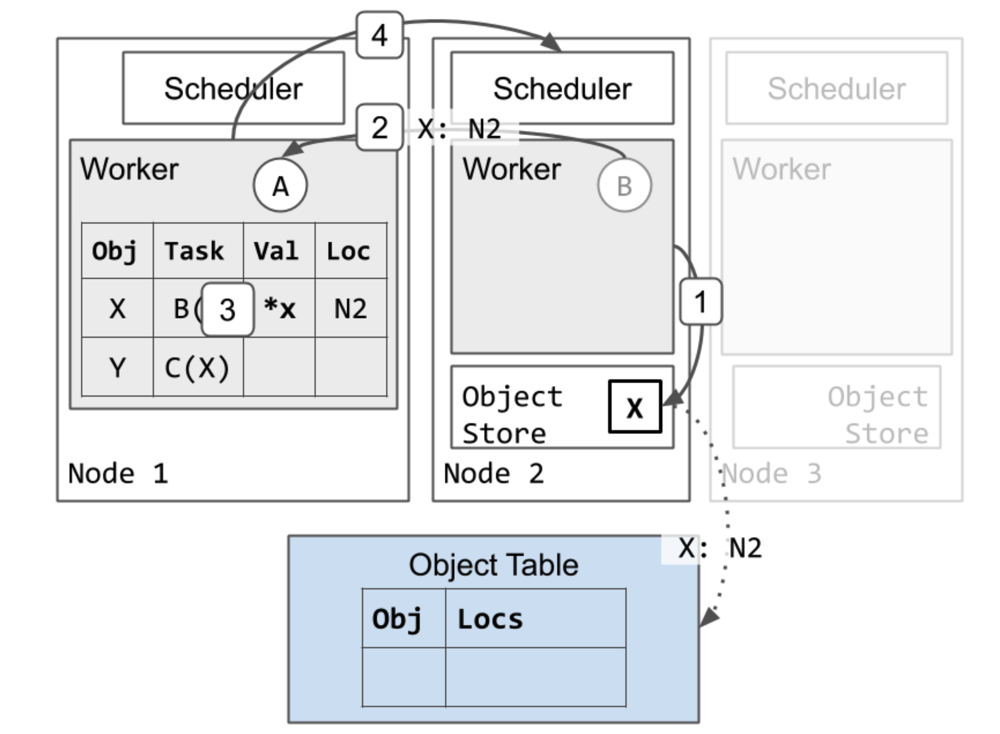
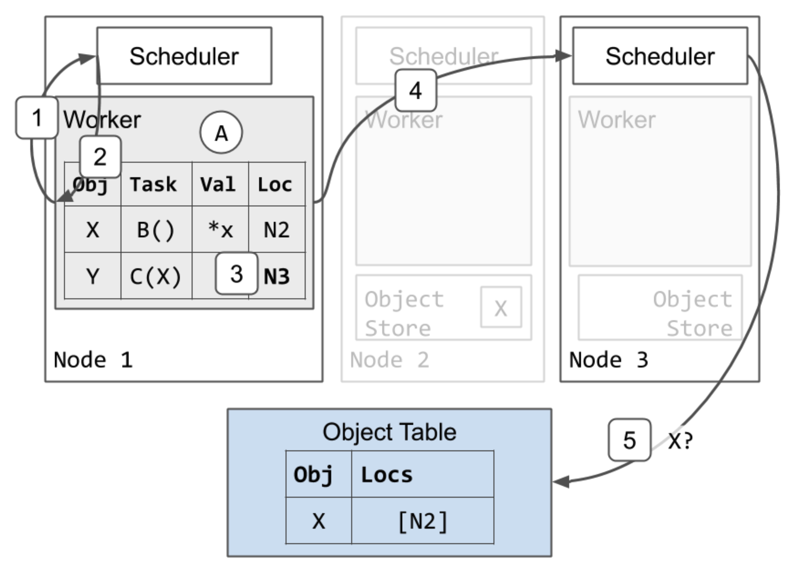
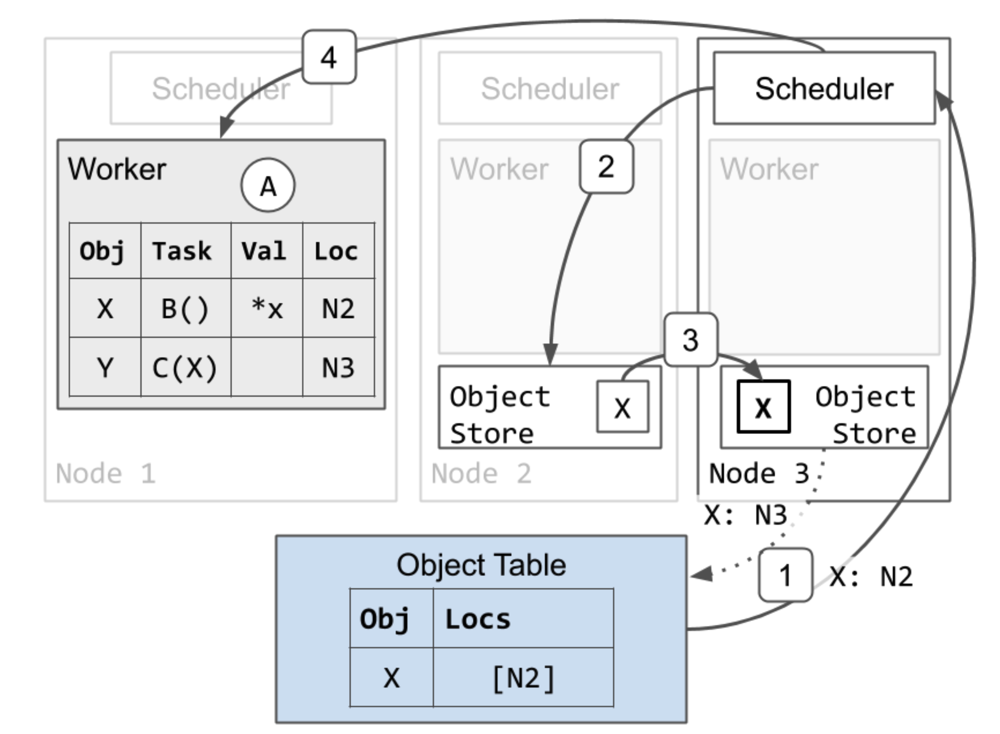
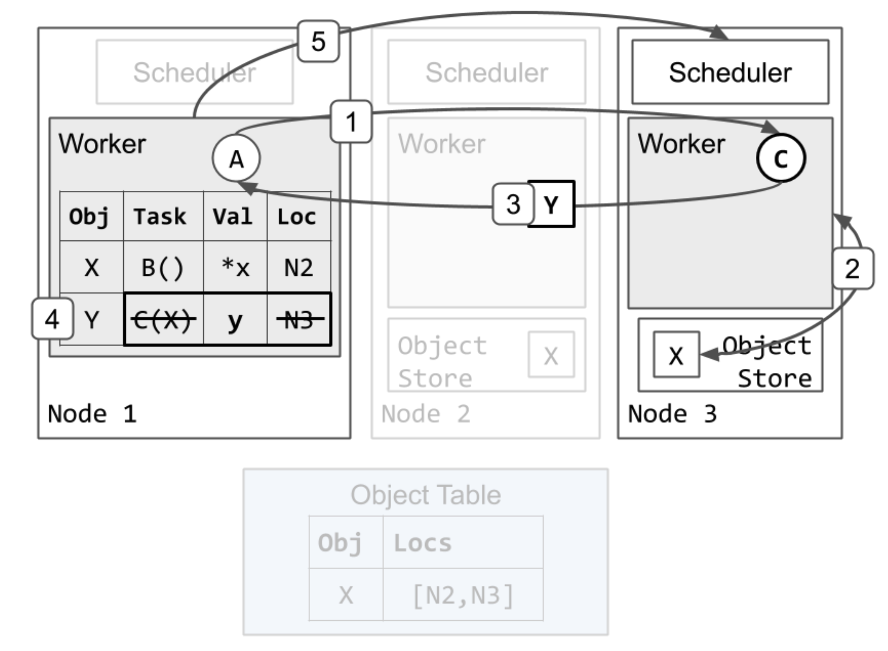
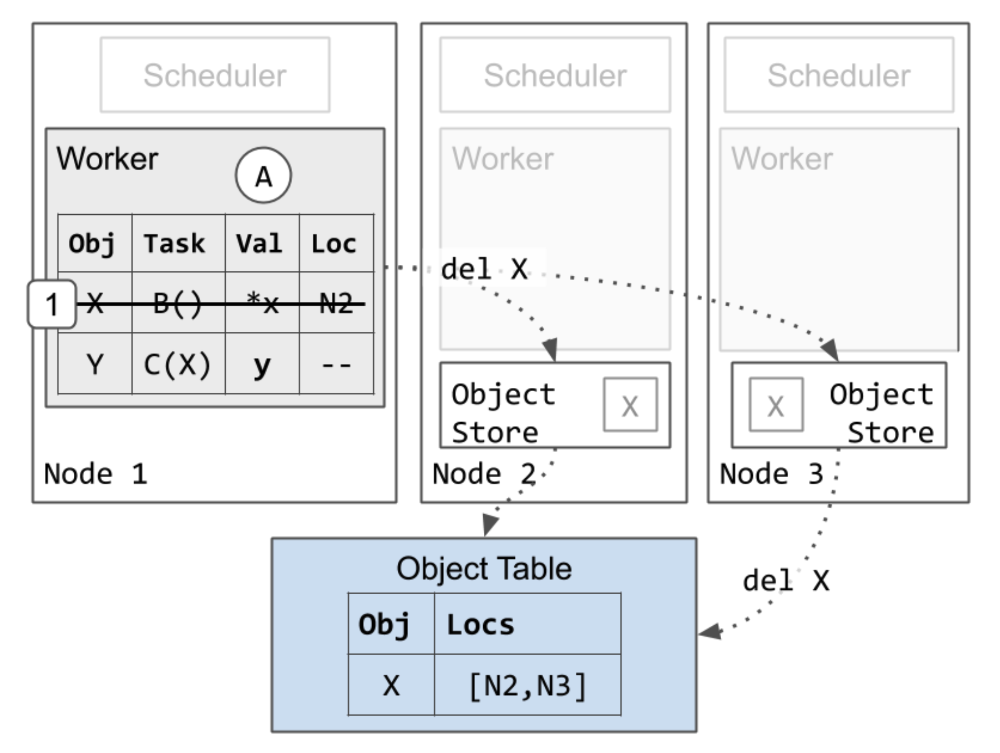

# Ray 架构总览——从 Driver 到 Worker 的消息流动

## 摘要

Ray 是一个高性能、可扩展的通用分布式计算框架，其底层架构设计决定了它能高效地调度任务、管理资源并处理大规模数据传输。本文将系统性地梳理 Ray 的核心架构，涵盖 Driver、Raylet、Worker、GCS、Object Store 等关键组件的职责与交互关系。我们将深入剖析任务的完整生命周期，从 Driver 发起请求，到 Raylet 分发任务、Worker 执行，再到结果回传的全过程。

## Ray 架构概览

Ray 由加州大学伯克利分校 RISE 实验室开发，旨在实现单机程序向大规模分布式系统的无缝扩展。其设计核心在于任务并行化与资源的动态调度，也就是说，开发者只需按照单机编程模型编写代码，Ray 会自动将其扩展至多节点执行，而无需开发者处理复杂的分布式逻辑。

### 核心概念

**任务（Task）**：即远程函数调用，可在不同进程甚至不同机器上执行。任务异步执行，通过 `.remote()` 发起，立即返回一个或多个 `ObjectRef`（即未来对象），可用于获取最终结果。任务可分为无状态（函数）或有状态（Actor 方法）。

**对象（Object）**：任务的返回值，或通过 `ray.put()` 显式创建的值。对象一旦创建即不可变，通过 `ObjectRef` 进行引用和传递。

**执行器（Actor）**：有状态的工作进程，即 `@ray.remote` 类的实例。其内部状态可被持续访问和修改，任务必须通过特定 Actor 实例的句柄提交。

**驱动程序（Driver）**：用户程序的起点，负责调用 `ray.init()` 并发起任务。它本质上也是一个特殊的工作进程。

**作业（Job）**：由同一个 Driver 发起的所有任务、对象和 Actor 的集合，作业与 Driver 一一对应，并共享相同的运行时上下文。

### 系统组件




每个 Ray 节点由以下核心组件组成：

- **Worker**：负责任务的提交与执行。分为无状态（可执行任意远程函数）和有状态（Actor）。每个 worker 关联一个特定的作业，默认按 CPU 核心数预启动。
  - **所有权表**：记录当前引用的对象，包括引用计数和对象位置信息。
  - **进程内存存储**：用于存放小型对象，支持高效读写。
- **Raylet**：每个节点的调度与资源管理中心，由以下两部分组成：
  - **调度器（Scheduler）**：负责本地资源调度与任务分发。集群中所有调度器共同构成 Ray 的分布式调度系统。
  - **对象存储（Object Store）**：也称 Plasma，负责存放和管理大型对象，支持跨节点传输、溢出和共享。
- **GCS（全局控制服务）**：仅存在于头节点，用于存储集群级元数据，如 Actor 位置、资源分组等。支持读缓存与写同步，并具备高可用能力。
- **Driver 进程**：一般运行在头节点，也可运行于任意节点。用于启动应用程序，提交任务，但不实际执行任何任务。
- **其他服务**：包括作业提交、自动扩展等系统服务。

### 内存结构



Ray 的内存使用主要分为以下几类：

1. **任务/Actor 执行时的堆内存**：执行用户代码所需内存。如果占用过高，Ray 会优先终止高内存占用的进程以保护系统稳定性。

2. **大型对象的共享内存**：由 `ray.put()` 或任务返回产生的大对象会写入共享内存对象存储，支持跨进程、跨节点访问。具备故障恢复、溢出回收和引用计数控制。

3. **小型对象的进程内存**：小于阈值（默认 100KB）的对象直接存储于本地进程内存中，加快读写效率。

4. **系统元数据内存**：包括任务描述、对象引用信息等系统开销。Ray v2.0 起，每个 `ObjectRef` 的内存开销大约为几 KB。元数据存储见下表。

   | 组件   | 使用场景举例                                                |
   | ------ | ----------------------------------------------------------- |
   | GCS    | 存储全局 Actor 表、节点列表、资源分组等                     |
   | Raylet | 存储本地任务队列、对象元数据、对象位置                      |
   | Worker | 存储任务队列、对象引用、语言前端作用域内的 `ObjectRef` 信息 |

### 系统协同流程

下图是 Ray 的架构概览，以及不同组件间的交互。




| 步骤 | 说明                                    |
| ---- | --------------------------------------- |
| a    | 任务执行与引用计数                      |
| b    | 本地资源管理                            |
| c    | 跨节点资源协调                          |
| d    | 分布式对象传输（大对象传输）            |
| e    | 大对象获取（如 `ray.get` 或参数值替换） |
| f    | 远程调度器为本地任务下载对象依赖        |

## 消息流动

我们以如下示例说明任务调度与对象传输的完整路径：

```python
@ray.remote
def A():
    y_id = C.remote(B.remote())
    y = ray.get(y_id)
```

在这个示例中，假设：

* 任务 A 提交了任务 B 和任务 C，并且 C 依赖于 B 的输出。
* 任务 B 返回一个大对象 X，C 返回一个小对象 Y。
* 任务 A、B 和 C 都在不同的节点上执行时。

### 阶段一：调度任务 B

首先，假设 worker 1 执行任务 A。任务 B 和 C 已经被提交到 worker 1。因此，worker 1 的本地所有权表已经包括 X 和 Y 的条目。

1. Worker 1（执行 A）向本地调度器申请执行 B；
2. 本地调度器将任务转发至节点 2；
3. Worker 1 更新所有权表，标记 B 将在节点 2 执行；
4. Worker 1 请求节点 2 调度器调度 B；
5. 节点 2 分配资源，指定执行者为 worker 2；
6. Worker 1 将 B 提交给 worker 2 执行。



### 阶段二：执行任务 B，生成大对象 X

1. Worker 2 执行 B，生成对象 X；

   * 节点 2 异步更新对象表，指示 X 现在位于节点 2 上（虚线箭头）。

   * 由于这是 X 的第一个副本，节点 2 还会固定它的副本，直到 worker 1 通知节点 2 可以释放该对象（未显示）。这确保了在对象仍被引用时，其值是可达的。

2. Worker 2 向 Worker 1 返回执行结果通知；

3. Worker 1 更新本地所有权表，标记 X 为可用；

4. Worker 1 释放调度资源，Worker 2 现在可以被重用来执行其他任务。



### 阶段三：调度任务 C

1. Worker 1 请求执行任务 C；
2. 调度器将任务转发至节点 3；
3. Worker 1 更新所有权表，标记任务位置；
4. Worker 1 请求节点 3 分配资源；
5. 节点 3 调度器检测到缺失依赖 X，向对象表请求其位置。



任务 C 需要 X 的本地副本才能开始执行，因此节点 3 获取 X 的副本：

1. 对象表响应调度器 3，指示 X 位于节点 2。

2. 调度器请求节点 2 的对象存储发送 X 的副本。

3. X 从节点 2 复制到节点 3。

   * 节点 3 也异步更新对象表，指示 X 现在也位于节点 3（虚线箭头）。

   * 节点 3 的 X 副本被缓存，但未被固定，本地 worker 正在使用它，该对象不会被逐出。然而，与节点 2 上的 X 副本不同，节点 3 上的副本可能会在对象存储 3 遭遇内存压力时根据 LRU 被逐出。如果发生这种情况，并且节点 3 以后再次需要该对象，它可以按照相同的协议从节点 2 或其他副本重新获取该对象。

4. 由于节点 3 现在有了 X 的本地副本，调度器 3 将资源分配给 worker 1，并响应 worker 3 的地址。



### 阶段四：任务 C 执行并返回小对象 Y

1. Worker 1 将任务 C 发送到 worker 3 执行。
2. Worker 3 从共享内存中获取 X，并运行 C(X)。
3. Worker 3 完成任务 C 并返回 Y，这次是通过值返回，而不是将其存储在本地对象存储中。
4. Worker 1 将 Y 存储在其进程内内存存储中。它还删除了任务 C 的规范和位置，因为 C 已完成执行。此时，任务 A 中的未完成 `ray.get` 调用将找到并从 worker 1 的进程内存存储中返回 Y 的值。
5. Worker 1 将资源返还给调度器 3。Worker 3 现在可以被重用来执行其他任务。这可以在步骤 4 之前完成。



### 阶段五：对象垃圾回收

1. 任务完成后，Worker 1 删除对象 X 的引用。这是安全的，因为待处理的任务 C 是 X 唯一的引用，而 C 已经完成。Worker 1 保留了 Y 的条目，因为应用程序仍然持有 Y 的 ObjectID 引用。

   * 最终，X 的所有副本都会从集群中删除。这可以在步骤 1 之后的任何时刻进行。如上所述，如果节点 3 的对象存储遭遇内存压力，节点 3 上的 X 副本也可能在步骤 1 之前被删除。



## 参考文献

[Ray v2 Architecture](https://docs.google.com/document/d/1tBw9A4j62ruI5omIJbMxly-la5w4q_TjyJgJL_jN2fI/preview?tab=t.0#heading=h.16g8domf57dq)
