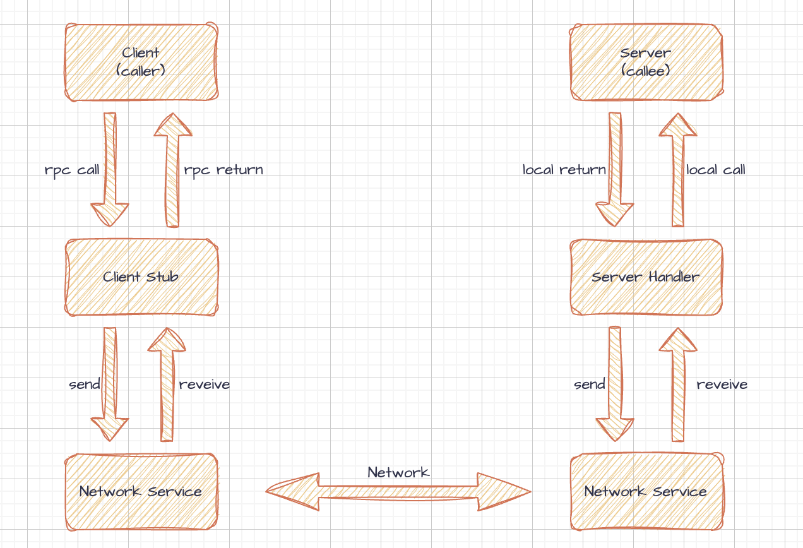
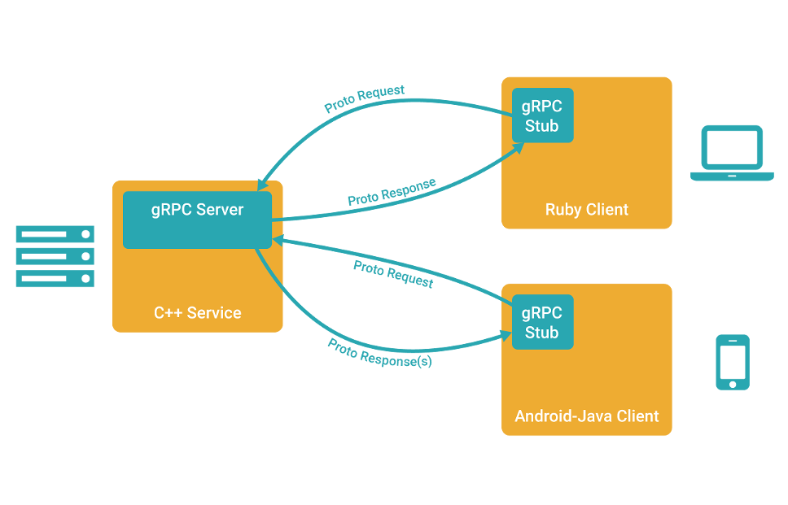

>参考文档：
>
>[gRPC简介](https://learnku.com/articles/58641)
>
>

## 1 RPC

TCP、HTTP 是网络传输协议，负责数据的传输和连接。而 RPC 是一种设计理念或框架，旨在通过封装复杂的网络通信细节，让调用远程服务的方法看起来像调用本地方法一样简单。RPC 通常需要依赖某种传输协议（例如 TCP、HTTP/2 等）来完成底层通信，但本身并不是协议。

PC 的核心目标是抽象网络通信的细节，实现跨网络的透明调用。gRPC 是基于 HTTP/2 和 Protocol Buffers 构建的具体实现，而传统的 RPC 可能直接基于 TCP 或其他协议。

**RPC 框架的主要职责**包括：

- 协议通信：管理网络连接、消息发送和接收。
- 序列化/反序列化：将复杂的数据结构转换为字节流（序列化）以便传输，并将字节流还原为原始数据结构（反序列化）。
- 消息通知：通知服务端和客户端处理请求或响应。
- 经常涉及负载均衡、服务注册与发现、认证与授权等功能，尤其在分布式系统中。

**RPC 的核心组件：**

* Client（客户端）：服务的调用方。
* Server（服务端）：服务的提供方。
* Client Stub（客户端存根）：负责包装远程调用逻辑，包括序列化请求参数、发送网络请求、接收响应并反序列化。
* Server Handler（服务端处理器）：负责解包请求数据、调用实际服务方法，以及将响应序列化后返回客户端。

## 2 gRPC

gRPC 是 Google 开发的一种高性能开源 RPC 框架，继承了 RPC 的核心思想，并在现代网络通信中扩展了许多新特性。

**gRPC 默认使用 Protobuf 作为序列化格式**，也支持其他序列化协议如（ JSON、FlatBuffers 等），Protobuf 相较于 JSON 或 XML 更高效，因其：

* 编码后的数据体积更小。
* 序列化和反序列化速度更快。
* 提供强类型支持。

gRPC **使用 HTTP/2 作为底层传输协议**，有以下核心特性：

* **双向流（Bidirectional Streaming）：** 客户端和服务端可以同时发送数据流。

* **流控（Flow Control）：** 允许动态调整传输的速率。

* **头部压缩（Header Compression）：** 减少网络开销，尤其是在带宽有限的环境下。

* **多路复用（Multiplexing）：** 在一个 TCP 连接上并发多个请求和响应。

gRPC 使用 `protoc` 和 `.proto` 文件生成代码，gRPC 的开发流程一般如下：

1. 定义 `.proto` 文件，描述服务和消息结构。
2. 使用 `protoc` 编译器生成代码（包括客户端存根和服务端接口）。
3. 在客户端和服务端实现生成的接口。

gRPC 支持四种**调用模式**：

* **简单 RPC（Unary RPC）：** 客户端发送一个请求，服务端返回一个响应。
* **服务器流式 RPC（Server Streaming RPC）：** 客户端发送一个请求，服务端返回一个数据流。
* **客户端流式 RPC（Client Streaming RPC）：** 客户端发送一个数据流，服务端返回一个响应。
* **双向流式 RPC（Bidirectional Streaming RPC）：** 客户端和服务端之间相互发送数据流。

响应和数据流的区别：

| 特性       | 单次响应                 | 数据流                                 |
| ---------- | ------------------------ | -------------------------------------- |
| 交互模式   | 请求 -> 响应             | 多个请求或响应数据片段持续传输         |
| 使用场景   | 简单查询、固定数据量传输 | 实时更新、大数据传输、双向交互         |
| 实现复杂度 | 简单                     | 较复杂，需要管理数据流的状态和生命周期 |
| 传输效率   | 一次性传输，适合小数据   | 更高效，适合大数据或实时通信           |
| 典型应用   | 查询用户信息、下单       | 实时聊天、流媒体传输、实时数据分析     |

gRPC **调用模型**：

