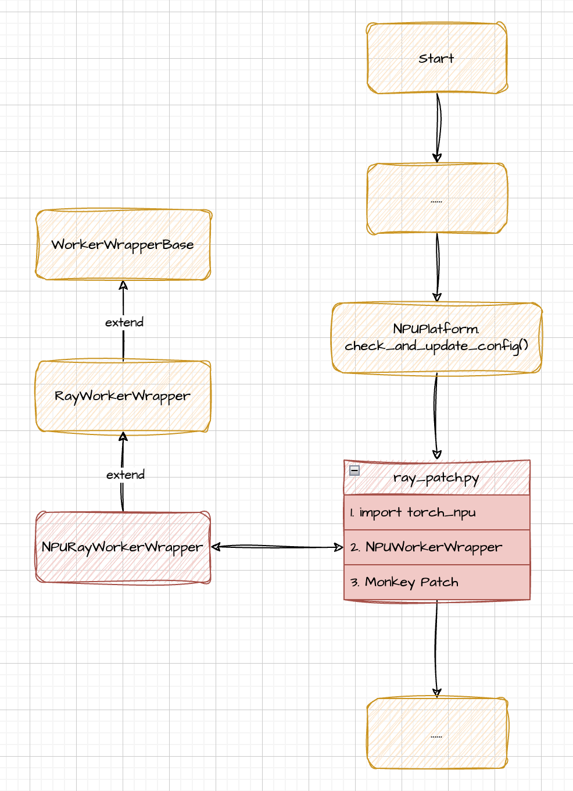

## PR1

### What this PR does / why we need it?

This PR enables vLLM to perform inference using the Ray backend.

The current issues encountered when running vLLM with Ray as the backend are as follows:

**Script:**

```bash
python examples/offline_distributed_inference_npu.py
```

**Result:**

```bash
Traceback (most recent call last):
  File "/home/cmq/lcg/github/vllm-ascend/examples/offline_distributed_inference_npu.py", line 32, in <module>
    llm = LLM(
  File "/home/cmq/miniconda3/envs/lcg-vllm-on-ray/lib/python3.10/site-packages/vllm/utils.py", line 1022, in inner
    return fn(*args, **kwargs)
  File "/home/cmq/miniconda3/envs/lcg-vllm-on-ray/lib/python3.10/site-packages/vllm/entrypoints/llm.py", line 242, in __init__
    self.llm_engine = self.engine_class.from_engine_args(
  File "/home/cmq/miniconda3/envs/lcg-vllm-on-ray/lib/python3.10/site-packages/vllm/engine/llm_engine.py", line 484, in from_engine_args
    engine = cls(
  File "/home/cmq/miniconda3/envs/lcg-vllm-on-ray/lib/python3.10/site-packages/vllm/engine/llm_engine.py", line 273, in __init__
    self.model_executor = executor_class(vllm_config=vllm_config, )
  File "/home/cmq/miniconda3/envs/lcg-vllm-on-ray/lib/python3.10/site-packages/vllm/executor/executor_base.py", line 271, in __init__
    super().__init__(*args, **kwargs)
  File "/home/cmq/miniconda3/envs/lcg-vllm-on-ray/lib/python3.10/site-packages/vllm/executor/executor_base.py", line 52, in __init__
    self._init_executor()
  File "/home/cmq/miniconda3/envs/lcg-vllm-on-ray/lib/python3.10/site-packages/vllm/executor/ray_distributed_executor.py", line 90, in _init_executor
    self._init_workers_ray(placement_group)
  File "/home/cmq/miniconda3/envs/lcg-vllm-on-ray/lib/python3.10/site-packages/vllm/executor/ray_distributed_executor.py", line 202, in _init_workers_ray
    worker_ips = ray.get([
  File "/home/cmq/miniconda3/envs/lcg-vllm-on-ray/lib/python3.10/site-packages/ray/_private/auto_init_hook.py", line 21, in auto_init_wrapper
    return fn(*args, **kwargs)
  File "/home/cmq/miniconda3/envs/lcg-vllm-on-ray/lib/python3.10/site-packages/ray/_private/client_mode_hook.py", line 103, in wrapper
    return func(*args, **kwargs)
  File "/home/cmq/miniconda3/envs/lcg-vllm-on-ray/lib/python3.10/site-packages/ray/_private/worker.py", line 2772, in get
    values, debugger_breakpoint = worker.get_objects(object_refs, timeout=timeout)
  File "/home/cmq/miniconda3/envs/lcg-vllm-on-ray/lib/python3.10/site-packages/ray/_private/worker.py", line 921, in get_objects
    raise value
ray.exceptions.ActorDiedError: The actor died because of an error raised in its creation task, ray::RayWorkerWrapper.__init__() (pid=2757112, ip=192.168.64.2, actor_id=aa71786a87ed51cca52a281401000000, repr=<vllm.executor.ray_utils.RayWorkerWrapper object at 0xfff594ef0d00>)
  At least one of the input arguments for this task could not be computed:
ray.exceptions.RaySystemError: System error: Expected one of cpu, cuda, ipu, xpu, mkldnn, opengl, opencl, ideep, hip, ve, fpga, maia, xla, lazy, vulkan, mps, meta, hpu, mtia, privateuseone device type at start of device string: npu
traceback: Traceback (most recent call last):
RuntimeError: Expected one of cpu, cuda, ipu, xpu, mkldnn, opengl, opencl, ideep, hip, ve, fpga, maia, xla, lazy, vulkan, mps, meta, hpu, mtia, privateuseone device type at start of device string: npu
[ERROR] 2025-02-18-11:36:19 (PID:2756150, Device:-1, RankID:-1) ERR99999 UNKNOWN applicaiton exception
(RayWorkerWrapper pid=2757099) Expected one of cpu, cuda, ipu, xpu, mkldnn, opengl, opencl, ideep, hip, ve, fpga, maia, xla, lazy, vulkan, mps, meta, hpu, mtia, privateuseone device type at start of device string: npu
(RayWorkerWrapper pid=2757099) Traceback (most recent call last):
(RayWorkerWrapper pid=2757099)   File "/home/cmq/miniconda3/envs/lcg-vllm-on-ray/lib/python3.10/site-packages/ray/_private/serialization.py", line 460, in deserialize_objects
(RayWorkerWrapper pid=2757099)     obj = self._deserialize_object(data, metadata, object_ref)
(RayWorkerWrapper pid=2757099)   File "/home/cmq/miniconda3/envs/lcg-vllm-on-ray/lib/python3.10/site-packages/ray/_private/serialization.py", line 317, in _deserialize_object
(RayWorkerWrapper pid=2757099)     return self._deserialize_msgpack_data(data, metadata_fields)
(RayWorkerWrapper pid=2757099)   File "/home/cmq/miniconda3/envs/lcg-vllm-on-ray/lib/python3.10/site-packages/ray/_private/serialization.py", line 272, in _deserialize_msgpack_data
(RayWorkerWrapper pid=2757099)     python_objects = self._deserialize_pickle5_data(pickle5_data)
(RayWorkerWrapper pid=2757099)   File "/home/cmq/miniconda3/envs/lcg-vllm-on-ray/lib/python3.10/site-packages/ray/_private/serialization.py", line 262, in _deserialize_pickle5_data
(RayWorkerWrapper pid=2757099)     obj = pickle.loads(in_band)
(RayWorkerWrapper pid=2757099) RuntimeError: Expected one of cpu, cuda, ipu, xpu, mkldnn, opengl, opencl, ideep, hip, ve, fpga, maia, xla, lazy, vulkan, mps, meta, hpu, mtia, privateuseone device type at start of device string: npu [repeated 2x across cluster] (Ray deduplicates logs by default. Set RAY_DEDUP_LOGS=0 to disable log deduplication, or see https://docs.ray.io/en/master/ray-observability/user-guides/configure-logging.html#log-deduplication for more options.)
(RayWorkerWrapper pid=2757099) Exception raised in creation task: The actor died because of an error raised in its creation task, ray::RayWorkerWrapper.__init__() (pid=2757099, ip=192.168.64.2, actor_id=d989f62b3ff8e84e192a355601000000, repr=<vllm.executor.ray_utils.RayWorkerWrapper object at 0xfff5bc560d00>)
(RayWorkerWrapper pid=2757099)   At least one of the input arguments for this task could not be computed:
(RayWorkerWrapper pid=2757099) ray.exceptions.RaySystemError: System error: Expected one of cpu, cuda, ipu, xpu, mkldnn, opengl, opencl, ideep, hip, ve, fpga, maia, xla, lazy, vulkan, mps, meta, hpu, mtia, privateuseone device type at start of device string: npu
(RayWorkerWrapper pid=2757099) traceback: Traceback (most recent call last):
```

This issue occurs because Ray serializes and deserializes the `RayWorkerWrapper` class when passing it to other worker processes for execution. However, during execution, the required `import torch_npu` is missing, leading to an error.

We define a class `NPURayWorkerWrapper` that inherits from `RayWorkerWrapper` and use a monkey patch to import `torch_npu`.

As shown in the figure below.



### Does this PR introduce *any* user-facing change?

no.

### How was this patch tested?

**Environment:**

CANN: 8.0.0

PyTorch: 2.5.1

Torch: 2.5.1rc1

python: 3.10

vllm: branch main 

vllm-ascend: branch main 

**Script:**

```bash
python examples/offline_distributed_inference_npu.py
```

**Result:**

```bash
(lcg-vllm-on-ray) cmq@cmq-docker:~/lcg/github/vllm-ascend$ python examples/offline_distributed_inference_npu.py
INFO 02-18 12:37:46 __init__.py:30] Available plugins for group vllm.platform_plugins:
INFO 02-18 12:37:46 __init__.py:32] name=ascend, value=vllm_ascend:register
INFO 02-18 12:37:46 __init__.py:34] all available plugins for group vllm.platform_plugins will be loaded.
INFO 02-18 12:37:46 __init__.py:36] set environment variable VLLM_PLUGINS to control which plugins to load.
INFO 02-18 12:37:46 __init__.py:44] plugin ascend loaded.
INFO 02-18 12:37:46 __init__.py:188] Platform plugin ascend is activated
INFO 02-18 12:38:01 config.py:548] This model supports multiple tasks: {'embed', 'score', 'classify', 'generate', 'reward'}. Defaulting to 'generate'.
INFO 02-18 12:38:01 llm_engine.py:234] Initializing a V0 LLM engine (v0.7.3.dev191+gb3942e15) with config: model='Qwen/Qwen2.5-0.5B-Instruct', speculative_config=None, tokenizer='Qwen/Qwen2.5-0.5B-Instruct', skip_tokenizer_init=False, tokenizer_mode=auto, revision=None, override_neuron_config=None, tokenizer_revision=None, trust_remote_code=True, dtype=torch.bfloat16, max_seq_len=32768, download_dir=None, load_format=auto, tensor_parallel_size=2, pipeline_parallel_size=1, disable_custom_all_reduce=False, quantization=None, enforce_eager=False, kv_cache_dtype=auto,  device_config=npu, decoding_config=DecodingConfig(guided_decoding_backend='xgrammar'), observability_config=ObservabilityConfig(otlp_traces_endpoint=None, collect_model_forward_time=False, collect_model_execute_time=False), seed=0, served_model_name=Qwen/Qwen2.5-0.5B-Instruct, num_scheduler_steps=1, multi_step_stream_outputs=True, enable_prefix_caching=False, chunked_prefill_enabled=False, use_async_output_proc=True, disable_mm_preprocessor_cache=False, mm_processor_kwargs=None, pooler_config=None, compilation_config={"splitting_ops":[],"compile_sizes":[],"cudagraph_capture_sizes":[256,248,240,232,224,216,208,200,192,184,176,168,160,152,144,136,128,120,112,104,96,88,80,72,64,56,48,40,32,24,16,8,4,2,1],"max_capture_size":256}, use_cached_outputs=False, 
2025-02-18 12:38:05,036 INFO worker.py:1841 -- Started a local Ray instance.
INFO 02-18 12:38:07 ray_distributed_executor.py:149] use_ray_spmd_worker: False
(NPURayWorkerWrapper pid=2825339) INFO 02-18 12:38:15 __init__.py:30] Available plugins for group vllm.platform_plugins:
(NPURayWorkerWrapper pid=2825339) INFO 02-18 12:38:15 __init__.py:32] name=ascend, value=vllm_ascend:register
(NPURayWorkerWrapper pid=2825339) INFO 02-18 12:38:15 __init__.py:34] all available plugins for group vllm.platform_plugins will be loaded.
(NPURayWorkerWrapper pid=2825339) INFO 02-18 12:38:15 __init__.py:36] set environment variable VLLM_PLUGINS to control which plugins to load.
(NPURayWorkerWrapper pid=2825339) INFO 02-18 12:38:15 __init__.py:44] plugin ascend loaded.
(NPURayWorkerWrapper pid=2825339) INFO 02-18 12:38:15 __init__.py:188] Platform plugin ascend is activated
(NPURayWorkerWrapper pid=2825344) WARNING 02-18 12:38:16 utils.py:2262] Methods add_lora,add_prompt_adapter,cache_config,compilation_config,current_platform,list_loras,list_prompt_adapters,load_config,pin_lora,pin_prompt_adapter,remove_lora,remove_prompt_adapter not implemented in <vllm_ascend.worker.NPUWorker object at 0xfff5a79f7fd0>
(NPURayWorkerWrapper pid=2825344) WARNING 02-18 12:38:16 _custom_ops.py:21] Failed to import from vllm._C with ModuleNotFoundError("No module named 'vllm._C'")
(NPURayWorkerWrapper pid=2825344) INFO 02-18 12:38:16 importing.py:16] Triton not installed or not compatible; certain GPU-related functions will not be available.
WARNING 02-18 12:38:16 utils.py:2262] Methods add_lora,add_prompt_adapter,cache_config,compilation_config,current_platform,list_loras,list_prompt_adapters,load_config,pin_lora,pin_prompt_adapter,remove_lora,remove_prompt_adapter not implemented in <vllm_ascend.worker.NPUWorker object at 0xfffe6c0f5900>
WARNING 02-18 12:38:16 _custom_ops.py:21] Failed to import from vllm._C with ModuleNotFoundError("No module named 'vllm._C'")
INFO 02-18 12:38:16 importing.py:16] Triton not installed or not compatible; certain GPU-related functions will not be available.
INFO 02-18 12:38:25 shm_broadcast.py:258] vLLM message queue communication handle: Handle(connect_ip='127.0.0.1', local_reader_ranks=[1], buffer_handle=(1, 4194304, 6, 'psm_855e4b9b'), local_subscribe_port=34619, remote_subscribe_port=None)
INFO 02-18 12:38:26 weight_utils.py:254] Using model weights format ['*.safetensors']
(NPURayWorkerWrapper pid=2825344) INFO 02-18 12:38:26 weight_utils.py:254] Using model weights format ['*.safetensors']
(NPURayWorkerWrapper pid=2825344) INFO 02-18 12:38:15 __init__.py:30] Available plugins for group vllm.platform_plugins:
(NPURayWorkerWrapper pid=2825344) INFO 02-18 12:38:15 __init__.py:32] name=ascend, value=vllm_ascend:register
(NPURayWorkerWrapper pid=2825344) INFO 02-18 12:38:15 __init__.py:34] all available plugins for group vllm.platform_plugins will be loaded.
(NPURayWorkerWrapper pid=2825344) INFO 02-18 12:38:15 __init__.py:36] set environment variable VLLM_PLUGINS to control which plugins to load.
(NPURayWorkerWrapper pid=2825344) INFO 02-18 12:38:15 __init__.py:44] plugin ascend loaded.
(NPURayWorkerWrapper pid=2825344) INFO 02-18 12:38:15 __init__.py:188] Platform plugin ascend is activated
INFO 02-18 12:38:27 weight_utils.py:270] Time spent downloading weights for Qwen/Qwen2.5-0.5B-Instruct: 0.729272 seconds
INFO 02-18 12:38:27 weight_utils.py:304] No model.safetensors.index.json found in remote.
Loading safetensors checkpoint shards:   0% Completed | 0/1 [00:00<?, ?it/s]
Loading safetensors checkpoint shards: 100% Completed | 1/1 [00:00<00:00,  4.82it/s]
Loading safetensors checkpoint shards: 100% Completed | 1/1 [00:00<00:00,  4.82it/s]

(NPURayWorkerWrapper pid=2825344) INFO 02-18 12:38:28 weight_utils.py:304] No model.safetensors.index.json found in remote.
/home/cmq/miniconda3/envs/lcg-vllm-on-ray/lib/python3.10/site-packages/torch_npu/distributed/distributed_c10d.py:114: UserWarning: HCCL doesn't support gather at the moment. Implemented with allgather instead.
  warnings.warn("HCCL doesn't support gather at the moment. Implemented with allgather instead.")
INFO 02-18 12:38:43 executor_base.py:111] # npu blocks: 572252, # CPU blocks: 43690
INFO 02-18 12:38:43 executor_base.py:116] Maximum concurrency for 32768 tokens per request: 279.42x
INFO 02-18 12:38:46 llm_engine.py:431] init engine (profile, create kv cache, warmup model) took 17.72 seconds
Processed prompts:   0%|                                                                                                    | 0/4 [00:00<?, ?it/s, est. speed input: 0.00 toks/s, output: 0.00 toks/s]./home/cmq/miniconda3/envs/lcg-vllm-on-ray/lib/python3.10/site-packages/torch_npu/distributed/distributed_c10d.py:114: UserWarning: HCCL doesn't support gather at the moment. Implemented with allgather instead.
  warnings.warn("HCCL doesn't support gather at the moment. Implemented with allgather instead.")
(NPURayWorkerWrapper pid=2825344) .
/home/cmq/miniconda3/envs/lcg-vllm-on-ray/lib/python3.10/site-packages/torch_npu/distributed/distributed_c10d.py:114: UserWarning: HCCL doesn't support gather at the moment. Implemented with allgather instead.
  warnings.warn("HCCL doesn't support gather at the moment. Implemented with allgather instead.")
Processed prompts: 100%|███████████████████████████████████████████████████████████████████████████████████████████| 4/4 [00:08<00:00,  2.20s/it, est. speed input: 2.50 toks/s, output: 45.45 toks/s]
Prompt: 'Hello, my name is', Generated text: ' Alex and I am a 17 year old male. I have been diagnosed with a rare genetic disorder called X-linked recessive. I have been told that I will not be able to have children. I have been told that I will not be able to have children because of the gene I have. I have been told that I will not be able to have children because of the gene I have. I have been told that I will not be able to have children because of the gene I have'
Prompt: 'The president of the United States is', Generated text: ' Statesman. He is the leader of the country. He is the one who is in charge of the country. He is the one who is in charge of the country. He is the one who is in charge of the country. He is the one who is in charge of the country. He is the one who is in charge of the country. He is the one who is in charge of the country. He is the one who is in charge of the country. He is the one who'
Prompt: 'The capital of France is', Generated text: ' the city of Paris. It is the largest city in France and the second largest in the European Union. It is located in the south of France, on the banks of the Seine River. It is situated on the Île de la Cité, which is a UNESCO World Heritage Site. The city is also known as the "City of Light" and is famous for its architecture, art, and music. Paris is a popular tourist destination and is home to many famous landmarks such as the E'
Prompt: 'The future of AI is', Generated text: ' following the path of the internet, and the internet is following the path of the web. The web is a network of interconnected web pages, and the internet is a network of interconnected computers. The web is a network of interconnected computers, and the internet is a network of interconnected computers. The web is a network of interconnected computers, and the internet is a network of interconnected computers. The web is a network of interconnected computers, and the internet is a network of interconnected computers. The web is a network'
```


In this PR, vLLM removes the platform check during import. For example, in `ray_utils`, the absence of a platform check results in missing `import torch_npu` dependencies for Ray's remote tasks. Consequently, when Ray serializes and deserializes `RayWorkerWrapper` to execute it in another process, the required `torch_npu` dependencies are missing.

Currently, I have considered the following three solutions:

1. **Use a monkey patch** to import `torch_npu`, as provided in this PR.
2. **Reintroduce platform checks** during import in the vLLM community, similar to the previous approach.
3. **Implement a dedicated RayNPU backend** (which seems unnecessary).


