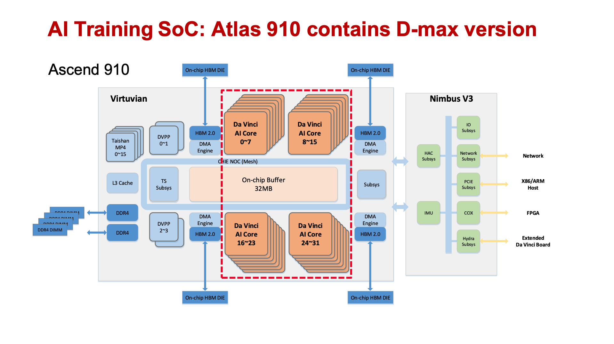
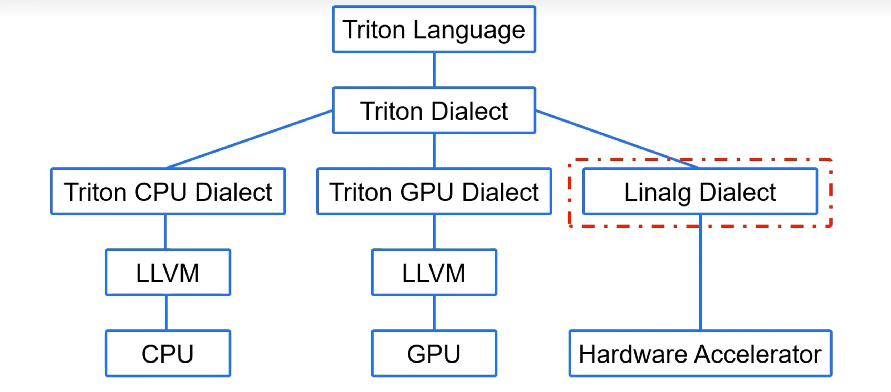
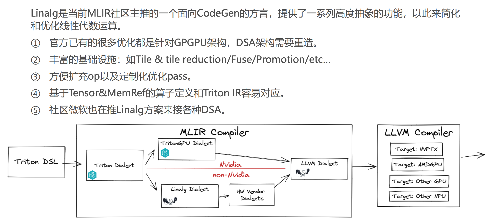
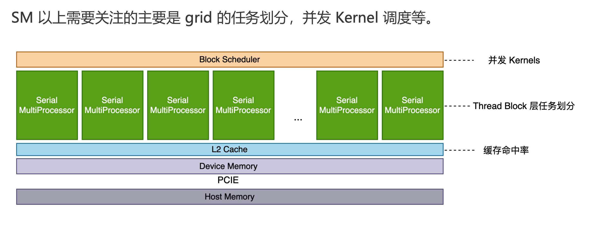
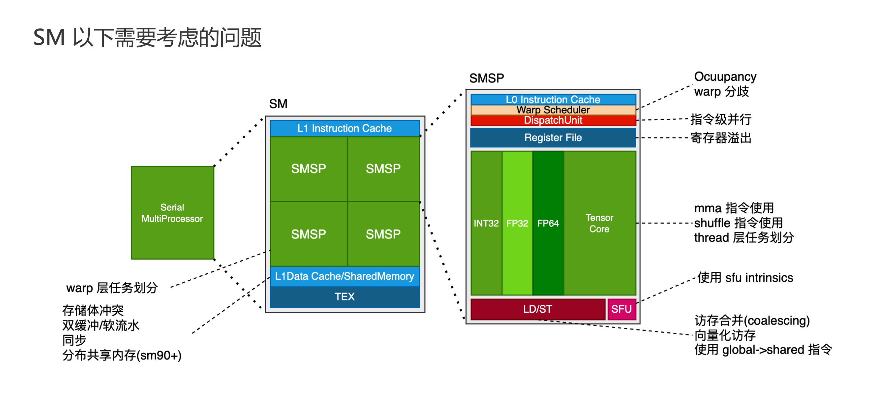
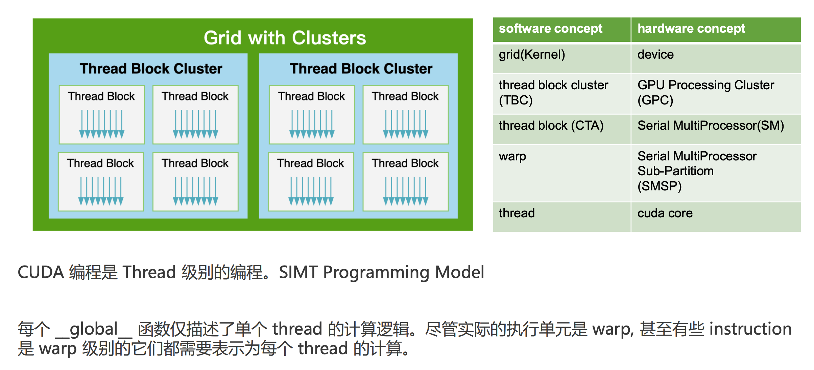
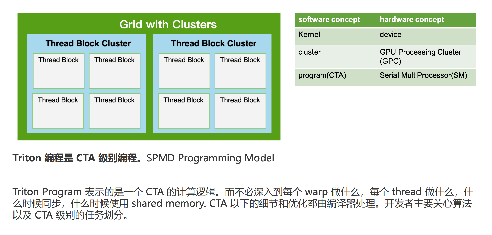
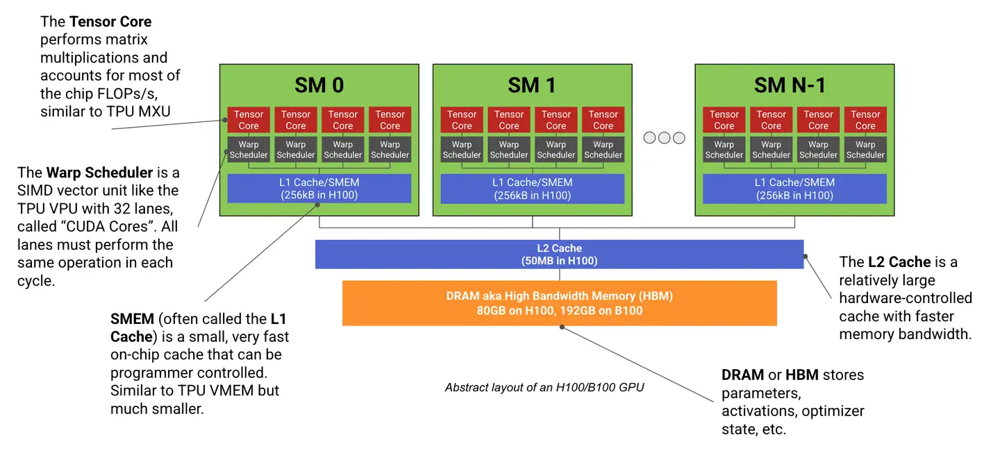

Torch的compile，可以选择后端，例如inductor。

```python
def func(a, b):
	x = a.ceil()+b.floor()
	y = x.sum(dim=-1)
	z = y.softmax(dim=-1)
	w = (z * 10) ** 3
	return w

torch.compile(func, backend="inductor")
```


Python(dynamo)->Dynamo捕获FX图，并切割子图->AOT_Autograd生成前向/后向图->Inductor进行算子融合，子图编译

Dynamo在抓图的时候，不会实际去计算，他只知道当前计算节电的入参的维度信息。例如：

```python
def fn(a, b):
  x = a + b
  x = x / 2.0
  if x.sun() < 0: # 在抓图的时候，这里dynamo并不知道实际的计算结果，所以这里会被切分为子图。
    return x * -1.0
  return x * 2
```


Input Code -> FX Graph IR -> ATen FX Graph IR -> Define-by-run IR->Scheduling/Fusion->Output Triton->Output Wrapper


Decompose 需要拆分的算子（大算子）

Lowering 需要融合的算子（小算子）

Fallback 无法融合的算子

大算子拆分为小算子，所有的小算子进行融合，形成融合算子；无法参与融合的算子就保持原样（大算子也可能拆分出无法融合的小算子）。最后根据融合算子和无法融合的算子进行编译。


XBLOCK = 数据长度 / vector kernels

RBLOCK = 规约轴的长度

需要缓存的大小 = XBLOCK * RBLOCK * 变量个数

UB（unified buffer），这部分位于Da Vinci AI Core内部，910A是256K，910A是192K


910A芯片架构



* 32个Da Vinci AI Core
* 片上缓存：64MB L2 Cache（带宽3.2TB/s），32GB HBM2（1.2TB/s），


* Cube Core用的是 Buffer A 和 Buffer B（L0 Cache）

* Vector Core用的是Unified Buffer，主要执行Pointwise（点运算）
* Cube Core 和 Vector Core都做不了的交给AI CPU执行


Triton 编译架构：




**MLIR (Multi-Level Intermediate Representation)** 是 LLVM 项目中的一个框架，用于构建**可扩展的多层中间表示系统**。

传统编译器（比如 LLVM IR）只有一层中间表示，而 MLIR 的目标是：让编译器可以在多层抽象级别上进行优化，从高层（Tensor 表达）到低层（LLVM IR 或硬件指令）。













Triton的编译器叫pass





首先, warp 的概念很像 CPU 中的一组线程. 但是 GPU 中线程非常多, 所以我们会希望线程的同质化比较高一些, 换句话说就是, 一组线程总是执行同一个指令. 好了, 这是 Warp Scheduler 的意义, Warp Scheduler 管理 32 个线程, 这种结构我们统称为 SIMD 是 Single Instruction, Multiple Data（单指令多数据） 的缩写，是一种并行计算架构。


### 1️⃣ CUDA：SIMT (Single Instruction, Multiple Threads)

- **核心思想**：所有线程执行同一条指令，但每个线程有自己的数据和寄存器。
- **线程组织**：线程块 (block) + 网格 (grid)，每个线程有 `(threadIdx, blockIdx)`。
- **典型代码**：

```c++
__global__ void add(float* A, float* B, float* C, int N) {
  	// threadIdx 表示线程在 当前 block 内的索引，从 0 到 blockDim.x - 1。
  	// blockIdx 表示线程块在 整个 grid 中的索引
  	// blockDim 表示 每个 block 中线程的数量。
    int idx = threadIdx.x + blockIdx .x * blockDim.x;
    if (idx < N) {
        C[idx] = A[idx] + B[idx];
    }
}
```

- **特点**：
  - 显式管理线程索引、block/grid 维度。
  - 强调 **数据并行**，线程间独立。
  - 开发者需显式考虑 **共享内存、内存对齐、warp 效率**。

------

### 2️⃣ Triton：SPMD (Single Program, Multiple Data)

- **核心思想**：每个程序实例 (program instance) 是一个线程块的抽象，像 CUDA 的 block，但 Triton 会自动映射到 GPU 线程。
- **特点**：
  - 高层抽象，不用写 blockIdx/threadIdx。
  - 支持 **Tile + Block 自动映射**。
  - 更偏 **张量化/矩阵操作优化**。

```python
@triton.jit
def add_kernel(X_ptr, Y_ptr, Z_ptr, N, BLOCK: tl.constexpr):
    pid = tl.program_id(0)
    offsets = pid * BLOCK + tl.arange(0, BLOCK)
    x = tl.load(X_ptr + offsets)
    y = tl.load(Y_ptr + offsets)
    tl.store(Z_ptr + offsets, x + y)
```

- **特点**：
  - SPMD 风格：单程序多数据，每个 program instance 自动并行执行。
  - Triton 自动处理线程块映射、SIMD/vectorization、共享内存等优化。

------

### 3️⃣ TileLang：类似高层 DSL + 自动 SPMD/Tile 调度

- **核心思想**：
  - 高层声明 **tensor / block / tile / loop**。
  - 内核用 **`@T.prim_func` + `T.Tensor` + tile loops`** 定义。
  - 编译器自动生成底层 GPU/CPU 代码，类似 Triton 的 SPMD 风格。
- **TileLang 优势**：
  - 自动 **tiling、vectorization、parallel scheduling**。
  - 可以像 Triton 一样写高层 tensor 逻辑，而不需要显式管理线程。
  - 支持 CPU (LLVM) 或 GPU (CUDA) target。

```python
@T.prim_func
def matrix_add(M: T.int32, N: T.int32,
               A: T.Tensor([M, N], "float32"),
               B: T.Tensor([M, N], "float32"),
               C: T.Tensor([M, N], "float32")):
    TILE_M, TILE_N = 32, 32
    for bm in T.Pipelined(0, tl.cdiv(M, TILE_M)):
        for bn in T.Pipelined(0, tl.cdiv(N, TILE_N)):
            for i, j in T.grid(TILE_M, TILE_N):
                if bm*TILE_M+i < M and bn*TILE_N+j < N:
                    C[bm*TILE_M+i, bn*TILE_N+j] = A[bm*TILE_M+i, bn*TILE_N+j] + B[bm*TILE_M+i, bn*TILE_N+j]
```

- **特点**：
  - **高层 Tile + block 抽象**，更接近 **SPMD + tensor tiling**。
  - 自动生成底层 CUDA/LLVM 内核。
  - 类似 Triton 的 SPMD 编程，但提供更丰富的 **自动调度/优化**。

------

### 4️⃣ 对比总结

| 框架 / 模型 | 并行模型   | 线程抽象                    | 编程难度               | 自动优化                             |
| ----------- | ---------- | --------------------------- | ---------------------- | ------------------------------------ |
| CUDA        | SIMT       | threadIdx / blockIdx        | 高，需要管理内存和线程 | 手动                                 |
| Triton      | SPMD       | program_id / block 自动映射 | 中                     | 自动 tile / vectorization            |
| TileLang    | SPMD / DSL | tile loops / tensor         | 高级抽象               | 自动 tile / vectorization / parallel |

------

**总结**：

- CUDA 是低层 SIMT，显式管理线程和内存。
- Triton 是高层 SPMD，每个 program instance 自动映射到 GPU block。
- TileLang 是类似 Triton 的 **高层 DSL + SPMD + 自动调度**，支持 GPU/CPU 自动优化。


一般来说：

• 一个kernel对应一个grid

• 一个grid可以有多个block，一维~三维

• 一个block可以有多个thread，一维~三维
