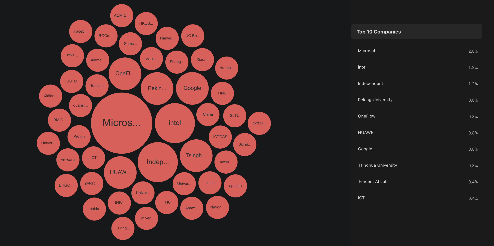
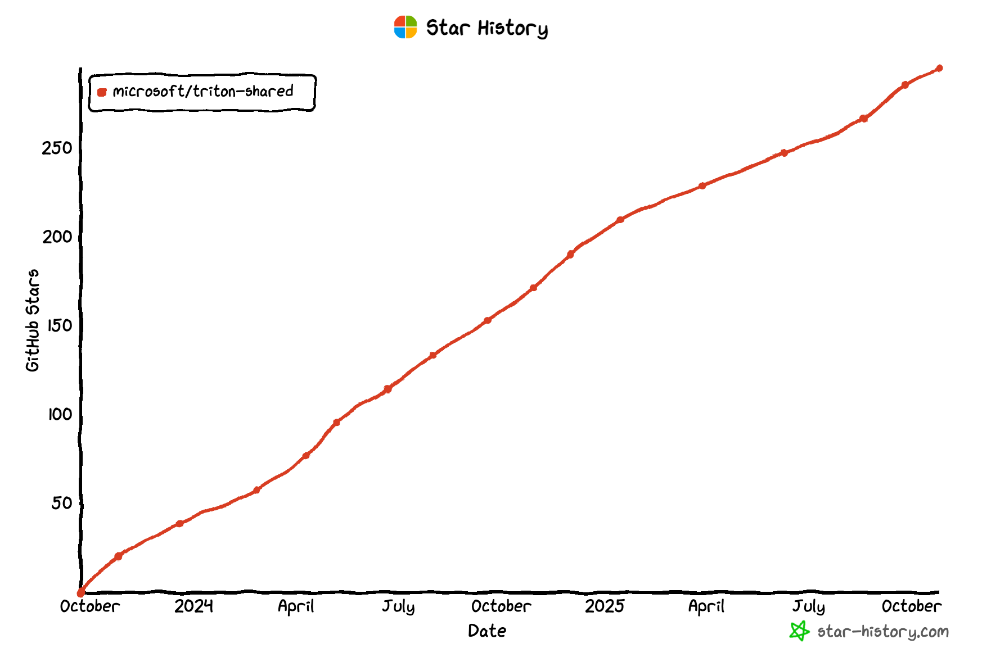

# Triton Shared

## 项目介绍

Github 地址：https://github.com/microsoft/triton-shared

公司：microsoft

核心贡献者：

贡献者：36人

Star：295

Fork：78






## 贡献者

| GitHub ID    | Name          | Company                | Note                       |
| ------------ | ------------- | ---------------------- | -------------------------- |
| nhat-nguyen  | Nhat Nguyen   | University of Waterloo | 给 Triton 发贡献了树外后端 |
| manbearian   | ian Bearman   | Microsoft              | 不活跃                     |
| python3kgae  | Xiang Li      |                        | 不活跃                     |
| parsifal-47  | Renat Idrisov |                        | 不活跃                     |
| red1bluelost | Micah Weston  | Microsoft              |                            |

## 竞争力

Triton-shared 是 **Triton 编译器的中间层（middle layer）**，它位于 Triton 的前端（IR 生成）与后端（硬件特定代码生成）之间。

可以用这条路径表示整个编译链路：

```
Triton IR  →  Triton-shared (Middle Layer, MLIR-based)  →  HW-specific IR (例如 LLVM IR / GPU backend)
```

也就是说：

- Triton 负责定义和生成高层的 Triton IR（tensor/block 级别的并行抽象）；
- Triton-shared 负责将这些高层 IR **降低（lower）** 到更通用的 MLIR dialect（例如 Linalg/Tensor/Memref）；
- 最终后端（CPU/GPU/...）再基于这些标准化的 MLIR IR 生成机器代码。

Triton-shared 被设计为 Triton 的 **树外后端（out-of-tree backend）**。
 这意味着它不是直接编译进 Triton 主仓库，而是以插件（plugin）的形式独立存在，通过运行时动态加载。

Triton 自己的 MLIR pass 是为“**Triton 官方 GPU 后端**”设计的；

Triton-shared 的 MLIR pass 是为“**外部后端 / 通用编译器生态**”设计的。

## 昇腾适配工作

这个项目本身就是支持多后端的，作为 Triton 的一个插件，如果昇腾支持了 Triton，不需要在 Triton-Shared 上去做工作。

不过昇腾支持 Triton 的路线应该和 Triton-Shared 的思路一致。

## Microsoft MAIA 适配 Triton

在网上只搜到了 MAIA 支持了 Triton，通过的是 MAIA SDK，不过没有找到相关的代码，也没有相关的技术实现路径。

## 大特性

| 链接                                                | 特性                                                         | Merge时间 |
| --------------------------------------------------- | ------------------------------------------------------------ | --------- |
| https://github.com/microsoft/triton-shared/pull/325 | 将 Tptr Dialect 转换为 LLVM                                  | 已关闭    |
| https://github.com/microsoft/triton-shared/pull/344 | 移除 Triton 子模块，并添加 triton-hash.txt 跟踪 Triton 提交  | 25/08/30  |
| https://github.com/microsoft/triton-shared/pull/151 | 为 PtrAnalysis 添加嵌套循环支持                              | 已关闭    |
| https://github.com/microsoft/triton-shared/pull/256 | 实现针对指针的 Triton 操作到 PtrDialect 的 lowering（降级转换） | 25/04/12  |
| https://github.com/microsoft/triton-shared/pull/300 | 将 memref.load/store 替换为 affine.load/store（修改底层IR结构） | 25/07/17  |
| https://github.com/microsoft/triton-shared/pull/290 | 在循环中处理结构化与非结构化访问的混合情况                   | 25/06/20  |
| https://github.com/microsoft/triton-shared/pull/284 | 支持带取模（mod）的 gather/scatter 操作                      | 25/06/18  |
| https://github.com/microsoft/triton-shared/pull/276 | 支持 `index_select` 风格的 gather/scatter 访问               | 25/05/16  |
| https://github.com/microsoft/triton-shared/pull/266 | 支持仅有一个非连续维度的 Gather/Scatter 访问                 | 25/05/07  |
| https://github.com/microsoft/triton-shared/pull/257 | 添加 pass，用于完成指针类型转换（ptr cast conversion）的最终阶段 | 25/04/12  |
| https://github.com/microsoft/triton-shared/pull/254 | 添加选项，将 Triton tensor 指针操作降级（lower）为 Linalg    | 25/04/09  |
| https://github.com/microsoft/triton-shared/pull/254 | 新增 TPtrDialect（Triton Pointer 方言）                      | 25/04/04  |
| https://github.com/microsoft/triton-shared/pull/239 | 支持 仅一个非连续维度的 Gather/Scatter 访问                  | 25/04/03  |
| https://github.com/microsoft/triton-shared/pull/109 | 引入 Arm SME/SVE2 优化 pass                                  | 已关闭    |
| https://github.com/microsoft/triton-shared/pull/216 | 引入 unstructured-to-memref pass                             | 25/01/16  |
| https://github.com/microsoft/triton-shared/pull/211 | 引入 triton-ptr-to-memref pass                               | 25/01/15  |
| https://github.com/microsoft/triton-shared/pull/210 | 引入 triton-to-unstructured pass                             | 25/01/15  |

