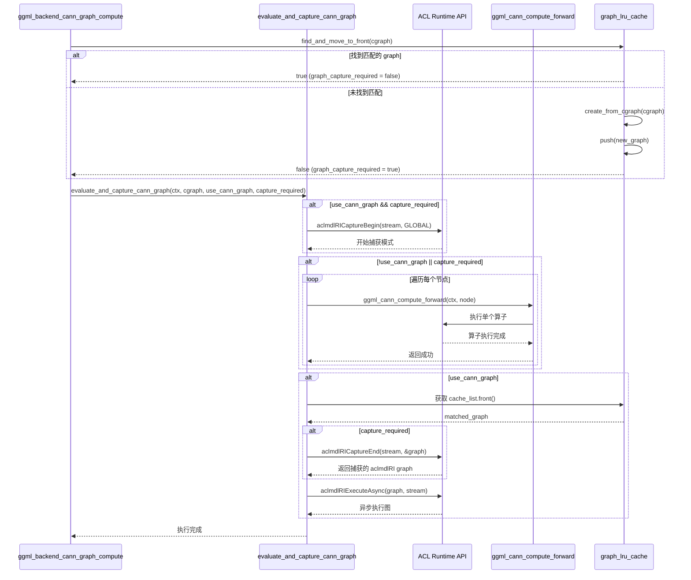

# ACL GRAPH 接入设计方案

## 1. 概述

本文档描述了在 llama.cpp 的 CANN 后端中接入 ACL GRAPH 的完整设计方案。ACL GRAPH 是华为昇腾 AI 处理器提供的运行时接口（Runtime Interface），通过图捕获和复用机制，能够显著提升计算图的执行效率。

### 1.1 设计目标

- 通过 ACL GRAPH 的图捕获和复用机制，减少算子调度开销
- 支持计算图的动态匹配和缓存，提高重复计算图的执行效率
- 保持向后兼容，支持传统的逐算子执行模式（eager mode）
- 提供灵活的配置选项，支持用户自定义是否启用图模式

### 1.2 核心技术点

1. **图捕获机制**：使用 `aclmdlRICaptureBegin` 和 `aclmdlRICaptureEnd` 捕获计算图
2. **图执行机制**：使用 `aclmdlRIExecuteAsync` 异步执行已捕获的图
3. **图匹配与缓存**：通过 LRU 缓存机制管理和复用已捕获的计算图
4. **图属性匹配**：通过节点属性比较判断计算图是否匹配

## 2. 系统架构

### 2.1 整体架构图

```
┌─────────────────────────────────────────────────────────────┐
│                    ggml_backend_cann_graph_compute          │
│                        (入口函数)                            │
└────────────────────┬────────────────────────────────────────┘
                     │
                     ▼
        ┌────────────────────────────┐
        │  判断是否启用 ACL GRAPH      │
        │  - acl_graph_mode 配置      │
        │  - prefill 模式检测          │
        └────────────┬───────────────┘
                     │
                     ▼
        ┌────────────────────────────┐
        │  Graph LRU Cache 查找/创建  │
        │  - find_and_move_to_front   │
        │  - create_from_cgraph      │
        └────────────┬───────────────┘
                     │
                     ▼
┌──────────────────────────────────────────────────────────────┐
│        evaluate_and_capture_cann_graph (核心方法)             │
├──────────────────────────────────────────────────────────────┤
│  1. 图捕获阶段 (如果需要)                                       │
│     - aclmdlRICaptureBegin                                   │
│                                                              │
│  2. 计算图执行阶段                                             │
│     - 逐算子执行 (ggml_cann_compute_forward)                  │
│                                                              │
│  3. 图结束捕获阶段 (如果需要)                                    │
│     - aclmdlRICaptureEnd                                     │
│                                                              │
│  4. 图执行阶段 (如果使用 graph)                                 │
│     - aclmdlRIExecuteAsync                                   │
└──────────────────────────────────────────────────────────────┘
```

## 3. 类图设计

### 3.1 核心类结构

```
┌──────────────────────────────────────────────────────────────┐
│              ggml_backend_cann_context                       │
├──────────────────────────────────────────────────────────────┤
│  + int32_t device                                            │
│  + std::string name                                          │
│  + bool acl_graph_mode                                       │
│  + ggml_cann_graph_lru_cache graph_lru_cache                 │
│  + aclrtStream streams[GGML_CANN_MAX_STREAMS]                │
│  + ggml_cann_pool* mem_pool                                  │
├──────────────────────────────────────────────────────────────┤
│  + stream(int stream): aclrtStream                           │
│  + stream(): aclrtStream                                     │
│  + pool(): ggml_cann_pool&                                   │
└──────────────────────────────────────────────────────────────┘
                            │
                            │ contains
                            ▼
┌──────────────────────────────────────────────────────────────┐
│            ggml_cann_graph_lru_cache                         │
├──────────────────────────────────────────────────────────────┤
│  + size_t capacity                                           │
│  + std::list<ggml_cann_graph*> cache_list                    │
├──────────────────────────────────────────────────────────────┤
│  + push(ggml_cann_graph* new_node): void                     │
│  + find_and_move_to_front(ggml_cgraph*): bool                 │
│  + clear(): void                                             │
└──────────────────────────────────────────────────────────────┘
                            │
                            │ manages
                            ▼
┌──────────────────────────────────────────────────────────────┐
│                  ggml_cann_graph                             │
├──────────────────────────────────────────────────────────────┤
│  + aclmdlRI graph                                            │
│  + std::vector<ggml_graph_node_properties>                   │
│      ggml_graph_properties                                   │
├──────────────────────────────────────────────────────────────┤
│  + create_from_cgraph(ggml_cgraph*):                         │
│      static ggml_cann_graph*                                 │
│  + matches_cgraph(ggml_cgraph*): bool                        │
└──────────────────────────────────────────────────────────────┘
                            │
                            │ contains
                            ▼
┌──────────────────────────────────────────────────────────────┐
│            ggml_graph_node_properties                        │
├──────────────────────────────────────────────────────────────┤
│  + void* node_address                                        │
│  + int64_t ne[GGML_MAX_DIMS]                                 │
│  + size_t nb[GGML_MAX_DIMS]                                  │
│  + void* src_address[GGML_MAX_SRC]                           │
│  + int64_t src_ne[GGML_MAX_SRC][GGML_MAX_DIMS]               │
│  + size_t src_nb[GGML_MAX_SRC][GGML_MAX_DIMS]                │
│  + ggml_op node_op                                           │
│  + int32_t op_params[GGML_MAX_OP_PARAMS/sizeof(int32_t)]     │
├──────────────────────────────────────────────────────────────┤
│  + has_matching_properties(ggml_tensor*): bool               │
└──────────────────────────────────────────────────────────────┘
```

## 4. 核心方法设计

### 4.1 evaluate_and_capture_cann_graph 方法详细设计

```cpp
static void evaluate_and_capture_cann_graph(
    ggml_backend_cann_context * cann_ctx,      // CANN 后端上下文
    ggml_cgraph *               cgraph,        // GGML 计算图
    bool                        use_cann_graph, // 是否使用 CANN graph
    bool                        cann_graph_capture_required // 是否需要捕获图
)
```

**方法职责**：
1. 根据条件决定是否开始图捕获
2. 执行计算图中的所有算子（逐算子模式或捕获模式）
3. 结束图捕获并获取捕获的图对象
4. 执行已捕获的图（如果使用 graph 模式）

**执行流程**：

```
开始
 │
 ├─> [if use_cann_graph && cann_graph_capture_required]
 │   │
 │   └─> aclmdlRICaptureBegin(stream, ACL_MODEL_RI_CAPTURE_MODE_GLOBAL)
 │       └─> 开始图捕获模式
 │
 ├─> [if !use_cann_graph || cann_graph_capture_required]
 │   │
 │   └─> for each node in cgraph:
 │       │
 │       ├─> 跳过空节点、RESHAPE、VIEW 等无需执行的节点
 │       │
 │       └─> ggml_cann_compute_forward(ctx, node)
 │           └─> 执行单个算子
 │
 ├─> [if use_cann_graph]
 │   │
 │   ├─> 从 cache_list 前端获取匹配的 graph
 │   │
 │   ├─> [if cann_graph_capture_required]
 │   │   │
 │   │   └─> aclmdlRICaptureEnd(stream, &graph->graph)
 │   │       └─> 结束图捕获，获取 aclmdlRI 图对象
 │   │
 │   └─> aclmdlRIExecuteAsync(graph->graph, stream)
 │       └─> 异步执行已捕获的图
 │
结束
```

## 5. 流程图

### 5.1 整体执行流程图


### 5.2 Graph 匹配与缓存流程图


### 5.3 图捕获与执行流程图



## 6. 数据结构设计

### 6.1 ggml_graph_node_properties

用于存储和匹配计算图节点的所有关键属性：

```cpp
struct ggml_graph_node_properties {
    // 输出张量属性
    void*  node_address;           // 节点数据地址
    int64_t ne[GGML_MAX_DIMS];     // 节点维度
    size_t  nb[GGML_MAX_DIMS];     // 节点步长
    
    // 输入张量属性
    void*  src_address[GGML_MAX_SRC];              // 源张量地址数组
    int64_t src_ne[GGML_MAX_SRC][GGML_MAX_DIMS];   // 源张量维度数组
    size_t  src_nb[GGML_MAX_SRC][GGML_MAX_DIMS];   // 源张量步长数组
    
    // 算子属性
    ggml_op node_op;                               // 算子类型
    int32_t op_params[GGML_MAX_OP_PARAMS / sizeof(int32_t)]; // 算子参数
};
```

**匹配逻辑**：
- 比较节点地址（VIEW 节点除外）
- 比较算子类型
- 比较所有维度和步长
- 比较所有源张量的地址、维度和步长
- 对于特定算子（SCALE、UNARY、GLU），比较算子参数

### 6.2 ggml_cann_graph

封装 ACL GRAPH 对象和对应的节点属性：

```cpp
struct ggml_cann_graph {
    aclmdlRI graph;  // ACL Runtime Interface 图对象
    std::vector<ggml_graph_node_properties> ggml_graph_properties;
    
    // 从 ggml_cgraph 创建
    static ggml_cann_graph* create_from_cgraph(ggml_cgraph* cgraph);
    
    // 检查是否匹配给定的 ggml_cgraph
    bool matches_cgraph(ggml_cgraph* cgraph);
};
```

### 6.3 ggml_cann_graph_lru_cache

LRU 缓存管理器，用于管理多个已捕获的计算图：

```cpp
struct ggml_cann_graph_lru_cache {
    size_t capacity;                              // 缓存容量（默认12）
    std::list<ggml_cann_graph*> cache_list;      // LRU 列表
    
    void push(ggml_cann_graph* new_node);        // 添加新图到前端
    bool find_and_move_to_front(ggml_cgraph*);   // 查找并移动到前端
    void clear();                                 // 清空缓存
};
```

**LRU 策略**：
- 新添加的 graph 放在列表前端
- 查找匹配时，将匹配的 graph 移动到前端
- 当缓存满时，删除列表末尾（最久未使用）的 graph

## 7. 关键设计决策

### 7.1 图捕获时机

**决策**：只在需要重新捕获图时才执行捕获操作。

**理由**：
- 图捕获需要遍历所有算子，开销较大
- 通过 LRU 缓存机制，大部分情况下可以直接复用已捕获的图
- 只有当计算图结构或参数发生变化时，才需要重新捕获

### 7.2 图匹配策略

**决策**：基于节点属性的精确匹配。

**匹配维度**：
1. 节点数量必须相同
2. 每个节点的算子类型必须相同
3. 每个节点的维度、步长必须相同
4. 每个节点的输入张量地址、维度、步长必须相同
5. 对于参数敏感的算子，算子参数必须相同

**特殊处理**：
- VIEW 节点不比较地址（地址可能变化但逻辑相同）
- 跳过空节点、RESHAPE、VIEW 等无需执行的节点

### 7.3 缓存管理策略

**决策**：采用 LRU（Least Recently Used）缓存策略。

**优点**：
- 简单高效，适合计算图重复执行场景
- 内存占用可控（固定容量）
- 自动淘汰最久未使用的图，释放资源

**容量配置**：
- 默认容量：12 个图
- 可通过环境变量 `GGML_CANN_GRAPH_CACHE_CAPACITY` 配置

### 7.4 执行模式切换

**决策**：支持灵活的配置选项，根据场景自动选择执行模式。

**场景判断**：
1. **全局配置**：`GGML_CANN_ACL_GRAPH` 环境变量控制是否启用
2. **Prefill 模式检测**：通过检测 `FLASH_ATTN_EXT` 算子的序列长度判断
3. **图可用性**：只有当 cache 中存在匹配的图或需要捕获新图时才使用 graph 模式

## 8. 性能优化考虑

### 8.1 图捕获开销

**问题**：图捕获需要执行一次完整的计算图，存在额外开销。

**优化**：
- 只在必要时捕获（通过缓存机制减少捕获次数）
- 捕获时仍执行实际计算，不浪费计算资源
- 对频繁重复的计算图，捕获一次可多次复用

### 8.2 内存管理

**问题**：每个缓存的图占用内存资源。

**优化**：
- LRU 缓存限制最大数量
- 图销毁时自动释放 `aclmdlRI` 资源
- 支持通过环境变量调整缓存容量

### 8.3 异步执行

**优势**：使用 `aclmdlRIExecuteAsync` 异步执行图，避免阻塞主线程。

## 9. 错误处理

### 9.1 ACL API 错误检查

所有 ACL API 调用都通过 `ACL_CHECK` 宏进行错误检查：

```cpp
#define ACL_CHECK(stmt) ACL_CHECK_GEN(stmt, 0, aclGetRecentErrMsg)
```

**错误处理流程**：
1. 检查返回值是否为成功码（0）
2. 如果失败，调用 `aclGetRecentErrMsg` 获取错误信息
3. 调用 `ggml_cann_error` 打印错误并终止程序

### 9.2 资源清理

**析构函数保证**：
- `ggml_cann_graph`: 自动调用 `aclmdlRIDestroy` 释放图资源
- `ggml_cann_graph_lru_cache`: 自动清理所有缓存的图

## 10. 配置选项

### 10.1 环境变量

| 环境变量 | 说明 | 默认值 |
|---------|------|--------|
| `GGML_CANN_ACL_GRAPH` | 是否启用 ACL Graph 模式 | `on` |
| `GGML_CANN_PREFILL_USE_GRAPH` | Prefill 阶段是否使用 Graph | 空（false） |
| `GGML_CANN_GRAPH_CACHE_CAPACITY` | Graph 缓存容量 | `12` |

### 10.2 代码配置

```cpp
// 在 ggml_backend_cann_context 构造函数中
acl_graph_mode = parse_bool(get_env("GGML_CANN_ACL_GRAPH").value_or("on"));
```

## 11. 测试建议

### 11.1 功能测试

1. **图捕获测试**：验证图捕获流程是否正确
2. **图匹配测试**：验证相同/不同计算图的匹配逻辑
3. **缓存管理测试**：验证 LRU 缓存的添加、查找、淘汰逻辑
4. **模式切换测试**：验证 eager mode 和 graph mode 的正确切换

### 11.2 性能测试

1. **首次执行**：对比启用/禁用 graph 模式的首次执行时间
2. **重复执行**：对比启用/禁用 graph 模式的重复执行时间
3. **缓存效果**：测试不同缓存容量对性能的影响

### 11.3 边界测试

1. **缓存满场景**：测试缓存满时的淘汰逻辑
2. **空图场景**：测试空计算图的处理
3. **大量节点场景**：测试包含大量节点的计算图

## 12. 总结

本设计方案通过 ACL GRAPH 的图捕获和复用机制，实现了高效的计算图执行。核心特点包括：

1. **灵活的配置**：支持多种配置选项，适应不同使用场景
2. **智能缓存**：LRU 缓存机制自动管理已捕获的图
3. **精确匹配**：基于节点属性的精确匹配确保图复用的正确性
4. **向后兼容**：支持传统的逐算子执行模式
5. **资源管理**：自动管理图资源，防止内存泄漏

该设计在保持代码简洁性的同时，充分利用了 ACL GRAPH 的性能优势，为 llama.cpp 在昇腾 AI 处理器上的高效运行提供了坚实基础。

