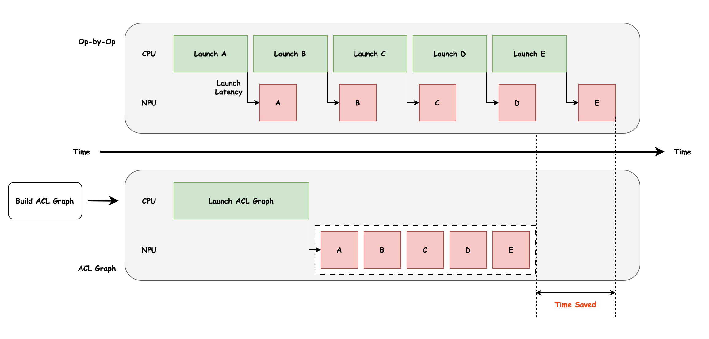
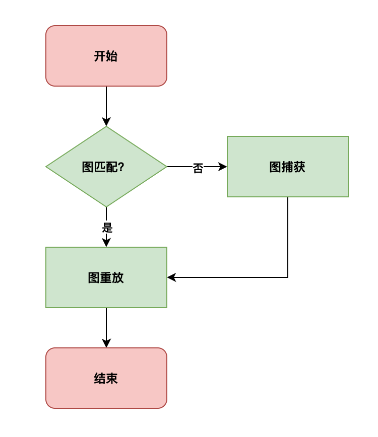
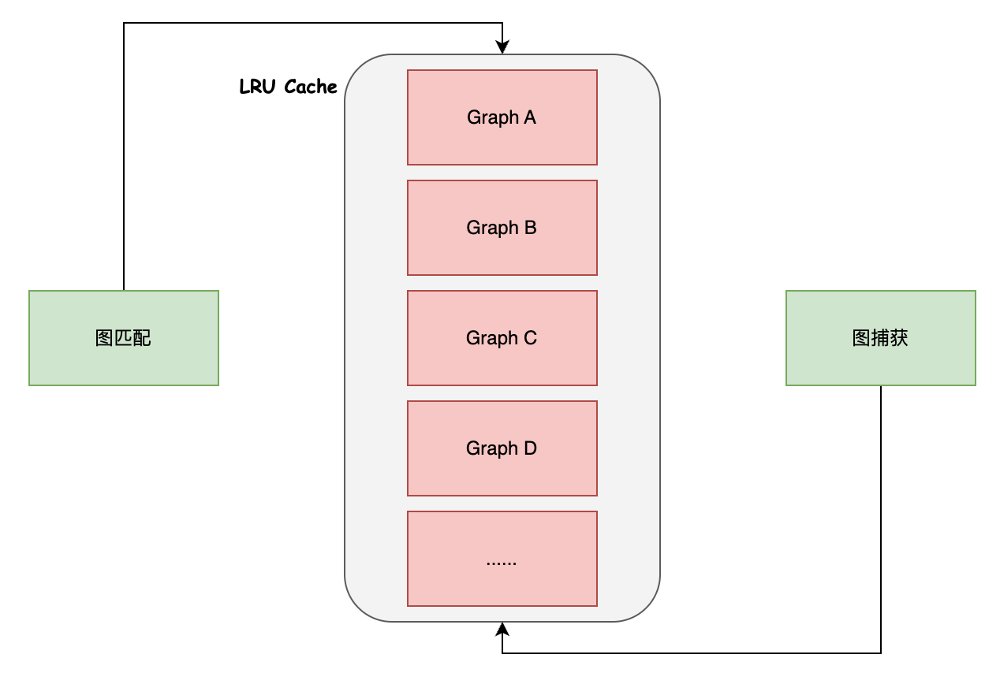
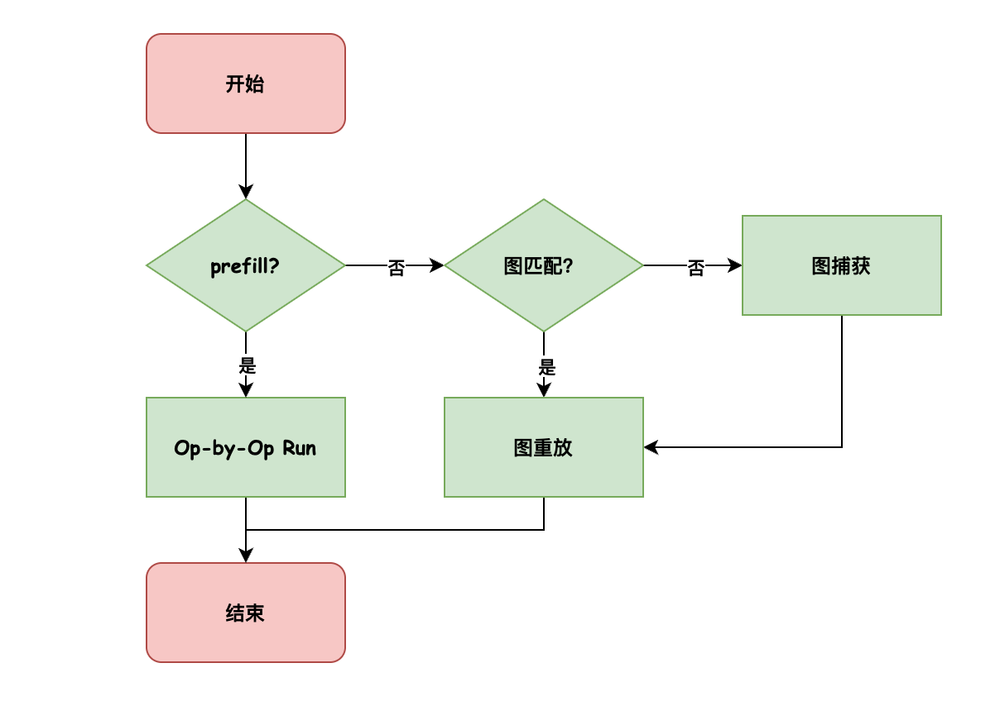
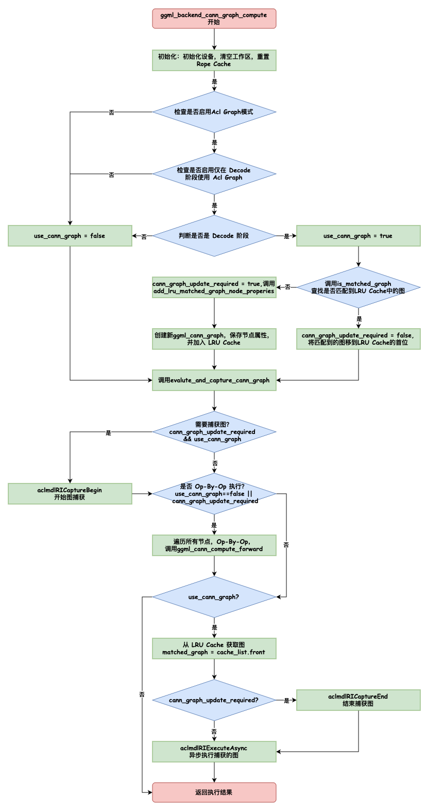

# Llama.cpp 接入 ACL Graph 性能优化介绍

## 背景

[Llama.cpp](https://github.com/ggerganov/llama.cpp) 是一个轻量级、纯 C/C++ 实现的大语言模型推理框架，能够在多种硬件平台上高效运行。为了进一步发挥华为昇腾 AI 处理器的潜能，我们尝试将 Llama.cpp 的算子执行逻辑与 **ACL Graph**（Ascend Computing Language 图模式）进行深度集成，从而实现更高效的推理性能。

在传统的 **Op-by-Op** 模式下，每个算子的执行都需要独立下发，涉及算子构建、内存拷贝和同步操作，这在大规模推理任务中会带来明显的开销。而 **ACL Graph 模式** 能够将一系列算子组合成计算图，并在图级别完成优化与调度，从而减少算子下发次数，提升算子融合与内存调度效率。

下图展示了 **ACL Graph 相较于传统 Op-by-Op 模式的优化示意**。可以看到，ACL Graph 主要解决的是 **CPU 端瓶颈（CPU Bound）**：通过减少算子下发，降低 CPU 压力，避免 NPU 长时间等待 CPU 调度。

- 对于参数规模较小的模型，这种优化效果尤为显著。例如在 Llama.cpp 上测试 **Qwen2.5-0.5B** 时，性能提升超过一倍。
- 对于参数规模较大的模型，性能瓶颈通常来自 NPU 端的算力本身（如下图中 A、B、C、D、E 等算子耗时较长），因此 ACL Graph 带来的收益相对有限。



## ACL Graph 接入

ACL Graph 模式的接入流程如图所示，主要分为 **图匹配**、**图捕获** 和 **图重放** 三个阶段。



### 图匹配

在执行算子序列前，需要判断其是否与已有的计算图匹配：

1. 若匹配成功，直接进行图重放；
2. 若不匹配，则销毁旧图，重新捕获并生成新图，再进行重放。

图匹配的核心判断条件包括：

- 算子序列的算子数量是否与图中的一致；
- 各算子类型是否相同；
- 各算子的输入输出地址是否一致；
- 各算子的输入输出维度是否一致。

在早期实现中，图匹配逻辑仅基于 **单一计算图**，这使得匹配命中率较低。为了提升匹配成功的概率，我们引入了 **LRU（Least Recently Used）Cache** 机制。

在进行图匹配时，系统会遍历 Cache 中所有已保存的计算图，逐一进行匹配：

- 如果找到匹配的计算图，则直接复用该图并进行重放，并基于 **LRU 策略** 更新 Cache；
- 如果没有任何图匹配成功，则重新执行图捕获，并基于 **LRU 策略** 更新 Cache，替换掉最久未被使用的计算图。

通过引入 LRU Cache，能够显著提升图复用率，减少频繁的图构建开销，从而进一步提高整体推理性能。



### 图捕获

图捕获的过程就是将当前执行的算子序列转化为计算图，具体步骤如下：

1. 调用 `aclmdlRICaptureBegin` 开始图捕获；
2. 按照 **Op-by-Op** 的方式依次执行算子序列；
3. 调用 `aclmdlRICaptureEnd` 结束捕获，得到完整计算图。

在 **prefill 阶段**，算子的维度信息与 prompt 的长度高度相关，导致计算图形态随输入变化而频繁改变。即使成功捕获了图，由于其复用频率极低，每次仍需执行“先捕获、再执行”的流程，不仅无法发挥 Graph 重放的优势，还会增加 **LRU Cache** 的管理负担（频繁触发图的销毁与替换）。

为降低这部分开销，我们在 prefill 阶段保留 **Op-by-Op 模式**，避免不必要的图捕获与 Cache 更新。而在 **decode 阶段**，每次推理的 `seq_length` 固定为 1，算子序列和维度保持一致，计算图可以稳定复用，此时采用 **ACL Graph 模式** 能够带来显著收益。



### 图重放

对于已捕获的计算图，可通过 `aclmdlRIExecuteAsync` 进行重放。
所谓重放，就是 **Launch ACL Graph + Execute Graph** 的过程，即直接调度整个计算图执行，而非逐算子下发。

### 全流程



#### 关键函数说明

1. `ggml_backend_cann_graph_compute` (入口函数)

- **作用**: 计算图的主入口
- **关键步骤**:
  1. 初始化设备和工作区
  2. 重置 rope_cache
  3. 决定是否使用 ACL Graph
  4. 查找或创建匹配的图
  5. 执行图计算

2. `is_matched_graph` (图匹配检查)

- **作用**: 在 LRU 缓存中查找匹配的计算图
- **匹配条件**:
  - 节点数量相同
  - 每个节点的属性匹配:
    - 操作类型 (node_op)
    - 张量形状 (ne, nb)
    - 输入张量地址和形状
    - 操作参数 (op_params)
- **返回**: 找到匹配图时，将其移到缓存前端并返回 true

3. `add_lru_matched_graph_node_properties` (添加新图)

- **作用**: 创建新的图并保存到 LRU 缓存
- **保存的属性**:
  - 节点地址
  - 操作类型
  - 张量维度 (ne, nb)
  - 所有输入张量的地址和维度
  - 操作参数

4. `evaluate_and_capture_cann_graph` (执行和捕获)

- **作用**: 执行计算图并可选地捕获为 ACL Graph
- **流程**:
  1. 如果需要捕获: 调用 `aclmdlRICaptureBegin`
  2. 如果需要执行操作: 遍历节点并调用 `ggml_cann_compute_forward`
  3. 如果使用 Graph: 
     - 如果需要捕获: 调用 `aclmdlRICaptureEnd` 保存图
     - 调用 `aclmdlRIExecuteAsync` 执行图

#### LRU 缓存机制

- **容量**: 默认 12 个图 (可通过 `GGML_CANN_GRAPH_CACHE_CAPACITY` 环境变量配置)
- **策略**: 
  - 新图插入到前端
  - 匹配的图移到前端
  - 超过容量时删除最旧的图

#### 决策点说明

1. **是否使用 Graph**:
   - `USE_ACL_GRAPH` 宏定义
   - `GGML_CANN_PREFILL_USE_GRAPH` 环境变量
   - Flash Attention 的序列长度 (prefill vs decode)
   - `acl_graph_mode` 配置

2. **是否需要捕获新图**:
   - 当前图与缓存中的图不匹配
   - 首次执行该图结构

3. **是否需要执行操作**:
   - 不使用 Graph 模式
   - 需要捕获新图 (必须执行一次以捕获)

#### 性能优化点

1. **图缓存**: 相同结构的图只需捕获一次，后续直接执行
2. **LRU 策略**: 保持最常用的图在缓存中
3. **条件执行**: 使用 Graph 时，第二次及以后直接执行图，跳过逐操作执行

## GGML_OP_CPY 算子问题

在将 ACL Graph 接入 Llama.cpp 时，最大的挑战来自运算符 **`GGML_OP_CPY`**。

Llama.cpp 的各个后端接入实际上是通过框架维护的一套 **API 和运算符抽象（GGML_OP）** 来完成的，每个后端需要实现对应的 API 和运算符逻辑。在进行 **图捕获** 判断时，需要校验以下信息是否一致：

- 节点的 **地址**
- 节点的 **维度**
- **节点个数**
- **运算符类型**

只有当这些信息完全一致时，才可以直接重放已捕获的图；否则就需要重新构图。

### 问题：GGML_OP_CPY 的地址变化

在 Llama.cpp 中，`GGML_OP_CPY` 主要用于 **生成并记录 KV Cache** 的过程。每次推理时，最新的 KV Cache 都会被拷贝到一个新的目标地址中。这导致 **每次算子节点的目的地址（dst）都会改变**，进而触发 **频繁的图重建**。结果是：

- 每个 token 都需要重新捕获和构建计算图；
- 图重放失去了意义；
- 性能甚至只有普通模式（Op-by-Op）的 **50% 左右**。

然而，本质上 `GGML_OP_CPY` 的变化只有 **目的地址不同**，其他信息均保持一致。因此，我们尝试了一些优化思路。

### 尝试的方案

1. **间接寻址方案（参考 CUDA Graph）**

   - 记录所有的 `dst` 地址，并维护一个二级指针；
   - 在调用底层 CANN 算子（如 InplaceCopy/Cast）时，将二级指针和索引传递给算子，由算子通过 **地址 + 索引** 获取实际 `dst` 地址；
   - 从而实现“固定的逻辑地址”，避免频繁构图。
   - **问题**：此方案需要额外开发算子，且 aclnn 对间接寻址支持存在不确定性，最终被否决。

2. **固定内存方案**

   - 申请一块固定内存，将所有 `dst` 都映射到这里，保证 ACL 调用时地址相同；
   - 但这会导致 **KV Cache 读取错误**：因为实际计算出的 KV Cache 被写入了固定内存，而没有放到真正的 KV Cache 区域。

3. **固定内存 + 间接拷贝**

   - 结合 `aclrtMemcpyAsyncWithDesc` 提供的间接寻址，将计算结果先写入固定内存，再以间接方式拷贝到 KV Cache 中实际位置；

   - **问题**：KV Cache 中 `k` 的存储地址是 **完全不连续的**，对于存储上不连续的张量，`aclrtMemcpy` 无法直接拷贝；逐个拷贝也不可行，因为 `aclrtMemcpy` 的源地址和目的地址都必须 **64 字节对齐**。

     - 一种情况是内存上连续，但因为转置等操作导致逻辑访问不连续；

     - 另一种情况则是物理存储本身不连续（如下图所示，每个 token 的 K Cache 被分散存放在不同位置），即刚才提到的 **完全不连续**。

       ```
       x x x x x s o o
       x x x x x s o o
       x x x x x s o o
       x x x x x s o o
       ```

### 最终方案：使用 SET_ROWS 替代

最终，我们采用 `SET_ROWS` 算子 来规避 `CPY` 算子的问题。

- `SET_ROWS` 可以直接设置 tensor 的某一行数据；
- KV Cache 在初始化时已经分配好内存，每个 token 的 cache 存储位置是固定的；
- 在更新 KV Cache 时，可以通过 `SET_ROWS` 将新生成的 KV Cache 数据写入对应行；
- 更重要的是，`SET_ROWS` 的输入地址始终固定（KV Cache 的起始地址），这样就避免了频繁重构图的问题。

通过这一改造，Llama.cpp 在接入 ACL Graph 时成功绕过了 `CPY` 带来的性能瓶颈，大幅提升了推理效率。

## Rope cache
### RoPE Cache Init 公式推导

在 `llama.cpp` 中，RoPE 的 cache 初始化逻辑可以写成如下数学公式：

以下计算针对每个seq的token进行计算，其中`i`是head dim维度，不同的head的RoPE cache相同。RoPE输入的shape为 [B, S, N, D]。位置信息保存的值即为$${\theta}$$。

1. 频率因子

$$
f_f =
\begin{cases}
\text{freq\_factors}[i_0/2], & \text{若 freq\_factors 存在} \\
1.0, & \text{否则}
\end{cases}
$$

2. 外推角度

$$
\theta_{\text{extrap}} = \dfrac{\theta}{f_f}
$$

 3. 插值角度

$$
\theta_{\text{interp}} = f_s \cdot \theta_{\text{extrap}}
$$

4. 最终角度计算

若 **$e = 0$（ext\_factor 不存在）**：

$$
\theta = \theta_{\text{interp}}
$$


若 **$e \neq 0$（ext\_factor 存在）**：

ramp 函数：

$$
r(i_0) =
\begin{cases}
1, & \tfrac{i_0}{2} \leq low \\
1 - \dfrac{\tfrac{i_0}{2} - low}{high - low}, & low < \tfrac{i_0}{2} < high \\
0, & \tfrac{i_0}{2} \geq high
\end{cases}
$$

其中 $(low, high) = (\text{corr\_dims}[0], \text{corr\_dims}[1])$。

最终角度：

$$
\theta = (1-r(i_0)) \cdot \theta_{\text{interp}} + r(i_0) \cdot \theta_{\text{extrap}}
$$

5. 幅度缩放（仅当 $e \neq 0$ 时）

$$
m \gets m \cdot \left(1 + 0.1 \cdot \ln \frac{1}{f_s}\right)
$$

6. 写入 Cache

$$
\text{cache}[i_0] = m \cdot \cos(\theta)
$$

$$
\text{cache}[i_0+1] = m \cdot \sin(\theta)
$$

7. 更新角度

$$
\theta \gets \theta \cdot \theta_{\text{scale}}
$$


### 使用aclnn算子实现

#### ext factor为0时

由于昇腾适合向量计算，所以，需要将上述计算方法等价变换成向量计算的过程。
$$
\theta \gets \theta \cdot \theta_{\text{scale}}
$$
首先处理这个角度更新的部分，由于$${\theta}$$是Position矩阵的对应每个seq token的值，这里针对每一个head dims，$${\theta}$$的值都需要乘以$$\theta_{\text{scale}}$$，那就等价于，对每个seq token的值


$$
\theta_{\text{scale}} = \left(\theta_{\text{scale}}\right)^{\text{head\_dim[i]}}
$$
所以第一步先计算每个head dim对应的$$\theta_{\text{scale}}$$的值，可以通过arrange生成 $${\{1,2,\dots,\text{head\_dim}\}}$$。
$$
\theta_{\text{scale}} = \left(\theta_{\text{scale}}\right)^{\{1,2,\dots,\text{head\_dim}\}}
$$
然后再计算外推角度和插值角度，这里先不计算与$${\theta}$$相乘，尽可能将不变的部分先计算
$$
\theta_{\text{extrap}} = \dfrac{\left(\theta_{\text{scale}}\right)^{\{1,2,\dots,\text{head\_dim}\}}}{f_f}
$$

$$
\theta_{\text{interp}} = \dfrac{\left(\theta_{\text{scale}}\right)^{\{1,2,\dots,\text{head\_dim}\} \cdot f_s}}{f_f}
$$

上述计算，仅与head_dim和一些输入的常量有关，在常量不发生变化的情况下，**将$$\theta_{\text{interp}} $$ 的值进行缓存，减少后续的计算量**。

如果ext_factor为0，计算与$${\theta}$$的乘积即可
$$
\theta \gets \theta \cdot \dfrac{\left(\theta_{\text{scale}}\right)^{\{1,2,\dots,\text{head\_dim}\} \cdot f_s  }}{f_f}
$$


最后，计算sin和cos的值
$$
\text{cache}[i_0] = m \cdot \cos(\theta)
$$

$$
\text{cache}[i_0+1] = m \cdot \sin(\theta)
$$

可以看出，对于每个layer，cache的值也是不会变化的，所以**sin和cos的cache，在每个layer的常量不变的情况下，仅在layer[0]计算**，其他layer直接用缓存的值。


#### ext factor不为0时


ramp 函数：

$$
r(i_0) =
\begin{cases}
1, & \tfrac{i_0}{2} \leq low \\
1 - \dfrac{\tfrac{i_0}{2} - low}{high - low}, & low < \tfrac{i_0}{2} < high \\
0, & \tfrac{i_0}{2} \geq high
\end{cases}
$$

展开混合公式：

$$
\theta = \theta_{\text{interp}} \cdot (1 - r) + \theta_{\text{extrap}} \cdot r
= \theta_{\text{extrap}} \cdot \big(f_s - f_s \cdot r + r \big)
$$

为了向量化和常量缓存，可以将系数提取出来：

$$
\text{cache\_factor} = f_s - f_s \cdot r + r
$$

或考虑源码中 ramp 的取反：

$$
\text{cache\_factor} = f_s + (f_s - 1) \cdot r
$$

最终：

$$
\theta = \theta_{\text{extrap}} \cdot \text{cache\_factor}
$$

也就是：
$$
\theta \gets \theta \cdot  \dfrac{\left(\theta_{\text{scale}}\right)^{\{1,2,\dots,\text{head\_dim}\} \cdot \text{cache\_factor} }}{f_f}
$$
同时，缩放幅度也需要进行计算
$$
attn\_factor \gets attn\_factor \cdot \left(1 + 0.1 \cdot \ln \frac{1}{f_s}\right)
$$
其他计算步骤与ext factor不为0的场景相同。

经过rope cache的缓存，对小参数量的推理速度有10%以上的提升。