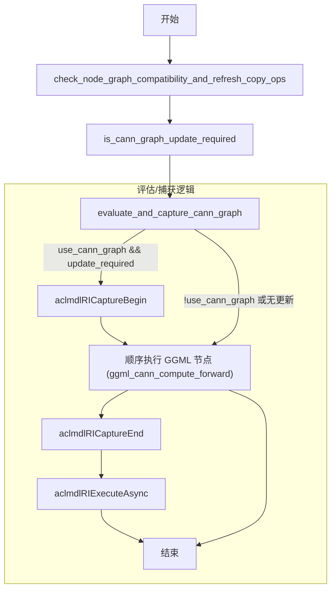
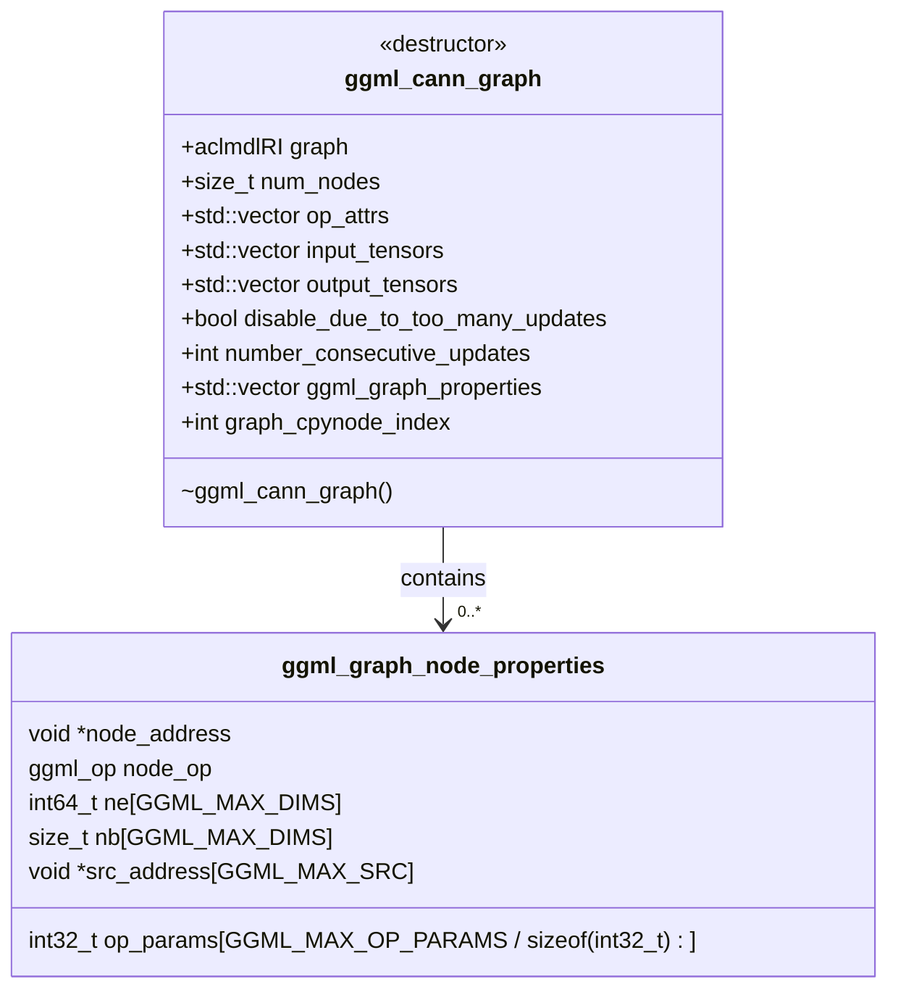

# ACL Graph 接口映射

| ACL接口                           | NVIDIA接口                          | 备注                                                 |
| --------------------------------- | ----------------------------------- | ---------------------------------------------------- |
| aclmdlRICaptureBegin              | cudaStreamBeginCapture              | 开始流capture                                        |
| aclmdlRICaptureEnd                | cudaStreamEndCapture                | 结束capture并实例化                                  |
| aclmdlRICaptureEnd                | cudaGraphInstantiate                | 结束capture并实例化                                  |
| aclmdlRICaptureEnd                | cudaGraphUpload                     | 结束capture并实例化                                  |
| aclmdlRICaptureGetInfo            | cudaStreamGetCaptureInfo            | 获取stream的捕获信息                                 |
| aclmdlRICaptureGetInfo            | cudaStreamIsCapturing               | 获取stream的捕获信息                                 |
| aclmdlRICaptureThreadExchangeMode | cudaThreadExchangeStreamCaptureMode | 切换线程的capture模式                                |
| aclmdlRIDebugPrint                | cudaGraphDebugDotPrint              | capture维测                                          |
| aclmdlRIDestroy                   | cudaGraphDestroy                    | 销毁capture的graph                                   |
| aclmdlRIDestroy                   | cudaGraphExecDestroy                | 销毁capture的graph                                   |
| aclmdlRIExecuteAsync              | cudaGraphLaunch                     | 执行capture的graph                                   |
| aclmdlRICaptureTaskGrpBegin       | /                                   | NPU提供针对capture graph更新能力接口，无对应cuda接口 |
| aclmdlRICaptureTaskGrpEnd         | /                                   | NPU提供针对capture graph更新能力接口，无对应cuda接口 |
| aclmdlRICaptureTaskUpdateBegin    | /                                   | NPU提供针对capture graph更新能力接口，无对应cuda接口 |
| aclmdlRICaptureTaskUpdateEnd      | /                                   | NPU提供针对capture graph更新能力接口，无对应cuda接口 |

# ACL Graph 接入Llama.cpp

代码链接：https://github.com/noemotiovon/llama.cpp/tree/acl_graph

计算图入口方法：`ggml_backend_cann_graph_compute`

ACL Graph的计算逻辑如下：

1. 开始捕获图；
2. 判断图有没有改变，如果没有改变，则直接执行图；如果改变了，则重新捕获图；
3. 执行图。

具体流程图如下：



在流程图中，复杂的逻辑都在评估和捕获中，为了判断是否需要重新捕获，引入了下面连个类，用于存储图捕获中的信息。




# 模型推理测试

本次测试仅为单卡上的模型推理测试，数据量不大，仅供参考。

在Acl Graph场景，目前存在精度问题，具体精度原因在下一节介绍。

## 脚本

```bash
# 基础功能
./bin/llama-cli -m /path/to/model -p "Building a website can be done in 10 steps:" -ngl 32

# FA
./bin/llama-cli -m /path/to/model -p "Building a website can be done in 10 steps:" -ngl 32 -fa

# 异步下发
export GGML_CANN_ASYNC_MODE=1
./bin/llama-cli -m /path/to/model -p "Building a website can be done in 10 steps:" -ngl 32

# aclgraph
./bin/llama-cli -m /path/to/model -p "Building a website can be done in 10 steps:" -ngl 32
```

## 测试代码

`普通推理`，`FA`，`异步下发`使用 [ggml-org/llama.cpp](https://github.com/ggml-org/llama.cpp) master分支的 `72c6bc3f3d0cf3bf160dddf1b803fed52bcbb0a3`。

`aclgraph` 使用 [noemotiovon/llama.cpp](https://github.com/noemotiovon/llama.cpp/tree/acl_graph) 的 `acl_graph` 分支。

## 设备 910B4

**推理速度（tok/s）：**

| 模型     | Qwen2.5-0.5B-F16 | Qwen2.5-7B-F16 | Qwen2.5-7B-Q8 | Qwen2.5-0.5B-Q4 |
| -------- | ---------------- | -------------- | ------------- | --------------- |
| 普通推理 | 55.58            | 31.41          | 19.38         | 14.25           |
| FA       | 57.45            | 33.89          | 20.31         | 14.92           |
| 异步下发 | 58.89            | 32.24          | 19.90         | 14.78           |
| aclgraph | 102.36           | 31.92          | 19.77         | 14.58           |

**AI Core 占比：**

| 模型     | Qwen2.5-0.5B-F16 | Qwen2.5-7B-F16 | Qwen2.5-7B-Q8 | Qwen2.5-0.5B-Q4 |
| -------- | ---------------- | -------------- | ------------- | --------------- |
| 普通推理 | 11%              | 63%            | 75%           | 45%             |
| FA       | 11%              | 63%            | 79%           | 48%             |
| 异步下发 | 11%              | 65%            | 78%           | 48%             |
| aclgraph | 22%              | 65%            | 79%           | 48%             |

## 设备 310P

**推理速度：**

| 模型     | Qwen2.5-0.5B-F16 | Qwen2.5-7B-F16 | Qwen2.5-7B-Q8 | Qwen2.5-0.5B-Q4 | Qwen3-0.6B-F16 | Qwen3-8B-F16 |
| -------- | ---------------- | -------------- | ------------- | --------------- | -------------- | ------------ |
| 普通推理 | 18.28            | 3.02           | /             | /               | 13.31          | 2.7          |
| FA       | /                | /              | /             | /               | /              | /            |
| 异步下发 | 18.62            | 3.02           | /             | /               | 13.09          | 2.59         |
| aclgraph | /                | /              | /             | /               | /              | /            |

**AI Core 占比：**

| 模型     | Qwen2.5-0.5B-F16 | Qwen2.5-7B-F16 | Qwen2.5-7B-Q8 | Qwen2.5-0.5B-Q4 | Qwen3-0.6B-F16 | Qwen3-8B-F16 |
| -------- | ---------------- | -------------- | ------------- | --------------- | -------------- | ------------ |
| 普通推理 | 30%              | 85%            | /             | /               | 30%            | 30%          |
| FA       | /                | /              | /             | /               | /              | /            |
| 异步下发 | 30%              | 81%            | /             | /               | 85%            | 85%          |
| aclgraph | /                | /              | /             | /               | /              | /            |

## 备注

**当前测试异步下发场景没有提升，问题正在定位。**

# ACL Graph 精度问题

在 Llama.cpp 模型推理中，大量使用到了算子 `GGML_OP_CPY`，但是在每次调用该运算符时，传入的地址是不同的，如果直接调用 aclnn 类似的CPY，会因为每次传入的地址不同，而重新开始捕获、执行图，而由于频繁的重新捕获，执行图，导致性能很差。

所以对于 CPY 算子，aclnn 应该有更适合的算子，他支持传入一下二级指针，里面存储的是每一个待拷贝的数组，并根据索引来进行拷贝，确定每次调用 aclnn 算子所使用的二级地址是一致的。

目前由于没有对应的aclnn算子，所以精度存在问题。

# CANN 支持算子列表

| GGML_OP                    | ACLNN_OP                                                     | 备注           |
| -------------------------- | ------------------------------------------------------------ | -------------- |
| GGML_UNARY_OP_ABS          | aclnnAbs                                                     |                |
| GGML_UNARY_OP_NEG          | aclnnNeg                                                     |                |
| GGML_UNARY_OP_GELU         | aclnnGelu                                                    |                |
| GGML_UNARY_OP_SILU         | aclnnSilu                                                    |                |
| GGML_UNARY_OP_GELU_QUICK   | aclnnGeluV2                                                  |                |
| GGML_UNARY_OP_TANH         | aclnnTanh                                                    |                |
| GGML_UNARY_OP_RELU         | aclnnRelu                                                    |                |
| GGML_UNARY_OP_SIGMOID      | aclnnSigmoid                                                 |                |
| GGML_UNARY_OP_HARDSIGMOID  | aclnnHardsigmoid                                             |                |
| GGML_UNARY_OP_HARDSWISH    | aclnnHardswish                                               |                |
| GGML_UNARY_OP_EXP          | aclnnExp                                                     |                |
| GGML_UNARY_OP_ELU          | aclnnElu                                                     |                |
| GGML_UNARY_OP_SGN          | aclnnSign                                                    |                |
| GGML_UNARY_OP_STEP         | aclnnGtScalar                                                |                |
| GGML_OP_REPEAT             | aclnnRepeat                                                  |                |
| GGML_OP_GET_ROWS           | aclnnEmbedding, aclnnCast, aclnnMul, aclnnInplaceMul         | 复杂，循环调用 |
| GGML_OP_DUP                | aclnnInplaceCopy, aclnnCast, aclrtMemcpyAsync                | 复杂           |
| GGML_OP_ADD                | aclnnAdd, aclnnAddInplace                                    |                |
| GGML_OP_ADD1               | aclnnAdd, aclnnAddInplace                                    |                |
| GGML_OP_SUB                | aclnnSub, aclnnSubInplace                                    |                |
| GGML_OP_ACC                | aclrtMemcpyAsync, aclnnAdd, aclnnAddInplace                  |                |
| GGML_OP_MUL                | aclnnMul, aclnnInplaceMul                                    |                |
| GGML_OP_DIV                | aclnnDiv, aclnnInplaceDiv                                    |                |
| GGML_OP_NORM               | aclnnLayerNorm                                               |                |
| GGML_OP_GROUP_NORM         | aclnnGroupNorm                                               |                |
| GGML_OP_CONCAT             | aclnnCat                                                     |                |
| GGML_OP_UPSCALE            | aclnnUpsampleNearest2d                                       |                |
| GGML_OP_PAD                | aclnnConstantPadNd                                           |                |
| GGML_OP_ARANGE             | aclnnArange                                                  |                |
| GGML_OP_TIMESTEP_EMBEDDING | aclnnArange, aclnnInplaceMuls, aclnnMuls, aclnnInplaceExp, aclnnPermute, aclnnMul, aclnnInplaceMul, aclnnCos, aclnnSin, aclnnCat | 复杂           |
| GGML_OP_LEAKY_RELU         | aclnnLeakyRelu                                               |                |
| GGML_OP_RMS_NORM           | aclrtMemsetAsync, aclnnInplaceAdds, aclnnRmsNorm             |                |
| GGML_OP_MUL_MAT            | aclnnMm, aclnnBatchMatMul, aclnnMatmul, aclnnCast, WeightQuantBatchMatmulV2, | 复杂           |
| GGML_OP_MUL_MAT_ID         | aclrtMemcpyAsync, aclnnCast, GroupedMatmulV2, WeightQuantBatchMatmulV2 | 复杂，循环调用 |
| GGML_OP_SCALE              | aclnnMuls                                                    |                |
| GGML_OP_SQR                | aclnnMul, aclnnInplaceMul                                    |                |
| GGML_OP_SQRT               | aclnnSqrt                                                    |                |
| GGML_OP_CLAMP              | aclnnClamp                                                   |                |
| GGML_OP_CPY（同DUP）       | aclnnInplaceCopy, aclnnCast, aclrtMemcpyAsync                | 复杂           |
| GGML_OP_CONT（同DUP）      | aclnnInplaceCopy, aclnnCast, aclrtMemcpyAsync                | 复杂           |
| GGML_OP_DIAG_MASK_INF      | aclrtMemsetAsync, aclnnInplaceAdds, aclnnInplaceTriu, aclnnTril | 复杂           |
| GGML_OP_SOFT_MAX           | aclnnMuls, aclnnInplaceMuls, aclnnCast, aclnnAdd, aclnnAddInplace, aclnnArange, aclnnInplaceFillScalar, aclnnInplacePowTensorTensor, aclnnMul, aclnnInplaceMul | 复杂           |
| GGML_OP_ROPE               | aclnnArange, aclnnMuls, aclnnInplaceMuls,aclnnDiv, aclnnInplaceDiv, aclnnMul, aclnnInplaceMul, aclnnSin, aclnnCos, aclnnRepeat, aclnnRepeatInterleaveIntWithDim, aclnnCast, aclnnRotaryPositionEmbedding | 复杂           |
| GGML_OP_IM2COL             | aclnnCast, aclnnPermute, aclrtMemcpyAsync                    | 复杂，循环调用 |
| GGML_OP_POOL_2D            | aclnnAvgPool2d, aclnnConstantPadNd, aclnnMaxPool             |                |
| GGML_OP_SUM                | aclnnReduceSum                                               |                |
| GGML_OP_SUM_ROWS           | aclnnReduceSum                                               |                |
| GGML_OP_ARGSORT            | aclnnArgsort, aclnnCast                                      |                |
| GGML_OP_ARGMAX             | aclnnArgMax                                                  |                |
| GGML_OP_COS                | aclnnCos                                                     |                |
| GGML_OP_SIN                | aclnnSin                                                     |                |
| GGML_OP_CONV_TRANSPOSE_1D  | aclnnConvolution                                             |                |
| GGML_OP_LOG                | aclnnLog                                                     |                |
| GGML_OP_MEAN               | aclnnMean                                                    |                |
| GGML_OP_PAD_REFLECT_1D     | aclnnReflectionPad1d                                         | 循环调用       |
| GGML_OP_COUNT_EQUAL        | aclnnInplaceEqTensor, aclnnUpsampleNearest2d                 |                |
| GGML_OP_FLASH_ATTN_EXT     | aclnnCast, aclnnRepeat, aclnnArange, InplaceFillScalar, aclnnInplacePowTensorTensor, aclnnInplaceMul, aclnnFusedInferAttentionScoreV2, aclnnPermute | 复杂           |


# CANN 昇腾支持

| GGML_OP                 | aclnn算子                    | 待实现功能                               | 备注                     |
| ----------------------- | ---------------------------- | ---------------------------------------- | ------------------------ |
| GGML_OP_GET_ROWS        | aclnnIndexSelect             | 支持输入为F16，输出为F32，自动转类型     | 做到算子内侧依然依赖cast |
| GGML_OP_DUP/GGML_OP_CPY |                              |                                          | 已经不能优化了           |
| GGML_OP_ROPE            | aclnnRotaryPositionEmbedding | 支持输入为F16，sin/cos为F32的计算        | **重要提升**             |
| GGML_OP_IM2COL          | aclnnPermute                 | 支持出入参类型不同，如F16->F32，F32->F16 | 做到算子内侧依然依赖cast |
| GGML_OP_ARGSORT         | aclnnArgsort                 | 支持出参为F16/F32                        |                          |
|                         |                              |                                          |                          |


