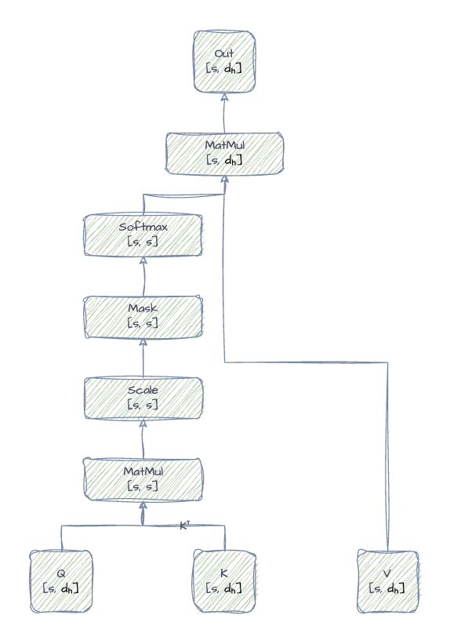
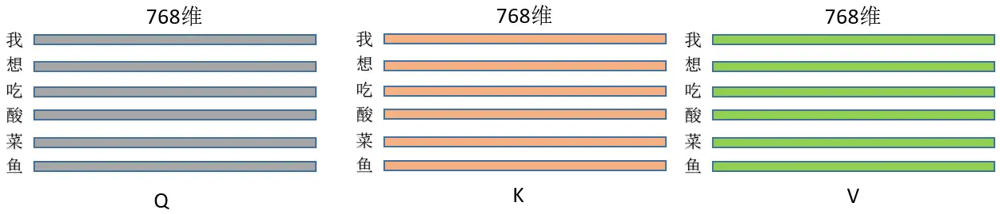

# 1 LLM 推理

LLM 推理分为两个阶段：Prefill，Decode。

Prefill：模型对全部的 Prompt Tokens 进行一次并行计算，生成第一个输出 Token。

Decode：根据之前产生的所有 Token，自回归的生成下一个 Token，直至生成EOS（end-of-sequence）。

本章简单介绍下LLM推理中的常见模块和层。

## Embedding

假设输入为“我想吃酸菜鱼”，以第 i 个字符“鱼”为例，假设其在词汇表中对应的 index 为 j。
$$
input\_embedding_i = token\_embedding_j + position\_embedding_i
$$
其中：$i$ 是对应 Token 的位置，$j$ 为词汇表对应的 index。

假设嵌入深度为 d，Prompt 长度为 s，则对应的 $input\_embedding$ 的矩阵维度为为 ($ X \in \mathbb{R}^{s \times d} $)。其中 s = 6，d = 768。


## Transformer 模块

一个Transformer 模块包括多个层：

```
Layer Normal -> Multi-Head Self Attention -> Projection -> Layer Normal -> MLP
```

Embedding 层得到的 $input\_embedding$ 矩阵是 Transformer 层的输入。


### Layer Normal

归一化方法有很多，其目标是使得每列的数值均值为0，标准差为1，通常通过计算每列的均值（Mean）和标准差（Std dev），然后让每一列减去相应的均值，并除以相应的标准差。layer_norm 输出的矩阵维度。

设输入矩阵为 ($ X \in \mathbb{R}^{s \times d} $)，其中 $s$ 是样本数，$d$ 是特征维度。对每一列进行归一化处理，即对各个 token 的每一个特征进行归一化：

#### 1 计算均值和方差

$$
\mu_j = \mathbb{E}[X_{:, j}] = \frac{1}{s} \sum_{i=1}^{s} X_{i,j}
$$

$$
\sigma_j^2 = \text{Var}[X_{:, j}] = \frac{1}{s} \sum_{i=1}^{s} (X_{i,j} - \mu_j)^2
$$

#### 2 归一化

$$
\hat{X}_{i,j} = \frac{X_{i,j} - \mu_j}{\sqrt{\sigma_j^2 + \epsilon}}
$$

其中 $\epsilon = 10^{-5}$ 是用于防止除以零的常数。

#### 3 缩放和平移

$$
Y_{i,j} = \gamma_j \hat{X}_{i,j} + \beta_j
$$

其中 $\gamma_j$ 和 $\beta_j$ 的维度是 ($ X \in \mathbb{R}^{d} $)，并且是可学习的，用于每列的缩放和平移。

最终，经过归一化输出的矩阵，仍与 $input\_embedding$ 的维度相同，为 ($ X \in \mathbb{R}^{s \times d} $)，为用于每列的缩放和平移。

### Multi-Head Self-Attention

self-attention层或许是Transformer中最核心的部分，此时 $input\_embedding$ 中的各个列开始交流。假设有 $h$ 个头，则每个头处理 $\frac{1}{h}$ 的嵌入深度，每个头对应的输入维度为 ($ X \in \mathbb{R}^{s \times (\frac{d}{h})} $)。

设输入为归一化后的 embedding 矩阵 $X \in \mathbb{R}^{s \times d}$，其中 $s$ 是序列长度，$d$ 是特征维度。在接下来的处理中，我们只关注其中一个头的处理，假设 $h$ = 1。



#### 1 生成 Q，K，V 矩阵

$$
Q = XW^Q + b^Q,\quad K = XW^K + b^K,\quad V = XW^V + b^V
$$


$W^Q, W^K, W^V \in \mathbb{R}^{d \times d_h}$ 是可学习的投影矩阵，每个头有自己的 $W^Q, W^K, W^V \in \mathbb{R}^{d \times d_h}$；

- $b^Q, b^K, b^V \in \mathbb{R}^{d_h}$ 是偏置项；
- $d_h$ 是每个注意力头的维度。

在实际的工程中，是通过直接乘以一个大矩阵 $W^Q, W^K, W^V \in \mathbb{R}^{d \times d}$，再进行“分头”处理。

**Q，K，V 矩阵的维度为 ($ X \in \mathbb{R}^{s \times d_h} $)。**



#### 2 计算注意力分数

$$
\text{AttentionScores} = \frac{QK^\top}{\sqrt{d_h}}
$$

其中 $\sqrt{d_h}$ 是缩放因子，用于避免点积过大导致 Softmax 饱和。

AttentionScores的维度 ($ X \in \mathbb{R}^{s \times s} $)。

如图所示：“我”字符对于“我”的注意力如图所示。


#### 3 通过 softmax 归一化分数

Softmax 函数是一个常用于分类任务中的函数，它可以将一组 实数转换为**概率分布**，即**非负且和为 1 的一组数**。

Softmax 计算表达式如下：
$$
P_i = \frac{\exp(z_i)}{\sum_{j=1}^{n} \exp(z_j)}, \quad \text{for } i = 1, 2, \dots, n
$$
其中：

- $\exp(z_i)$：对每个元素做指数运算，确保结果为正；
- 分母 $\sum_{j=1}^{n} \exp(z_j)$ 是归一化项，使得所有输出之和为 1；
- 输出 $P_i$ 是一个概率，满足：

$$
P_i > 0, \quad \sum_{i=1}^{n} P_i = 1
$$

下面是通过 Softmax 计算 AttentionWeights，上面提到$\sqrt{d_h}$ 是缩放因子，用于避免点积过大导致 Softmax 饱和，因为 $\exp(z_i)$ 是指数函数，当值越大时，是指数型增长，如果存在极个别较大的数，会让这些“特征”更加突出，其他的“特征”消失，从而导致 Softmax 饱和。

在运算时，由于当前 Token 不能看到未来的 Token，不能对其产生注意力得分，所以有**掩码矩阵的存在（应用在 Softmax 函数之前），这部分也是 KV Cache 诞生的关键**。
$$
\text{AttentionWeights} = \text{softmax}\left(\frac{QK^\top}{\sqrt{d_h}}\right)
$$

这里的 Softmax 函数是基于

AttentionWeights的维度 ($ X \in \mathbb{R}^{s \times s} $)。

#### 4 计算注意力输出（加权求和）

$$
\text{AttentionOutput} = \text{AttentionWeights} \cdot V
$$


AttentionOutput的维度 ($ X \in \mathbb{R}^{s \times d_h} $)。

经过了每个头的 self-attention 操作后，将每个头的输出的结果汇总，得到最终的AttentionOutput，其维度为 ($ X \in \mathbb{R}^{s \times d} $)。

#### 5 投影层（Projection）

Projection 层通过一个全连接层（矩阵乘法 + 偏置），将多个 attention head 的输出拼接后变换到输出空间，生成最终的表示。

假设：

- $H_i \in \mathbb{R}^{s \times d_h}$ 表示第 $i$ 个 attention head 的输出，$i = 1, 2, ..., h$
- $h$ 为 head 数量，$d_h$ 为每个 head 的维度
- 拼接后有：$h = [H_1; H_2; \dots; h] \in \mathbb{R}^{s \times d}$
- 投影矩阵 $W^O \in \mathbb{R}^{d \times d}$
- 偏置 $b^O \in \mathbb{R}^{d}$

$$
\text{output} = W^O h + b^O
$$

output的维度仍为($ X \in \mathbb{R}^{s \times d} $)。

#### 6 残差链接（Residual Connection）

假设：
- $x \in \mathbb{R}^{s \times d}$ 为输入（如 input embedding 或上一层的输出）
- $\text{Sublayer}(x)$ 表示某个子层的输出（如 Self-Attention 或 Feed Forward 输出）

则残差连接为：

$$
\text{Output} = x + \text{Sublayer}(x)
$$
output的维度仍为($ X \in \mathbb{R}^{s \times d} $)。

### MLP（多层感知机）

MLP 是 FFNN（前馈神经网络）的一个子集，因为 FFNN 可以包括除全连接层之外的其他类型的层。

每一层的 Attention 后面 都会跟一个 MLP（通常称为 Feed-Forward Network，FFN），并且每一层都有一个自己的 MLP，每一层的 MLP 都有自己独立的参数。

假设当前MLP是一个有两层的简单神经网络，通过带偏执线性变换将嵌入深度 d 映射到更高维的 4d，并通过 GELU 激活函数引入非线形，最后再通过带偏执的线性变换映射到 d。

输入张量为：

$$
X \in \mathbb{R}^{s \times d}
$$

#### 1 线性变换（带偏置）

将维度从 \( d \) 映射到 \( 4d \)：

$$
H = XW_1^T + b_1
$$

其中：

- $ W_1 \in \mathbb{R}^{4d \times d} $：第一层的权重矩阵
- $ b_1 \in \mathbb{R}^{4d} $：第一层的偏置
- $ H \in \mathbb{R}^{s \times 4d} $：变换后的中间结果

#### 2 GELU 激活函数

对中间结果逐元素应用 GELU 非线性激活：

$$
H' = \text{GELU}(H)
$$

GELU 的常用近似形式为：
$$
\text{GELU}(x) \approx 0.5x \left(1 + \tanh\left[\sqrt{\frac{2}{\pi}}\left(x + 0.044715x^3\right)\right]\right)
$$
其中 tanh 函数如下：
$$
\tanh(x) = \frac{\sinh(x)}{\cosh(x)} = \frac{e^x - e^{-x}}{e^x + e^{-x}}
$$

#### 3 线性变换回 

将维度从 \( 4d \) 映射回原始的 \( d \)：

$$
O = H'W_2^T + b_2
$$

其中：

- $ W_2 \in \mathbb{R}^{d \times 4d} $：第二层的权重矩阵
- $ b_2 \in \mathbb{R}^{d} $：第二层的偏置
- $ O \in \mathbb{R}^{s \times d} $：MLP 的输出

#### 4 残差连接（Residual Connection）

将 MLP 的输出加回输入：

$$
Y = X + O
$$
最后输出 Y 的维度($ X \in \mathbb{R}^{s \times d} $)，并重新作为下一层的 Transformer 模块的输入，或者 Output 的输入。

## Output

最后需要根据经过 Transformer 的结果，对下一个 Token 进行预测。

### 1 LayerNorm

Transformer 的最后一层输出为：

$$
X_{\text{last}} \in \mathbb{R}^{s \times d}
$$

我们首先对其进行层归一化处理：

$$
\hat{X} = \text{LayerNorm}(X_{\text{last}})
$$

### 2 线性变换（无偏置）

接下来，使用一个 **无偏置** 的线性变换将隐藏维度 $d$ 映射到词汇表大小 $V$，得到每个 Token 在词汇表上的打分（logits）：

$$
Z = \hat{X}W_{\text{out}}^T
$$

其中：

- $W_{\text{out}} \in \mathbb{R}^{V \times d}$：输出层的权重矩阵  
- $Z \in \mathbb{R}^{s \times V}$：每个 token 对应的词汇表 logits（未归一化得分）

### 3 温度缩放（可选）

为了控制 softmax 分布的平滑程度，可以使用温度系数 $T > 0$ 对 logits 进行缩放：

$$
Z' = \frac{Z}{T}
$$

- 当 $T = 1$ 时，softmax 保持原样
- 当 $T > 1$ 时，分布更平坦（更多探索）
- 当 $T < 1$ 时，分布更尖锐（更确定）

### 4 Softmax 概率

将缩放后的 logits 转换为概率分布：
$$
P = \text{softmax}(Z') = \text{softmax}\left(\frac{Z}{T}\right)
$$

具体来说，对于第 $i$ 个位置（第 $i$ 个 token）：

$$
P_i[j] = \frac{\exp(Z'_i[j])}{\sum_{k=1}^V \exp(Z'_i[k])}
$$

### 5 生成下一个 token（采样）

我们使用序列中最后一个位置的输出概率 $P_s \in \mathbb{R}^V$ 来预测下一个 token：

- **采样方式**：从分布 $P_s$ 中按概率采样  
- **贪婪选择**（greedy）：选择概率最高的 token

$$
\text{next\_token} = \begin{cases}
\text{sample}(P_s) & \text{采样方式} \\
\arg\max_j P_s[j] & \text{贪婪方式}
\end{cases}
$$

---

### 总结流程图（文字描述）

```
Transformer 输出 → LayerNorm → 无偏置线性变换 → （可选温度缩放）→ softmax → 概率分布 → 采样或选择 → 下一个 token
```

---

### 输出维度回顾：

| 阶段                               | 维度         |
| ---------------------------------- | ------------ |
| Transformer 输出 $X_{\text{last}}$ | $s \times d$ |
| 归一化后 $\hat{X}$                 | $s \times d$ |
| Logits $Z$                         | $s \times V$ |
| 概率分布 $P$                       | $s \times V$ |
